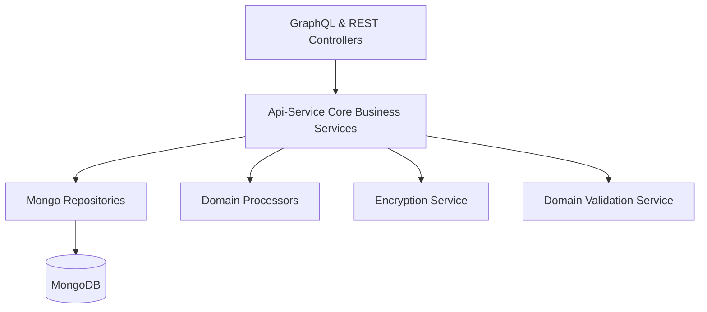
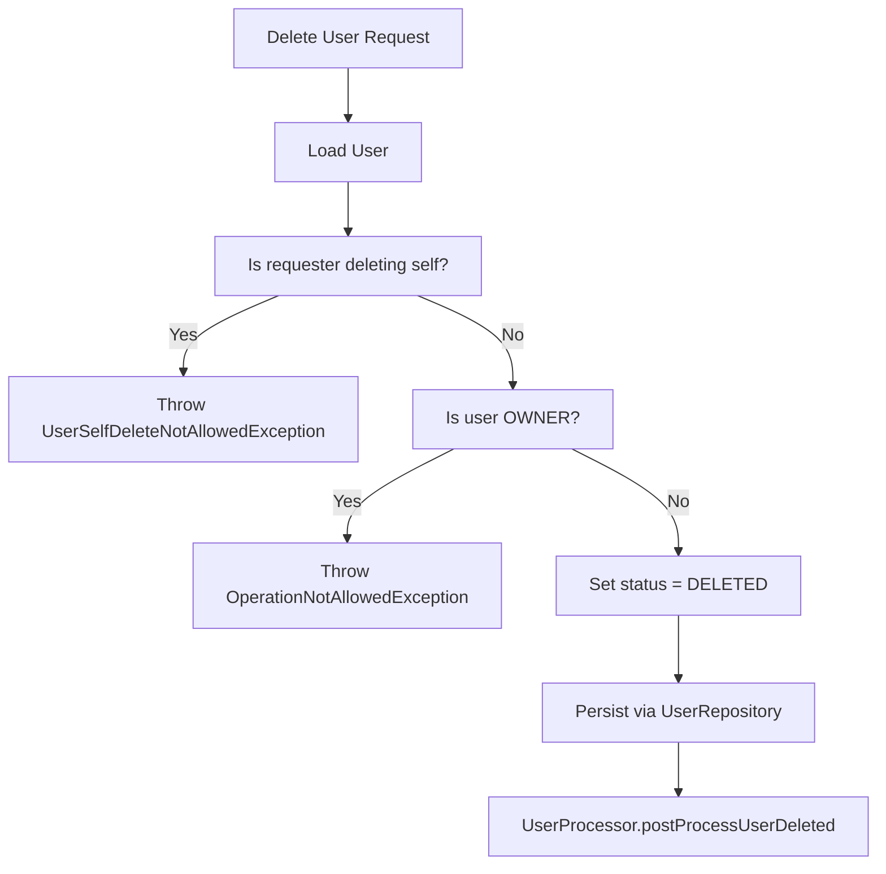
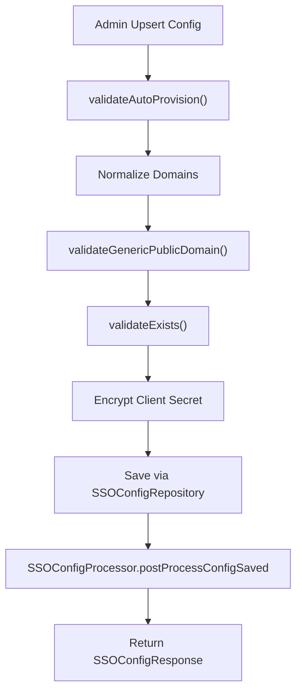
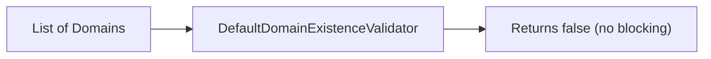
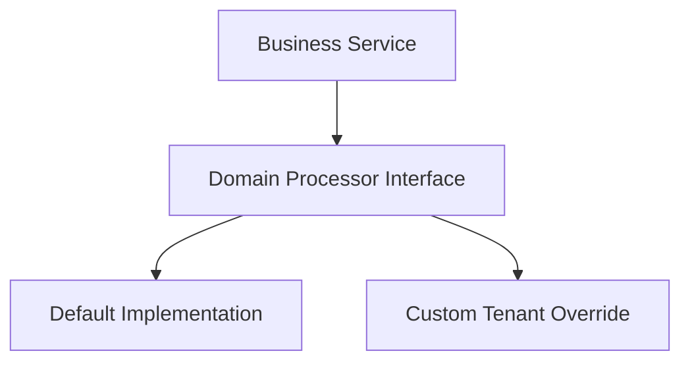

# Api-Service Core Business Services

## Overview

The **Api-Service Core Business Services** module contains the central domain logic of the OpenFrame API service. It sits between:

- The API layer (GraphQL + REST controllers)
- The persistence layer (Mongo repositories and documents)
- Cross-cutting infrastructure (security, encryption, tenant context, SSO)

This module is responsible for:

- Enforcing business rules
- Coordinating repositories and mappers
- Applying validation and domain constraints
- Triggering post-processing hooks via processors

It acts as the orchestration layer that ensures the API layer remains thin and focused on transport concerns.

---

## Architectural Position

### Responsibilities

- Controllers delegate business operations to this module.
- Services coordinate repositories, validation, and encryption.
- Processors provide extension points for side-effects.
- Data persistence is handled via Mongo repositories from the data layer.

---

## Core Components

This module contains the following primary service and processor components:

- `UserService`
- `SSOConfigService`
- `DefaultDomainExistenceValidator`
- `DefaultInvitationProcessor`
- `DefaultSSOConfigProcessor`
- `DefaultUserProcessor`

Each of these contributes to a specific business domain.

---

# User Management

## UserService

The **UserService** encapsulates all user-related business operations.

### Responsibilities

- Retrieve users by ID or email
- List users with pagination
- Update user profile fields
- Perform soft deletion with role and safety checks
- Trigger post-processing via `UserProcessor`

### Business Rules

### Key Safeguards

- Users cannot delete themselves.
- OWNER role accounts cannot be deleted.
- Deletion is soft (status set to `DELETED`).
- Post-processing hooks allow audit or integration logic.

---

# SSO Configuration Management

## SSOConfigService

The **SSOConfigService** manages Single Sign-On configuration per provider (e.g., Microsoft, Google).

### Responsibilities

- Retrieve enabled providers for login UI
- Retrieve full configuration for admin editing
- Create or update SSO configurations (upsert)
- Toggle provider enabled/disabled state
- Delete SSO configuration
- Validate domain and auto-provision constraints
- Trigger post-processing hooks

### High-Level Flow

### Domain & Auto-Provision Validation

Validation includes:

- Normalizing domain input (trim, lowercase, distinct).
- Rejecting invalid or public generic domains.
- Ensuring domains exist (pluggable validation logic).
- Enforcing:
  - `allowedDomains` required when `autoProvisionUsers = true`.
  - Microsoft auto-provision requires `msTenantId`.

This prevents misconfiguration that could allow unintended account provisioning.

### Encryption

- Client secrets are encrypted before persistence.
- Decrypted values are only exposed for administrative editing.

---

# Domain Existence Validation

## DefaultDomainExistenceValidator

The **DefaultDomainExistenceValidator** provides a default implementation of `DomainExistenceValidator`.

### Behavior

- Default behavior does **not block** any domain existence checks.
- Marked with `@ConditionalOnMissingBean`.
- SaaS tenant deployments can override this bean to enforce stricter validation.

This pattern allows:

- OSS default behavior
- Enterprise overrides without modifying core code

---

# Processor Extension Points

Processors implement domain-level hooks and are injected using Spring’s conditional bean mechanism.

They enable customization without altering core services.

## Processor Architecture

If no custom implementation is provided, the default processor is used.

---

## DefaultInvitationProcessor

Handles post-invitation events.

### Hooks

- `postProcessInvitationCreated`
- `postProcessInvitationRevoked`

Default behavior: structured logging only.

Override scenarios may include:

- Sending email notifications
- Triggering audit logs
- Integrating with external identity systems

---

## DefaultSSOConfigProcessor

Handles post-SSO configuration events.

### Hooks

- `postProcessConfigSaved`
- `postProcessConfigDeleted`
- `postProcessConfigToggled`

Default behavior: logging.

Custom implementations may:

- Register/deregister OAuth clients
- Sync with Authorization Server
- Trigger tenant-level reconfiguration

---

## DefaultUserProcessor

Handles user lifecycle events.

### Hooks

- `postProcessUserDeleted`
- `postProcessUserUpdated`
- `postProcessUserGet`

Default behavior: logging.

Extension scenarios:

- Audit trail enrichment
- Deprovisioning external systems
- Metrics aggregation

---

# Interaction with Other Modules

The Api-Service Core Business Services module integrates closely with several other modules in the system architecture:

## API Layer

- Controllers delegate to services in this module.
- DTOs are defined in the API DTO module.

## Data Layer

- Uses Mongo repositories for persistence.
- Operates on `User`, `Invitation`, and `SSOConfig` documents.

## Security Layer

- Relies on encryption services for secure secret handling.
- Enforces role-based constraints (e.g., OWNER protection).

## Authorization Server

- SSO configuration impacts OAuth and tenant registration flows.
- Post-processing hooks may integrate with authorization components.

---

# Design Patterns Used

## 1. Service Layer Pattern

Encapsulates business logic separate from controllers.

## 2. Processor (Hook) Pattern

Provides extension points using:

- Interface-based hooks
- `@ConditionalOnMissingBean`

This allows tenant-specific customization.

## 3. Soft Delete Pattern

Users are marked `DELETED` instead of being physically removed.

## 4. Validation-Oriented Design

- Domain normalization
- Conditional constraints
- Defensive checks before persistence

---

# Summary

The **Api-Service Core Business Services** module is the heart of business logic in the API service.

It:

- Enforces domain rules
- Protects critical invariants (e.g., owner accounts)
- Secures sensitive data (SSO secrets)
- Provides extension hooks for tenant-specific behavior
- Bridges controllers and persistence layers

By keeping business logic centralized and extensible, this module ensures the API remains robust, secure, and adaptable across OSS and SaaS deployments.