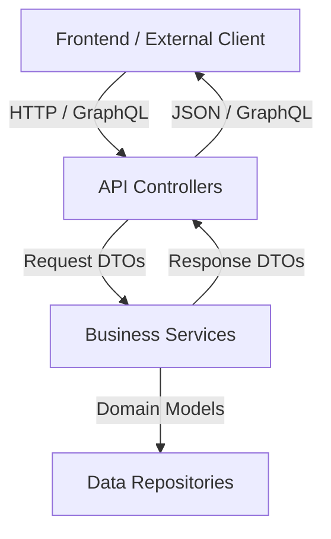
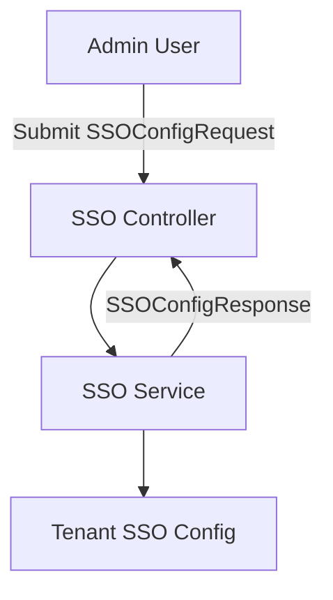
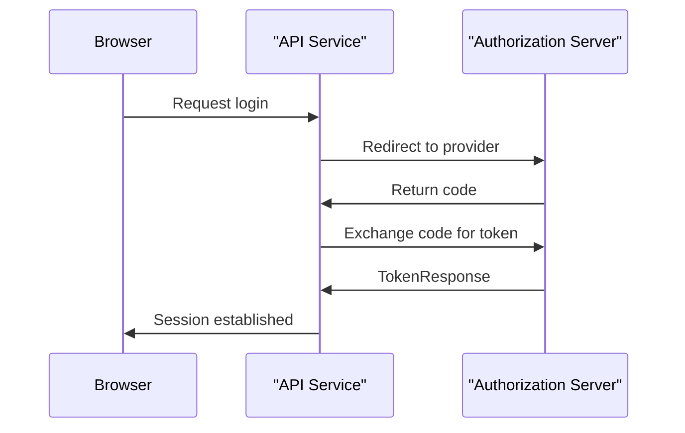
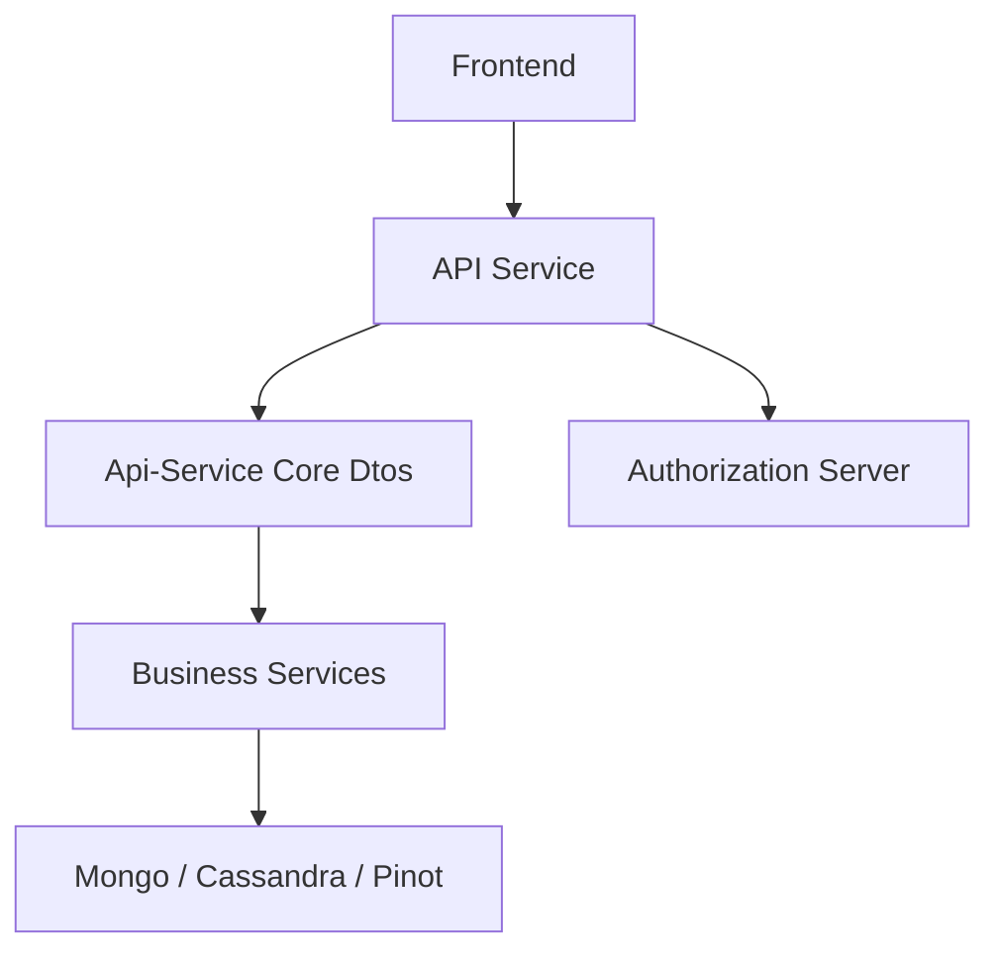

# Api-Service Core Dtos

## Overview

The **Api-Service Core Dtos** module defines the Data Transfer Objects (DTOs) used by the Api Service layer of OpenFrame. These DTOs act as the contract boundary between:

- REST controllers and external clients
- GraphQL resolvers and frontend applications
- Business services and persistence layers
- The Authorization Server and OAuth/OIDC flows

This module contains **request models, response models, filter inputs, pagination structures, and integration payloads** that standardize how data moves in and out of the Api Service.

DTOs in this module are intentionally:

- Immutable or builder-based where appropriate
- Serialization-friendly (Jackson annotations)
- Validation-aware (Jakarta validation annotations)
- Decoupled from persistence documents

---

## Architectural Role

The Api-Service Core Dtos module sits between the API layer and the business/data layers.



### Responsibilities

1. Define request contracts
2. Define response contracts
3. Provide filtering inputs for GraphQL and REST
4. Provide pagination and connection models
5. Encapsulate OAuth/OIDC payloads
6. Standardize update and force-operation commands

The module does **not**:

- Contain business logic
- Interact with databases directly
- Perform authorization decisions

---

# DTO Categories

The module can be logically grouped into the following categories.

---

## 1. Security & API Key DTOs

These DTOs define contracts for API keys and agent registration secrets.

### AgentRegistrationSecretResponse

Represents a generated agent registration secret.

```text
Fields:
- id: String
- key: String
- createdAt: Instant
- active: boolean
```

Used when provisioning or rotating secrets for client agents.

### ApiKeyResponse

Represents metadata about an API key (without exposing the secret).

```text
Fields:
- id
- name
- description
- enabled
- createdAt
- updatedAt
- lastUsed
- expiresAt
- totalRequests
- successfulRequests
- failedRequests
```

This supports:
- Observability
- Usage analytics
- Expiration management

---

## 2. Client Configuration DTOs

### ClientConfigurationResponse

Provides client versioning information:

```text
Fields:
- version: String
```

Typically used by agents or frontend applications to determine compatibility or upgrade requirements.

---

## 3. GraphQL Pagination & Connection Models

The module includes generic connection structures aligned with GraphQL Relay-style pagination.

### GenericEdge<T>

Represents a single node and its cursor.

```text
Fields:
- node: T
- cursor: String
```

### CountedGenericConnection<T>

Extends a generic connection with a filtered count.

```text
Fields:
- edges: List<T>
- pageInfo
- filteredCount: int
```

### Pagination Flow


This allows:
- Cursor-based pagination
- Filtered result counts
- Efficient client-side rendering

---

## 4. SSO Configuration DTOs

These DTOs define how Single Sign-On providers are configured and queried.

### SSOConfigRequest

Used to create or update SSO provider configuration.

Key characteristics:

- Validates `clientId` and `clientSecret`
- Supports auto-provisioning
- Allows domain whitelisting
- Supports Microsoft tenant ID

### SSOConfigResponse

Represents persisted SSO configuration.

### SSOConfigStatusResponse

Lightweight response for status checks.

### SSOProviderInfo

Provides provider metadata (e.g., Google, Microsoft).

### SSO Configuration Lifecycle



---

## 5. OAuth & OIDC DTOs

These DTOs enable OAuth2 and OpenID Connect flows.

### AuthorizationResponse

```text
Fields:
- code
- state
- redirectUri
```

### TokenResponse

```text
Fields:
- access_token
- refresh_token
- token_type
- expires_in
```

### SocialAuthRequest / GoogleTokenRequest

Used for exchanging authorization codes using PKCE.

### OpenIDConfiguration

Represents OIDC discovery metadata.

### UserInfo & UserInfoRequest

Used for:
- Standard OIDC user info endpoint
- Internal identity mapping

### OAuth Flow (Simplified)



---

## 6. Filtering Input DTOs

Filtering DTOs are optimized for GraphQL queries and REST endpoints.

### LogFilterInput
- Date range filtering
- Event types
- Tool types
- Severities
- Organization IDs
- Device ID

### DeviceFilterInput
- Device status
- Device types
- OS types
- Organization IDs
- Tag names

### EventFilterInput
- User IDs
- Event types
- Date range

### OrganizationFilterInput
- Category
- Employee range
- Active contract flag

### ToolFilterInput
- Enabled flag
- Type
- Category
- Platform category

These DTOs are designed to:

- Avoid exposing database query models
- Map cleanly to service-level filter processors
- Provide type-safe filtering

---

## 7. Force & Update Command DTOs

These DTOs represent command-style operations.

### Force Operations

- ForceClientUpdateRequest
- ForceToolInstallationAllRequest
- ForceToolReinstallationRequest
- ForceToolUpdateRequest
- ForceToolAgentUpdateRequest
- ForceToolAgentUpdateAllRequest

They typically contain:

```text
- machineIds: List<String>
- toolAgentId: String
```

Used to trigger:
- Agent upgrades
- Tool reinstallation
- Forced synchronization

### ForceToolAgentUpdateResponse

Returns itemized update results.

---

## 8. Invitation DTOs

### CreateInvitationRequest
- Email (validated)
- Roles

### UpdateInvitationStatusRequest
- InvitationStatus

### InvitationPageResponse
Extends a generic `PageResponse`.

Used in onboarding workflows and tenant-based user provisioning.

---

## 9. User DTOs

### UserResponse

Represents a user in API responses.

```text
Fields:
- id
- email
- emailVerified
- firstName
- lastName
- roles
- status
- image
- createdAt
- updatedAt
```

### UpdateUserRequest

Validated update payload:

```text
Fields:
- firstName (max 128)
- lastName (max 128)
```

### UserPageResponse

Extends generic `PageResponse<UserResponse>`.

---

# Design Principles

## 1. Clear Separation of Concerns

DTOs do not:
- Contain persistence annotations
- Leak internal Mongo documents
- Perform business transformations

## 2. Validation at the Edge

Requests use Jakarta validation annotations such as:

- `@NotBlank`
- `@NotNull`
- `@Size`

This ensures invalid payloads are rejected at the controller boundary.

## 3. Serialization Control

Jackson annotations are used to:

- Align with OAuth naming conventions
- Map snake_case to camelCase
- Omit null fields when appropriate

## 4. GraphQL Alignment

Filter inputs and connection types are aligned with GraphQL schema definitions, enabling:

- Strongly typed filtering
- Cursor-based pagination
- Frontend-friendly query models

---

# How This Module Fits the System



The **Api-Service Core Dtos** module acts as the formal contract boundary that:

- Shields internal domain models
- Provides stable external APIs
- Enables versioning and evolution
- Supports multi-tenant, OAuth-secured flows

---

# Summary

The **Api-Service Core Dtos** module is the contract layer of the Api Service. It:

- Defines all API-facing data structures
- Supports REST and GraphQL
- Enables OAuth and SSO integration
- Provides filtering and pagination patterns
- Encapsulates command-style update operations

It is a foundational module ensuring that API interactions remain consistent, validated, and decoupled from internal implementation details.