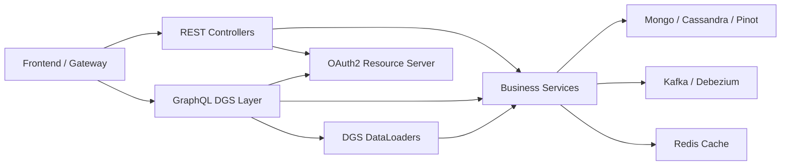
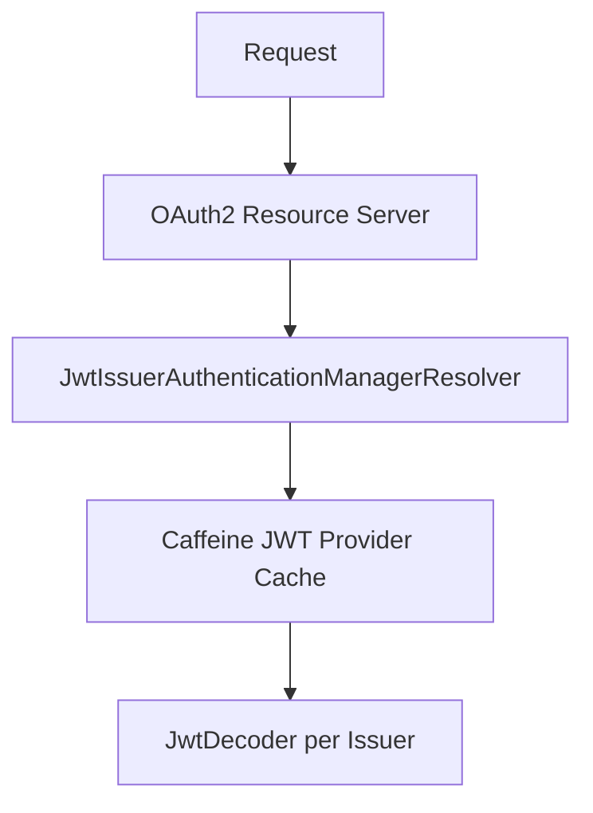
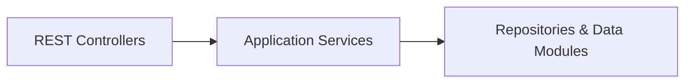
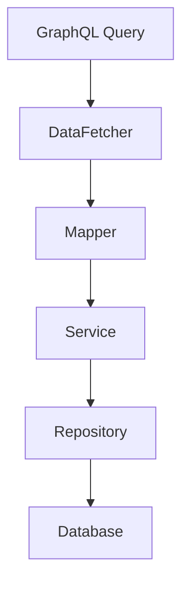
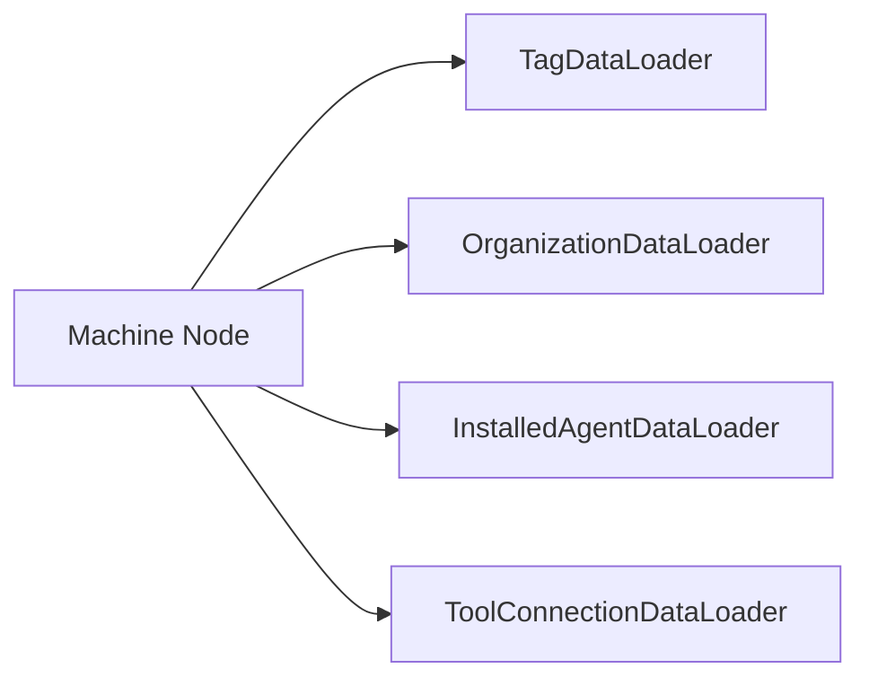
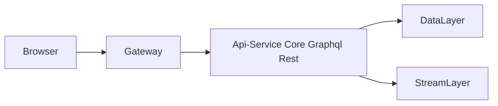

# Api-Service Core Graphql Rest

## Overview

The **Api-Service Core Graphql Rest** module is the central application-layer service that exposes OpenFrame domain capabilities through:

- ✅ REST endpoints (Spring MVC controllers)
- ✅ GraphQL queries and mutations (Netflix DGS)
- ✅ OAuth2 Resource Server integration for JWT-based authentication
- ✅ DataLoader-based batching for efficient GraphQL resolution

It acts as the primary internal API layer for:

- Frontend applications
- Gateway service
- Internal automation and orchestration services

This module is deployed as part of the `ApiApplication` entrypoint and relies on lower-level modules such as data, security, Kafka, Redis, and business services.

---

## High-Level Architecture



### Responsibilities

| Layer | Responsibility |
|--------|---------------|
| Controllers | REST-based internal APIs |
| DataFetchers | GraphQL queries & mutations |
| DataLoaders | N+1 problem mitigation |
| Config | Security, scalars, initialization |
| Services | Business orchestration |

---

# Configuration Layer

The configuration classes wire security, scalars, HTTP clients, and boot-time initialization.

## ApiApplicationConfig

Provides a `PasswordEncoder` bean using BCrypt.

```java
@Bean
public PasswordEncoder passwordEncoder() {
    return new BCryptPasswordEncoder();
}
```

Used by services that manage credentials, API keys, or secrets.

---

## AuthenticationConfig

Registers `AuthPrincipalArgumentResolver`, enabling:

```java
@AuthenticationPrincipal AuthPrincipal principal
```

This allows controllers to directly inject authenticated user metadata.

---

## SecurityConfig

Minimal OAuth2 Resource Server configuration.

Key properties:

- JWT validation via issuer resolution
- Caffeine cache for `JwtAuthenticationProvider`
- CSRF disabled
- All routes `permitAll()` (Gateway enforces access)



### Important Design Note

The **Gateway Service** performs:

- JWT validation
- Path authorization
- Cookie-to-header transformation

The Api-Service Core Graphql Rest only enables JWT decoding to support `@AuthenticationPrincipal`.

---

## GraphQL Scalar Configuration

### DateScalarConfig
- GraphQL scalar: `Date`
- Format: `yyyy-MM-dd`
- Maps to `LocalDate`

### InstantScalarConfig
- GraphQL scalar: `Instant`
- ISO-8601 format
- Maps to `Instant`

These scalars ensure strict input validation at the GraphQL schema boundary.

---

## DataInitializer

Boot-time initialization of default OAuth clients using environment properties:

- `oauth.client.default.id`
- `oauth.client.default.secret`

Behavior:
- Updates secret if changed
- Creates client if not existing
- Supports `password` and `refresh_token` grants

---

## RestTemplateConfig

Registers a `RestTemplate` bean for internal HTTP calls to:

- Authorization server
- External services
- Tenant-aware APIs

---

# REST Controllers

The REST layer exposes internal command and operational endpoints.



## HealthController

- `GET /health`
- Returns `OK`
- Used by Kubernetes / Gateway probes

---

## MeController

- `GET /me`
- Returns authenticated user information from `AuthPrincipal`

Response includes:

- id
- email
- displayName
- roles
- tenantId

---

## ApiKeyController

Manages API keys per authenticated user.

Endpoints:

- `GET /api-keys`
- `POST /api-keys`
- `PUT /api-keys/{id}`
- `DELETE /api-keys/{id}`
- `POST /api-keys/{id}/regenerate`

Security model:
- Keys are scoped per user
- Requires authenticated principal

---

## AgentRegistrationSecretController

Handles agent onboarding secrets.

- `GET /agent/registration-secret/active`
- `POST /agent/registration-secret/generate`

Used by client services and provisioning flows.

---

## DeviceController

Internal API for updating device status:

- `PATCH /devices/{machineId}`

Used by stream processors or system services.

---

## ForceAgentController

Forces installation, update, or reinstallation of:

- Tool agents
- Client versions

Examples:

- `POST /force/tool-agent/install`
- `POST /force/client/update`
- `POST /force/tool-agent/reinstall`

This orchestrates asynchronous workflows across stream and client services.

---

## OrganizationController

Command-side mutations:

- Create
- Update
- Delete

Deletion guarded against active machines (409 Conflict).

---

## InvitationController

Manages tenant invitations:

- Create
- List (paged)
- Revoke
- Resend

---

## UserController

User lifecycle management:

- List users
- Get by ID
- Update
- Soft delete

---

## SSOConfigController

Tenant-level SSO configuration.

Endpoints:

- `GET /sso/providers`
- `POST /sso/{provider}`
- `PATCH /sso/{provider}/toggle`

Integrates with Authorization Server SSO strategies.

---

## OpenFrameClientConfigurationController

- `GET /openframe-client/configuration`
- Returns configuration used by client agents.

---

## ReleaseVersionController

- `GET /release-version`
- Exposes currently active release metadata.

---

# GraphQL Layer (Netflix DGS)

The GraphQL layer provides flexible querying with:

- Cursor-based pagination
- Filter inputs
- Sort inputs
- Typed connections



---

## DeviceDataFetcher

Queries:

- `devices`
- `device`
- `deviceFilters`

Uses:

- `DeviceService`
- `DeviceFilterService`
- `GraphQLDeviceMapper`

Supports:

- Cursor pagination
- Search
- Sorting
- Filter options

### Nested Resolvers

Uses DataLoaders for:

- Tags
- Tool connections
- Installed agents
- Organization

---

## EventDataFetcher

Queries:

- `events`
- `eventById`
- `eventFilters`

Mutations:

- `createEvent`
- `updateEvent`

Builds `Event` domain object and delegates to `EventService`.

---

## LogDataFetcher

Queries:

- `logs`
- `logFilters`
- `logDetails`

Used for audit and tool event visibility.

---

## OrganizationDataFetcher

Queries:

- `organizations`
- `organization`
- `organizationByOrganizationId`

Separates read model from command model.

---

## ToolsDataFetcher

Queries:

- `integratedTools`
- `toolFilters`

Exposes tool metadata and filtering capabilities.

---

# DataLoader Layer

Prevents N+1 query issues in GraphQL.



### InstalledAgentDataLoader
Batches machine IDs to fetch installed agents.

### OrganizationDataLoader
- Deduplicates IDs
- Filters soft-deleted organizations
- Maintains input order

### TagDataLoader
Loads tags per machine.

### ToolConnectionDataLoader
Loads tool connection metadata.

---

# Interaction with Other Modules

The Api-Service Core Graphql Rest module integrates with:

- Data Mongo Documents and Repositories (Mongo persistence)
- Data Core Cassandra Pinot and Models (analytics and events)
- Data Redis Cache Config (caching)
- Data Kafka Tenant Autoconfig (stream publishing)
- Stream Service Kafka Debezium Enrichment (event ingestion)
- Authorization Server Core Tenant Sso Registration (SSO & OAuth)
- Security OAuth Jwt Bff (JWT + OAuth helpers)

It acts as the orchestration boundary between external clients and internal domain services.

---

# Deployment Context

Entrypoint:

- `ApiApplication`

Typical request path:



---

# Design Characteristics

✅ Clean separation between REST and GraphQL  
✅ Minimal security responsibility (Gateway-first model)  
✅ Strong input validation  
✅ Cursor-based pagination  
✅ Multi-tenant ready  
✅ Optimized GraphQL batching  
✅ Explicit command vs query separation  

---

# Summary

The **Api-Service Core Graphql Rest** module is the primary application-layer API service in OpenFrame. It:

- Exposes REST endpoints for operational and mutation workflows
- Provides GraphQL querying for complex UI use cases
- Integrates OAuth2 Resource Server for JWT-based principal resolution
- Optimizes GraphQL performance using DataLoaders
- Coordinates business services across persistence, streaming, and caching layers

It forms the backbone of OpenFrame’s API surface and is the central integration point between the Gateway, frontend applications, and domain services.
