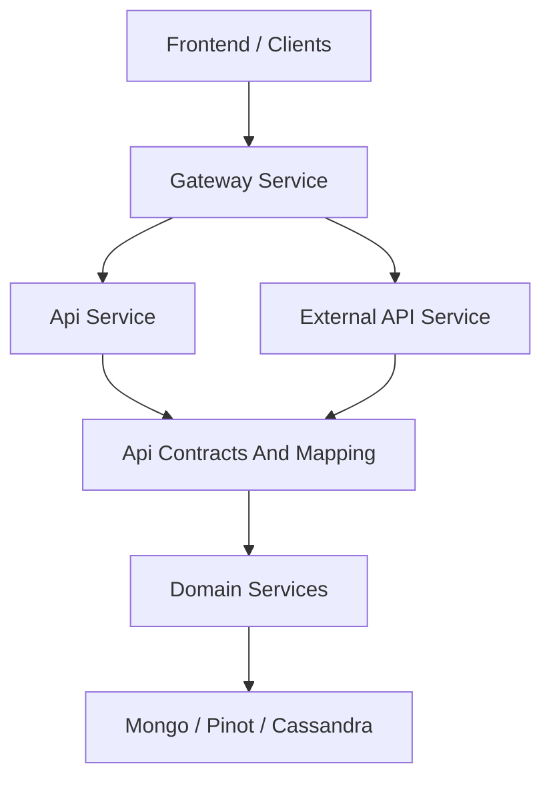
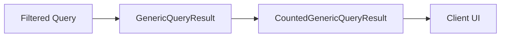
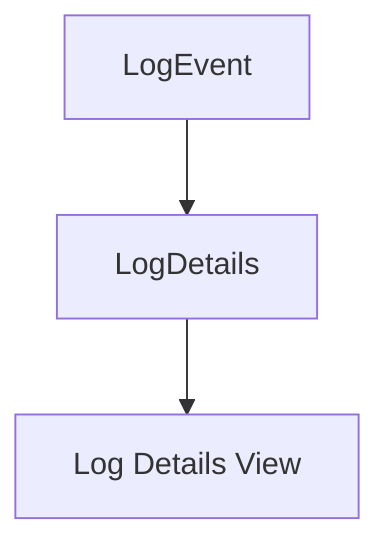
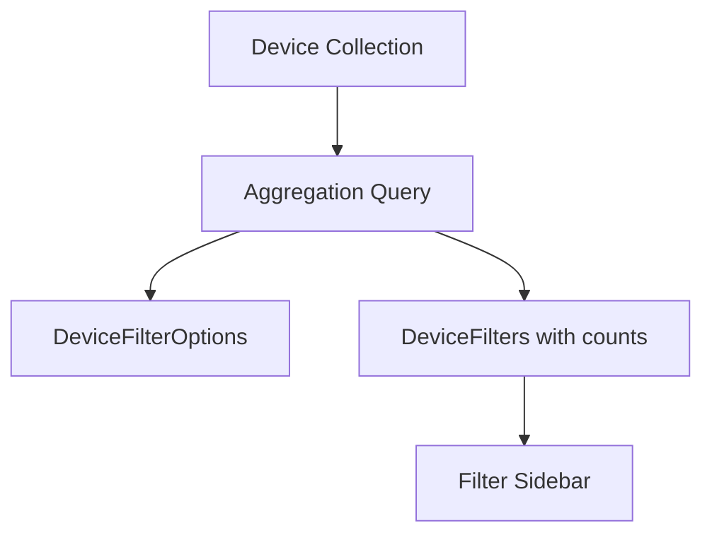
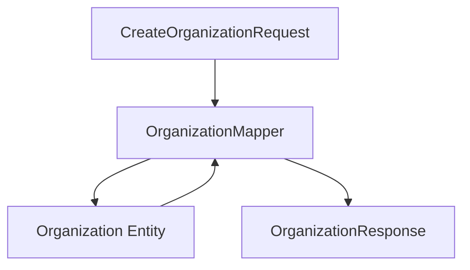
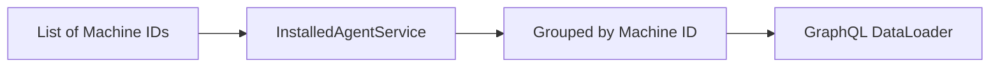
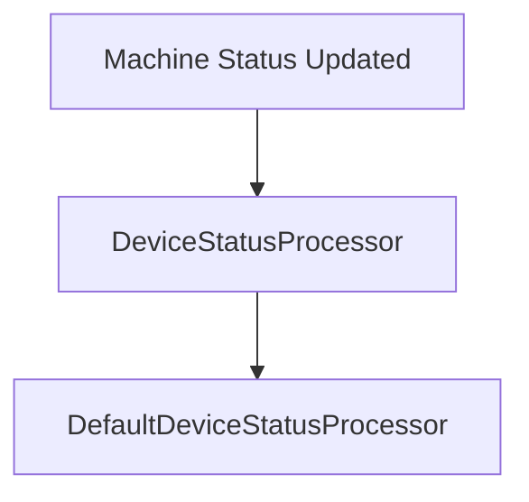

# Api Contracts And Mapping

## Overview

The **Api Contracts And Mapping** module defines the shared data contracts, filter models, pagination structures, and mapping utilities used across the OpenFrame platform. It acts as the canonical boundary layer between:

- API services (REST and GraphQL)
- Domain services and processors
- Data persistence (Mongo, Pinot, Cassandra)
- External API consumers

This module ensures consistent DTOs, filter semantics, pagination models, and entity-to-DTO mapping across:

- Api Service (GraphQL + internal REST)
- External API Service
- Gateway Service
- Frontend clients

It prevents duplication of contracts and guarantees that both internal and external APIs expose aligned, version-safe representations.

---

## Architectural Role in the Platform



### Responsibilities

The module provides:

1. Shared DTOs for responses and filters
2. Cursor-based pagination models
3. Query result wrappers
4. Organization mapping logic
5. Batch-loading support services for GraphQL
6. Default processing hooks (e.g., device status updates)

---

# Core Components

## 1. Query Result Wrappers

### CountedGenericQueryResult

```java
public class CountedGenericQueryResult<T> extends GenericQueryResult<T> {
    private int filteredCount;
}
```

### Purpose

Extends a generic query result by including a `filteredCount` field. This is critical for:

- Filtered list views
- Dashboard metrics
- Paginated GraphQL queries
- REST list endpoints with total count awareness

### Usage Pattern



---

# 2. Audit & Log Contracts

## LogEvent vs LogDetails

### LogEvent
- Lightweight representation
- Used in list views
- Optimized for pagination

### LogDetails
- Full representation
- Includes `message` and `details`
- Used in detailed views



## LogFilterOptions & LogFilters

These models define filtering semantics for audit logs:

- Date range (startDate, endDate)
- Event types
- Tool types
- Severities
- Organization filters
- Device-specific filtering

They enable consistent filtering across:

- GraphQL DataFetchers
- External REST controllers
- Pinot-backed analytics queries

---

# 3. Device Filtering Contracts

## DeviceFilterOptions

Defines the available filter dimensions:

- Status
- Device type
- OS type
- Organization IDs
- Tag names

## DeviceFilters

Represents resolved filter options including counts per option.



## TagFilterOption & DeviceFilterOption

Provide:

- value
- label
- count

Used for dropdown and facet-based filtering.

---

# 4. Event Filtering Contracts

## EventFilterOptions

Includes:

- userIds
- eventTypes
- startDate
- endDate

## EventFilters

Simplified filter structure for execution.

These contracts align with:

- Stream Processing events
- Pinot event projections
- Mongo event repositories

---

# 5. Organization Contracts & Mapping

## OrganizationResponse

Shared DTO used by both:

- GraphQL (Api Service)
- REST (External API Service)

Includes:

- Business identifiers
- Contract dates
- Revenue
- Contact information
- Soft-delete metadata

## OrganizationList

Wrapper for returning organization collections.

## OrganizationFilterOptions

Defines internal filtering parameters such as:

- Category
- Employee range
- Active contract flag

---

## OrganizationMapper

Centralized entity-to-DTO mapping logic.

### Responsibilities

- Convert Create request to Organization entity
- Perform partial updates safely
- Prevent modification of immutable `organizationId`
- Map nested contact information
- Copy mailing address when required



### Why Centralized Mapping Matters

- Avoids duplication across GraphQL and REST layers
- Guarantees consistent response structure
- Enforces immutability constraints
- Standardizes nested mapping logic

---

# 6. Pagination Contract

## CursorPaginationInput

Supports cursor-based pagination with validation:

- limit (1–100)
- cursor

Ensures:

- Safe API limits
- Consistent pagination across services
- GraphQL connection-style queries

---

# 7. Tool Filtering Contracts

## ToolFilterOptions

Defines filtering dimensions:

- enabled
- type
- category
- platformCategory

## ToolFilters

Represents selected filter values.

## ToolList

Wrapper DTO returning a list of integrated tools.

Used by:

- External API Service
- Management Service
- GraphQL tools queries

---

# 8. Batch Loading Support Services

## InstalledAgentService

Optimized for GraphQL DataLoader usage.

### Core Capability



### Why It Exists

- Prevents N+1 query problem
- Groups results by machineId
- Preserves request order

---

## ToolConnectionService

Similar batching logic for tool connections.

Ensures efficient loading of related entities during GraphQL resolution.

---

# 9. Device Status Processing Hook

## DefaultDeviceStatusProcessor

Default implementation of a post-processing hook triggered when a device status changes.

### Characteristics

- Conditional bean
- Can be overridden
- Provides extension point for custom behavior



This design enables platform extensions without modifying core logic.

---

# Cross-Service Contract Alignment

The Api Contracts And Mapping module ensures alignment across:

| Layer | Uses These Contracts |
|-------|----------------------|
| Api Service (GraphQL) | DTOs, FilterOptions, DataLoader services |
| External API Service | OrganizationResponse, ToolList, Filters |
| Management Service | OrganizationResponse, ToolFilterOptions |
| Stream Processing | EventFilters, Log models |
| Frontend | FilterOptions, pagination models |

---

# Design Principles

1. Single Source of Truth for DTOs
2. Separation of entity and API contract
3. Explicit filter modeling
4. Cursor-based pagination over offset pagination
5. Batch loading for GraphQL efficiency
6. Extensible processing via conditional beans

---

# Summary

The **Api Contracts And Mapping** module is the contract backbone of the OpenFrame platform. It standardizes:

- API response shapes
- Filtering semantics
- Pagination behavior
- Organization mapping logic
- GraphQL batching patterns

By centralizing contracts and mapping logic, it guarantees consistency, extensibility, and performance across all services in the system.
