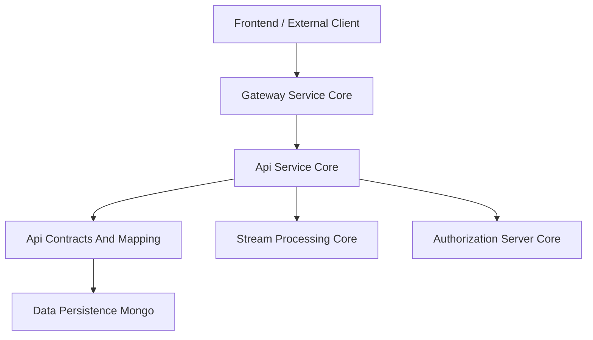
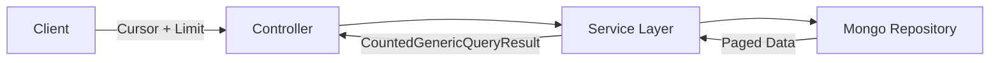
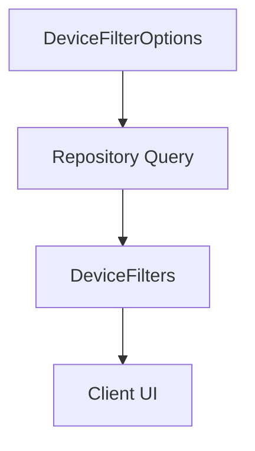
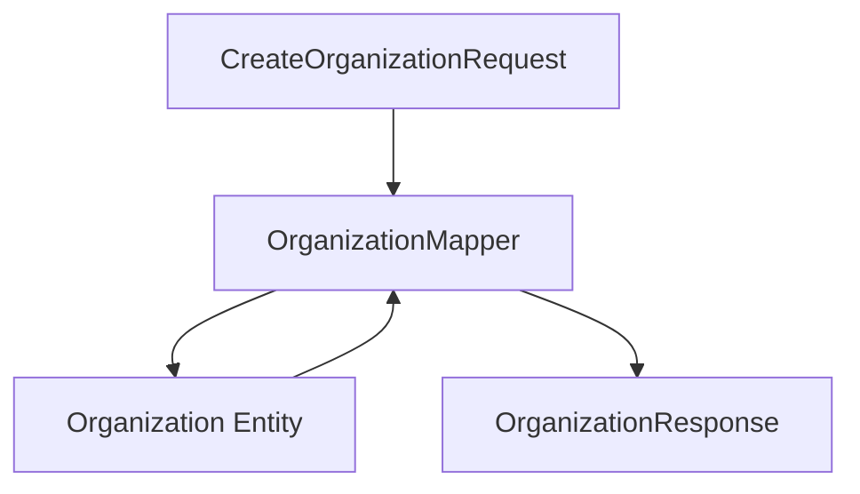
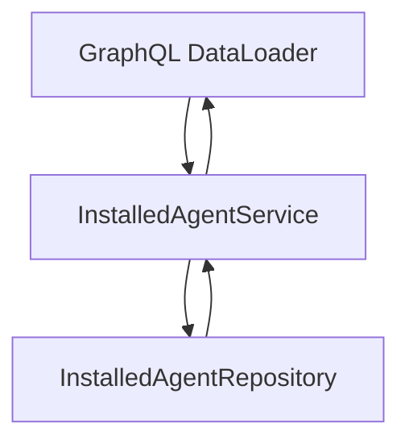
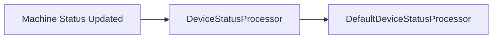
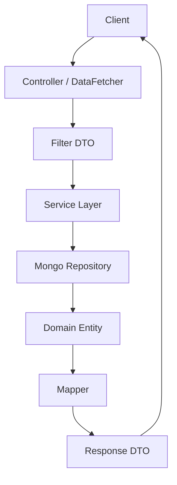

# Api Contracts And Mapping

## Overview

The **Api Contracts And Mapping** module defines the shared Data Transfer Objects (DTOs), filter contracts, pagination inputs, and mapping utilities that standardize how data flows between services, controllers, GraphQL resolvers, and external APIs across the OpenFrame platform.

It acts as the **contract layer** between:

- API-facing modules (GraphQL and REST)
- Service layer components
- Persistence modules (Mongo repositories and documents)
- External clients (frontend, external API consumers)

By centralizing contracts in a dedicated module, the platform ensures:

- Strong typing and consistent payload structures
- Reusable filter and pagination patterns
- Clear separation between domain entities and API responses
- Shared mapping logic across GraphQL and REST APIs

---

## Architectural Position in the Platform

The Api Contracts And Mapping module sits between the API service layer and the persistence layer.



### Responsibilities in the Flow

1. **Controllers & DataFetchers (Api Service Core)**
   - Accept inputs (filters, pagination)
   - Return structured DTO responses

2. **Api Contracts And Mapping**
   - Defines DTOs for request/response payloads
   - Provides filter option structures
   - Implements entity-to-DTO mapping
   - Supplies shared service helpers (e.g., DataLoader support services)

3. **Data Persistence Mongo**
   - Provides domain entities (Organization, Device, Event, etc.)
   - Mapped to/from DTOs using mappers in this module

---

# Core Design Principles

## 1. Clear Separation of Concerns

- **Entities** → Defined in the persistence module
- **DTOs** → Defined here
- **Mapping logic** → Centralized in mappers
- **Business logic** → Located in service modules

This prevents direct exposure of database entities to external APIs.

---

## 2. Reusable Filtering Model

Filtering is implemented using a consistent pattern:

- `*FilterOptions` → Input structures for filtering
- `*Filters` → Response structures containing available filter values
- `CountedGenericQueryResult<T>` → Generic paginated result with filtered count

This pattern is applied to:

- Devices
- Logs
- Events
- Tools
- Organizations

---

# DTO Layer

## Generic Query Result

### CountedGenericQueryResult

```java
public class CountedGenericQueryResult<T> extends GenericQueryResult<T> {
    private int filteredCount;
}
```

### Purpose

- Wraps paginated query results
- Adds `filteredCount` to indicate total matching results
- Supports GraphQL and REST pagination

This allows clients to:

- Render pages correctly
- Display "X results found" information

---

# Pagination Contracts

## CursorPaginationInput

```java
public class CursorPaginationInput {
    @Min(1)
    @Max(100)
    private Integer limit;
    private String cursor;
}
```

### Features

- Cursor-based pagination
- Validation constraints (`1–100` limit)
- Used consistently across list endpoints

### Flow



---

# Filtering Contracts

Filtering is implemented through two complementary DTO types:

- **Filter Options** → What can be filtered
- **Filters** → Aggregated filter values with counts

---

## Device Filtering

### DeviceFilterOptions

Defines available filter inputs:

- Statuses
- Device types
- OS types
- Organization IDs
- Tags

### DeviceFilters

Represents:

- Filter values
- Display labels
- Result counts
- `filteredCount`



---

## Log & Audit Filtering

### LogFilterOptions

Supports filtering by:

- Date range
- Event types
- Tool types
- Severities
- Organization IDs
- Device ID

### LogEvent vs LogDetails

| DTO | Purpose |
|------|----------|
| LogEvent | Lightweight event summary |
| LogDetails | Full event detail including message and extended details |

This separation allows:

- Fast list rendering
- On-demand detail retrieval

---

## Event Filtering

### EventFilterOptions

- User IDs
- Event types
- Date range

### EventFilters

- Selected filter values
- Simplified structure for query execution

---

## Tool Filtering

### ToolFilterOptions

- Enabled state
- Type
- Category
- Platform category

### ToolFilters

- Lists of tool types
- Categories
- Platform categories

---

## Organization Filtering

### OrganizationFilterOptions

Internal filtering fields:

- Category
- Employee count range
- Active contract flag

### OrganizationList

Wrapper for returning multiple organization entities.

### OrganizationResponse

Shared DTO used by:

- GraphQL (Api Service Core)
- REST (External API Service Core)

Ensures identical contract across APIs.

---

# Mapping Layer

## OrganizationMapper

The OrganizationMapper centralizes conversion between:

- CreateOrganizationRequest → Organization entity
- UpdateOrganizationRequest → existing Organization
- Organization → OrganizationResponse

### Key Features

- Generates UUID-based `organizationId`
- Prevents modification of immutable fields
- Supports partial updates
- Handles nested objects:
  - Contact information
  - Addresses
  - Contact persons



### Important Design Decisions

1. `organizationId` is immutable once created.
2. Mailing address can mirror physical address.
3. Nested DTOs are mapped recursively.
4. Entity exposure is avoided in external contracts.

---

# Shared Service Layer Utilities

Although primarily a contract module, it also provides reusable service logic used by DataLoaders and API services.

---

## InstalledAgentService

### Responsibilities

- Fetch installed agents by machine ID
- Batch-fetch agents for multiple machines
- Support DataLoader batching in GraphQL



### Optimization Strategy

- Groups results by machine ID
- Preserves request order
- Reduces N+1 query problems

---

## ToolConnectionService

Similar batching pattern:

- Fetch tool connections per machine
- Batch resolution for GraphQL

Ensures consistent multi-machine retrieval.

---

# Device Status Processing

## DefaultDeviceStatusProcessor

Provides a default implementation of the `DeviceStatusProcessor` interface.

### Behavior

- Triggered after device status update
- Logs status changes
- Used only if no custom processor bean is defined



### Extensibility

- Uses `@ConditionalOnMissingBean`
- Allows overriding in higher-level services
- Supports custom event propagation or notifications

---

# Cross-Module Relationships

The Api Contracts And Mapping module interacts with:

- Api Service Core (controllers, data fetchers)
- External API Service Core (REST endpoints)
- Data Persistence Mongo (entities & repositories)
- Stream Processing Core (event/log enrichment contracts)

It does not:

- Contain HTTP controllers
- Implement security
- Handle authentication
- Perform heavy business logic

It strictly defines contracts and mapping utilities.

---

# Data Flow Summary



---

# Key Benefits to the Platform

1. **Consistency** – Shared DTOs across GraphQL and REST
2. **Scalability** – Standardized filter + pagination model
3. **Maintainability** – Mapping logic centralized
4. **Performance** – Batch loading support for GraphQL
5. **Extensibility** – Override-friendly processors and mappers

---

# Conclusion

The **Api Contracts And Mapping** module is the backbone of the platform's API consistency. It defines how data is shaped, filtered, paginated, and transformed between persistence and presentation layers.

Without this module, each service would implement its own contracts and mapping logic, leading to:

- Inconsistent APIs
- Duplicated logic
- Tight coupling between persistence and controllers

By centralizing these concerns, the platform achieves a clean, layered, and scalable architecture.