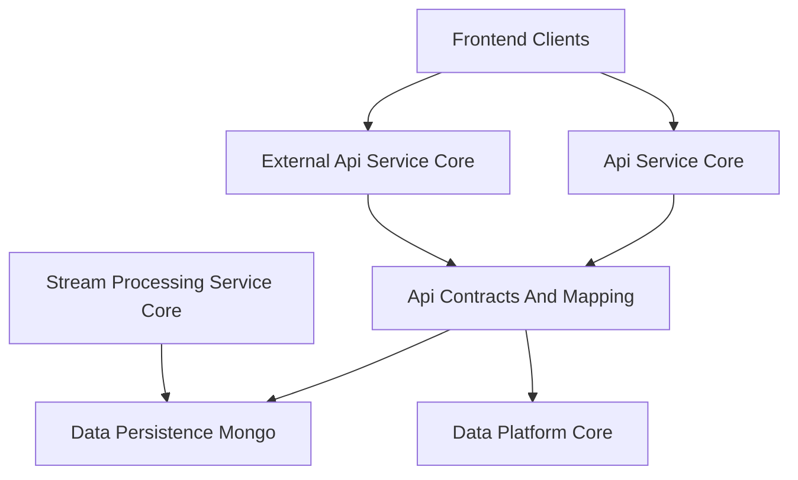
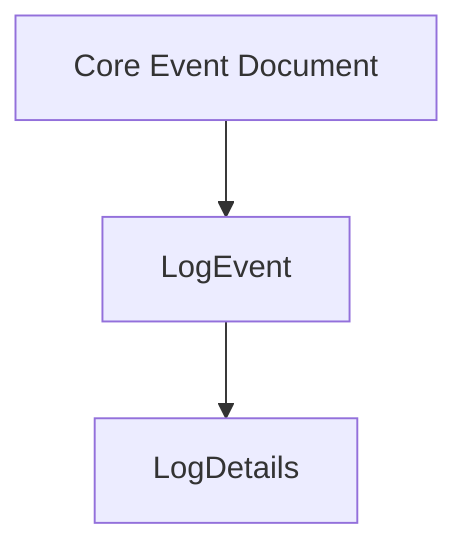
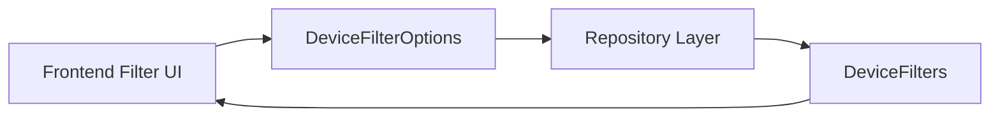
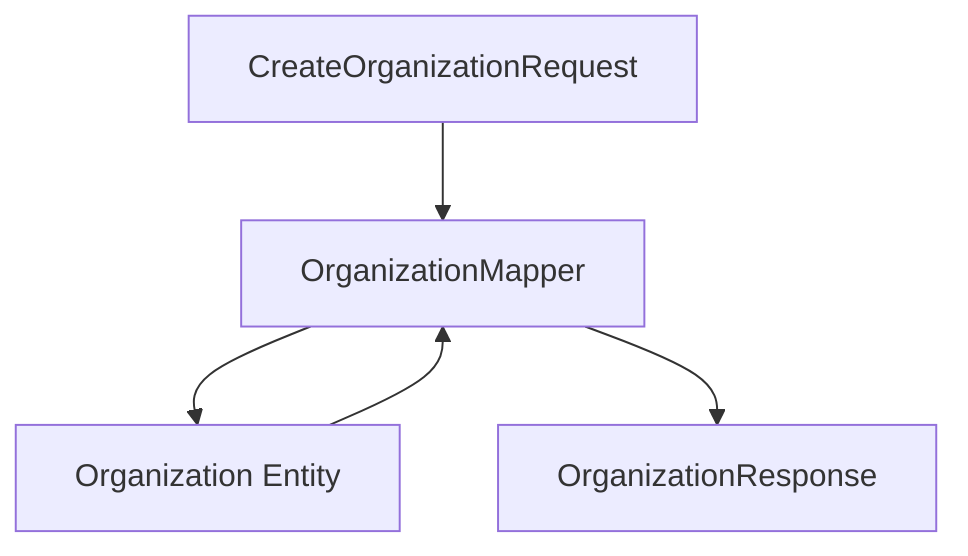
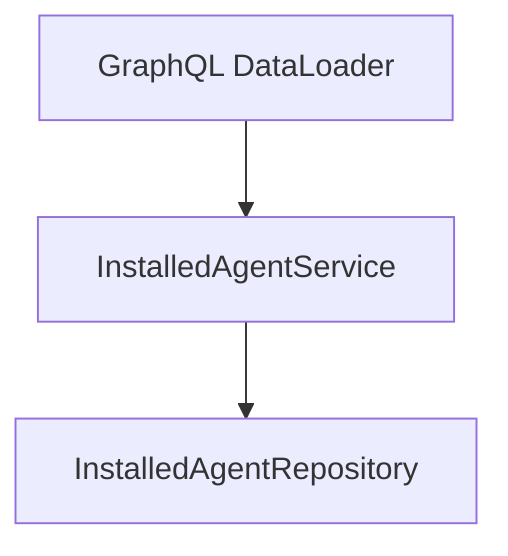
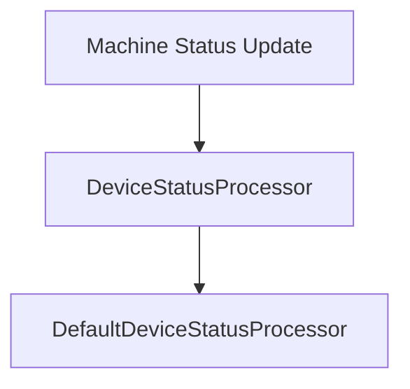

# Api Contracts And Mapping

## Overview

The **Api Contracts And Mapping** module defines the shared API layer contracts used across OpenFrame services. It contains:

- Data Transfer Objects (DTOs) for GraphQL and REST APIs  
- Filter and pagination models  
- Query result wrappers  
- Entity-to-DTO mappers  
- Shared application-level services used by API layers  

This module acts as a **contract boundary** between:

- API-facing services such as Api Service Core and External Api Service Core  
- Persistence modules such as Data Persistence Mongo  
- Stream and integration layers  
- Frontend clients (Tenant App, Chat Client)

It ensures consistency across internal GraphQL APIs and external REST APIs without duplicating schema definitions.

---

## Architectural Position

The Api Contracts And Mapping module sits between service implementations and data persistence.



### Responsibilities

1. Define stable request and response DTOs  
2. Standardize filtering and pagination models  
3. Provide entity-to-DTO mappers  
4. Provide reusable services for API consumption  
5. Ensure contract reuse across GraphQL and REST

---

# Core Building Blocks

## 1. Generic Query Wrappers

### CountedGenericQueryResult

Extends a generic query result model by including a `filteredCount` field.

**Purpose:**
- Supports paginated responses
- Provides both total and filtered counts
- Used for advanced UI filtering and analytics

```text
CountedGenericQueryResult<T>
 ├─ items (inherited)
 ├─ totalCount (inherited)
 └─ filteredCount
```

This wrapper is typically returned by query endpoints that support:

- Complex filtering
- Faceted search
- Cursor-based pagination

---

## 2. Cursor-Based Pagination

### CursorPaginationInput

Provides cursor-driven pagination with validation constraints.

```text
Fields:
- limit (1–100)
- cursor (opaque string)
```

### Design Characteristics

- Avoids offset-based pagination performance issues
- Scales well for large datasets
- Works across Mongo and stream-aggregated views

---

# Audit And Log Contracts

The audit model standardizes event and log retrieval.

## LogEvent

Lightweight event representation:

- toolEventId  
- eventType  
- toolType  
- severity  
- deviceId  
- organizationId  
- timestamp  

## LogDetails

Extended event model including:

- message  
- details  
- hostname  
- organizationName  



## Filtering Models

### LogFilterOptions
Input filter structure including:

- Date range  
- Tool types  
- Event types  
- Severities  
- Organization IDs  
- Device ID  

### LogFilters
Represents available filter values for UI dropdowns.

Includes:
- Tool types  
- Event types  
- Severities  
- Organization filter options  

### OrganizationFilterOption
Used for UI selection:

```text
OrganizationFilterOption
 ├─ id
 └─ name
```

---

# Device Contracts

## DeviceFilterOptions (Input)

Represents filtering criteria:

- Statuses  
- Device types  
- OS types  
- Organization IDs  
- Tag names  

## DeviceFilters (Output)

Represents filter metadata returned to UI:

- DeviceFilterOption lists (with counts)  
- TagFilterOption list  
- filteredCount



### DeviceFilterOption / TagFilterOption

Both include:

- value  
- label  
- count  

Used for faceted search interfaces.

---

# Event Contracts

## EventFilterOptions
Input model including:

- userIds  
- eventTypes  
- date range  

## EventFilters
Output filter metadata model.

---

# Organization Contracts

This module centralizes organization DTOs used across both GraphQL and REST.

## OrganizationResponse

Shared DTO used by:

- Api Service Core (GraphQL)  
- External Api Service Core (REST)

Includes:

- id  
- organizationId (UUID)  
- category  
- numberOfEmployees  
- contract information  
- contact information  
- lifecycle metadata  

## OrganizationList

Wrapper for returning multiple organizations.

## OrganizationFilterOptions

Internal filtering model including:

- category  
- employee range  
- active contract flag  

---

# Tool Contracts

## ToolFilterOptions (Input)

- enabled  
- type  
- category  
- platformCategory  

## ToolFilters (Output)

Lists available filter values.

## ToolList

Wraps a list of integrated tools.

---

# Mapping Layer

## OrganizationMapper

The OrganizationMapper is a central conversion component.

### Responsibilities

1. Convert CreateOrganizationRequest → Organization entity  
2. Convert UpdateOrganizationRequest → partial entity update  
3. Convert Organization → OrganizationResponse  
4. Handle nested ContactInformation mapping  
5. Generate immutable organizationId (UUID)



### Key Design Decisions

- organizationId is immutable after creation  
- Partial updates only modify non-null fields  
- Mailing address can mirror physical address  
- Mapper reused across GraphQL and REST layers  

This prevents duplication of mapping logic in multiple services.

---

# Shared API Services

## InstalledAgentService

Provides machine-to-agent aggregation logic.

### Core Capabilities

- Batch retrieval for multiple machine IDs  
- Single machine retrieval  
- Lookup by machineId and agentType  



Designed specifically to support:

- N+1 query mitigation
- Efficient batching in GraphQL resolvers

---

## ToolConnectionService

Provides batched tool connection lookup.

Similar pattern to InstalledAgentService:

- getToolConnectionsForMachines  
- getToolConnectionsForMachine  

Optimized for DataLoader usage.

---

## DefaultDeviceStatusProcessor

Default implementation of DeviceStatusProcessor.

### Purpose

- Hook for post-processing device status changes  
- Used when no custom implementation is provided  
- Designed for extension via Spring conditional beans



This allows customization without modifying API contracts.

---

# Cross-Module Integration

The Api Contracts And Mapping module integrates with:

- Api Service Core (GraphQL controllers and data fetchers)  
- External Api Service Core (REST controllers)  
- Data Persistence Mongo (entities and repositories)  
- Data Platform Core (domain models and services)  

It does not contain business workflows or transport logic.  
It strictly defines contracts and reusable mapping logic.

---

# Design Principles

1. Contract Reuse  
   Shared DTOs across GraphQL and REST.

2. Separation Of Concerns  
   Mapping logic isolated from controllers.

3. Extensibility  
   Processor interfaces allow override without contract changes.

4. UI-Friendly Filtering  
   FilterOptions (input) and Filters (faceted output) are separate models.

5. Performance Awareness  
   Cursor pagination and batch services prevent performance bottlenecks.

---

# Summary

The **Api Contracts And Mapping** module is the structural backbone of OpenFrame's API layer.  

It standardizes:

- Query results  
- Filtering models  
- Pagination contracts  
- Organization data mapping  
- Device, log, event, and tool DTOs  

By centralizing these contracts, the platform ensures consistency, scalability, and maintainability across internal and external APIs.