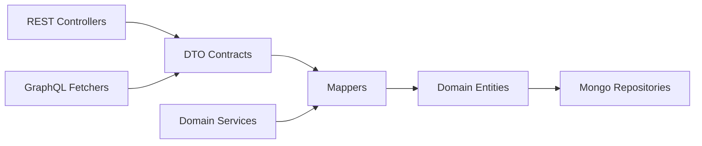
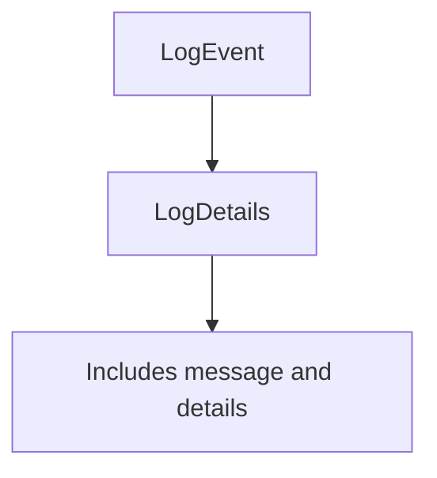
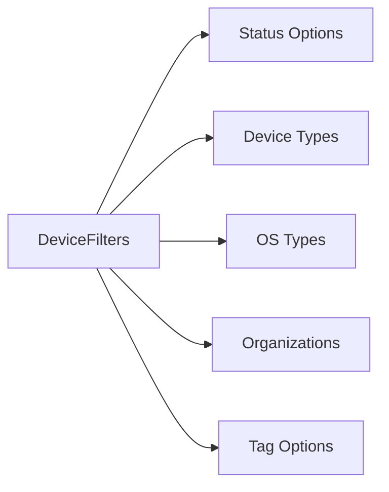
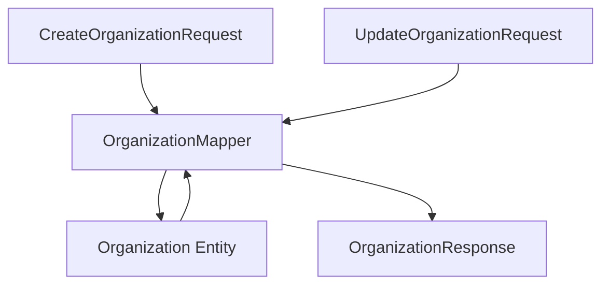
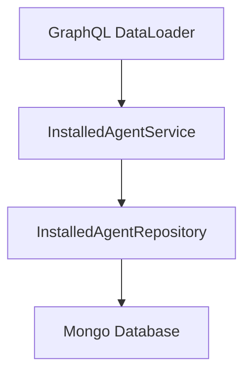
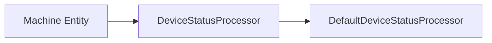
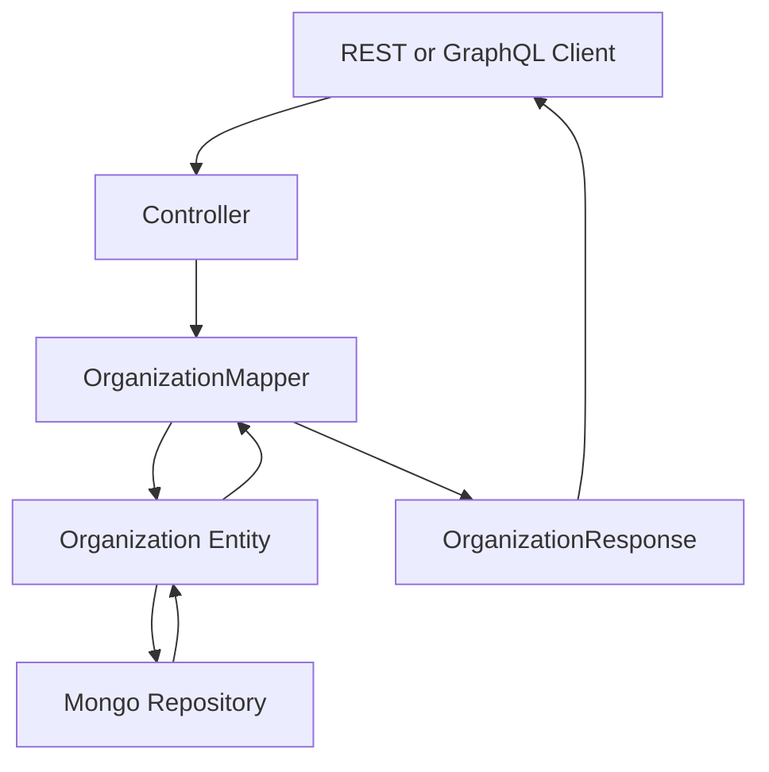
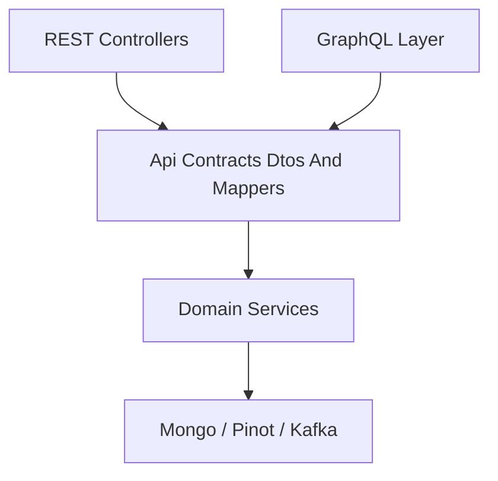

# Api Contracts Dtos And Mappers

The **Api Contracts Dtos And Mappers** module defines the shared data contracts between services, controllers, GraphQL resolvers, and external clients within the OpenFrame platform.

It acts as the **contract boundary layer** between:

- REST controllers in Api Service Core and External API
- GraphQL data fetchers and data loaders
- Domain services and processors
- Data layer entities (Mongo, Pinot, etc.)
- Frontend and external consumers

This module ensures:

- Stable and versioned API contracts
- Clear separation between persistence models and API representations
- Reusable filtering and pagination structures
- Centralized mapping logic for complex domain entities

---

## Architectural Role in the Platform

The Api Contracts Dtos And Mappers module sits between the domain layer and the transport layers (REST/GraphQL).



### Key Responsibilities

1. Define DTOs used in REST and GraphQL APIs
2. Provide filter and query option models
3. Implement entity-to-DTO mapping logic
4. Standardize pagination and counted results
5. Provide shared services used by DataLoaders

This module is heavily used by:

- [Api Service Core Rest Controllers](../api_service_core_rest_controllers/api_service_core_rest_controllers.md)
- [Api Service Core Graphql Fetchers And Loaders](../api_service_core_graphql_fetchers_and_loaders/api_service_core_graphql_fetchers_and_loaders.md)
- [External Api Service Core](../external_api_service_core/external_api_service_core.md)
- [Data Layer Mongo Models And Repositories](../data_layer_mongo_models_and_repositories/data_layer_mongo_models_and_repositories.md)

---

# Core Building Blocks

The module can be grouped into the following logical areas:

1. Generic Query & Pagination Contracts
2. Audit & Log DTOs
3. Device DTOs and Filters
4. Event DTOs and Filters
5. Organization DTOs and Mapping
6. Tool DTOs and Filters
7. Shared Services for GraphQL DataLoaders
8. Device Status Processing Extension Point

---

# 1. Generic Query and Pagination Contracts

## CountedGenericQueryResult

```java
public class CountedGenericQueryResult<T> extends GenericQueryResult<T> {
    private int filteredCount;
}
```

### Purpose

Extends a generic query result by adding `filteredCount`, enabling APIs to return:

- The list of items
- The total count after filters are applied

This is critical for:

- Paginated tables
- Filtered dashboards
- GraphQL connections

---

## CursorPaginationInput

```java
public class CursorPaginationInput {
    @Min(1)
    @Max(100)
    private Integer limit;
    private String cursor;
}
```

### Characteristics

- Cursor-based pagination
- Validated limits (1–100)
- Designed for scalable queries

Used across list-based GraphQL queries and REST endpoints.

---

# 2. Audit and Log DTOs

This section defines contracts for audit logs and event history APIs.

## LogEvent vs LogDetails



### LogEvent
- Lightweight event representation
- Used in list queries
- Contains metadata such as:
  - eventType
  - toolType
  - severity
  - timestamp
  - organization and device identifiers

### LogDetails
- Extends logical structure of LogEvent
- Adds:
  - message
  - details
- Used for detail views

---

## LogFilterOptions and LogFilters

Two complementary structures:

### LogFilterOptions
Defines input constraints:

- Date range
- Event types
- Tool types
- Severities
- Organization IDs
- Device ID

Used by controllers and GraphQL fetchers.

### LogFilters
Represents resolved filter sets returned to UI:

- Available tool types
- Available event types
- Available severities
- Organization filter options

Supports dynamic filter dropdowns in frontend.

---

# 3. Device DTOs and Filters

## DeviceFilterOptions

Defines allowed filtering criteria:

- DeviceStatus
- DeviceType
- OS types
- Organization IDs
- Tag names

Bridges domain enums with API layer.

---

## DeviceFilters



Each filter option contains:

- value
- label
- count

This allows frontend dashboards to show:

- "Online (42)"
- "Windows (18)"
- "Tagged: Critical (5)"

---

## TagFilterOption and DeviceFilterOption

Reusable option DTOs with:

- value
- label
- count

These enable aggregated filter summaries.

---

# 4. Event DTOs and Filters

## EventFilterOptions

Used for querying event streams by:

- userIds
- eventTypes
- startDate
- endDate

## EventFilters

Simplified filter result structure returned to UI.

This separation between *input filter options* and *resolved filters* keeps API contracts clean and predictable.

---

# 5. Organization DTOs and Mapping

This is one of the most sophisticated areas in the module.

## OrganizationResponse

Shared response model used by both REST and GraphQL APIs.

Contains:

- Core identity fields
- Financial fields
- Contract dates
- Contact information
- Soft deletion metadata

---

## OrganizationList

Wrapper DTO for list responses:

```java
public class OrganizationList {
    private List<Organization> organizations;
}
```

Used by REST controllers for bulk retrieval.

---

## OrganizationMapper

Central mapping component:



### Responsibilities

1. Convert create request to entity
2. Perform partial updates (non-null fields only)
3. Enforce immutable organizationId
4. Map nested structures:
   - ContactInformation
   - ContactPerson
   - Address
5. Generate UUID-based organizationId

### Important Design Decisions

- organizationId is immutable
- mailingAddressSameAsPhysical auto-copies address
- Deleted state is explicitly modeled
- Mapper is shared between REST and GraphQL

This prevents duplication across:

- Api Service Core
- External Api Service Core

---

# 6. Tool DTOs and Filters

## ToolFilterOptions

Used for querying tools by:

- enabled
- type
- category
- platformCategory

## ToolFilters

Resolved filter collections returned to UI:

- types
- categories
- platformCategories

## ToolList

Wrapper DTO around list of IntegratedTool entities.

---

# 7. Shared Services for GraphQL DataLoaders

These services are optimized for batch resolution.

## InstalledAgentService



### Key Method

`getInstalledAgentsForMachines(List<String> machineIds)`

Returns grouped results preserving input order — critical for DataLoader batching.

Other capabilities:

- Fetch by machineId
- Fetch by machineId and agentType
- Fetch all agents

---

## ToolConnectionService

Batch retrieval of ToolConnection entities for:

- Single machine
- Multiple machines

Optimized for GraphQL N+1 query prevention.

---

# 8. Device Status Processing Extension Point

## DefaultDeviceStatusProcessor



### Characteristics

- Conditional bean (`@ConditionalOnMissingBean`)
- Provides default no-op logging behavior
- Can be overridden by custom implementation

This enables extensibility for:

- Custom monitoring hooks
- External notification systems
- Audit logging pipelines

---

# Data Flow Example: Organization Creation



---

# Design Principles

## 1. Clear Separation of Concerns

- Entities belong to data layer
- DTOs belong to contract layer
- Mappers isolate transformation logic

## 2. Transport-Agnostic Contracts

DTOs are reused across:

- REST
- GraphQL
- External APIs

## 3. Filter Abstraction Pattern

Each domain uses:

- FilterOptions (input)
- Filters (resolved UI output)

This ensures scalable, dynamic filtering capabilities.

## 4. Batch-Friendly Services

Services such as InstalledAgentService are intentionally shaped for GraphQL DataLoader compatibility.

---

# How This Module Fits Into the System



Without this module:

- Controllers would leak persistence models
- Mapping logic would be duplicated
- Filtering logic would be inconsistent
- GraphQL batching would be inefficient

---

# Summary

The **Api Contracts Dtos And Mappers** module is the contract backbone of the OpenFrame platform.

It provides:

- Stable API DTOs
- Filter and pagination models
- Shared mapping logic
- Batch-oriented services
- Extensibility hooks

It ensures consistency between REST, GraphQL, and data layers while keeping domain entities isolated from external consumers.

This module is foundational for maintainable, scalable, and evolvable API design across the entire OpenFrame ecosystem.
