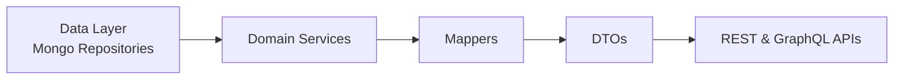
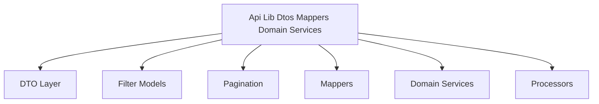
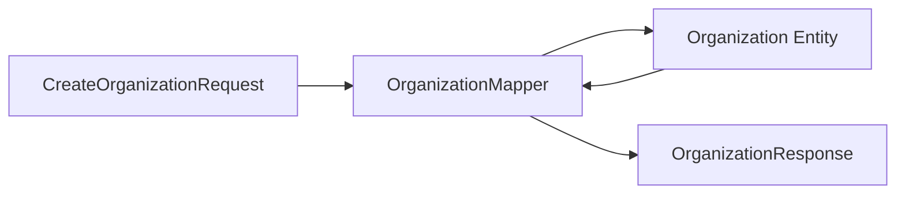
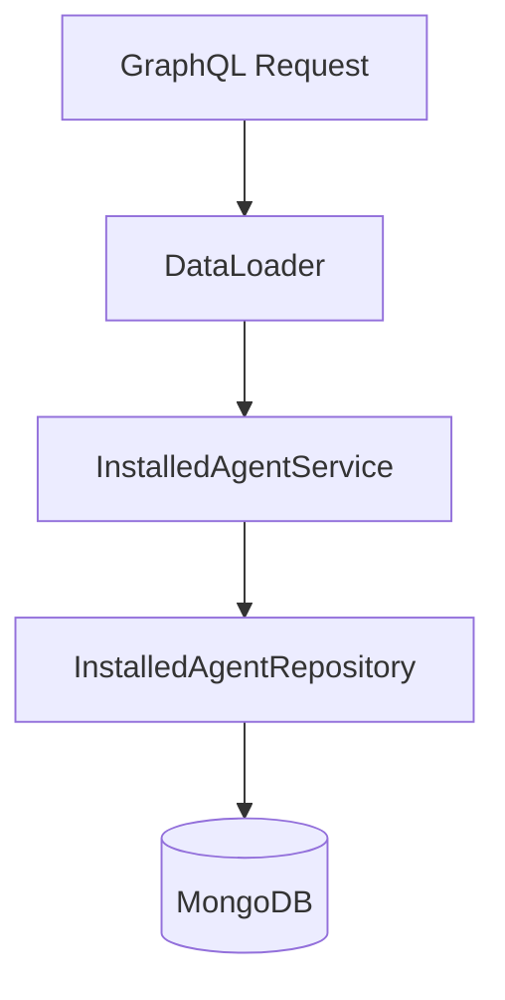
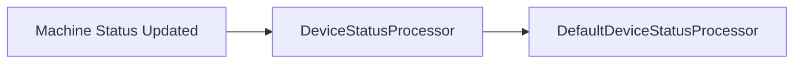
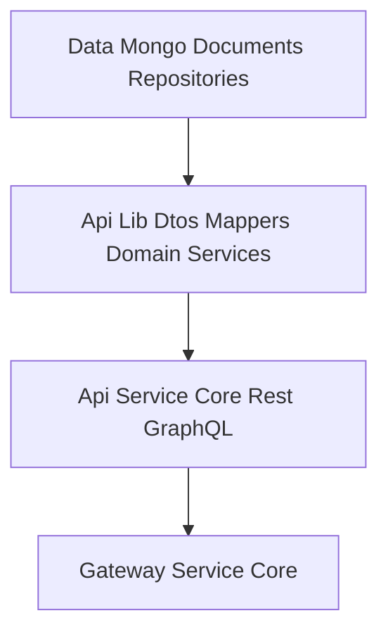

# Api Lib Dtos Mappers Domain Services

## Overview

The **Api Lib Dtos Mappers Domain Services** module is a shared library that provides:

- Core Data Transfer Objects (DTOs)
- Filtering and pagination models
- Entity-to-DTO mappers
- Reusable domain-level services
- Default processor implementations

This module is designed to be reused across multiple service layers, including:

- [Api Service Core Rest GraphQL](../api_service_core_rest_graphql/api_service_core_rest_graphql.md)
- External API services
- GraphQL data fetchers and REST controllers

It acts as a **contract and transformation layer** between:

- Data layer (Mongo, Pinot, Cassandra)
- Business services
- REST and GraphQL APIs

---

## Architectural Role

At a high level, this module sits between persistence and API delivery layers.



### Responsibilities

1. Standardize API response models
2. Provide reusable filtering structures
3. Encapsulate pagination logic
4. Map internal entities to external-safe DTOs
5. Provide batch-loading services for GraphQL
6. Offer extension points via processor interfaces

---

# Module Structure

The module can be logically divided into five areas:



---

# DTO Layer

DTOs define the contract exposed by APIs and shared between services.

## Generic Query Results

### CountedGenericQueryResult

Extends a base query result with a filtered count:

```java
public class CountedGenericQueryResult<T> extends GenericQueryResult<T> {
    private int filteredCount;
}
```

**Purpose:**
- Used in paginated queries
- Returns total filtered count alongside results
- Supports GraphQL-style connection models

---

## Audit DTOs

### LogEvent
Lightweight event representation.

### LogDetails
Extended event with full message and details.

### LogFilterOptions
Input model for querying logs:
- Date range
- Event types
- Tool types
- Severities
- Organization filters

### LogFilters
Precomputed filter metadata for UI dropdowns.

### OrganizationFilterOption
Simple ID + name pair used in UI filter lists.

---

## Device DTOs

### DeviceFilterOptions
Available filtering dimensions:
- Status
- Device type
- OS types
- Organization IDs
- Tag names

### DeviceFilters
Returned filter options including counts per option.

### DeviceFilterOption / TagFilterOption
Reusable value/label/count structure for UI aggregation.

---

## Event DTOs

### EventFilterOptions
Defines query constraints such as:
- User IDs
- Event types
- Date range

### EventFilters
Compact representation for UI filtering.

---

## Organization DTOs

### OrganizationResponse
Shared response model used by both REST and GraphQL APIs.

Contains:
- Business identifiers
- Contact information
- Revenue and contract metadata
- Audit fields (createdAt, updatedAt)
- Soft-delete indicators

### OrganizationList
Wrapper for returning multiple organizations.

### OrganizationFilterOptions
Internal filter criteria used for advanced organization queries.

---

## Tool DTOs

### ToolFilterOptions
Filter input for tool queries.

### ToolFilters
Multi-value filter model.

### ToolList
Wrapper for returning integrated tools.

---

# Shared Pagination Model

## CursorPaginationInput

Provides cursor-based pagination:

```java
public class CursorPaginationInput {
    @Min(1)
    @Max(100)
    private Integer limit;
    private String cursor;
}
```

**Key Features:**
- Enforced validation constraints
- GraphQL-friendly cursor model
- Supports efficient forward pagination

---

# Mapper Layer

## OrganizationMapper

The OrganizationMapper converts between:

- CreateOrganizationRequest → Organization entity
- UpdateOrganizationRequest → Organization entity (partial updates)
- Organization entity → OrganizationResponse DTO

### Mapping Flow



### Key Design Decisions

- `organizationId` is immutable once generated
- Partial updates only modify non-null fields
- Contact information mapping is deeply nested
- Mailing address can mirror physical address

This ensures:

- Separation of internal document model and API contract
- Backward compatibility for clients
- Centralized transformation logic

---

# Domain Services

These services provide reusable domain logic that is shared across APIs.

## InstalledAgentService

Provides batch and single retrieval operations:

- Get agents for multiple machines (GraphQL DataLoader support)
- Get agents by machine
- Get agent by ID

### Batch Loading Pattern



The `getInstalledAgentsForMachines` method groups results by machine ID and preserves ordering.

---

## ToolConnectionService

Provides batch retrieval of tool connections per machine.

Optimized for:
- GraphQL resolvers
- Avoiding N+1 query issues

---

# Processor Extension Point

## DefaultDeviceStatusProcessor

Implements `DeviceStatusProcessor` and is annotated with:

```text
@ConditionalOnMissingBean(DeviceStatusProcessor.class)
```

### Purpose

- Acts as default behavior
- Allows overriding in other modules
- Enables custom post-processing when device status changes

### Extension Flow



This makes the module extensible without tight coupling.

---

# How This Module Fits the System

Within the overall platform architecture:



## Summary of Responsibilities

| Layer | Responsibility |
|-------|----------------|
| DTOs | API contract models |
| Filters | Query and UI filtering support |
| Pagination | Cursor-based navigation |
| Mappers | Entity ↔ DTO transformation |
| Services | Shared domain logic |
| Processors | Extensibility hooks |

---

# Design Principles

1. Separation of concerns
2. Shared API contracts across services
3. Reusable batch-loading logic
4. Extensible processor interfaces
5. Clear boundary between persistence and presentation

---

# When to Modify This Module

You should update this module when:

- A new API-level DTO is needed
- A shared filter model is introduced
- A new entity-to-DTO mapping is required
- Batch-loading domain logic must be reused
- A cross-cutting processor extension point is added

Avoid placing business-specific logic here. This module is meant to remain reusable and infrastructure-focused.

---

# Conclusion

The **Api Lib Dtos Mappers Domain Services** module is the structural backbone of API data modeling and transformation. It ensures consistent contracts, reusable filtering, efficient data loading, and clean separation between persistence and API layers across the OpenFrame ecosystem.
