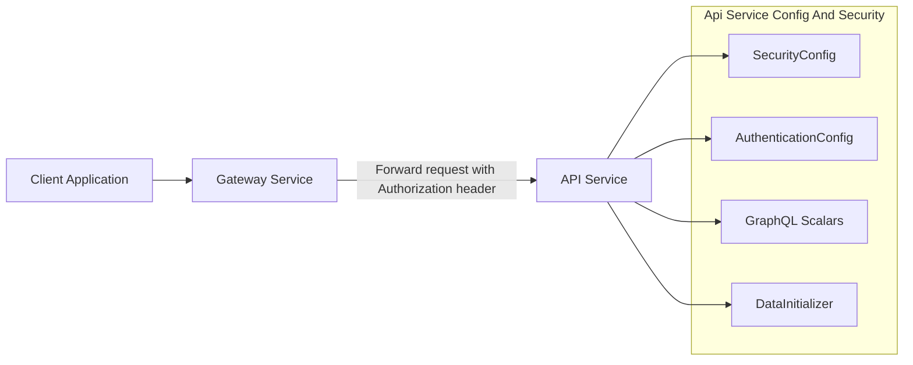
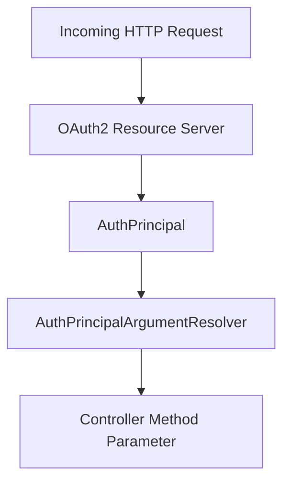
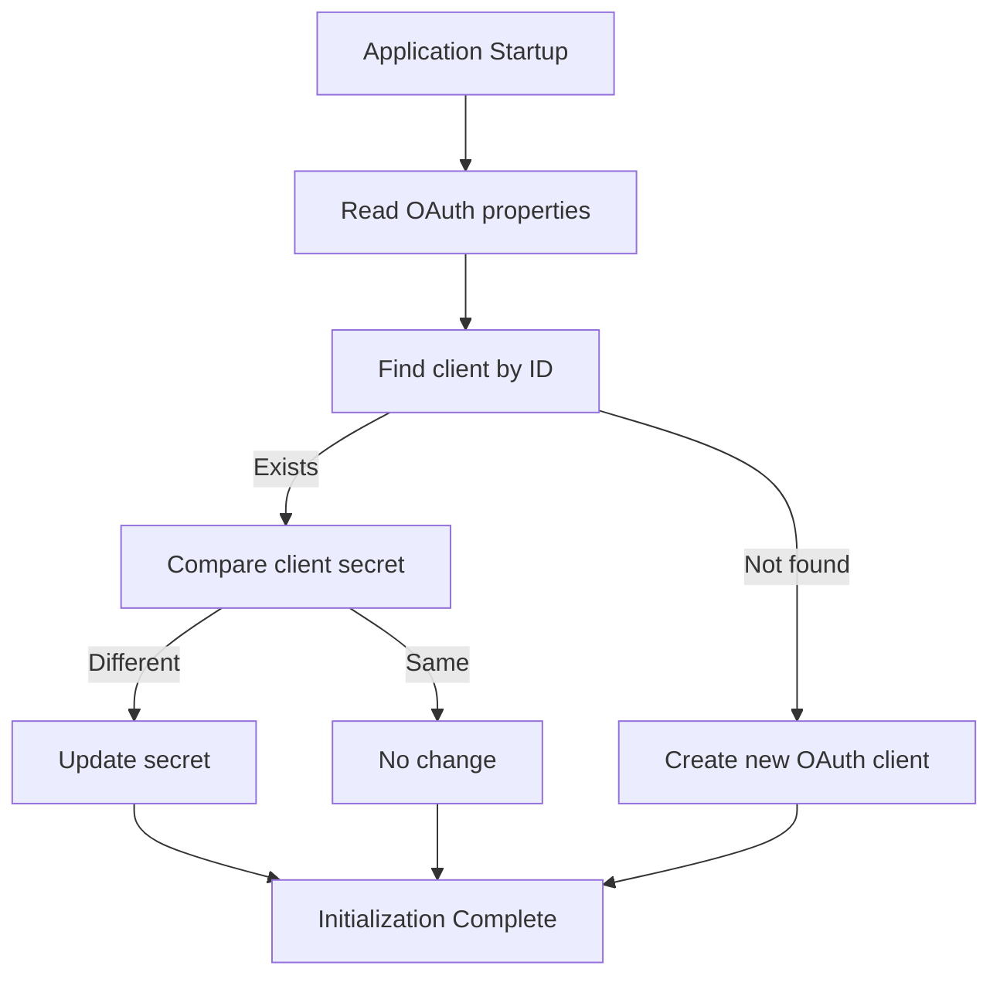
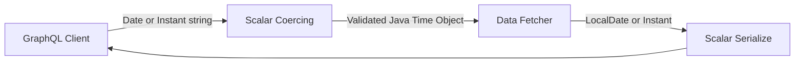
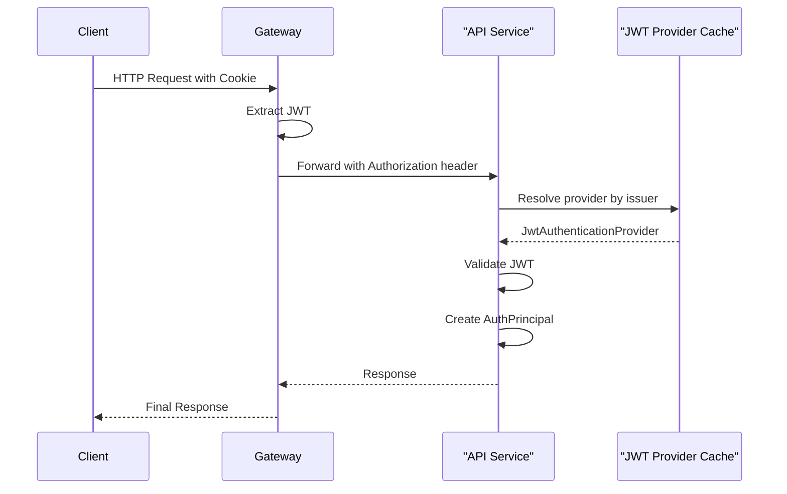

# Api Service Config And Security

## Overview

The **Api Service Config And Security** module provides foundational configuration for the OpenFrame API service. It is responsible for:

- Core Spring beans (e.g., password encoding, REST clients)
- Authentication principal resolution
- OAuth client bootstrap initialization
- GraphQL custom scalar registration
- OAuth2 Resource Server configuration
- JWT issuer-based authentication provider caching

This module does **not** implement business logic or REST/GraphQL endpoints. Instead, it establishes the runtime and security infrastructure that other API modules depend on (such as REST controllers, GraphQL data fetchers, and domain services).

---

## Architectural Context

Within the overall OpenFrame platform, the API Service sits behind the Gateway. The Gateway handles request filtering, JWT extraction, and high-level authorization. The Api Service Config And Security module enables the API service to:

- Act as an OAuth2 Resource Server
- Decode and validate JWTs per issuer
- Expose authenticated principals to controllers
- Support GraphQL custom scalar types

### High-Level Interaction



**Key Principle:** The Gateway performs primary authentication enforcement. The API service enables JWT decoding and principal propagation for downstream business logic.

---

## Core Components

### 1. ApiApplicationConfig

**Class:** `ApiApplicationConfig`

Provides general-purpose Spring beans required by the API layer.

#### PasswordEncoder Bean

```java
@Bean
public PasswordEncoder passwordEncoder() {
    return new BCryptPasswordEncoder();
}
```

- Uses `BCryptPasswordEncoder`
- Ensures secure hashing of user credentials
- Used by user-related services and processors

This encoder aligns with Spring Security best practices and ensures compatibility with authentication flows managed across services.

---

### 2. AuthenticationConfig

**Class:** `AuthenticationConfig`

Registers a custom argument resolver for authentication principals.

```java
@Override
public void addArgumentResolvers(List<HandlerMethodArgumentResolver> resolvers) {
    resolvers.add(new AuthPrincipalArgumentResolver());
}
```

#### Purpose

- Enables use of `@AuthenticationPrincipal` with a custom `AuthPrincipal` type
- Bridges JWT-based authentication to controller method parameters

#### Flow



This allows REST and GraphQL layers to directly access authenticated user context without manual token parsing.

---

### 3. DataInitializer

**Class:** `DataInitializer`

Bootstraps OAuth client configuration at application startup.

Implements a `CommandLineRunner` bean that:

1. Reads properties:
   - `oauth.client.default.id`
   - `oauth.client.default.secret`
2. Checks if the client exists in `OAuthClientRepository`
3. Creates or updates the client accordingly

#### Initialization Logic



#### Why This Matters

- Ensures required OAuth clients always exist
- Keeps secrets synchronized with environment configuration
- Supports automated deployments and immutable infrastructure patterns

---

### 4. GraphQL Scalar Configuration

The module defines custom scalars for GraphQL using Netflix DGS.

#### DateScalarConfig

- Scalar name: `Date`
- Java type: `LocalDate`
- Format: `yyyy-MM-dd`

Responsibilities:
- Serialize `LocalDate` to string
- Parse string to `LocalDate`
- Validate format strictly

#### InstantScalarConfig

- Scalar name: `Instant`
- Java type: `Instant`
- Format: ISO-8601 (default `Instant.parse`)

Responsibilities:
- Serialize `Instant` to ISO-8601 string
- Parse string to `Instant`
- Validate timestamp correctness

#### GraphQL Type Flow



These scalars:

- Prevent inconsistent date formats
- Enforce strong typing in GraphQL schema
- Reduce runtime parsing errors

---

### 5. RestTemplateConfig

**Class:** `RestTemplateConfig`

Provides a shared `RestTemplate` bean:

```java
@Bean
public RestTemplate restTemplate() {
    return new RestTemplate();
}
```

Used for:
- External service calls
- OAuth flows
- Integration with external identity providers

Centralizing this bean allows future customization (timeouts, interceptors, error handlers) in one place.

---

### 6. SecurityConfig

**Class:** `SecurityConfig`

This is the most critical part of the module.

### Design Philosophy

The API service:

- ✅ Enables JWT decoding
- ✅ Supports multi-issuer authentication
- ✅ Exposes `@AuthenticationPrincipal`
- ❌ Does NOT enforce endpoint-level authorization
- ❌ Does NOT manage login flows

The Gateway handles filtering and authorization decisions.

---

## JWT Provider Cache

A Caffeine `LoadingCache` is used to cache `JwtAuthenticationProvider` instances per issuer.

```java
@Bean
public LoadingCache<String, JwtAuthenticationProvider> jwtProviderCache() {
    return Caffeine.newBuilder()
            .maximumSize(maximumSize)
            .expireAfterWrite(expireAfter)
            .refreshAfterWrite(refreshAfter)
            .build(issuer -> {
                var decoder = JwtDecoders.fromIssuerLocation(issuer);
                return new JwtAuthenticationProvider(decoder);
            });
}
```

### Why Caching Is Important

Without caching:
- Each new issuer would trigger repeated metadata discovery
- Increased latency
- Increased load on identity providers

With caching:
- Providers are reused
- Issuer metadata refresh is controlled
- Performance remains stable under multi-tenant scenarios

---

## Security Filter Chain

```java
@Bean
public SecurityFilterChain securityFilterChain(HttpSecurity http,
        LoadingCache<String, JwtAuthenticationProvider> jwtProviderCache) throws Exception {

    JwtIssuerAuthenticationManagerResolver issuerResolver =
        new JwtIssuerAuthenticationManagerResolver(
            issuer -> jwtProviderCache.get(issuer)::authenticate
        );

    return http
            .csrf(AbstractHttpConfigurer::disable)
            .authorizeHttpRequests(auth -> auth
                    .anyRequest().permitAll()
            )
            .oauth2ResourceServer(oauth2 ->
                    oauth2.authenticationManagerResolver(issuerResolver))
            .build();
}
```

### Key Behaviors

1. **CSRF Disabled**
   - API is stateless
   - Protected by Gateway

2. **All Requests Permitted**
   - Authorization is delegated to Gateway
   - API still receives authenticated context

3. **OAuth2 Resource Server Enabled**
   - Validates JWT
   - Uses dynamic issuer resolution
   - Supports multi-tenant identity providers

---

## End-to-End Authentication Flow



---

## Configuration Properties

The module relies on externalized configuration for:

```text
openframe.security.jwt.cache.expire-after
openframe.security.jwt.cache.refresh-after
openframe.security.jwt.cache.maximum-size

oauth.client.default.id
oauth.client.default.secret
```

These properties allow runtime tuning without code changes.

---

## Responsibilities Summary

| Concern | Component | Responsibility |
|----------|------------|----------------|
| Password hashing | ApiApplicationConfig | BCrypt encoder bean |
| Principal resolution | AuthenticationConfig | Custom argument resolver |
| OAuth client bootstrap | DataInitializer | Create/update default OAuth client |
| GraphQL Date scalar | DateScalarConfig | yyyy-MM-dd parsing/serialization |
| GraphQL Instant scalar | InstantScalarConfig | ISO-8601 parsing/serialization |
| External HTTP calls | RestTemplateConfig | Shared RestTemplate bean |
| JWT validation | SecurityConfig | OAuth2 Resource Server + issuer cache |

---

## Design Principles

1. **Separation of Concerns**  
   Gateway enforces access. API focuses on domain logic.

2. **Stateless Security**  
   No server-side sessions.

3. **Multi-Tenant Ready**  
   Dynamic issuer resolution with caching.

4. **Strong Typing in GraphQL**  
   Explicit scalars prevent invalid date/time formats.

5. **Infrastructure as Code Friendly**  
   OAuth clients auto-initialized at startup.

---

## Conclusion

The **Api Service Config And Security** module is the infrastructure backbone of the API service. It ensures:

- Secure JWT validation
- Clean authentication principal propagation
- Reliable OAuth client initialization
- Consistent GraphQL date/time handling
- Centralized bean configuration

Although minimal in business logic, this module is critical for correctness, security, and maintainability of the entire OpenFrame API layer.