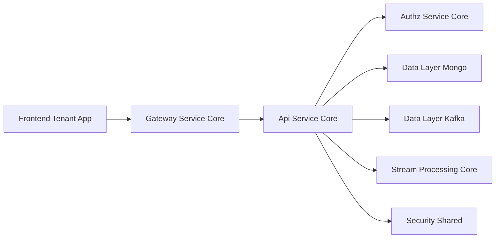
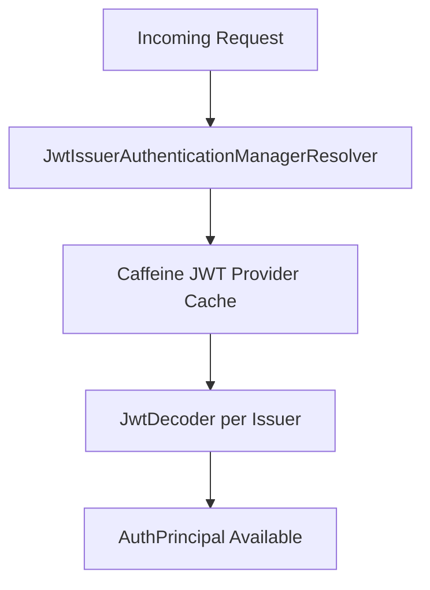
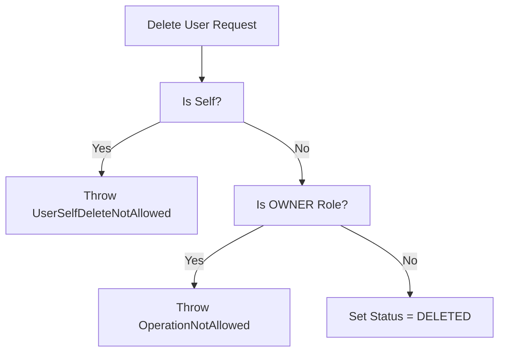
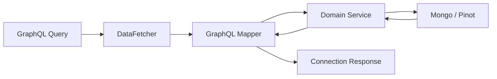
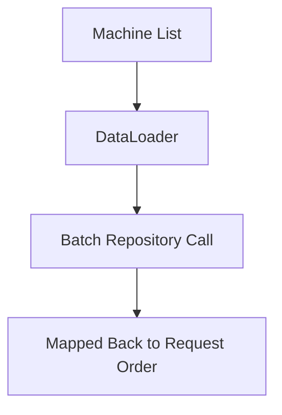
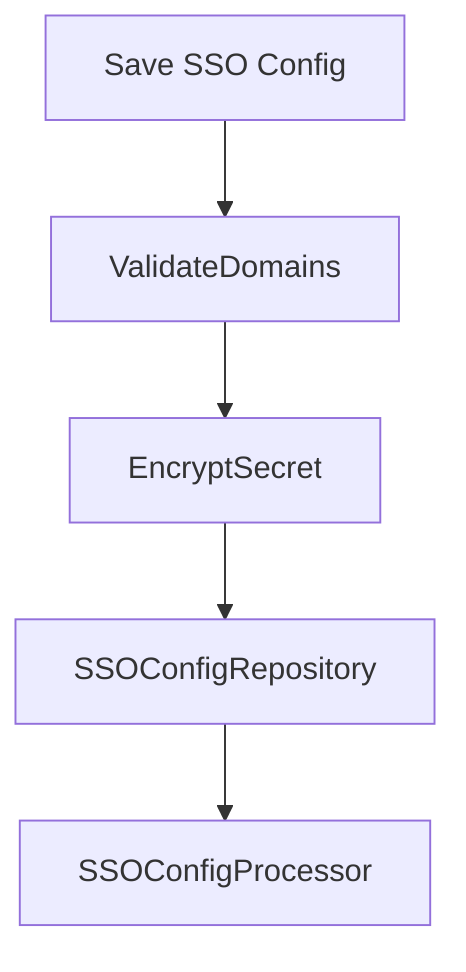
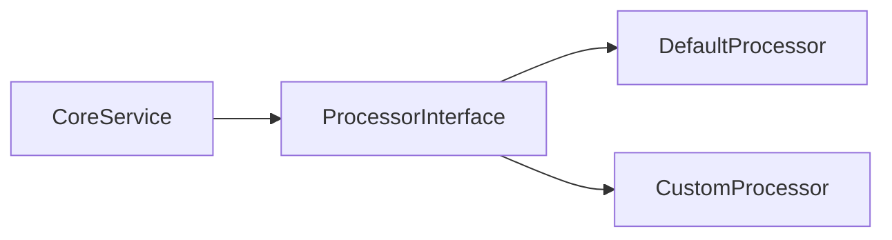
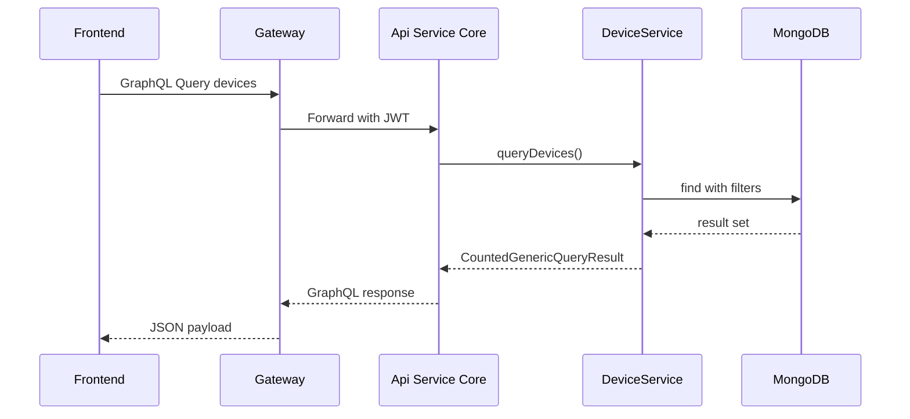

# Api Service Core

The **Api Service Core** module is the primary internal API layer of the OpenFrame platform. It exposes REST and GraphQL endpoints used by the frontend tenant application, gateway layer, and other internal services.

It is responsible for:

- Internal REST APIs for users, organizations, API keys, SSO, invitations, and configuration
- GraphQL APIs for devices, events, logs, tools, and organizations
- Authentication principal resolution and JWT resource server support
- Coordination with domain services and data repositories
- Providing extension hooks through processor interfaces

Api Service Core acts as a domain-oriented façade over the data layer and business services while delegating authentication enforcement to the Gateway and Authorization services.

---

## High-Level Architecture



### Responsibilities Boundary

- **Gateway Service Core**: JWT validation, cookie-to-header translation, rate limiting, CORS.
- **Authz Service Core**: OAuth2 Authorization Server, login, SSO flows, tenant context.
- **Api Service Core**: Business APIs, domain orchestration, GraphQL queries/mutations.
- **Data Layers**: Persistence (MongoDB), Kafka integration, and Pinot analytical repositories.

---

# 1. Configuration Layer

## 1.1 ApiApplicationConfig

Provides core Spring beans:

- `PasswordEncoder` using `BCryptPasswordEncoder`

This ensures consistent password hashing across user and API-related flows.

## 1.2 AuthenticationConfig

Registers a custom `AuthPrincipalArgumentResolver` so controllers can use:

```java
@AuthenticationPrincipal AuthPrincipal principal
```

This allows domain controllers to access:

- User ID
- Email
- Display name
- Roles
- Tenant ID

Without manually parsing JWT claims.

## 1.3 SecurityConfig

Although Gateway handles authentication enforcement, Api Service Core enables OAuth2 Resource Server support to:

- Resolve JWT issuers dynamically
- Support multi-tenant issuer-based validation
- Populate `@AuthenticationPrincipal`



Key characteristics:

- CSRF disabled (stateless API)
- All requests permitted (authorization done upstream)
- Dynamic issuer-based JWT validation
- Caffeine-based provider cache

---

# 2. REST Controllers

The REST layer provides internal APIs for administrative and operational workflows.

## 2.1 User & Identity

- **UserController** – CRUD and soft delete users
- **MeController** – Returns authenticated user metadata
- **InvitationController** – Manage user invitations
- **SSOConfigController** – Configure and toggle SSO providers

### Soft Delete Logic

`UserService` enforces:

- Prevent self-deletion
- Prevent OWNER deletion
- Marks user status as `DELETED`



## 2.2 Organization Management

- **OrganizationController** – Create, update, delete organizations

Deletion safeguards:

- Throws conflict if organization still has machines

## 2.3 API Key Management

- **ApiKeyController** – Create, list, update, regenerate, delete API keys

API keys are scoped per user using `AuthPrincipal`.

## 2.4 Device Internal API

- **DeviceController** – Patch device status

Used primarily by internal services or stream processors.

## 2.5 Configuration & Metadata

- **ReleaseVersionController** – Retrieve current release metadata
- **OpenFrameClientConfigurationController** – Provide client configuration
- **AgentRegistrationSecretController** – Manage agent registration secrets
- **HealthController** – Liveness endpoint

---

# 3. GraphQL Layer (Netflix DGS)

Api Service Core exposes GraphQL APIs using Netflix DGS.

## 3.1 Query DataFetchers

- **DeviceDataFetcher**
- **EventDataFetcher**
- **LogDataFetcher**
- **OrganizationDataFetcher**
- **ToolsDataFetcher**

These components:

- Accept filter inputs
- Convert to domain filter options via mappers
- Apply cursor-based pagination
- Return connection-based responses



## 3.2 DataLoader Layer

To prevent N+1 query issues, DGS DataLoaders are used:

- **InstalledAgentDataLoader**
- **OrganizationDataLoader**
- **TagDataLoader**
- **ToolConnectionDataLoader**



This ensures efficient batched database access.

---

# 4. SSO Configuration Service

`SSOConfigService` manages:

- Enabled providers
- Full provider configuration
- Encryption of client secrets
- Domain validation for auto-provisioning
- Provider-specific constraints (e.g., Microsoft tenant requirement)



Features:

- Encrypted client secrets
- Domain normalization
- Auto-provision safeguards
- Extension via `SSOConfigProcessor`

---

# 5. Extension & Processor Model

The module provides pluggable processors with default implementations:

- **DefaultInvitationProcessor**
- **DefaultSSOConfigProcessor**
- **DefaultUserProcessor**

Each is annotated with `@ConditionalOnMissingBean`, enabling:

- Tenant-specific overrides
- Custom post-processing logic
- Event publishing or auditing hooks



If a custom processor bean exists, it overrides the default.

---

# 6. Interaction with Other Modules

## 6.1 With Gateway Service Core

- Gateway validates JWT
- Adds Authorization headers
- Handles CORS and rate limiting
- Forwards authenticated requests to Api Service Core

## 6.2 With Authz Service Core

- OAuth2 login and SSO flows
- Tenant-aware JWT issuer resolution
- Key generation and token lifecycle

## 6.3 With Data Layer Mongo

- Users
- Organizations
- Devices
- Events
- SSO configurations
- API keys

## 6.4 With Stream Processing Core

- Device status updates
- Event ingestion
- Audit log enrichment

---

# 7. Execution Flow Example

## Example: Fetch Devices via GraphQL



---

# 8. Design Principles

Api Service Core follows:

- ✅ Thin controllers, rich services
- ✅ Clear separation of REST and GraphQL concerns
- ✅ Cursor-based pagination
- ✅ Multi-tenant aware JWT resolution
- ✅ Pluggable processor extension model
- ✅ DataLoader-based GraphQL optimization

---

# 9. Summary

The **Api Service Core** module is the domain-centric API layer of OpenFrame.

It:

- Exposes internal REST and GraphQL endpoints
- Coordinates domain services and persistence
- Integrates with Gateway and Authorization services
- Supports SSO, API keys, invitations, organizations, and devices
- Provides extensibility through processor hooks

It forms the core application logic layer between infrastructure (Gateway/Auth) and persistence (Mongo/Kafka/Pinot), enabling a scalable, multi-tenant API platform.