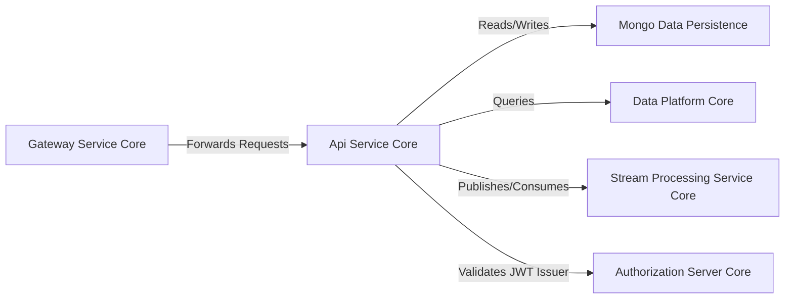
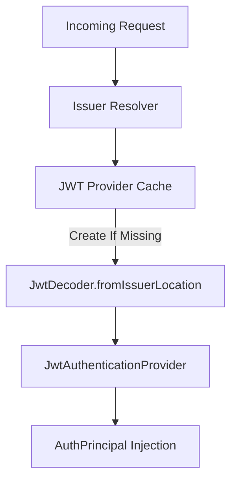
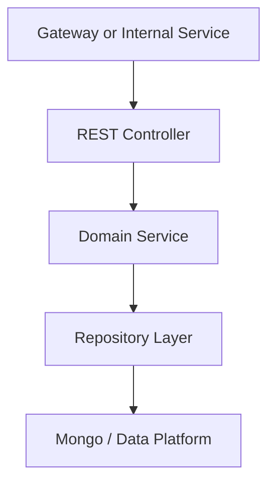
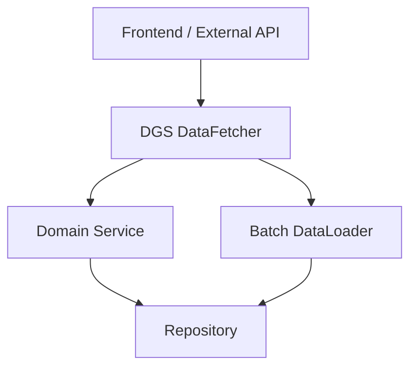
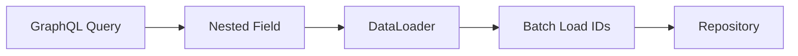
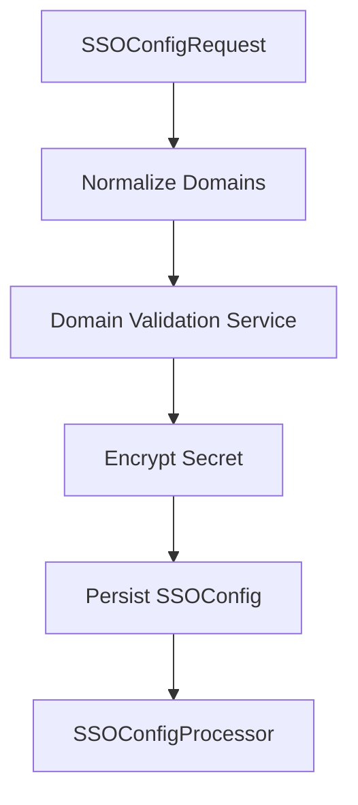

# Api Service Core

## Overview

The **Api Service Core** module is the central internal API layer of the OpenFrame platform. It exposes:

- Internal REST endpoints used by Gateway and other services
- GraphQL queries and mutations for tenant-facing functionality
- Security integration with OAuth2 Resource Server
- Cross-cutting configuration such as password encoding, JWT validation, and scalar handling

This module acts as the orchestration layer between:

- Data persistence (Mongo, Cassandra, Pinot)
- Stream processing and event ingestion
- Authorization and identity services
- Gateway routing and external APIs

It does **not** perform full authentication or JWT filtering itself. That responsibility belongs to the Gateway layer. Instead, Api Service Core focuses on business logic, orchestration, and domain-level operations.

---

## Architectural Role in the Platform



### Key Responsibilities

1. Expose REST endpoints for administrative and internal operations
2. Provide GraphQL API for devices, events, logs, tools, and organizations
3. Integrate with OAuth2 resource server for principal resolution
4. Coordinate domain services and persistence layers
5. Enforce business rules around users, SSO, API keys, and organizations

---

# Configuration Layer

The configuration layer wires core infrastructure components into the Spring context.

## ApiApplicationConfig

Provides shared beans such as:

- `PasswordEncoder` using `BCryptPasswordEncoder`

This ensures consistent password hashing across services that rely on this module.

---

## AuthenticationConfig

Registers a custom `AuthPrincipalArgumentResolver`, enabling:

```text
@AuthenticationPrincipal AuthPrincipal principal
```

This allows controllers to directly access:

- User ID
- Email
- Roles
- Tenant ID

Without manually extracting JWT claims.

---

## SecurityConfig

The Api Service Core uses Spring Security in **resource server mode**.

Important characteristics:

- CSRF disabled
- All requests permitted at filter level
- JWT authentication enabled for `@AuthenticationPrincipal` support
- Multi-issuer support via `JwtIssuerAuthenticationManagerResolver`
- Caffeine cache for `JwtAuthenticationProvider` instances



This design allows:

- Multi-tenant issuer validation
- Cached JWT decoder creation
- Lightweight internal enforcement (Gateway handles authorization)

---

## DataInitializer

Runs at application startup using `CommandLineRunner`.

Responsibilities:

- Reads OAuth client configuration from environment
- Creates or updates default OAuth client
- Ensures grant types and scopes are initialized

This guarantees a consistent default client configuration across environments.

---

## GraphQL Scalar Configuration

### DateScalarConfig

Defines a custom `Date` scalar using format:

```text
yyyy-MM-dd
```

Provides:

- Validation
- Parsing
- Serialization

### InstantScalarConfig

Defines an `Instant` scalar:

- Accepts ISO-8601 format
- Serializes via `Instant.toString()`

These scalars ensure strong typing and consistent date handling across GraphQL queries.

---

## RestTemplateConfig

Registers a reusable `RestTemplate` bean for internal HTTP communication.

---

# REST Controllers

The REST layer exposes internal administrative and operational endpoints.



## HealthController

- `GET /health`
- Simple health probe
- Used by infrastructure monitoring

---

## MeController

- `GET /me`
- Returns authenticated user context
- Uses `@AuthenticationPrincipal`

If no principal is present, returns 401.

---

## ApiKeyController

Manages API keys for authenticated users.

Endpoints:

- List keys
- Create key
- Update key
- Delete key
- Regenerate key

Security behavior:

- Always scoped to `principal.getId()`
- Prevents cross-user access

---

## UserController

Handles user lifecycle:

- List users (paginated)
- Get user by ID
- Update user
- Soft delete user

Key business rules in `UserService`:

- Users cannot delete themselves
- Owner role cannot be deleted
- Soft delete via status transition to `DELETED`

---

## InvitationController

Manages tenant invitations:

- Create invitation
- List invitations
- Revoke invitation
- Resend invitation

Uses `InvitationService` and supports post-processing via `InvitationProcessor`.

---

## OrganizationController

Mutation-only controller (reads handled elsewhere):

- Create organization
- Update organization
- Delete organization

Enforces:

- 404 for missing organizations
- 409 conflict if organization contains machines

---

## SSOConfigController

Admin-facing configuration for SSO providers.

Features:

- List enabled providers
- List available providers
- Get full config
- Create or update config
- Toggle enablement
- Delete config

Business validation handled in `SSOConfigService`.

---

## AgentRegistrationSecretController

Manages agent registration secrets:

- Fetch active secret
- List secrets
- Generate new secret

Used during client agent onboarding.

---

## DeviceController

Internal endpoint:

```text
PATCH /devices/{machineId}
```

Updates device status.

Used by:

- Client services
- Stream processing flows

---

## ForceAgentController

Administrative endpoints for:

- Forcing tool installation
- Forcing tool reinstallation
- Triggering client updates
- Triggering tool agent updates

Acts as orchestration layer invoking:

- `ForceToolInstallationService`
- `ForceClientUpdateService`
- `ForceToolAgentUpdateService`

---

## ReleaseVersionController

- `GET /release-version`
- Returns current platform release metadata

---

## OpenFrameClientConfigurationController

- `GET /openframe-client/configuration`
- Supplies configuration to OpenFrame client runtime

---

# GraphQL Layer

The Api Service Core uses Netflix DGS to expose GraphQL APIs.



## DeviceDataFetcher

Provides:

- `devices` query with filtering, search, sorting
- `device` by ID
- `deviceFilters`

Resolves nested fields using DataLoaders:

- Tags
- Tool connections
- Installed agents
- Organization

Prevents N+1 query problems.

---

## EventDataFetcher

Provides:

- Event list with cursor pagination
- Event by ID
- Event filters
- Create event mutation
- Update event mutation

Integrates with `EventService`.

---

## LogDataFetcher

Audit log queries:

- Log filters
- Logs with pagination
- Detailed log lookup

Designed for structured audit exploration.

---

## OrganizationDataFetcher

Provides:

- Paginated organization list
- Organization by ID
- Organization by organizationId

---

## ToolsDataFetcher

Provides:

- `integratedTools`
- `toolFilters`

Integrates with tool domain services.

---

# DataLoaders

DataLoaders batch and cache GraphQL field resolution.



Implemented loaders:

- InstalledAgentDataLoader
- OrganizationDataLoader
- TagDataLoader
- ToolConnectionDataLoader

This significantly reduces database round trips.

---

# Domain Services

## UserService

Core logic:

- Pagination via Spring `PageRequest`
- Soft deletion
- Role enforcement
- Post-processing via `UserProcessor`

Ensures business rules are centralized.

---

## SSOConfigService

Complex service handling:

- Encrypted client secrets
- Domain validation
- Auto-provision validation
- Provider-specific constraints (e.g., Microsoft single-tenant)
- Post-processing via `SSOConfigProcessor`

Validation flow:



---

## Default Processors

The module defines fallback processors:

- DefaultInvitationProcessor
- DefaultSSOConfigProcessor
- DefaultUserProcessor

These use `@ConditionalOnMissingBean` to allow platform customization without modifying core logic.

---

# Security Model Summary

| Layer | Responsibility |
|--------|---------------|
| Gateway | JWT validation, filtering, authorization |
| Api Service Core | Resource server, principal extraction |
| Authorization Server | Token issuance and client registration |

Api Service Core relies on issuer-based validation and injects `AuthPrincipal` for business logic enforcement.

---

# Design Principles

1. Separation of concerns between Gateway and API logic
2. GraphQL optimized with DataLoader batching
3. Pluggable processors via conditional beans
4. Strong validation and encryption for SSO
5. Soft deletion over destructive operations
6. Clear REST vs GraphQL separation

---

# Conclusion

The **Api Service Core** module is the heart of internal tenant operations in OpenFrame. It:

- Exposes internal REST endpoints
- Powers GraphQL queries and mutations
- Enforces business rules
- Integrates security context
- Coordinates persistence and domain services

It is intentionally lightweight in infrastructure responsibilities and heavy in orchestration and domain correctness, forming the central business API layer of the OpenFrame platform.
