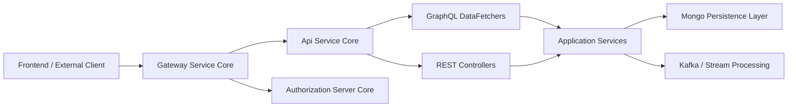
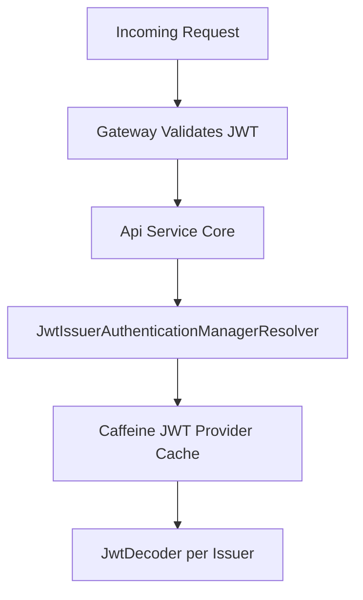
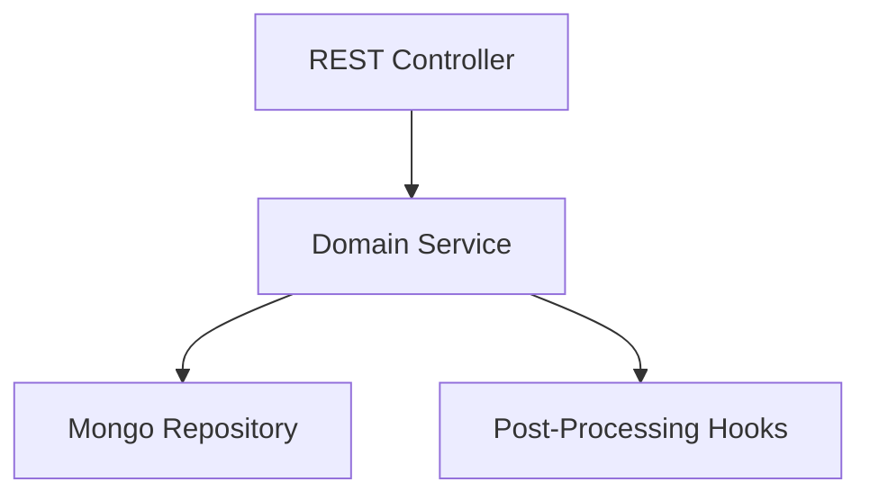
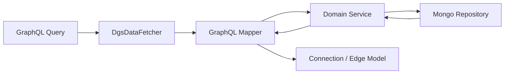
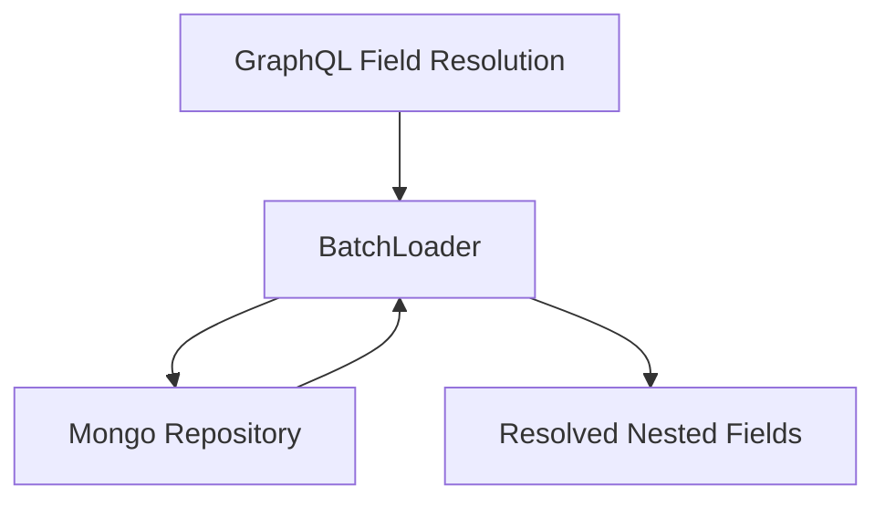
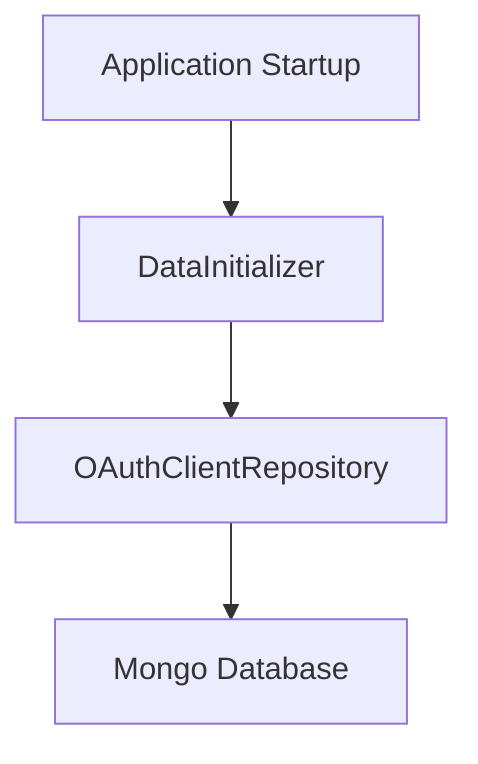

# Api Service Core

The **Api Service Core** module is the internal backbone of the OpenFrame platform. It exposes REST and GraphQL APIs that power the OpenFrame frontend, management workflows, and internal service-to-service communication.

It sits behind the Gateway Service Core and operates as a multi-tenant, OAuth2 Resource Server–enabled Spring Boot application. While the Gateway handles authentication and authorization enforcement, the Api Service Core focuses on:

- Business logic orchestration
- GraphQL query and mutation handling
- REST-based internal command endpoints
- DataLoader-based performance optimization
- Integration with Mongo persistence and stream processing

---

## High-Level Architecture

### Key Responsibilities

- ✅ Acts as OAuth2 Resource Server (JWT validation support)
- ✅ Provides GraphQL APIs using Netflix DGS
- ✅ Exposes internal REST endpoints for mutations and commands
- ✅ Coordinates domain services and repositories
- ✅ Implements cursor-based pagination and filtering
- ✅ Prevents N+1 queries via DataLoader pattern

---

## Security Model

The Api Service Core does **not** perform full authentication enforcement. That responsibility belongs to the Gateway Service Core.

Instead, it:

- Enables OAuth2 Resource Server support
- Resolves `@AuthenticationPrincipal` into `AuthPrincipal`
- Uses issuer-based JWT validation
- Caches `JwtAuthenticationProvider` instances per issuer

### Security Flow

### Core Security Components

- `SecurityConfig` – Configures Resource Server and issuer-based JWT resolver
- `AuthenticationConfig` – Registers `AuthPrincipalArgumentResolver`
- `ApiApplicationConfig` – Defines shared beans such as `PasswordEncoder`

The Authorization Server is implemented separately in:

- [Authorization Server Core](../authorization_server_core/authorization_server_core.md)

---

## API Surface

The Api Service Core exposes two primary API styles:

1. **REST Controllers** – Command-oriented endpoints
2. **GraphQL DataFetchers** – Query-oriented and connection-based APIs

---

# REST Controllers

REST endpoints are primarily used for:

- Mutations
- Internal operations
- Administrative updates

### Controllers Overview

| Controller | Responsibility |
|------------|---------------|
| `HealthController` | Liveness endpoint (`/health`) |
| `DeviceController` | Device status updates |
| `OrganizationController` | Create, update, delete organizations |
| `UserController` | User CRUD and soft delete |
| `MeController` | Current authenticated user info |
| `OpenFrameClientConfigurationController` | Client runtime configuration |

### REST Interaction Flow

### Example: User Deletion Rules

`UserService` enforces:

- ❌ Users cannot delete themselves
- ❌ OWNER role cannot be deleted
- ✅ Soft deletion via status flag

This ensures business invariants are preserved at the service layer.

---

# GraphQL Layer (Netflix DGS)

The Api Service Core uses Netflix DGS for GraphQL query and mutation handling.

## DataFetchers

Each domain exposes a dedicated DataFetcher:

| DataFetcher | Domain |
|-------------|--------|
| `DeviceDataFetcher` | Machines and device filtering |
| `EventDataFetcher` | Event queries and mutations |
| `LogDataFetcher` | Audit logs |
| `OrganizationDataFetcher` | Organization queries |
| `ToolsDataFetcher` | Integrated tools |

### GraphQL Query Flow

### Cursor-Based Pagination

The module uses:

- `CursorPaginationInput`
- `CursorPaginationCriteria`
- `CountedGenericConnection`
- `GenericEdge`

This enables Relay-style GraphQL pagination with total count support.

---

# DataLoader Layer (N+1 Prevention)

To prevent N+1 query issues in GraphQL nested fields, the module uses DGS DataLoaders.

## DataLoaders

| DataLoader | Purpose |
|------------|----------|
| `InstalledAgentDataLoader` | Batch load installed agents by machineId |
| `OrganizationDataLoader` | Batch load organizations |
| `TagDataLoader` | Batch load tags |
| `ToolConnectionDataLoader` | Batch load tool connections |

### N+1 Optimization Flow

This ensures high performance even when resolving deep nested object graphs.

---

# Domain Services

The service layer encapsulates business logic and enforces invariants.

## Notable Services

- `UserService`
- `SSOConfigService`
- Device, Event, Organization, Log, Tool services

### SSOConfigService Responsibilities

- Store and encrypt provider client secrets
- Validate allowed domains
- Support Microsoft-specific tenant rules
- Enable/disable providers
- Trigger post-processing hooks

The service integrates with:

- Mongo repositories
- Encryption service
- Domain validation
- Post-processing processors

SSO also integrates with:

- [Authorization Server Core](../authorization_server_core/authorization_server_core.md)

---

# Configuration & Initialization

## DataInitializer

`DataInitializer` ensures a default OAuth client exists at startup.

Responsibilities:

- Reads environment properties
- Creates or updates OAuth client
- Ensures correct grant types and scopes

---

# Integration with Other Modules

The Api Service Core works closely with other platform modules:

| Module | Purpose |
|--------|---------|
| [Gateway Service Core](../gateway_service_core/gateway_service_core.md) | JWT validation, routing |
| [Authorization Server Core](../authorization_server_core/authorization_server_core.md) | OAuth2 & OIDC |
| [Data Persistence Mongo](../data_persistence_mongo/data_persistence_mongo.md) | Storage layer |
| [Stream Processing Core](../stream_processing_core/stream_processing_core.md) | Event processing |
| [Api Contracts And Mapping](../api_contracts_and_mapping/api_contracts_and_mapping.md) | DTOs and mappers |

---

# Deployment Context

The entrypoint for this module is:

- `ApiApplication`

Defined in the Service Entrypoints module:

- [Service Entrypoints](../service_entrypoints/service_entrypoints.md)

---

# Summary

The **Api Service Core** is the central orchestration layer of OpenFrame.

It provides:

- Secure, multi-tenant GraphQL APIs
- Internal REST command endpoints
- DataLoader-optimized performance
- Cursor-based pagination
- Business rule enforcement
- OAuth2 Resource Server integration

It bridges the Gateway, Authorization Server, Mongo persistence, and stream processing into a cohesive, scalable API layer powering the entire OpenFrame platform.
