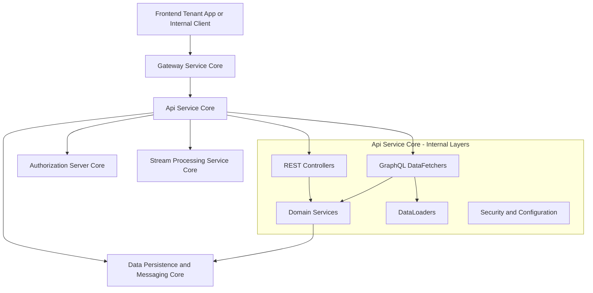
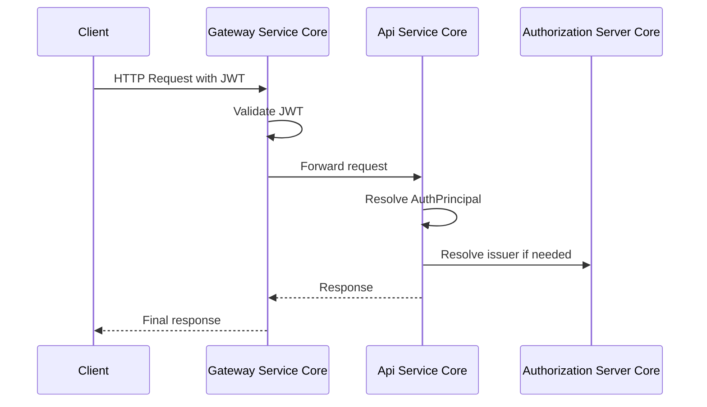
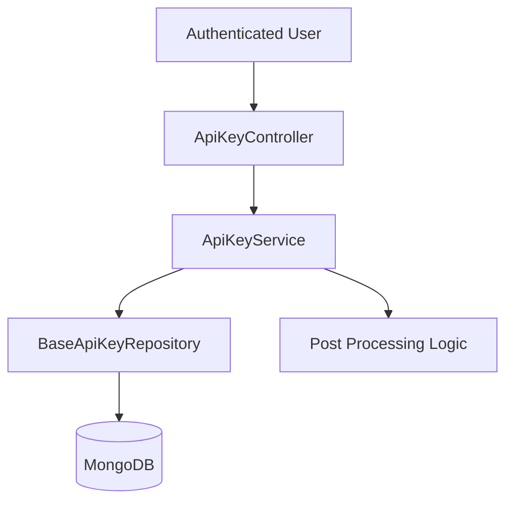
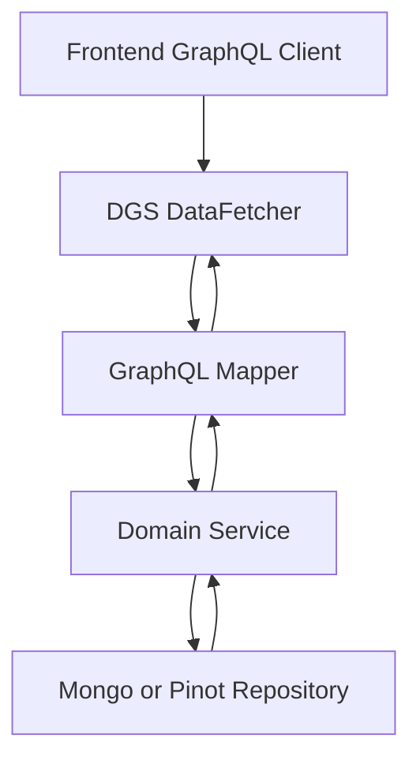
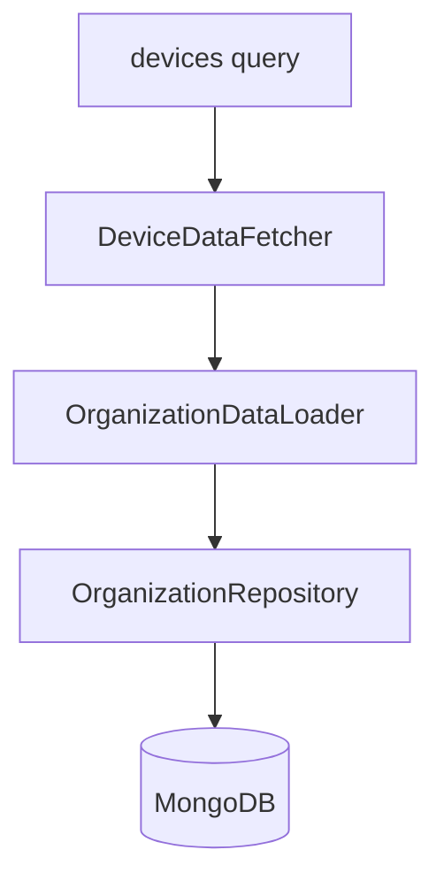

# Api Service Core

## Overview

The **Api Service Core** module is the central internal API layer of the OpenFrame platform. It exposes REST and GraphQL endpoints for tenant-facing and internal operations such as:

- User and organization management  
- Device lifecycle and status updates  
- API key management  
- Invitations and SSO configuration  
- Event and log querying  
- Tool and integration metadata access  

It acts as the primary orchestration layer between:

- The data layer (MongoDB, Kafka, Redis, etc.)  
- Domain services and processors  
- The Gateway Service Core (edge routing and JWT validation)  
- The Authorization Server Core (OAuth2 and SSO flows)  

---

## High-Level Architecture



### Key Responsibilities

1. Provide REST endpoints for mutations and internal operations.  
2. Provide GraphQL queries and mutations for rich frontend data access.  
3. Enforce resource server behavior using JWT validation.  
4. Coordinate domain services and processors.  
5. Optimize GraphQL data fetching using DataLoader batching.  

---

## Application Bootstrap

### ApiApplication

The entry point is `ApiApplication`, annotated with:

- `@SpringBootApplication`  
- `@ComponentScan` including:
  - `com.openframe.api`  
  - `com.openframe.data`  
  - `com.openframe.core`  
  - `com.openframe.notification`  
  - `com.openframe.kafka`  

This ensures the Api Service Core wires together:

- API controllers and GraphQL components  
- Data repositories and documents  
- Kafka and messaging infrastructure  
- Core platform services  

---

## Security Model

The Api Service Core is configured as a **Resource Server**, not as an authentication authority.

Authentication responsibilities are split as follows:

- **Gateway Service Core**:  
  - Validates JWTs  
  - Handles permit-all paths  
  - Adds Authorization headers from cookies  
- **Authorization Server Core**:  
  - Issues JWT tokens  
  - Manages OAuth2 clients and SSO  
- **Api Service Core**:  
  - Resolves JWT into `AuthPrincipal`  
  - Enforces method-level access through injected principals  

### Security Flow



### SecurityConfig

- Enables OAuth2 Resource Server.  
- Uses `JwtIssuerAuthenticationManagerResolver`.  
- Caches `JwtAuthenticationProvider` instances per issuer using Caffeine.  
- Disables CSRF for API usage.  
- Permits all HTTP paths (Gateway enforces perimeter rules).  

### AuthenticationConfig

Registers `AuthPrincipalArgumentResolver`, enabling:

```java
public ResponseEntity<?> endpoint(@AuthenticationPrincipal AuthPrincipal principal)
```

This pattern is used in controllers such as:

- ApiKeyController  
- MeController  
- UserController  

---

## Configuration Layer

The Api Service Core includes several configuration components:

### ApiApplicationConfig

- Provides a `BCryptPasswordEncoder` bean.

### RestTemplateConfig

- Exposes a `RestTemplate` bean for outbound HTTP calls.

### DataInitializer

- Runs at startup via `CommandLineRunner`.  
- Ensures a default OAuth client exists.  
- Updates client secret if changed in configuration.  

### GraphQL Scalar Configuration

Custom scalars:

- `Date` → `LocalDate` in `yyyy-MM-dd` format.  
- `Instant` → ISO-8601 timestamp.  

These are implemented using DGS `@DgsScalar` and enforce strict parsing and serialization rules.

---

## REST Layer

REST controllers handle mutations and internal commands.

### Core Controllers

- **HealthController** → `/health`  
- **MeController** → `/me`  
- **ApiKeyController** → `/api-keys`  
- **UserController** → `/users`  
- **OrganizationController** → `/organizations`  
- **InvitationController** → `/invitations`  
- **AgentRegistrationSecretController** → `/agent/registration-secret`  
- **DeviceController** → `/devices`  
- **OpenFrameClientConfigurationController** → `/openframe-client/configuration`  

### Example: ApiKey Lifecycle



Operations include:

- Create API key  
- List API keys  
- Regenerate key  
- Delete key  

All scoped to the authenticated user via `AuthPrincipal`.

---

## GraphQL Layer (Netflix DGS)

The Api Service Core exposes rich GraphQL queries using Netflix DGS.

### DataFetchers

- **DeviceDataFetcher**  
- **EventDataFetcher**  
- **LogDataFetcher**  
- **OrganizationDataFetcher**  
- **ToolsDataFetcher**  

These support:

- Cursor-based pagination  
- Filtering and sorting  
- Search  
- Aggregated filter metadata  

### GraphQL Query Flow



### DeviceDataFetcher and DataLoader Optimization

To avoid N+1 problems, the module uses DataLoader components:

- InstalledAgentDataLoader  
- OrganizationDataLoader  
- TagDataLoader  
- ToolConnectionDataLoader  



This batching ensures:

- Reduced database round trips  
- Efficient nested object resolution  
- Predictable performance for large datasets  

---

## Domain Services Layer

Services encapsulate business logic and coordinate repositories and processors.

### Key Services

- **UserService**  
- **SSOConfigService**  
- **InstalledAgentService**  
- **ToolConnectionService**  

### UserService Responsibilities

- List users with pagination  
- Update user profile fields  
- Soft-delete users  
- Enforce constraints:
  - Cannot delete self  
  - Cannot delete owner  

It delegates side effects to a `UserProcessor`.

### Processor Pattern

Default processors are registered with `@ConditionalOnMissingBean`:

- DefaultUserProcessor  
- DefaultInvitationProcessor  
- DefaultSSOConfigProcessor  
- DefaultDeviceStatusProcessor  

This allows:

- Extensibility via bean overrides  
- Clean separation of core logic and side effects  

---

## SSO Configuration Management

The `SSOConfigService` manages:

- Provider enable/disable  
- Client ID and secret encryption  
- Domain validation  
- Auto-provisioning rules  

Key validations:

- Auto-provision requires at least one allowed domain.  
- Microsoft auto-provision requires `msTenantId`.  
- Domains are normalized and validated.  

It integrates with encryption services and repository storage.

---

## Device and Event Management

### Device Updates

`DeviceController` exposes:

- PATCH `/devices/{machineId}` → update device status  

Post-processing of status changes is delegated to a `DeviceStatusProcessor` implementation.

### Event Management

`EventDataFetcher` supports:

- Query events with filtering and pagination  
- Create and update events  
- Retrieve filter metadata  

Events are timestamped with `Instant.now()` during creation.

---

## Interaction with Other Core Modules

The Api Service Core collaborates closely with other modules:

- Gateway Service Core → routing and perimeter security  
- Authorization Server Core → OAuth2 and SSO flows  
- Data Persistence and Messaging Core → Mongo, Kafka, Redis  
- Stream Processing Service Core → event enrichment and processing  

For details, see the corresponding module documentation:

- [Gateway Service Core](../gateway_service_core/gateway_service_core.md)  
- [Authorization Server Core](../authorization_server_core/authorization_server_core.md)  
- [Data Persistence and Messaging Core](../data_persistence_and_messaging_core/data_persistence_and_messaging_core.md)  

---

## Summary

The **Api Service Core** module is the backbone of tenant-facing and internal API logic in OpenFrame. It:

- Exposes both REST and GraphQL APIs  
- Operates as an OAuth2 resource server  
- Implements extensible processor hooks  
- Optimizes data access with DataLoader  
- Coordinates domain services and repositories  

By cleanly separating configuration, security, controllers, data fetchers, services, and processors, it provides a scalable and extensible API foundation for the entire platform.
