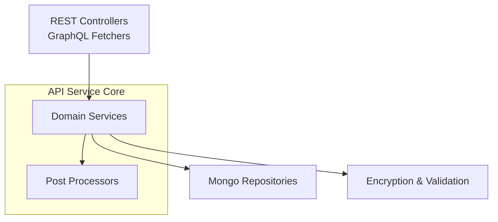
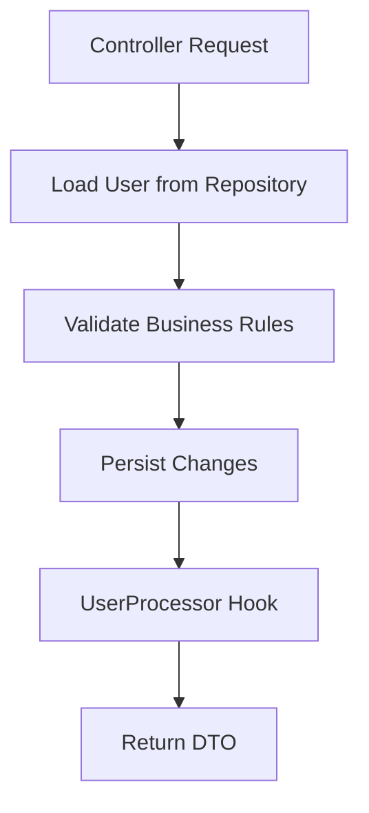
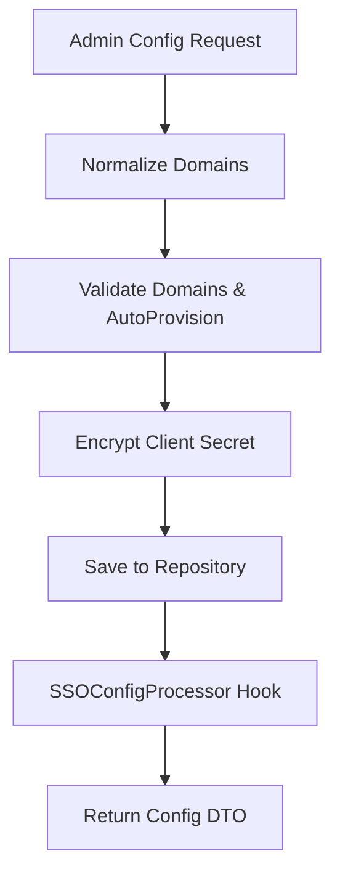
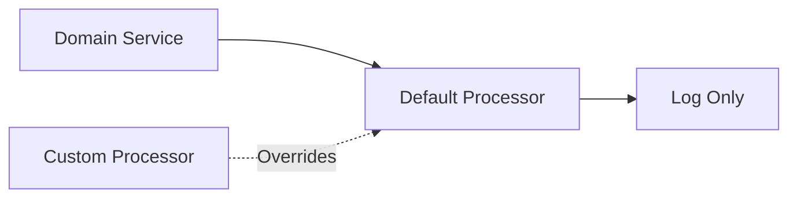
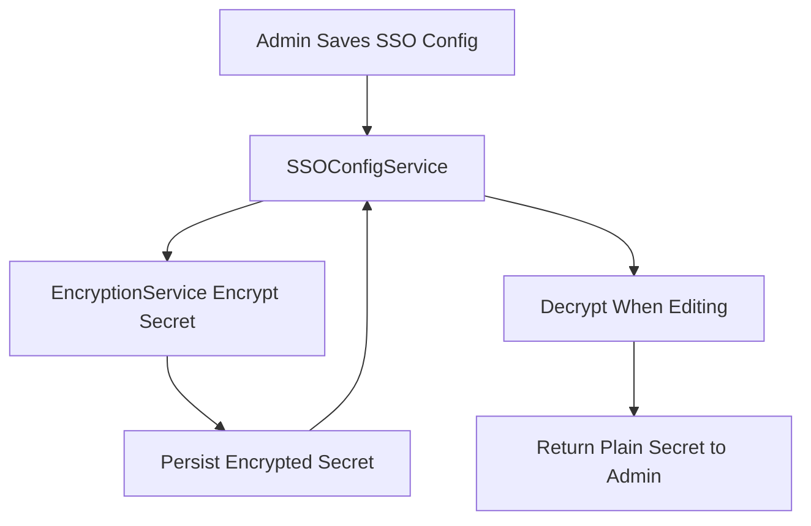

# Api Service Core Domain Services Processors

The **Api Service Core Domain Services Processors** module encapsulates the core business logic for user management, SSO configuration, domain validation, and lifecycle post-processing hooks within the API Service.

It acts as the **domain orchestration layer** between:

- REST and GraphQL entry points
- Data repositories (Mongo)
- Security and encryption services
- Cross-module processors and extension hooks

This module is intentionally designed to be **extensible**, leveraging Spring’s `@ConditionalOnMissingBean` mechanism so SaaS tenants or downstream services can override default behavior without modifying core code.

---

## Architectural Role in the Platform

At a high level, this module sits between controllers and data repositories.



### Upstream Dependencies

- REST Controllers → [Api Service Core Rest Controllers](../api_service_core_rest_controllers/api_service_core_rest_controllers.md)
- GraphQL → [Api Service Core GraphQL Fetchers and Loaders](../api_service_core_graphql_fetchers_and_loaders/api_service_core_graphql_fetchers_and_loaders.md)

### Downstream Dependencies

- Mongo Models & Repositories → [Data Layer Mongo Models and Repositories](../data_layer_mongo_models_and_repositories/data_layer_mongo_models_and_repositories.md)
- Shared OAuth/JWT → [Shared Security OAuth Client Support](../shared_security_oauth_client_support/shared_security_oauth_client_support.md)

---

# Core Components

This module consists of the following primary components:

- `DefaultDomainExistenceValidator`
- `SSOConfigService`
- `DefaultInvitationProcessor`
- `DefaultSSOConfigProcessor`
- `DefaultUserProcessor`
- `UserService`

They can be grouped into two logical areas:

1. **Domain Services** (business logic)
2. **Post-Processing Hooks (Processors)**

---

# Domain Services

## UserService

`UserService` encapsulates all core user lifecycle logic.

### Responsibilities

- Fetch users by email or ID
- Paginated user listing
- User updates
- Soft deletion with role-based protection
- Enforcement of business invariants

### Business Rules Enforced

- Users cannot delete themselves
- Users with `OWNER` role cannot be deleted
- Deletion is soft (`UserStatus.DELETED`)
- Post-processing is triggered after mutation operations

### Internal Flow



### Extensibility

After updates, deletes, and list operations, the service invokes a `UserProcessor` implementation.

By default:

- `DefaultUserProcessor` logs events only.

Custom implementations can:

- Emit audit events
- Publish Kafka messages
- Trigger external system sync

---

## SSOConfigService

`SSOConfigService` manages Single Sign-On provider configuration for tenants.

### Responsibilities

- Create/update SSO provider configuration
- Delete configuration
- Toggle provider enabled state
- Provide enabled providers for login UI
- Validate domain and auto-provision rules

### Key Dependencies

- `SSOConfigRepository` (Mongo persistence)
- `EncryptionService` (encrypt/decrypt client secrets)
- `SSOConfigProcessor` (post-processing hooks)
- `DomainValidationService` (domain enforcement)

### SSO Configuration Lifecycle



### Domain Validation Logic

The service ensures:

- Domains are normalized (trimmed, lowercase, deduplicated)
- Generic public domains are rejected
- Domain existence is validated
- `autoProvisionUsers` requires at least one domain
- Microsoft auto-provision requires `msTenantId`

### Security Considerations

- Client secrets are encrypted at rest
- Secrets are decrypted only for admin editing responses
- Configuration toggles trigger processor hooks

---

## DefaultDomainExistenceValidator

This is the default implementation of `DomainExistenceValidator`.

```text
Default behavior: Always return false (do not block by existence)
```

### Purpose

- Provides a safe default in OSS
- Allows SaaS tenant builds to override behavior
- Uses Spring `@ConditionalOnMissingBean`

### Extension Model

If a tenant provides its own `DomainExistenceValidator`, the default implementation is automatically disabled.

This allows:

- Enterprise domain enforcement
- External directory checks
- Domain ownership verification

---

# Post-Processing Hook Architecture

The module uses a **Processor Pattern** to allow extension without modifying core services.

All processors are:

- Spring components
- Annotated with `@ConditionalOnMissingBean`
- Safe to override



---

## DefaultUserProcessor

Triggered after:

- User deletion
- User update
- User list fetch

Default behavior:

- Logs events only

Extension possibilities:

- Audit trail persistence
- Security alerts
- Notification systems

---

## DefaultInvitationProcessor

Triggered when:

- Invitation created
- Invitation revoked

Default behavior:

- Debug logging only

Extension examples:

- Send invitation email
- Trigger provisioning workflow
- Publish onboarding event

---

## DefaultSSOConfigProcessor

Triggered after:

- Configuration saved
- Configuration deleted
- Configuration toggled

Default behavior:

- Logging only

Extension possibilities:

- Register dynamic OAuth clients
- Notify Authorization Server
- Refresh in-memory security caches

---

# Interaction with Authorization Server

The SSO configuration domain interacts conceptually with:

- [Authorization Server Core](../authorization_server_core/authorization_server_core.md)

While this module stores and validates SSO config, the Authorization Server:

- Handles OAuth flows
- Registers dynamic clients
- Issues tokens
- Manages PKCE and redirect validation

The processor hook pattern allows tight integration without direct coupling.

---

# Data Layer Integration

This module heavily relies on Mongo repositories from:

- [Data Layer Mongo Models and Repositories](../data_layer_mongo_models_and_repositories/data_layer_mongo_models_and_repositories.md)

Primary entities involved:

- `User`
- `Invitation`
- `SSOConfig`

Repositories provide persistence while domain services enforce business rules.

---

# Security and Encryption Flow



Encryption functionality originates from shared security modules.

---

# Design Principles

The **Api Service Core Domain Services Processors** module follows these principles:

### 1. Clean Separation of Concerns
- Controllers → request/response
- Services → business rules
- Repositories → persistence
- Processors → side-effects

### 2. Extensibility by Default
All processors and validators can be overridden without modifying core code.

### 3. Business Rule Centralization
All invariants (self-delete prevention, domain rules, SSO constraints) live in services.

### 4. Secure by Design
- Secrets encrypted at rest
- Strict domain validation
- Controlled auto-provisioning

---

# Summary

The **Api Service Core Domain Services Processors** module is the heart of API-level business logic for:

- User lifecycle management
- SSO provider configuration
- Domain validation enforcement
- Extension hook orchestration

It provides:

- Strong domain rule enforcement
- Multi-tenant extensibility
- Clean integration with security and persistence layers
- Processor-based side-effect injection

Within the OpenFrame platform architecture, this module ensures that all domain-level operations are consistent, secure, and extensible across tenants and deployment models.