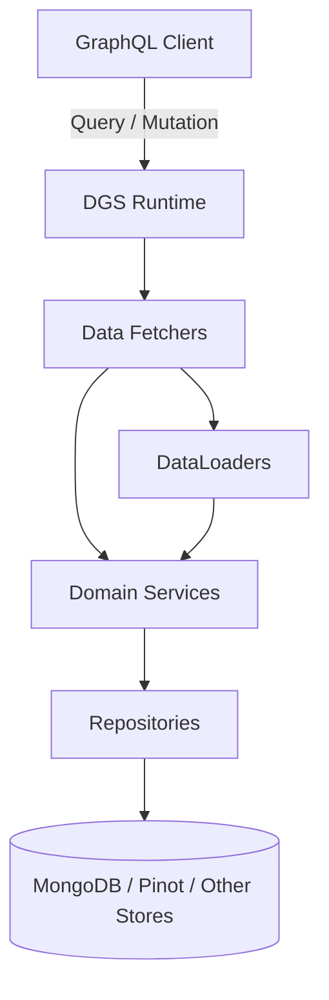
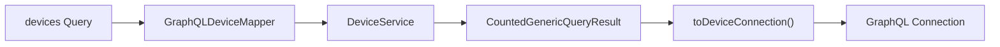
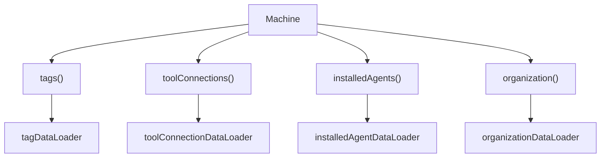
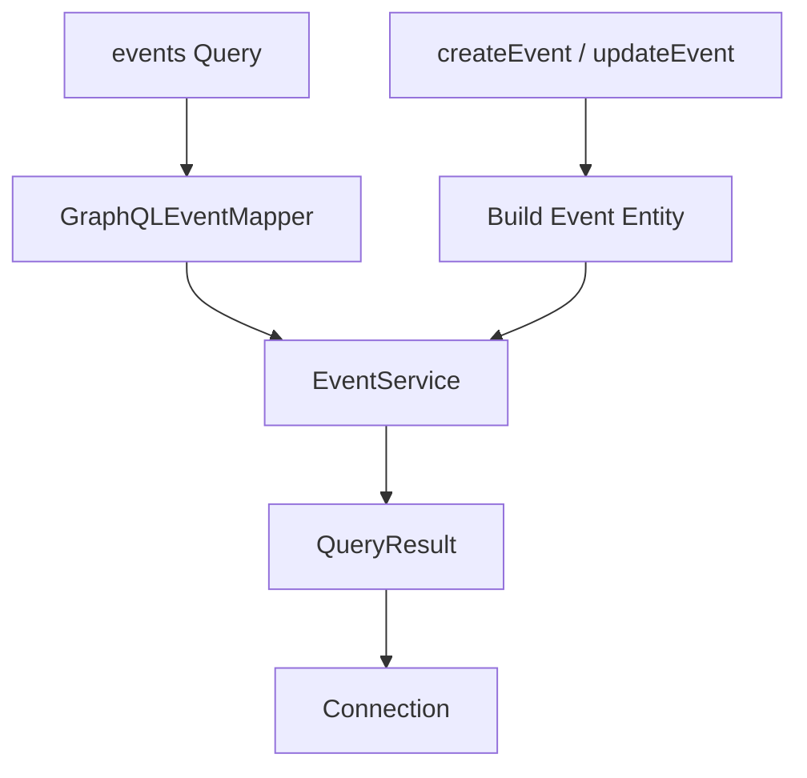
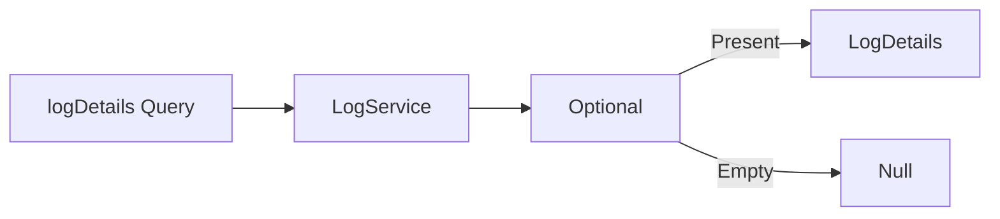
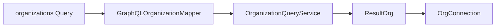
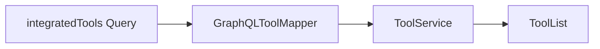
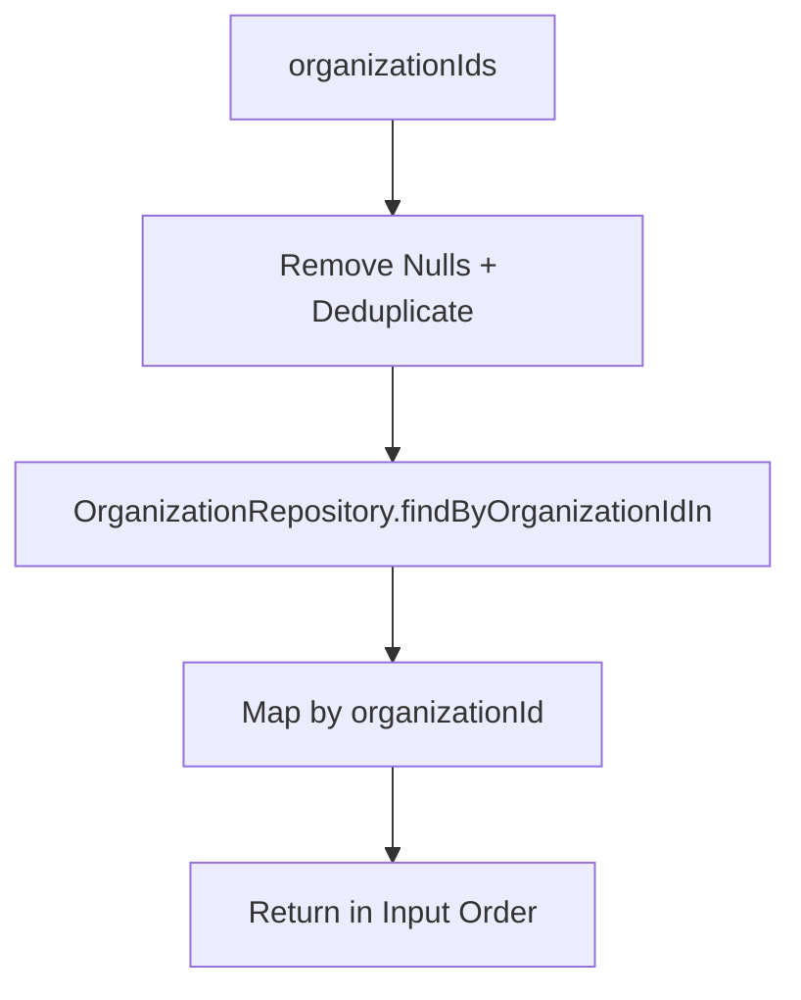
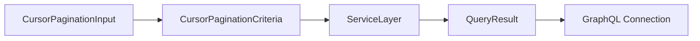

# Api Service Core Graphql Fetchers And Loaders

## Overview

The **Api Service Core Graphql Fetchers And Loaders** module is the GraphQL execution layer of the OpenFrame API Service. It exposes query and mutation operations using Netflix DGS and orchestrates:

- Domain services from the API layer
- Data access via repositories and services
- GraphQL DTO mapping
- Batch loading through DataLoader to prevent N+1 query problems

This module acts as the bridge between the GraphQL schema and the underlying domain, service, and data layers.

It is part of the `openframe-api-service-core` library and is consumed by the Api Application entrypoint.

---

## Architectural Role

At a high level, the module sits between the GraphQL schema and the service layer.

### Responsibilities

- Map GraphQL input types to domain filter options
- Delegate business logic to domain services
- Convert query results into GraphQL connections
- Provide cursor-based pagination
- Resolve nested fields using batch DataLoaders

---

# Core Components

The module consists of two major categories:

1. **Data Fetchers** – Query and mutation entrypoints
2. **Data Loaders** – Batch loading components for nested field resolution

---

# Data Fetchers

All fetchers are annotated with `@DgsComponent` and use DGS annotations such as:

- `@DgsQuery`
- `@DgsMutation`
- `@DgsData`

They translate GraphQL operations into service calls.

---

## Device Data Fetcher

**Class:** `DeviceDataFetcher`

### Responsibilities

- Query devices with filtering, sorting, search, and cursor pagination
- Fetch a single device by `machineId`
- Resolve nested fields on `Machine`:
  - Tags
  - Tool Connections
  - Installed Agents
  - Organization

### Query Flow

### Nested Field Resolution (Machine)

### Key Concepts

- Uses `CountedGenericConnection` for total count support
- Converts `DeviceFilterInput` into `DeviceFilterOptions`
- Implements cursor-based pagination via `CursorPaginationCriteria`
- Uses DataLoader to prevent N+1 queries

---

## Event Data Fetcher

**Class:** `EventDataFetcher`

### Responsibilities

- Query events with filtering and pagination
- Retrieve a single event by ID
- Provide event filter metadata
- Create and update events via mutations

### Query & Mutation Flow

### Notable Behavior

- Supports `EventFilterInput`
- Uses `GenericConnection` (without total count)
- Builds domain `Event` objects directly in mutations

---

## Log Data Fetcher

**Class:** `LogDataFetcher`

### Responsibilities

- Query audit logs with filtering and pagination
- Provide filter metadata
- Retrieve detailed log entries by composite identifiers

### Log Details Resolution

### Characteristics

- Uses `LogFilterInput` and `LogFilterOptions`
- Supports cursor pagination
- Retrieves detailed logs via compound key parameters

---

## Organization Data Fetcher

**Class:** `OrganizationDataFetcher`

### Responsibilities

- Query organizations with pagination and filters
- Fetch organization by internal ID
- Fetch organization by external `organizationId`

### Flow

### Key Points

- Uses `CountedGenericConnection`
- Separates read model (`OrganizationQueryService`) from direct lookup (`OrganizationService`)

---

## Tools Data Fetcher

**Class:** `ToolsDataFetcher`

### Responsibilities

- Query integrated tools
- Provide tool filter metadata

### Flow

### Characteristics

- Uses `ToolFilterInput`
- Delegates filtering to `ToolService`
- Does not use cursor pagination

---

# Data Loaders

DataLoaders solve the **N+1 query problem** by batching and caching loads during a GraphQL request.

Each loader implements `BatchLoader<K, V>` and is registered with `@DgsDataLoader`.

---

## Installed Agent Data Loader

**Class:** `InstalledAgentDataLoader`

- Key: `machineId`
- Value: `List<InstalledAgent>`
- Delegates to `InstalledAgentService`

Batch loads installed agents for multiple machines in a single call.

---

## Organization Data Loader

**Class:** `OrganizationDataLoader`

- Key: `organizationId`
- Value: `Organization`

### Behavior

- Removes null IDs
- Deduplicates keys
- Filters soft-deleted organizations
- Returns results in the original request order

---

## Tag Data Loader

**Class:** `TagDataLoader`

- Key: `machineId`
- Value: `List<Tag>`
- Delegates to `TagService`

Used when resolving `Machine.tags`.

---

## Tool Connection Data Loader

**Class:** `ToolConnectionDataLoader`

- Key: `machineId`
- Value: `List<ToolConnection>`
- Delegates to `ToolConnectionService`

Used when resolving `Machine.toolConnections`.

---

# Pagination Model

The module implements cursor-based pagination using:

- `CursorPaginationInput`
- `CursorPaginationCriteria`
- `GenericConnection` / `CountedGenericConnection`

This ensures:

- Stable pagination
- Forward/backward navigation
- Optional total count support

---

# Interaction with Other Layers

The Api Service Core Graphql Fetchers And Loaders module depends on:

- Domain services (DeviceService, EventService, ToolService, etc.)
- Mappers (GraphQLDeviceMapper, GraphQLEventMapper, etc.)
- Data repositories via services
- Shared DTOs from the API contracts layer

It does **not**:

- Contain business rules
- Directly manipulate persistence logic (except via DataLoader repository usage)
- Implement security logic

Security and authentication are handled upstream by the runtime and security configuration layers.

---

# Design Principles

### 1. Thin Fetchers
All business logic resides in services. Fetchers only:

- Validate input
- Map types
- Delegate work

### 2. Separation of Concerns

- Fetchers → GraphQL boundary
- Services → Business logic
- Repositories → Data access
- Mappers → DTO transformations

### 3. Performance Optimization

- Batch loading with DataLoader
- Cursor pagination
- Search + filter combination support

---

# Summary

The **Api Service Core Graphql Fetchers And Loaders** module provides:

- GraphQL query and mutation entrypoints
- Cursor-based pagination support
- Filter metadata resolution
- Batched nested field loading
- Clean delegation to domain services

It is the execution engine that turns GraphQL schema definitions into efficient, scalable, and domain-driven data access operations within the OpenFrame platform.
