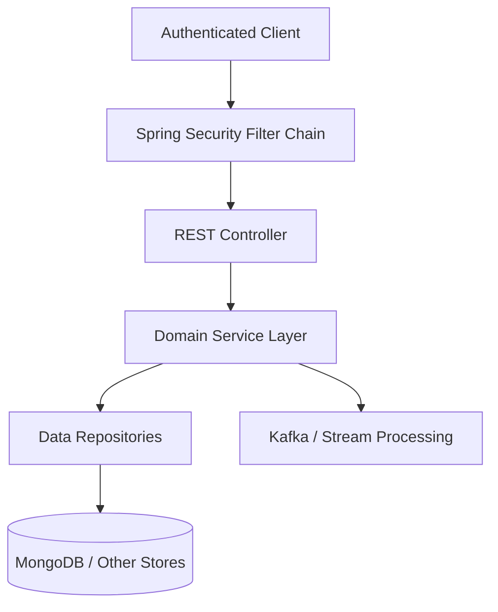
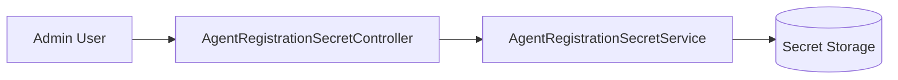
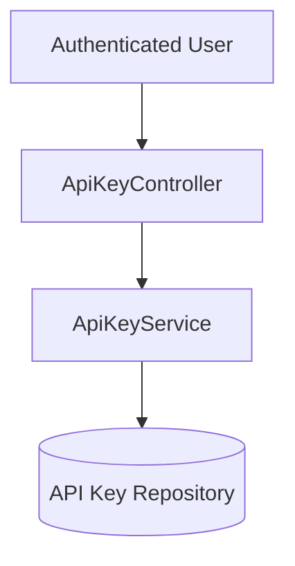
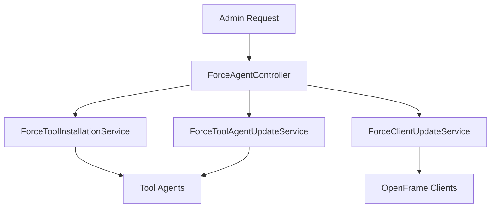
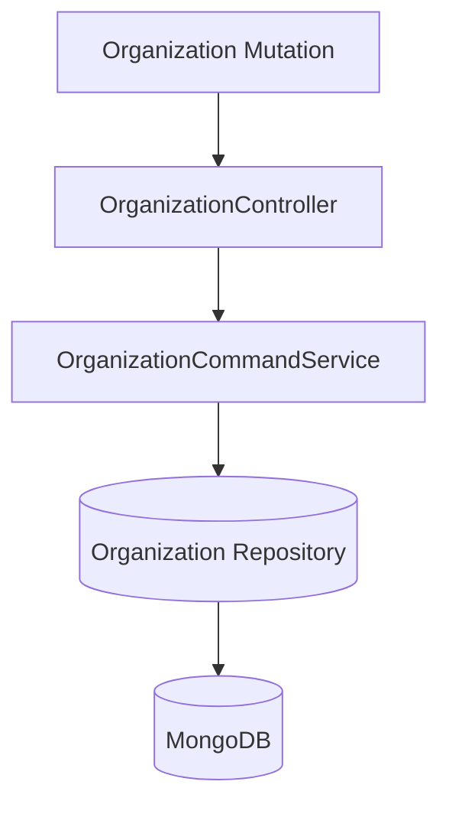
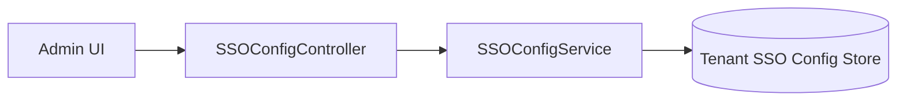

# Api Service Core Rest Controllers

The **Api Service Core Rest Controllers** module exposes the primary internal REST API for the OpenFrame platform. It acts as the HTTP entry layer for authenticated users, administrators, and internal services interacting with core domain functionality such as users, organizations, API keys, SSO configuration, device management, agent operations, and release metadata.

This module is part of the `openframe-api-service-core` library and is typically used by the OpenFrame API application entrypoint. It translates HTTP requests into domain service invocations and returns structured DTO responses.

---

## Responsibilities

The Api Service Core Rest Controllers module is responsible for:

- Exposing authenticated REST endpoints
- Mapping HTTP requests to domain services
- Performing request validation
- Translating domain results into DTO responses
- Converting domain exceptions into proper HTTP status codes
- Acting as a boundary between web concerns and business logic

It does **not** implement business logic directly. All processing is delegated to domain services, processors, or query services.

---

## Architectural Position

The controllers sit between Spring Security and the domain service layer.



### Key Characteristics

- Annotated with `@RestController`
- Route mappings via `@RequestMapping`, `@GetMapping`, `@PostMapping`, etc.
- Authentication injected via `@AuthenticationPrincipal AuthPrincipal`
- Validation via `@Valid`
- HTTP semantics controlled using `@ResponseStatus` or `ResponseEntity`

---

## Controller Overview

The module contains the following controllers:

| Controller | Base Path | Primary Responsibility |
|------------|-----------|------------------------|
| AgentRegistrationSecretController | `/agent/registration-secret` | Manage agent registration secrets |
| ApiKeyController | `/api-keys` | User-scoped API key management |
| DeviceController | `/devices` | Device status updates (internal) |
| ForceAgentController | `/force` | Force installation and update operations |
| HealthController | `/health` | Liveness probe endpoint |
| InvitationController | `/invitations` | User invitation lifecycle |
| MeController | `/me` | Current authenticated user information |
| OpenFrameClientConfigurationController | `/openframe-client/configuration` | Client configuration retrieval |
| OrganizationController | `/organizations` | Organization mutations |
| ReleaseVersionController | `/release-version` | Release metadata retrieval |
| SSOConfigController | `/sso` | SSO configuration management |
| UserController | `/users` | User management |

---

# Detailed Controller Responsibilities

## AgentRegistrationSecretController

**Base Path:** `/agent/registration-secret`

Endpoints:

- `GET /active` – Retrieve currently active secret
- `GET /` – Retrieve all secrets
- `POST /generate` – Generate new secret

This controller delegates to `AgentRegistrationSecretService` and is used during agent bootstrap flows.



---

## ApiKeyController

**Base Path:** `/api-keys`

Handles API key lifecycle for authenticated users.

Endpoints:

- `GET /` – List user API keys
- `POST /` – Create API key
- `GET /{keyId}` – Retrieve specific key
- `PUT /{keyId}` – Update key
- `DELETE /{keyId}` – Delete key
- `POST /{keyId}/regenerate` – Regenerate key secret

Security context is injected via:

```text
@AuthenticationPrincipal AuthPrincipal
```

The controller ensures operations are scoped to the authenticated user ID.



---

## DeviceController

**Base Path:** `/devices`

Provides internal mutation endpoint for device status updates.

Endpoint:

- `PATCH /{machineId}` – Update device status

Used by internal services or integration layers to update machine health or lifecycle status.

---

## ForceAgentController

**Base Path:** `/force`

Provides administrative endpoints to trigger forced actions across agents and clients.

Capabilities include:

- Force tool installation
- Force tool reinstallation
- Force client update
- Force tool agent update
- Bulk operations ("all")



This controller orchestrates high-impact operations and should be access-controlled at the security configuration level.

---

## HealthController

**Base Path:** `/health`

Simple liveness probe returning:

```text
OK
```

Used by load balancers, Kubernetes probes, and monitoring systems.

---

## InvitationController

**Base Path:** `/invitations`

Handles user invitation lifecycle.

Endpoints:

- `POST /` – Create invitation
- `GET /` – Paginated invitation list
- `DELETE /{id}` – Revoke invitation
- `POST /{id}/resend` – Resend invitation

Delegates to `InvitationService` in the user service domain.

---

## MeController

**Base Path:** `/me`

Returns details about the currently authenticated user.

Behavior:

- Returns 401 if no principal
- Returns structured user metadata if authenticated

Example response structure:

```json
{
  "authenticated": true,
  "user": {
    "id": "user-id",
    "email": "user@example.com",
    "displayName": "User",
    "roles": ["ADMIN"],
    "tenantId": "tenant-123"
  }
}
```

This endpoint is commonly used by frontend clients during application bootstrap.

---

## OpenFrameClientConfigurationController

**Base Path:** `/openframe-client/configuration`

Retrieves runtime configuration required by OpenFrame clients.

Delegates to `OpenFrameClientConfigurationQueryService`.

---

## OrganizationController

**Base Path:** `/organizations`

Handles organization mutations only (create, update, delete).

Endpoints:

- `POST /` – Create organization
- `PUT /{id}` – Update organization
- `DELETE /{id}` – Delete organization

Exception mapping:

- `IllegalArgumentException` → 404 Not Found
- `OrganizationHasMachinesException` → 409 Conflict



---

## ReleaseVersionController

**Base Path:** `/release-version`

Returns current platform release metadata.

If no version exists, returns `404 Not Found`.

---

## SSOConfigController

**Base Path:** `/sso`

Manages tenant-level SSO configuration.

Endpoints:

- `GET /providers` – Enabled providers
- `GET /providers/available` – All supported providers
- `GET /{provider}` – Provider configuration
- `POST /{provider}` – Create config
- `PUT /{provider}` – Update config
- `PATCH /{provider}/toggle` – Enable/disable provider
- `DELETE /{provider}` – Remove configuration



---

## UserController

**Base Path:** `/users`

Handles user management operations.

Endpoints:

- `GET /` – Paginated user list
- `GET /{id}` – Retrieve user
- `PUT /{id}` – Update user
- `DELETE /{id}` – Soft delete user

Deletion requires the authenticated principal ID for audit and validation.

---

# Cross-Cutting Concerns

## Authentication & Authorization

- Uses `AuthPrincipal` injected via Spring Security
- Role enforcement is configured at the security configuration layer
- Controllers assume authentication has already occurred

## Validation

- DTO validation via `@Valid`
- Constraint annotations enforced before service invocation

## Exception Handling Strategy

- Domain exceptions translated to `ResponseStatusException`
- Explicit HTTP codes for conflict and not found cases
- Minimal controller-level try/catch logic

## Logging

- Structured logging using SLF4J
- Debug logs for user-scoped operations
- Info logs for administrative actions

---

# Integration with the Broader System

The Api Service Core Rest Controllers module integrates with:

- Domain services and processors
- Data repositories (MongoDB and other stores)
- Security infrastructure
- Stream processing and agent orchestration services

It forms the authoritative internal REST surface for the OpenFrame platform.

---

# Summary

The **Api Service Core Rest Controllers** module defines the HTTP contract for core administrative and operational capabilities in OpenFrame. It enforces authentication boundaries, delegates to domain services, and provides consistent REST semantics for frontend clients, internal services, and administrative tooling.

By keeping controllers thin and delegating logic downward, the module maintains a clean separation of concerns, improving testability, maintainability, and architectural clarity.
