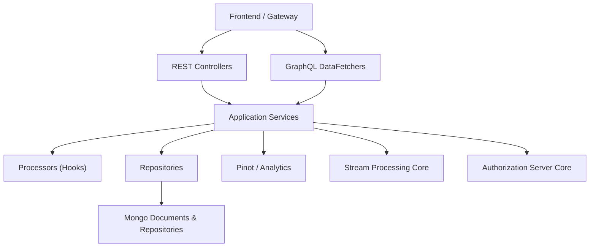
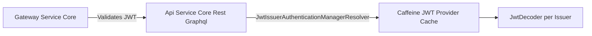
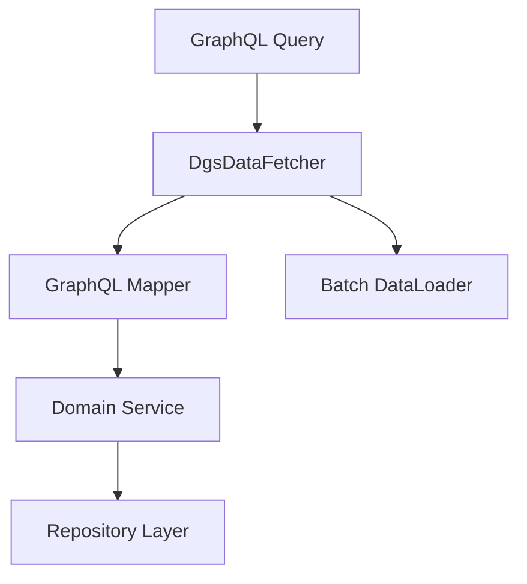
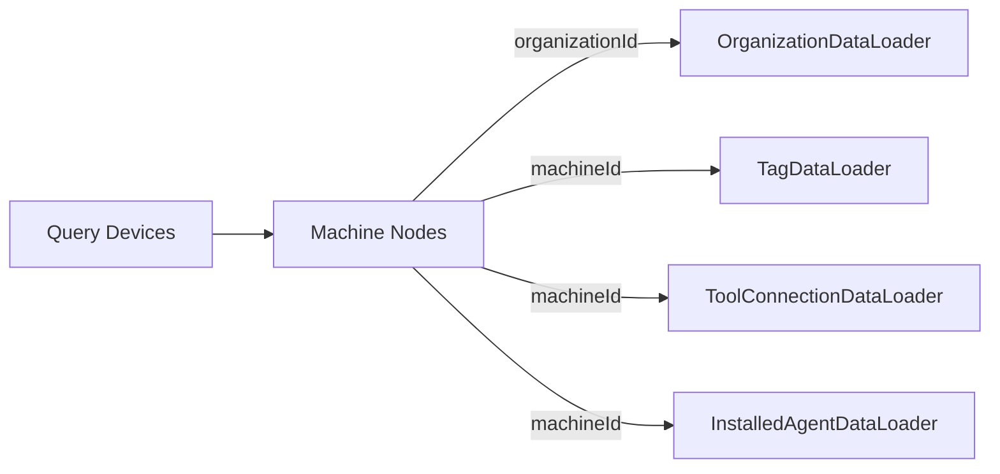
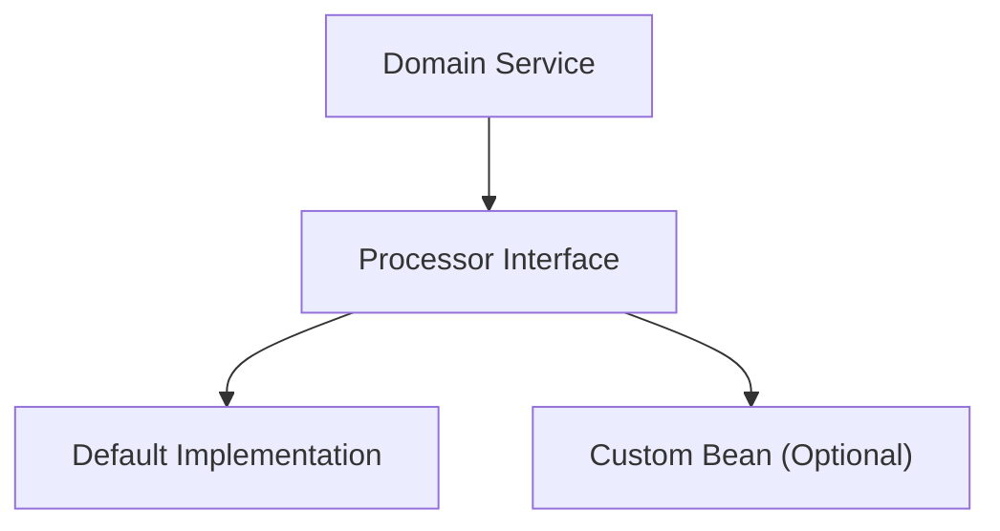
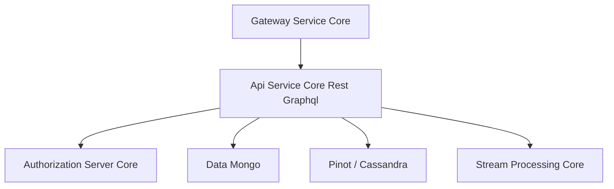

# Api Service Core Rest Graphql

The **Api Service Core Rest Graphql** module is the central internal API layer of OpenFrame. It exposes:

- Internal **REST endpoints** for command-style operations (mutations, admin actions, internal integrations).
- A **GraphQL API (Netflix DGS)** for flexible, cursor-based querying across devices, events, logs, organizations, tools, and more.
- Core security integration as an OAuth2 Resource Server (JWT-based) behind the Gateway.

This module acts as the orchestration layer between:

- Data access modules (Mongo, Pinot, Cassandra)
- Stream processing services
- Authorization and SSO services
- Gateway and frontend clients

---

## 1. Architectural Overview

The Api Service Core Rest Graphql module is designed around a layered architecture:

- **Controllers** → REST endpoints
- **DataFetchers** → GraphQL queries & mutations
- **Services** → Business logic
- **Processors** → Post-processing extension points
- **Repositories / External Modules** → Persistence and integrations



### Key Responsibilities

- Unified internal API surface for tenant operations.
- GraphQL cursor-based pagination with connection/edge pattern.
- SSO configuration and user lifecycle management.
- Device, event, log, organization, and tool querying.
- JWT-based authentication support for `@AuthenticationPrincipal`.

---

## 2. Configuration Layer

### 2.1 Core Configuration Classes

- **ApiApplicationConfig** – Registers shared beans (e.g., `PasswordEncoder`).
- **AuthenticationConfig** – Registers `AuthPrincipalArgumentResolver` for `@AuthenticationPrincipal`.
- **RestTemplateConfig** – Provides `RestTemplate` bean for outbound HTTP calls.
- **SecurityConfig** – Configures OAuth2 Resource Server with multi-issuer JWT support and Caffeine caching.
- **DateScalarConfig** – Custom GraphQL `Date` scalar (`yyyy-MM-dd`).
- **InstantScalarConfig** – Custom GraphQL `Instant` scalar.

### 2.2 Security Model

Authentication is delegated to the **Gateway Service Core**, but this module enables JWT decoding to support method-level principal access.



Characteristics:

- All requests are `permitAll()` at HTTP level.
- JWT validation is enabled for principal resolution.
- Multi-tenant issuer resolution via `JwtIssuerAuthenticationManagerResolver`.

---

## 3. REST Controllers (Command API)

REST controllers are used primarily for **mutations and internal operations**.

### 3.1 DeviceController
- `PATCH /devices/{machineId}`
- Updates device status via `DeviceService`.

### 3.2 InvitationController
- `POST /invitations`
- `GET /invitations`
- `DELETE /invitations/{id}`
- `POST /invitations/{id}/resend`

Handles user invitation lifecycle.

### 3.3 UserController
- `GET /users`
- `GET /users/{id}`
- `PUT /users/{id}`
- `DELETE /users/{id}` (soft delete)

Implements:
- Self-delete protection
- Owner role protection
- Post-processing via `UserProcessor`

### 3.4 OrganizationController
- Create, update, delete organizations.
- Enforces conflict rules (e.g., cannot delete if machines exist).

### 3.5 SSOConfigController
Manages SSO provider configuration:

- `/sso/providers`
- `/sso/providers/available`
- `/sso/{provider}`
- `/sso/{provider}/toggle`

Delegates to `SSOConfigService`.

### 3.6 Additional Controllers

- **MeController** – Returns authenticated principal info.
- **ReleaseVersionController** – Exposes release metadata.
- **OpenFrameClientConfigurationController** – Returns client configuration.
- **HealthController** – `/health` endpoint.

---

## 4. GraphQL Layer (Netflix DGS)

GraphQL is implemented using Netflix DGS and follows a **connection/edge pattern** for pagination.

### 4.1 GraphQL Architecture



### 4.2 Core DataFetchers

- **DeviceDataFetcher** – Devices, filters, nested relations.
- **EventDataFetcher** – Events query and mutations.
- **LogDataFetcher** – Audit logs and details.
- **OrganizationDataFetcher** – Organization queries.
- **ToolsDataFetcher** – Integrated tool queries.

### 4.3 Cursor-Based Pagination

The module uses:

- `GenericEdge<T>`
- `GenericConnection<T>`
- `CountedGenericConnection<T>`

```text
Connection
 ├── edges[]
 │    ├── node
 │    └── cursor
 ├── pageInfo
 └── filteredCount (optional)
```

### 4.4 DataLoader Strategy (N+1 Prevention)

DataLoaders batch-load related entities:

- `InstalledAgentDataLoader`
- `OrganizationDataLoader`
- `TagDataLoader`
- `ToolConnectionDataLoader`



This prevents per-node repository calls.

---

## 5. Service Layer

The service layer encapsulates business rules.

### 5.1 UserService

Responsibilities:

- Pagination and mapping (`UserPageResponse`).
- Update user names.
- Soft delete with constraints:
  - Cannot delete self.
  - Cannot delete OWNER role.
- Delegates to `UserProcessor` for extension hooks.

### 5.2 SSOConfigService

Handles:

- Upsert configuration.
- Secret encryption/decryption.
- Domain validation.
- Provider toggling.
- Post-processing via `SSOConfigProcessor`.

Validation logic includes:

- Domain normalization.
- Public domain restrictions.
- Microsoft tenant enforcement for auto-provisioning.

### 5.3 Processor Extension Points

Default processors:

- `DefaultInvitationProcessor`
- `DefaultSSOConfigProcessor`
- `DefaultUserProcessor`

Each is conditionally registered and can be overridden.



---

## 6. DTO and Mapping Model

The module defines GraphQL-optimized DTOs:

- `DeviceFilterInput`
- `EventFilterInput`
- `LogFilterInput`
- `OrganizationFilterInput`
- `ToolFilterInput`
- `UserResponse`, `UserPageResponse`
- `InvitationPageResponse`

GraphQL inputs are converted into domain filter options via dedicated mappers (e.g., `GraphQLDeviceMapper`, `GraphQLEventMapper`).

This separation ensures:

- GraphQL schema independence from persistence models.
- Stable API contracts.
- Clean transformation between query inputs and repositories.

---

## 7. Integration with Other Modules

The Api Service Core Rest Graphql module integrates closely with:

- Data Mongo Documents Repositories – persistence layer.
- Data Platform Config Pinot Cassandra And Repos – analytics and log storage.
- Stream Processing Core – event ingestion and enrichment.
- Authorization Server Core – identity and SSO flows.
- Gateway Service Core – JWT validation and edge security.



---

## 8. Execution Entry Point

The runtime entry point for this module is:

- `ApiApplication`

This bootstraps:

- Spring Boot context
- Security configuration
- GraphQL DGS components
- REST controllers
- DataLoaders

---

## 9. Design Principles

1. **GraphQL for flexible reads** – rich querying and cursor pagination.
2. **REST for commands** – explicit, controlled mutations.
3. **Gateway-first security** – minimal in-service enforcement.
4. **Processor hooks** – extensibility without modifying core logic.
5. **Separation of DTOs and persistence models** – clean API boundaries.
6. **Batch loading via DataLoader** – N+1 mitigation.

---

## 10. Summary

The **Api Service Core Rest Graphql** module is the central orchestration API layer of OpenFrame. It:

- Bridges frontend, gateway, and backend services.
- Combines REST mutations and GraphQL queries.
- Implements JWT-based principal resolution.
- Enforces core business rules for users, organizations, devices, SSO, and events.
- Provides extensibility through processor interfaces.

It is a critical integration point across identity, data, analytics, and stream processing within the OpenFrame platform.
