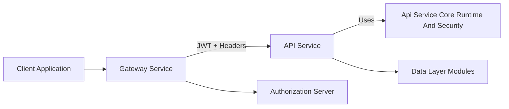
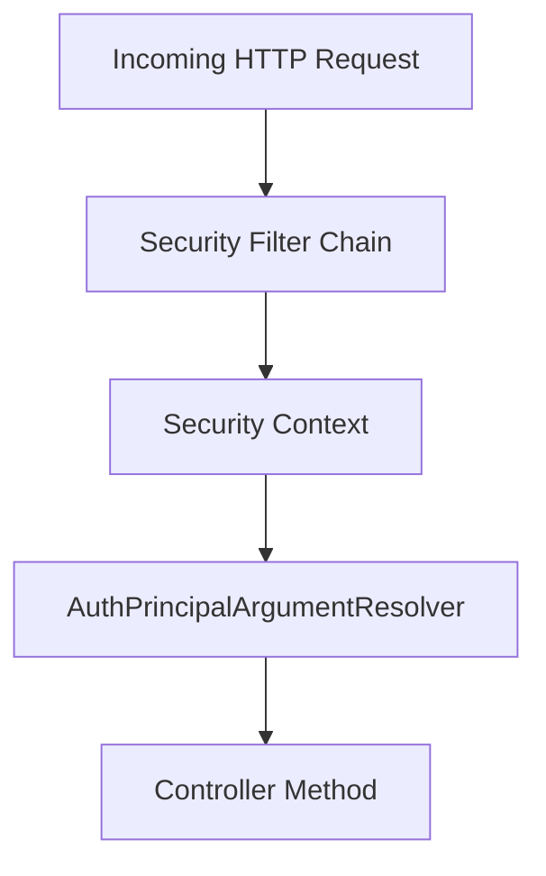
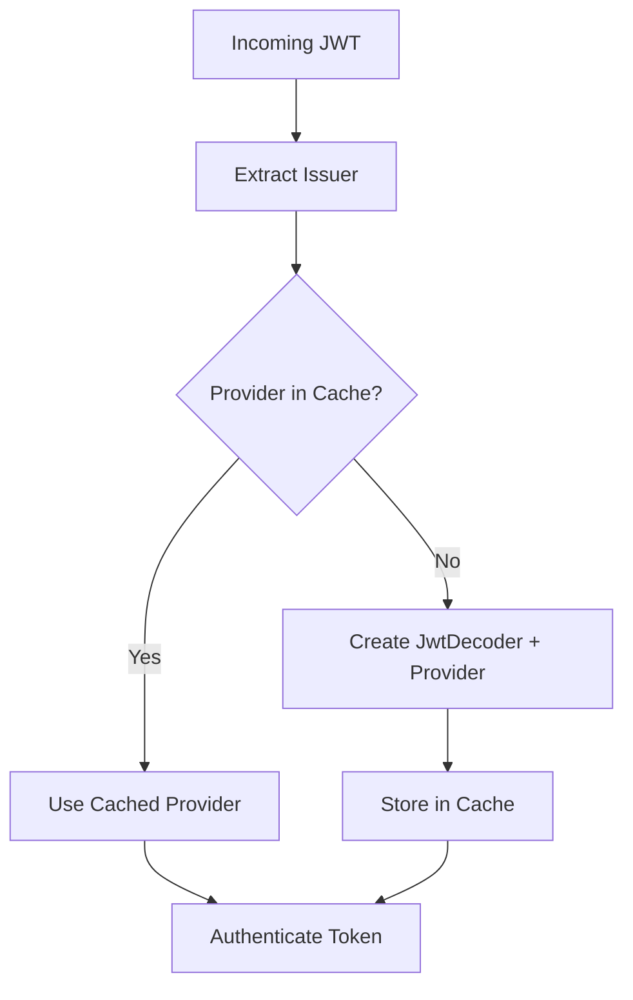
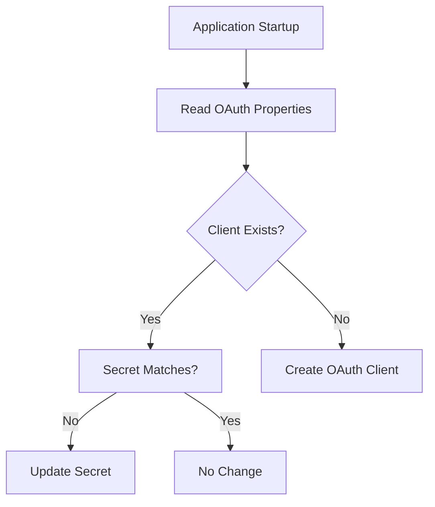
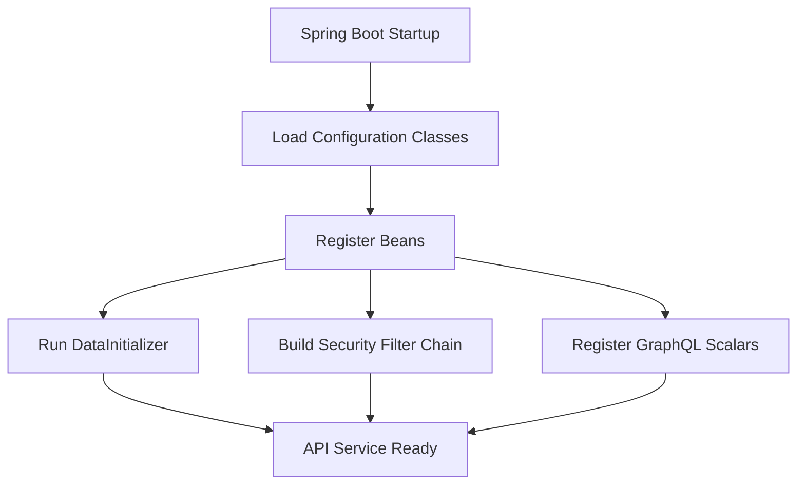

# Api Service Core Runtime And Security

## Overview

The **Api Service Core Runtime And Security** module provides the foundational runtime configuration, security setup, and infrastructure wiring for the OpenFrame API service. It acts as the backbone for:

- Spring Boot application configuration
- Authentication principal resolution
- OAuth client bootstrapping
- JWT-based resource server support
- GraphQL scalar customization
- HTTP client configuration

This module does **not** implement business logic or REST/GraphQL endpoints directly. Instead, it ensures that higher-level modules (such as REST controllers and GraphQL data fetchers) operate within a secure, properly initialized runtime environment.

---

## Architectural Role in the Platform

At runtime, the Api Service participates in a larger OpenFrame microservice architecture. The Gateway handles external authentication concerns, while this module configures the API service as a resource server capable of interpreting validated JWT tokens.



### Key Responsibilities

1. Register core Spring beans (password encoding, HTTP clients).
2. Enable OAuth2 Resource Server support.
3. Resolve authenticated principals into controller method arguments.
4. Initialize default OAuth clients on startup.
5. Extend GraphQL with `Date` and `Instant` scalar types.
6. Optimize JWT authentication provider resolution using caching.

---

## Component Breakdown

### 1. ApiApplicationConfig

**Class:** `ApiApplicationConfig`

Provides foundational Spring beans required across the API service.

#### Password Encoder

```java
@Bean
public PasswordEncoder passwordEncoder() {
    return new BCryptPasswordEncoder();
}
```

- Uses `BCryptPasswordEncoder`.
- Ensures secure password hashing.
- Shared by services handling credentials or secret material.

This encoder aligns with other services in the platform that rely on BCrypt-based hashing.

---

### 2. AuthenticationConfig

**Class:** `AuthenticationConfig`

Registers a custom argument resolver for injecting authenticated principals into controller methods.

```java
@Override
public void addArgumentResolvers(List<HandlerMethodArgumentResolver> resolvers) {
    resolvers.add(new AuthPrincipalArgumentResolver());
}
```

#### Purpose

- Enables use of `@AuthenticationPrincipal` with a custom `AuthPrincipal` abstraction.
- Bridges Spring Security context and application-level user models.

#### Flow



This ensures authenticated user information is cleanly injected into controller logic without manual extraction.

---

### 3. SecurityConfig

**Class:** `SecurityConfig`

Defines the Spring Security configuration for the API service.

### Design Philosophy

The Gateway is responsible for:

- Validating JWT tokens
- Enforcing authorization rules
- Handling permit-all paths
- Converting cookies into `Authorization` headers

The API service only:

- Acts as an OAuth2 Resource Server
- Resolves JWTs into authenticated principals

### JWT Authentication Provider Cache

To efficiently support multi-tenant issuer-based JWT validation, a Caffeine cache stores `JwtAuthenticationProvider` instances.



#### Cache Characteristics

- `maximumSize`
- `expireAfterWrite`
- `refreshAfterWrite`

Configured via:

```text
openframe.security.jwt.cache.expire-after
openframe.security.jwt.cache.refresh-after
openframe.security.jwt.cache.maximum-size
```

#### Security Filter Chain

```java
http
    .csrf(AbstractHttpConfigurer::disable)
    .authorizeHttpRequests(auth -> auth.anyRequest().permitAll())
    .oauth2ResourceServer(oauth2 -> oauth2.authenticationManagerResolver(issuerResolver));
```

- CSRF disabled (stateless API usage).
- All requests permitted at this layer.
- OAuth2 Resource Server enabled.

Authorization decisions are expected to occur upstream or in business logic layers.

---

### 4. DataInitializer

**Class:** `DataInitializer`

Bootstraps a default OAuth client at application startup.

#### Trigger Mechanism

Implemented as a `CommandLineRunner` bean:

```java
@Bean
CommandLineRunner initOAuthClients(OAuthClientRepository clientRepository)
```

#### Behavior

1. Reads:
   - `oauth.client.default.id`
   - `oauth.client.default.secret`
2. Checks repository for existing client.
3. Creates or updates client accordingly.



#### Default Configuration

- Grant types: `password`, `refresh_token`
- Scopes: `read`, `write`

This ensures local development and initial deployments always have a valid OAuth client.

---

### 5. GraphQL Scalar Configuration

The module extends GraphQL support with custom scalar types.

#### DateScalarConfig

- GraphQL scalar name: `Date`
- Backed by `LocalDate`
- Format: `yyyy-MM-dd`

Responsibilities:

- Serialize `LocalDate` to string
- Parse string input into `LocalDate`
- Validate format strictly

#### InstantScalarConfig

- GraphQL scalar name: `Instant`
- Backed by `java.time.Instant`
- Uses ISO-8601 format

Both scalars ensure consistent temporal formatting across the API and prevent schema-level ambiguity.


---

### 6. RestTemplateConfig

Provides a standard Spring `RestTemplate` bean.

```java
@Bean
public RestTemplate restTemplate() {
    return new RestTemplate();
}
```

#### Purpose

- Enables outbound HTTP calls.
- Used for inter-service communication.
- Centralizes HTTP client configuration.

This abstraction ensures consistent HTTP client usage across the API service.

---

## Runtime Lifecycle

### Application Startup Sequence



---

## Security Model Summary

| Layer | Responsibility |
|--------|---------------|
| Gateway | Authentication validation, header management |
| Authorization Server | Token issuance, client registration |
| Api Service Core Runtime And Security | Resource server configuration, JWT resolution |
| Controllers & Services | Business authorization logic |

This layered approach ensures:

- Clear separation of concerns
- Centralized authentication enforcement
- Scalable multi-tenant JWT validation
- Reduced duplication across services

---

## Design Principles

1. **Minimal Surface Area** – Security logic is intentionally lightweight.
2. **Delegated Responsibility** – Gateway performs heavy security enforcement.
3. **Extensibility** – Custom scalars and argument resolvers integrate cleanly.
4. **Performance-Oriented** – JWT providers cached per issuer.
5. **Environment-Driven Initialization** – OAuth client setup is configurable.

---

## Conclusion

The **Api Service Core Runtime And Security** module establishes the secure execution environment for the OpenFrame API service. By combining Spring configuration, JWT-based resource server support, GraphQL scalar extensions, and startup initialization logic, it ensures that higher-level modules can focus solely on business functionality.

It is the foundational layer that makes secure, multi-tenant API execution possible within the OpenFrame platform.
