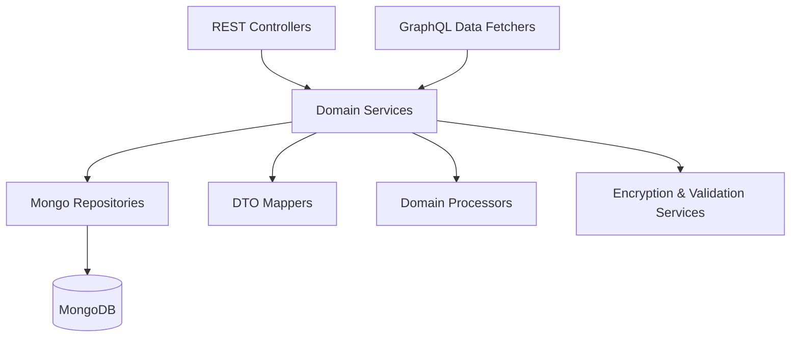
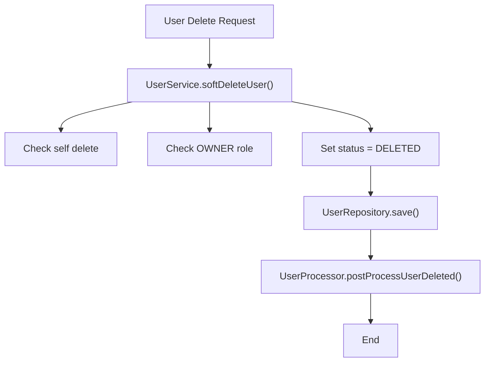
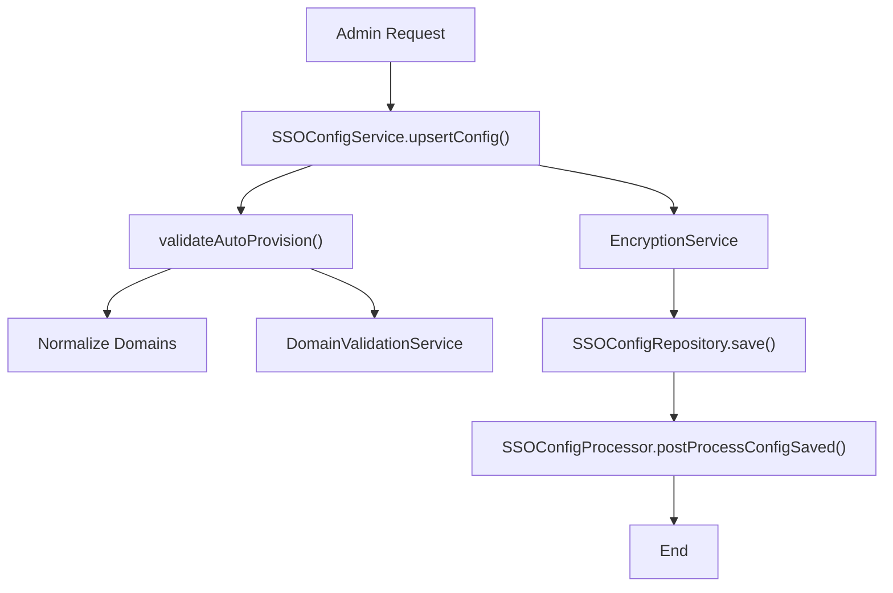
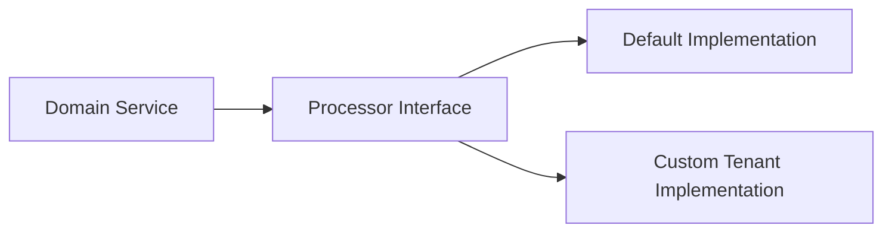
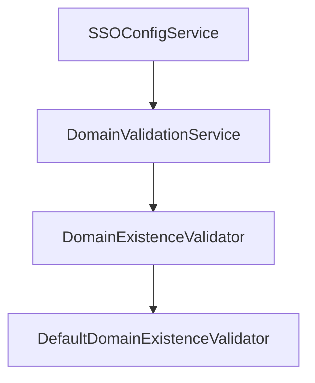

# Api Service Domain Services And Processors

The **Api Service Domain Services And Processors** module encapsulates the core business logic of the OpenFrame API service. It sits between the REST/GraphQL layers and the data persistence layer, implementing domain-specific rules, validation, lifecycle hooks, and orchestration across repositories and processors.

This module is responsible for:

- Managing **User** lifecycle operations
- Managing **SSO configuration** lifecycle and validation
- Providing **extension hooks (processors)** for domain events
- Supporting multi-tenant domain validation strategies

It is a central coordination layer that ensures business invariants are enforced consistently across the API service.

---

## Architectural Context

Within the overall API service, this module connects controllers and data fetchers to repositories and infrastructure services.



### Responsibilities Split

| Layer | Responsibility |
|--------|----------------|
| Controllers / Data Fetchers | Transport layer (REST / GraphQL) |
| Domain Services | Business logic & invariants |
| Processors | Extensibility hooks for side-effects |
| Repositories | Persistence abstraction |
| Infrastructure Services | Encryption, validation, policies |

---

## Core Components Overview

This module contains the following primary components:

### 1. UserService

Implements user-related domain logic including:

- Pagination and listing
- Safe update operations
- Soft deletion with role and self-delete protection
- Delegation to `UserProcessor` hooks

Key business invariants enforced:

- A user **cannot delete themselves**
- An **OWNER role cannot be deleted**
- Deletions are soft (status = DELETED)

---

### 2. SSOConfigService

Encapsulates all Single Sign-On configuration logic:

- CRUD operations for SSO providers
- Secure storage using encrypted secrets
- Provider enable/disable toggling
- Domain validation for auto-provisioning
- Delegation to `SSOConfigProcessor`

Key features:

- Secrets encrypted via `EncryptionService`
- Domain normalization & validation
- Provider-specific validation (Microsoft tenant constraint)
- Upsert semantics (create or update)

---

### 3. DefaultDomainExistenceValidator

Provides a **default implementation** of domain existence validation.

```java
public boolean anyExists(List<String> domains) {
    return false;
}
```

Important design detail:

- Marked with `@ConditionalOnMissingBean`
- Allows SaaS tenant-specific overrides
- Default behavior: do not block domain provisioning

This supports extensibility in multi-tenant deployments.

---

### 4. Domain Processors (Extension Hooks)

The module provides default processor implementations that can be overridden.

#### DefaultInvitationProcessor
- postProcessInvitationCreated
- postProcessInvitationRevoked

#### DefaultSSOConfigProcessor
- postProcessConfigSaved
- postProcessConfigDeleted
- postProcessConfigToggled

#### DefaultUserProcessor
- postProcessUserDeleted
- postProcessUserUpdated
- postProcessUserGet

All are annotated with:

```java
@ConditionalOnMissingBean
```

This ensures:

- Library default behavior is minimal (logging only)
- Platform deployments can override with custom implementations
- No core modification required for tenant customization

---

## User Lifecycle Flow



### Enforced Rules

- Self-deletion throws `UserSelfDeleteNotAllowedException`
- Owner deletion throws `OperationNotAllowedException`
- Non-deleted users transition to `DELETED` state

---

## SSO Configuration Lifecycle



### Auto-Provision Rules

When `autoProvisionUsers = true`:

- At least one allowed domain must be provided
- Domains are normalized (lowercase, trimmed, distinct)
- Public domains are validated
- Microsoft requires `msTenantId` when auto-provisioning

---

## Extensibility Model

A key architectural decision in this module is the **processor pattern**.



### Design Characteristics

- Open/Closed Principle compliant
- Uses Spring conditional bean loading
- Enables SaaS vs OSS behavior divergence
- Keeps business logic isolated from side effects

Possible customizations:

- Send audit events
- Emit Kafka messages
- Trigger email notifications
- Sync with external IAM systems

---

## Multi-Tenant Domain Validation Strategy

The domain validation flow is intentionally layered:



### Default Behavior

- Does not block provisioning
- Acts as a no-op fallback

### Tenant Override Behavior

A tenant-specific implementation may:

- Check domain existence in tenant repository
- Enforce uniqueness across tenants
- Integrate with external domain policy systems

---

## Error Handling Strategy

The module uses explicit domain-level exceptions:

- `UserSelfDeleteNotAllowedException`
- `OperationNotAllowedException`
- `IllegalArgumentException`

This ensures:

- Clear domain-specific semantics
- Predictable controller error mapping
- Consistent REST/GraphQL responses

---

## Integration With Other Modules

The Api Service Domain Services And Processors module integrates with:

- Data persistence via Mongo repositories
- Shared security for encryption
- DTO mapping layer
- REST and GraphQL layers

It deliberately does **not**:

- Perform transport-level concerns
- Perform authentication logic
- Contain infrastructure configuration

Those responsibilities are handled in other API service modules.

---

## Design Principles

The module adheres to:

- Clear separation of concerns
- Strong domain invariants
- Extension over modification
- Soft deletion over destructive deletion
- Secure secret handling
- Multi-tenant adaptability

---

## Summary

The **Api Service Domain Services And Processors** module forms the business backbone of the API service.

It provides:

- Structured domain orchestration
- Validation of critical business rules
- Secure SSO configuration handling
- Controlled user lifecycle management
- Pluggable extension hooks for SaaS customizations

This design enables OpenFrame to maintain a clean, extensible, and secure API domain layer while supporting both OSS and multi-tenant SaaS deployments.
