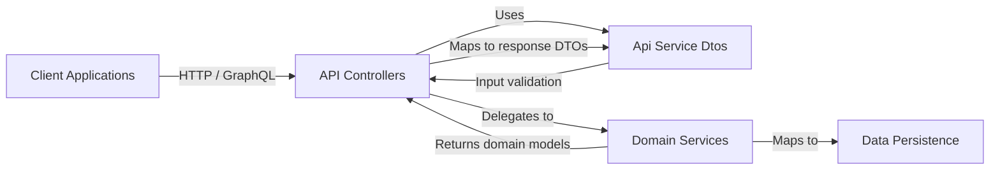
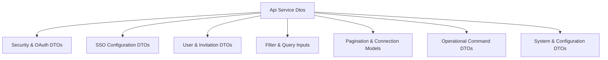
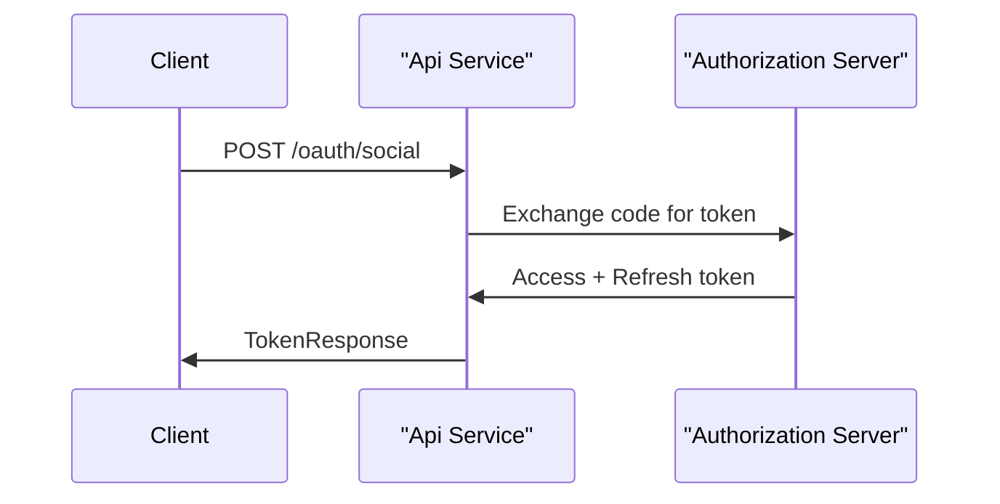
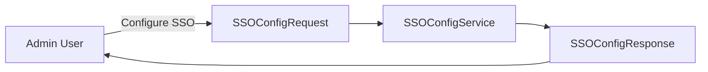
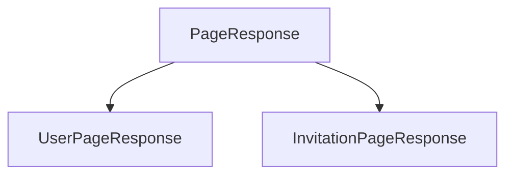
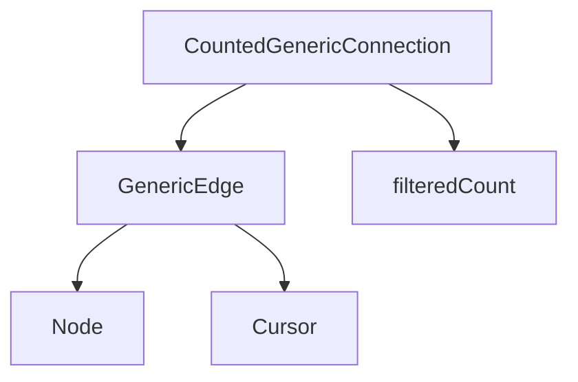
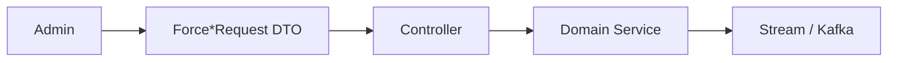
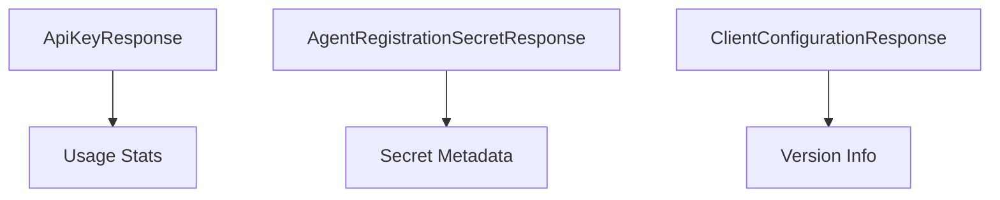
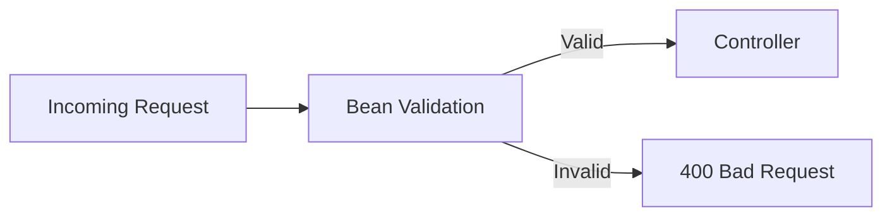

# Api Service Dtos

The **Api Service Dtos** module defines the Data Transfer Objects (DTOs) used by the Api Service to communicate with clients over REST and GraphQL. These DTOs form the public contract of the Api Service and act as a boundary between:

- Controllers (REST + GraphQL)
- Domain Services and Processors
- Persistence and external integrations

This module contains request models, response models, pagination abstractions, filtering inputs, OAuth/OIDC payloads, SSO configuration objects, and operational command DTOs (force updates, invitations, etc.).

It does **not** contain business logic. Instead, it provides strongly typed structures that:

- Define API contracts
- Enforce validation constraints
- Shape GraphQL schema inputs and outputs
- Prevent domain model leakage

---

## Architectural Context

The Api Service Dtos module sits between the transport layer (REST/GraphQL) and the domain layer.

### Responsibilities

The **Api Service Dtos** module is responsible for:

1. Defining request payloads
2. Defining response payloads
3. Supporting cursor-based pagination (GraphQL)
4. Supporting filter inputs for querying
5. Supporting OAuth2 / OIDC flows
6. Supporting operational commands (force updates, invitations, etc.)

---

# DTO Categories Overview

The module can be logically grouped into the following categories:

Each group is detailed below.

---

# 1. Security & OAuth DTOs

These DTOs support OAuth2, OpenID Connect, and token exchange flows.

### Core Classes

- `AuthorizationResponse`
- `GoogleTokenRequest`
- `SocialAuthRequest`
- `TokenResponse`
- `OpenIDConfiguration`
- `UserInfo`
- `UserInfoRequest`

### Flow Example

### Key Design Characteristics

- Uses `@JsonProperty` to map OAuth field names like `access_token`
- Supports PKCE (`code_verifier` fields)
- Separates request and response models
- Encapsulates OIDC discovery metadata in `OpenIDConfiguration`

These DTOs align with the Authorization Server module but remain transport-focused.

---

# 2. SSO Configuration DTOs

These classes define how Single Sign-On providers are configured and exposed.

### Core Classes

- `SSOConfigRequest`
- `SSOConfigResponse`
- `SSOConfigStatusResponse`
- `SSOProviderInfo`

### Responsibilities

- Accept provider credentials
- Support domain whitelisting
- Control auto-provisioning behavior
- Provide safe response views (status vs full config)

Validation is enforced using annotations like `@NotBlank`.

---

# 3. User & Invitation DTOs

These DTOs manage user lifecycle and invitations.

### User DTOs

- `UserResponse`
- `UpdateUserRequest`
- `UserPageResponse`

### Invitation DTOs

- `CreateInvitationRequest`
- `InvitationPageResponse`
- `UpdateInvitationStatusRequest`

### Pagination Pattern

User and invitation responses extend `PageResponse<T>` from shared core utilities.

### Design Notes

- Strong validation using `@Size`, `@ValidEmail`, `@NotNull`
- Separation between request and response types
- Image and role data embedded in `UserResponse`
- Pagination abstraction reused across modules

---

# 4. Filter & Query Inputs (GraphQL + REST)

These DTOs are optimized for filtering large datasets.

### Core Filter Inputs

- `LogFilterInput`
- `DeviceFilterInput`
- `EventFilterInput`
- `OrganizationFilterInput`
- `ToolFilterInput`

### Characteristics

- Support multi-value filters (`List<String>`)
- Support date range queries
- Map directly to GraphQL schema input types
- Decouple API-level filters from database query models

These DTOs protect the persistence layer from direct exposure and allow evolution of filtering logic independently.

---

# 5. Pagination & Connection Models (GraphQL)

The module supports cursor-based pagination patterns used in GraphQL.

### Core Classes

- `GenericEdge<T>`
- `CountedGenericConnection<T>`

`GenericEdge` wraps a node and cursor.

`CountedGenericConnection` extends `GenericConnection` and adds `filteredCount`.

This enables:

- Efficient forward/backward pagination
- Client awareness of total filtered count
- Consistent GraphQL schema design

---

# 6. Operational Command DTOs

These DTOs represent explicit operational actions triggered by administrators.

### Force Operations

Force operations exist in two packages (`force` and `update`) to support different execution paths.

Examples:

- `ForceClientUpdateRequest`
- `ForceToolInstallationAllRequest`
- `ForceToolReinstallationRequest`
- `ForceToolUpdateRequest`
- `ForceToolAgentUpdateRequest`
- `ForceToolAgentUpdateAllRequest`
- `ForceToolAgentUpdateResponse`

These DTOs:

- Identify target machines or tool agents
- Trigger asynchronous workflows
- Return structured response summaries

They are intentionally minimal and action-oriented.

---

# 7. System & Configuration DTOs

These support API-level configuration exposure.

### Core Classes

- `ClientConfigurationResponse`
- `ApiKeyResponse`
- `AgentRegistrationSecretResponse`

### Responsibilities

#### ClientConfigurationResponse
- Exposes client version information

#### ApiKeyResponse
- Returns metadata about API keys
- Omits secret values
- Tracks usage statistics

#### AgentRegistrationSecretResponse
- Exposes secret metadata
- Includes `createdAt` and activation state

These DTOs enforce secure exposure of sensitive data by excluding raw secrets.

---

# Validation Strategy

The module uses Jakarta Validation annotations:

- `@NotBlank`
- `@NotNull`
- `@Size`
- Custom validators like `@ValidEmail`

Validation occurs at the controller boundary before domain logic executes.

---

# Design Principles

The **Api Service Dtos** module follows these principles:

1. Clear separation between request and response models
2. No domain logic inside DTOs
3. Validation at the boundary
4. Support for REST and GraphQL contracts
5. Pagination abstraction reuse
6. Secure handling of sensitive information
7. Future-proof filter modeling

---

# How It Fits into the Overall System

Within the OpenFrame platform architecture:

- REST Controllers depend on these DTOs for payload mapping
- GraphQL Data Fetchers use filter and connection DTOs
- Domain Services return models that are mapped into response DTOs
- External API services define their own DTOs but follow similar patterns

The **Api Service Dtos** module acts as the contract layer that stabilizes the Api Service interface while allowing internal implementations to evolve.

---

# Summary

The **Api Service Dtos** module is the structural backbone of the Api Service contract layer. It:

- Defines all input and output models
- Enforces validation rules
- Enables pagination and filtering
- Supports OAuth and SSO flows
- Structures operational commands

By centralizing these DTOs, the system achieves:

- Strong typing
- API consistency
- Secure data exposure
- Clear separation of concerns

This module ensures that the Api Service remains robust, extensible, and contract-driven.