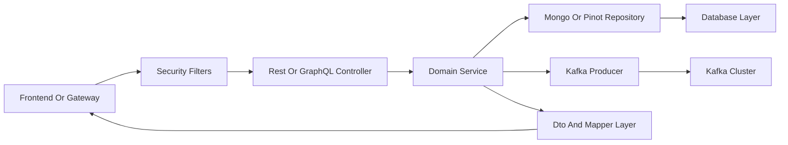
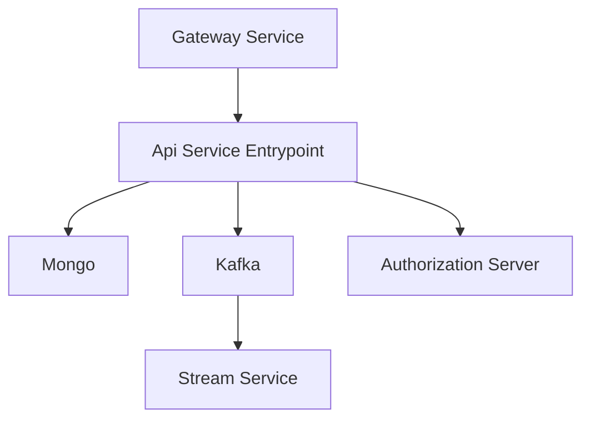
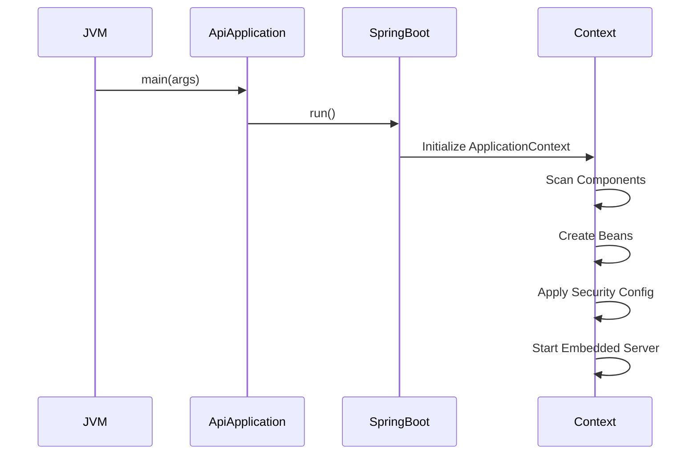

# Api Service Entrypoint

## Overview

The **Api Service Entrypoint** module is the bootstrap layer of the OpenFrame API service. It is responsible for initializing the Spring Boot application context, wiring together all API-related components, and exposing the REST and GraphQL interfaces that power the OpenFrame platform.

At its core, this module contains the `ApiApplication` class, which:

- Boots the Spring Boot runtime
- Defines the root component scan boundaries
- Initializes logging and infrastructure beans
- Activates auto-configuration for data, security, messaging, and domain services

Although minimal in code, this module is architecturally critical: it is the execution boundary that composes all API-related submodules into a running microservice.

---

## Core Component

### ApiApplication

**Class:** `com.openframe.api.ApiApplication`

```java
@SpringBootApplication
@ComponentScan(basePackages = {
        "com.openframe.api",
        "com.openframe.data",
        "com.openframe.core",
        "com.openframe.notification",
        "com.openframe.kafka"
})
@Slf4j
public class ApiApplication {

    public static void main(String[] args) {
        log.info("Starting OpenFrame API");
        SpringApplication.run(ApiApplication.class, args);
    }
}
```

### Responsibilities

1. **Application Bootstrap**  
   Uses `@SpringBootApplication` to enable:
   - Auto-configuration
   - Component scanning
   - Spring Boot configuration lifecycle

2. **Component Boundary Definition**  
   The explicit `@ComponentScan` ensures beans are discovered from:
   - `com.openframe.api` → Controllers, GraphQL, services
   - `com.openframe.data` → Mongo, Cassandra, Pinot, Redis integrations
   - `com.openframe.core` → Shared utilities and DTO base types
   - `com.openframe.notification` → Mail services
   - `com.openframe.kafka` → Kafka producers and topic configuration

3. **Service Startup Logging**  
   Emits a startup log entry to confirm API service initialization.

---

## High-Level Architecture

The Api Service Entrypoint assembles multiple internal modules into a cohesive API microservice.

```mermaid
flowchart TD
    ApiApp["Api Service Entrypoint"]
    Config["Api Service Config And Security"]
    RestLayer["Api Service Rest Controllers"]
    GraphQL["Api Service GraphQL Layer"]
    Domain["Api Service Domain Services And Processors"]
    DTOs["Api Service Dtos"]
    Contracts["Api Contracts And Mapping"]
    Data["Data Persistence Mongo"]
    Cache["Data Cache Redis"]
    Platform["Data Platform And Pinot Cassandra"]
    Kafka["Data Transport Kafka"]
    Security["Shared Security And OAuth Bff"]

    ApiApp --> Config
    ApiApp --> RestLayer
    ApiApp --> GraphQL
    ApiApp --> Domain
    ApiApp --> DTOs
    ApiApp --> Contracts
    ApiApp --> Data
    ApiApp --> Cache
    ApiApp --> Platform
    ApiApp --> Kafka
    ApiApp --> Security
```



The entrypoint does not implement business logic directly. Instead, it orchestrates and activates the layers listed above.

---

## Request Processing Flow

Once the application is started, request handling flows through layered components.



### Key Phases

1. **Authentication & Authorization**  
   Handled by Spring Security and shared OAuth configuration.

2. **Controller Layer**  
   - REST endpoints (device, user, organization, SSO, etc.)
   - GraphQL data fetchers

3. **Domain Services & Processors**  
   Business rules, validation, orchestration.

4. **Data Access Layer**  
   - Mongo repositories
   - Pinot analytics queries
   - Cassandra storage (where applicable)

5. **Event Emission**  
   Kafka producers publish events for downstream processing.

---

## Module Relationships

The Api Service Entrypoint depends on and activates several sibling modules.

### Configuration & Security

See:  
[Api Service Config And Security](api_service_config_and_security.md)

Provides:
- Spring Security configuration
- Authentication setup
- RestTemplate and scalar configuration
- Data initializers

---

### REST Layer

See:  
[Api Service Rest Controllers](api_service_rest_controllers.md)

Contains:
- DeviceController
- OrganizationController
- UserController
- SSOConfigController
- HealthController
- And other REST endpoints

---

### GraphQL Layer

See:  
[Api Service GraphQL Layer](api_service_graphql_layer.md)

Provides:
- DataFetchers
- DataLoaders
- Connection-style pagination
- Query and mutation orchestration

---

### Domain Services & Processors

See:  
[Api Service Domain Services And Processors](api_service_domain_services_and_processors.md)

Encapsulates:
- SSO configuration logic
- Invitation processing
- User lifecycle management
- Domain validation

---

### Data & Infrastructure

The API service integrates with multiple infrastructure modules:

- [Data Persistence Mongo](data_persistence_mongo.md)
- [Data Cache Redis](data_cache_redis.md)
- [Data Platform And Pinot Cassandra](data_platform_and_pinot_cassandra.md)
- [Data Transport Kafka](data_transport_kafka.md)
- [Shared Security And OAuth Bff](shared_security_and_oauth_bff.md)

These modules provide storage, caching, analytics, messaging, and authentication primitives.

---

## Interaction with Other Services

The Api Service Entrypoint operates as one of several OpenFrame microservices.



Related entrypoints:

- [Gateway Service Entrypoint](gateway_service_entrypoint.md)
- [Authorization Server Entrypoint](authorization_server_entrypoint.md)
- [Stream Service Entrypoint](stream_service_entrypoint.md)
- [Management Service Entrypoint](management_service_entrypoint.md)
- [Client Service Entrypoint](client_service_entrypoint.md)
- [External Api Service Entrypoint](external_api_service_entrypoint.md)

---

## Startup Lifecycle

When the JVM starts the Api Service Entrypoint:



### Lifecycle Phases

1. JVM invokes `main()`
2. Spring Boot initializes auto-configuration
3. Component scanning registers controllers, services, repositories
4. Security filters are wired
5. Embedded web server starts (typically Tomcat or Netty)
6. Service begins accepting HTTP requests

---

## Design Principles

The Api Service Entrypoint follows several architectural principles:

- **Thin Entrypoint** – No business logic in the bootstrap class
- **Explicit Scan Boundaries** – Prevents accidental cross-module coupling
- **Layered Architecture** – Controller → Service → Repository → Infrastructure
- **Event-Driven Extensions** – Kafka-based propagation to stream processors
- **Security-First** – Integrated OAuth and JWT configuration

---

## Summary

The **Api Service Entrypoint** module is the runtime anchor of the OpenFrame API service. While its code footprint is small, it defines the structural composition of the API microservice by:

- Bootstrapping Spring Boot
- Activating configuration and security layers
- Wiring REST and GraphQL endpoints
- Integrating persistence, caching, and messaging

All external API interactions with the OpenFrame platform ultimately pass through this service boundary, making it a central pillar of the system architecture.