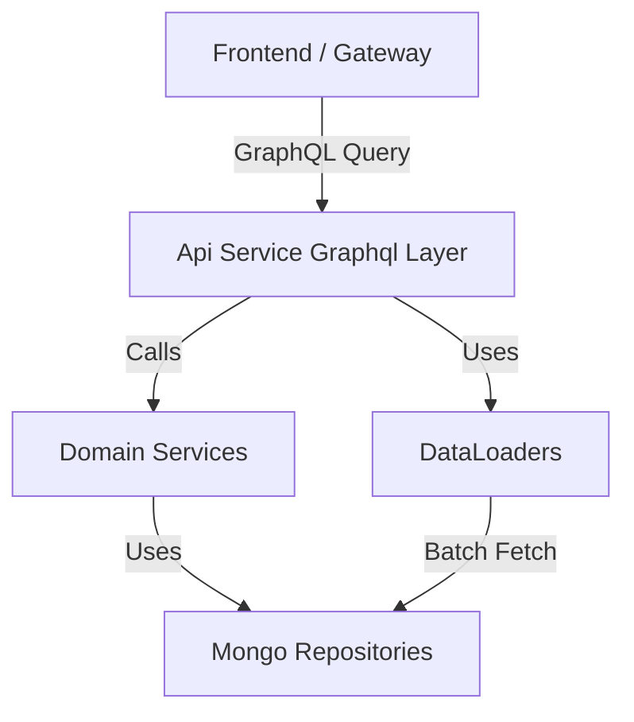
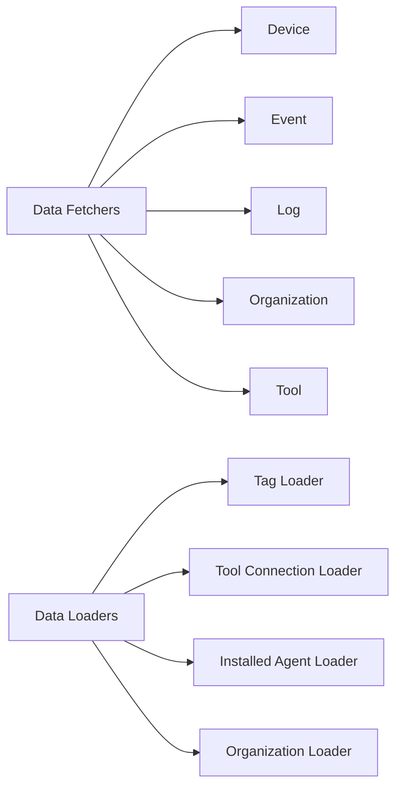
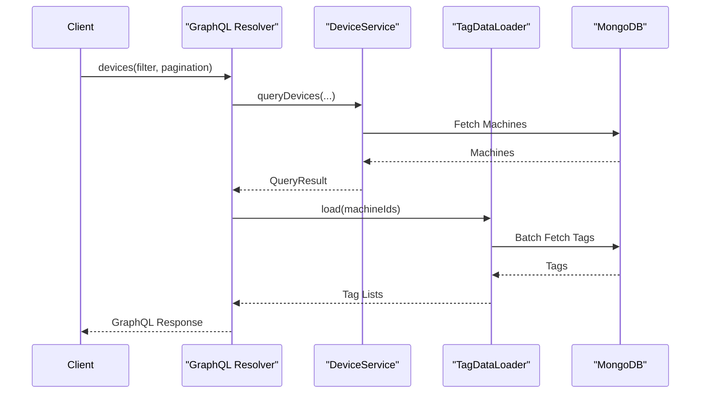
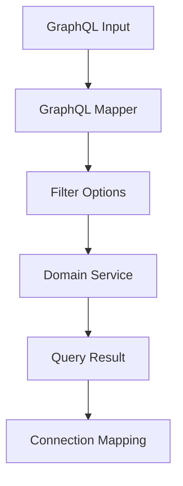
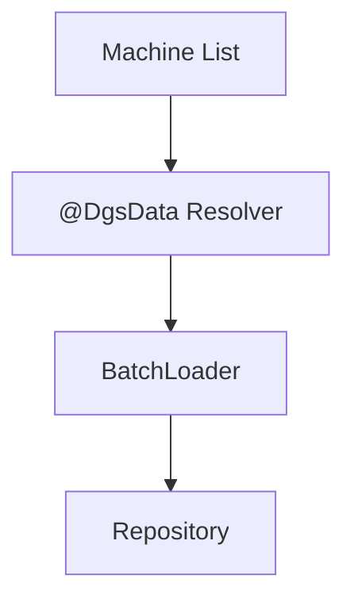

# Api Service Graphql Layer

## Overview

The **Api Service Graphql Layer** is the GraphQL interface of the OpenFrame API Service. It exposes typed queries and mutations for devices, events, logs, organizations, and integrated tools using the Netflix DGS framework.

This layer acts as:

- A **GraphQL façade** over domain services
- A **mapping boundary** between GraphQL DTOs and domain models
- A **performance-optimized resolver layer** using DataLoader to prevent N+1 queries

It integrates closely with:

- Domain services and processors (business logic)
- Mongo repositories and data services (persistence)
- Shared DTOs and mappers
- Security configuration defined in the API Service

---

## Architectural Positioning

The Api Service Graphql Layer:

1. Accepts GraphQL queries and mutations
2. Maps input DTOs into filter and pagination criteria
3. Delegates execution to domain services
4. Maps domain results back into GraphQL connection types
5. Uses DataLoader for batched relational resolution

---

## Internal Structure

The module is divided into two main responsibilities:

- **Data Fetchers** – Query and mutation resolvers
- **Data Loaders** – Batch loading components for relational fields

---

## Sub-Modules

### 1. Data Fetchers

GraphQL resolvers implemented using `@DgsComponent`, `@DgsQuery`, `@DgsMutation`, and `@DgsData`.

Responsibilities:

- Transform GraphQL inputs into service-layer filter objects
- Invoke domain services
- Return cursor-based connection results
- Resolve nested fields using DataLoader

Detailed documentation:

- [Data Fetchers](api_service_graphql_layer/data_fetchers/data_fetchers.md)

---

### 2. Data Loaders

Batch loading components registered with `@DgsDataLoader`.

Responsibilities:

- Eliminate N+1 query problems
- Batch relational lookups (tags, tool connections, organizations, installed agents)
- Preserve ordering of requested keys

Detailed documentation:

- [Data Loaders](api_service_graphql_layer/data_loaders/data_loaders.md)

---

## Query Execution Flow Example

The following illustrates how a `devices` query resolves nested relationships:

---

## Key Design Patterns

### 1. Cursor-Based Pagination

All major list queries return connection types such as:

- `CountedGenericConnection`
- `GenericConnection`

These wrap:

- `edges`
- `pageInfo`
- Optional `totalCount`

This enables efficient forward pagination for large datasets.

---

### 2. Filter Mapping Pattern

Each DataFetcher follows a structured flow:

This ensures strict separation between API contracts and domain logic.

---

### 3. N+1 Prevention Strategy

Relational fields such as:

- Machine → Tags
- Machine → ToolConnections
- Machine → InstalledAgents
- Machine → Organization

are resolved using DataLoader batching.

Instead of performing one query per machine, the DataLoader aggregates keys and performs a single batch call.

---

## Domain Coverage

The Api Service Graphql Layer exposes:

- Device inventory and filtering
- Event querying and mutation
- Audit log retrieval and detail lookup
- Organization listing and retrieval
- Integrated tool discovery

All business logic remains inside domain services. The GraphQL layer remains:

- Stateless
- Thin
- Mapping-focused
- Validation-aware

---

## Security Considerations

Although authentication and authorization are configured in the API Service configuration layer, the GraphQL resolvers rely on:

- Validated input DTOs
- Service-layer authorization
- Spring Security context

The GraphQL layer does not implement security logic directly.

---

## Summary

The **Api Service Graphql Layer** provides a high-performance, type-safe, and scalable GraphQL interface over OpenFrame domain services.

It ensures:

- Clean separation of concerns
- Efficient pagination
- N+1 protection via DataLoader
- Strong DTO-to-domain mapping discipline
- Consistent API contracts across devices, events, logs, organizations, and tools

For implementation details, refer to:

- [Data Fetchers](api_service_graphql_layer/data_fetchers/data_fetchers.md)
- [Data Loaders](api_service_graphql_layer/data_loaders/data_loaders.md)
