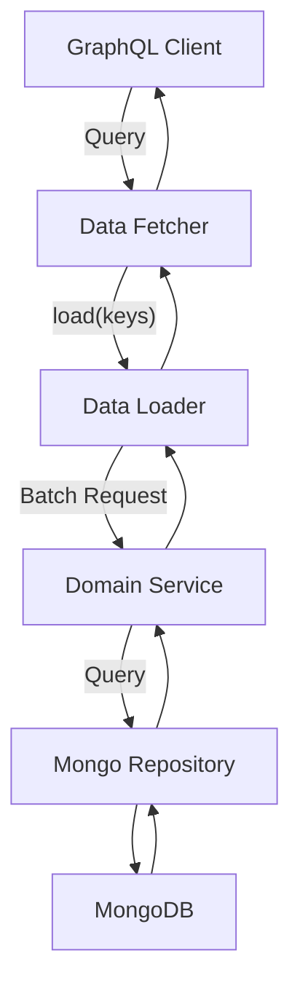
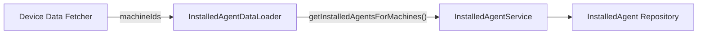
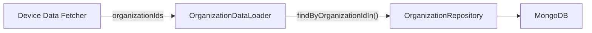
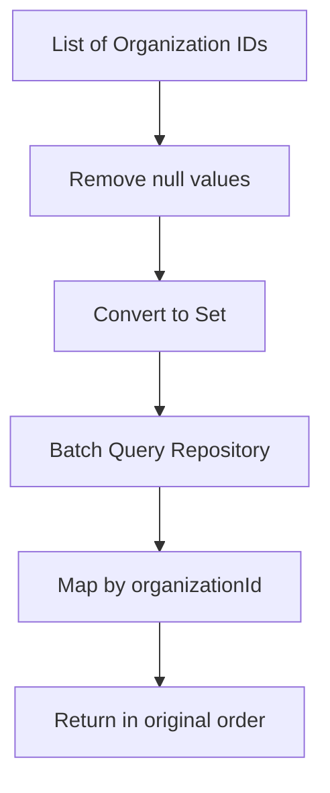
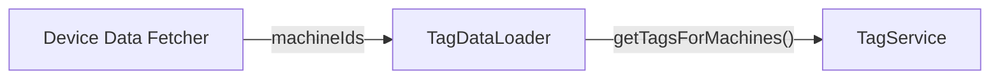
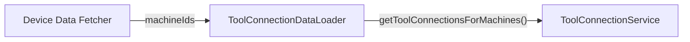
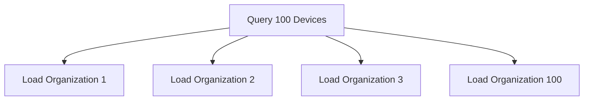
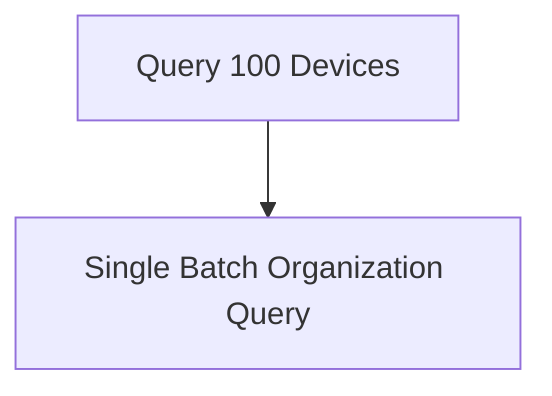
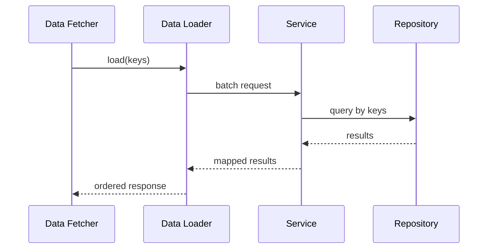

# Data Loaders

The **Data Loaders** module is part of the GraphQL layer in the API Service. It provides batched and asynchronous data fetching capabilities using Netflix DGS and the `org.dataloader` pattern to eliminate the classic **N+1 query problem**.

This module works closely with the [API Service GraphQL Layer](../api_service_graphql_layer.md) and is consumed by the [Data Fetchers](../data_fetchers/data_fetchers.md) to efficiently resolve nested GraphQL fields.

---

## Purpose and Responsibilities

The Data Loaders module is responsible for:

- ✅ Batching multiple GraphQL field resolutions into a single backend call  
- ✅ Preserving request ordering in batched responses  
- ✅ Delegating business logic to domain services or repositories  
- ✅ Improving performance and reducing database load  
- ✅ Supporting asynchronous, non-blocking execution via `CompletableFuture`  

Each Data Loader is registered using the `@DgsDataLoader` annotation and implements the `BatchLoader<K, V>` interface.

---

## Architectural Context

The Data Loaders sit between GraphQL Data Fetchers and the domain/data access layers.

### Key Design Principles

1. **Batch First** – All loaders receive a list of keys.
2. **Order Preservation** – Results are returned in the same order as input keys.
3. **Service Delegation** – Business logic remains in services.
4. **Async Execution** – Uses `CompletableFuture.supplyAsync`.

---

## Core Components

### 1. Installed Agent Data Loader

**Class:** `InstalledAgentDataLoader`  
**Key:** `machineId`  
**Value:** `List<InstalledAgent>`

Delegates to `InstalledAgentService` to retrieve installed agents per machine.

### Behavior

- Accepts multiple machine IDs
- Returns a list of installed agents per machine
- Maintains input ordering
- Executes asynchronously

---

### 2. Organization Data Loader

**Class:** `OrganizationDataLoader`  
**Key:** `organizationId`  
**Value:** `Organization`

This loader prevents N+1 issues when resolving organizations for multiple machines.

### Notable Logic

- Removes `null` IDs
- Deduplicates keys
- Filters soft-deleted organizations
- Maps results back to original key order

---

### 3. Tag Data Loader

**Class:** `TagDataLoader`  
**Key:** `machineId`  
**Value:** `List<Tag>`

Delegates to `TagService` to fetch machine-associated tags.

### Responsibilities

- Batch fetch tags for multiple machines
- Return grouped tag lists
- Avoid repeated database queries

---

### 4. Tool Connection Data Loader

**Class:** `ToolConnectionDataLoader`  
**Key:** `machineId`  
**Value:** `List<ToolConnection>`

Delegates to `ToolConnectionService` to resolve tool integrations associated with machines.

---

## N+1 Problem Prevention

Without Data Loaders:

With Data Loaders:

This dramatically reduces database round-trips and improves response time.

---

## Execution Model

All loaders follow this pattern:

Important characteristics:

- One request-scoped Data Loader registry per GraphQL request
- Caching within a single request lifecycle
- Asynchronous execution using `CompletableFuture`

---

## Integration with Other Modules

The Data Loaders module collaborates with:

- [API Service GraphQL Layer](../api_service_graphql_layer.md) – Provides the GraphQL infrastructure
- [Data Fetchers](../data_fetchers/data_fetchers.md) – Invoke Data Loaders when resolving nested fields
- Data persistence modules (Mongo repositories and services) – Provide actual data retrieval

This separation ensures:

- Clean architecture boundaries  
- Reusable domain services  
- High GraphQL performance  
- Scalable query resolution

---

## Summary

The **Data Loaders** module is a critical performance optimization layer within the GraphQL stack. By batching and asynchronously resolving entity relationships, it:

- Eliminates N+1 query problems
- Reduces database load
- Maintains deterministic ordering
- Keeps business logic in services
- Improves overall API responsiveness

In large GraphQL queries involving devices, organizations, tags, and tool connections, this module ensures OpenFrame remains efficient and scalable under load.