# Data Fetchers

The **Data Fetchers** module is the GraphQL execution layer of the API Service. It bridges incoming GraphQL queries and mutations with domain services, mappers, and persistence layers.

Built on top of Netflix DGS, this module defines query and mutation resolvers for core OpenFrame entities such as Devices, Events, Logs, Organizations, and Integrated Tools. It is responsible for:

- Translating GraphQL inputs into domain filter options
- Executing cursor-based paginated queries
- Delegating business logic to domain services
- Coordinating DataLoader-based batching to prevent N+1 issues
- Mapping domain models into GraphQL connection types

This module is part of the [API Service GraphQL Layer](../api_service_graphql_layer.md) and works closely with the sibling [Data Loaders](../data_loaders/data_loaders.md) module.

---

## Architectural Overview

At runtime, Data Fetchers sit between the GraphQL schema and the domain/service layer.

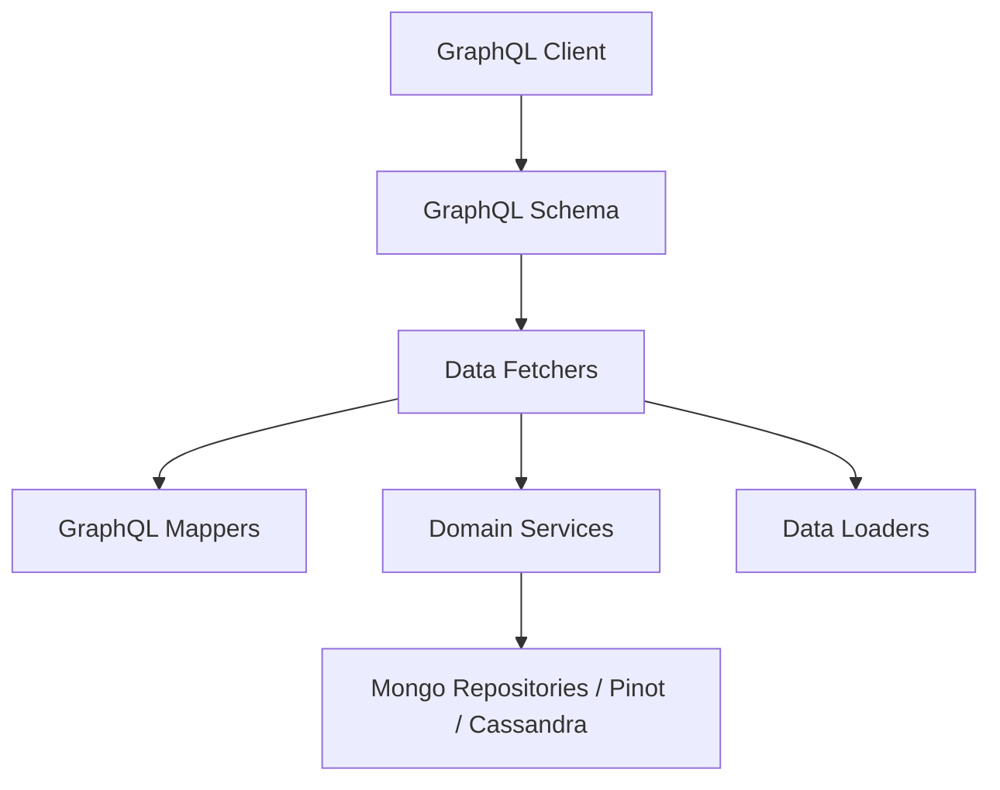

### Responsibilities by Layer

- **GraphQL Client**: Sends queries and mutations
- **Data Fetchers**: Resolve queries and nested fields
- **GraphQL Mappers**: Convert inputs to filter criteria and results to connection types
- **Domain Services**: Contain business logic and data access orchestration
- **Data Loaders**: Batch and cache nested entity lookups
- **Persistence Layer**: MongoDB, Pinot, Cassandra, and other data stores

---

# Core Components

## Device Data Fetcher

Handles GraphQL operations related to devices (machines).

### Queries

- `deviceFilters(filter)` → Returns dynamic filter options
- `devices(filter, pagination, search, sort)` → Returns cursor-based connection
- `device(machineId)` → Returns single machine by ID

### Nested Field Resolvers (Machine)

Uses DataLoader to resolve relationships efficiently:

- `tags`
- `toolConnections`
- `installedAgents`
- `organization`

### Device Query Flow

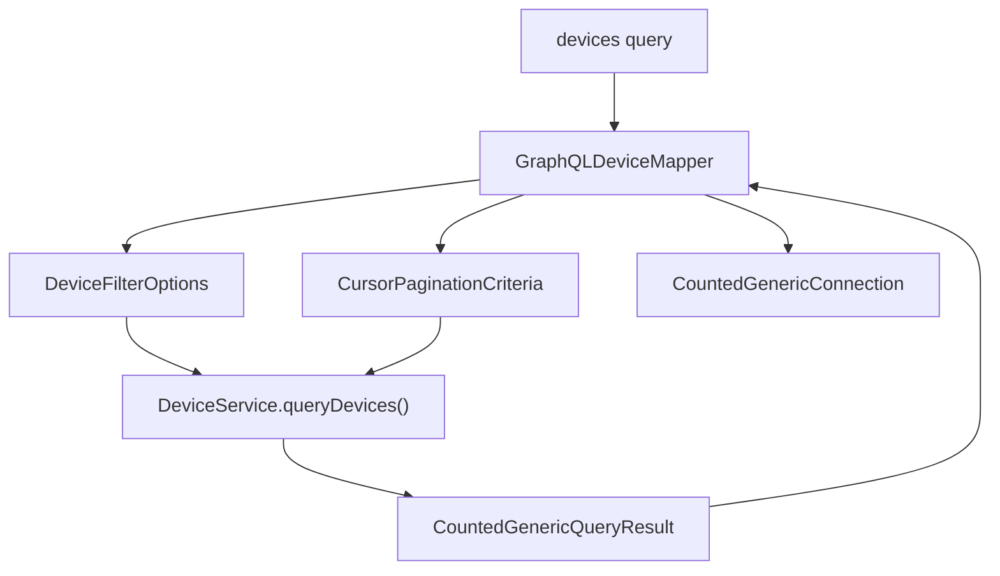

### Nested Data Resolution

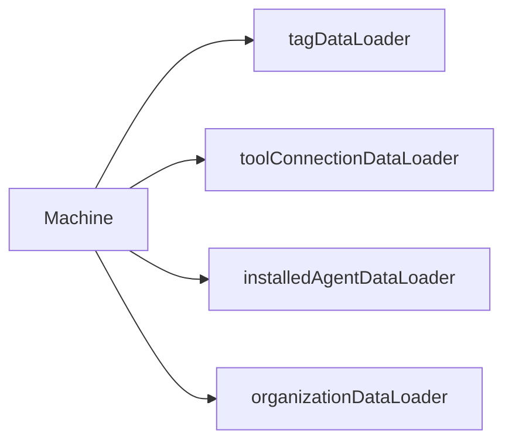

This prevents N+1 query issues by batching ID-based lookups per request.

---

## Event Data Fetcher

Responsible for event retrieval and mutation operations.

### Queries

- `events(filter, pagination, search, sort)`
- `eventById(id)`
- `eventFilters(filter)`

### Mutations

- `createEvent(input)`
- `updateEvent(id, input)`

### Event Query Flow

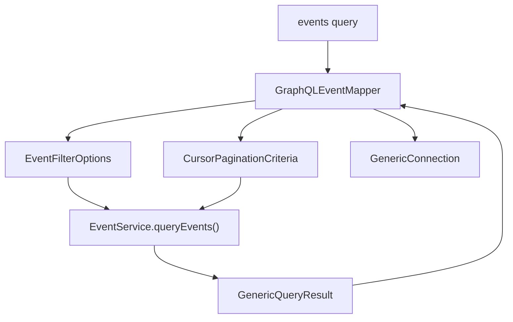

### Mutation Flow

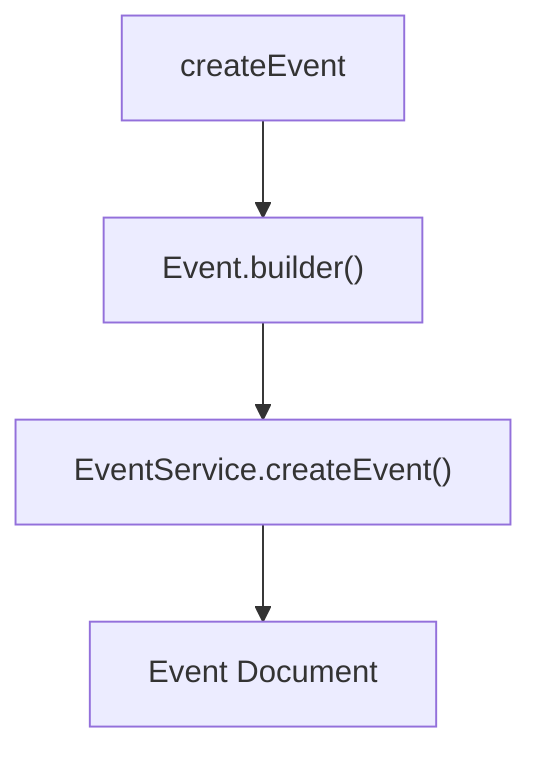

Event mutations construct domain objects and delegate persistence to the EventService.

---

## Log Data Fetcher

Handles audit log retrieval with advanced filtering and cursor-based pagination.

### Queries

- `logFilters(filter)`
- `logs(filter, pagination, search, sort)`
- `logDetails(ingestDay, toolType, eventType, timestamp, toolEventId)`

### Log Query Flow

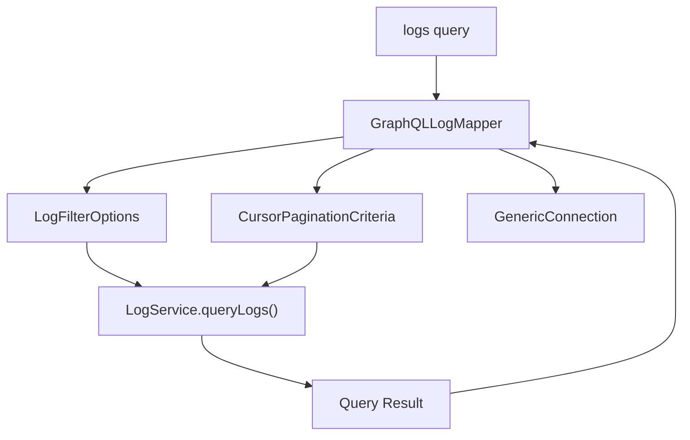

`logDetails` performs a targeted lookup using compound identifiers such as ingest day and tool event ID.

---

## Organization Data Fetcher

Exposes organization-level queries.

### Queries

- `organizations(filter, pagination, search, sort)`
- `organization(id)`
- `organizationByOrganizationId(organizationId)`

### Organization Query Flow

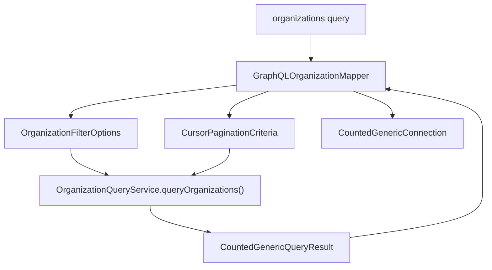

This separates read-optimized query logic from write-oriented organization services.

---

## Tools Data Fetcher

Handles integrated tool discovery and filtering.

### Queries

- `integratedTools(filter, search, sort)`
- `toolFilters()`

### Tools Query Flow

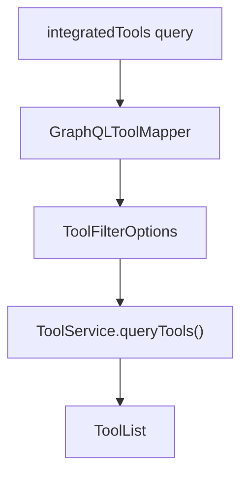

Unlike device and event queries, tools do not use cursor pagination in this implementation.

---

# Cursor-Based Pagination Model

Most collection queries implement cursor-based pagination using shared DTOs.

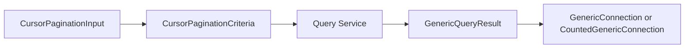

Key characteristics:

- Forward and backward pagination support
- Stable sorting via `SortInput`
- Search term support
- Total count support for certain entities

---

# DataLoader Integration

The Data Fetchers module relies on the sibling [Data Loaders](../data_loaders/data_loaders.md) module for batching and caching.

### Why DataLoader?

Without batching:

- Fetch 50 machines
- Fetch tags for each machine individually
- 50 additional database calls

With DataLoader:

- Collect all machine IDs
- Execute one batched query
- Distribute results back to individual resolvers

### Execution Model

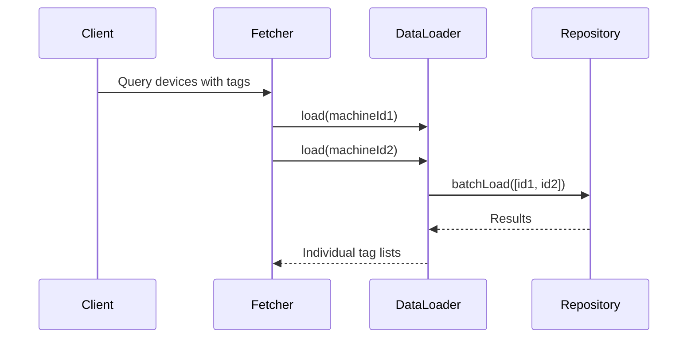

This design ensures high performance and predictable database load.

---

# Validation and Input Handling

Each Data Fetcher:

- Uses `@Valid` for DTO validation
- Applies `@NotBlank` for required scalar inputs
- Logs structured debug statements
- Delegates business logic to services

The module deliberately avoids embedding domain logic. Its responsibilities are:

- Input transformation
- Delegation
- Result mapping
- Nested field resolution

---

# How Data Fetchers Fit into the System

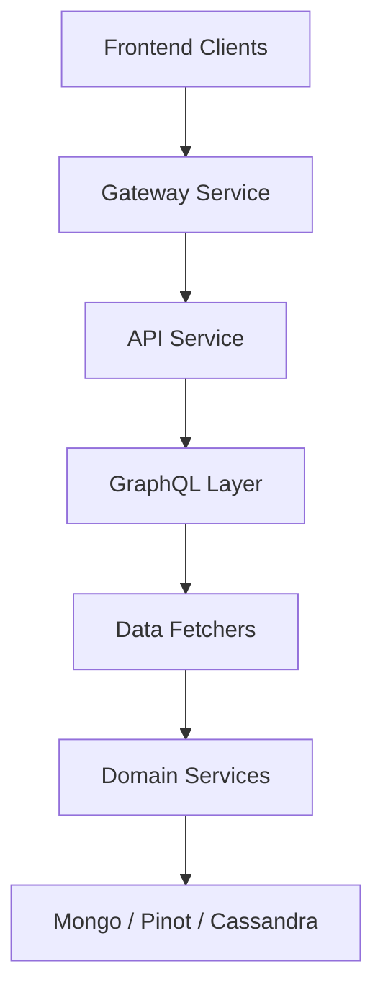

Within the API Service:

- **REST Controllers** handle HTTP endpoints
- **Data Fetchers** handle GraphQL queries and mutations
- **Domain Services** implement business rules
- **Repositories** handle persistence

The Data Fetchers module therefore acts as the execution engine of the GraphQL API.

---

# Summary

The **Data Fetchers** module:

- Implements GraphQL query and mutation resolvers
- Converts GraphQL inputs into domain-level filter criteria
- Provides cursor-based pagination
- Uses DataLoader for efficient nested resolution
- Delegates business logic to domain services
- Maps domain results into GraphQL connection types

It is a thin but critical orchestration layer that enables a scalable, strongly-typed GraphQL API across devices, events, logs, organizations, and integrated tools.
