# Api Service Rest Controllers

The **Api Service Rest Controllers** module exposes the primary REST-based management and internal operational endpoints for the OpenFrame API service. It acts as the HTTP boundary layer between clients (Frontend, Gateway, Internal Services) and the domain/service layer.

This module is implemented using Spring Boot `@RestController` components and follows a clean layering approach:

- Controller (HTTP boundary)
- Service (business logic)
- DTOs (API contracts)
- Domain + Persistence (Mongo, Kafka, etc.)

It focuses primarily on:

- Tenant-aware user and organization management
- API key lifecycle management
- SSO configuration management
- Agent and tool force operations
- Client configuration exposure
- Internal health and operational endpoints

---

## Architectural Position

The Api Service Rest Controllers module sits inside the API Service and exposes secured endpoints behind the Gateway and Security layers.

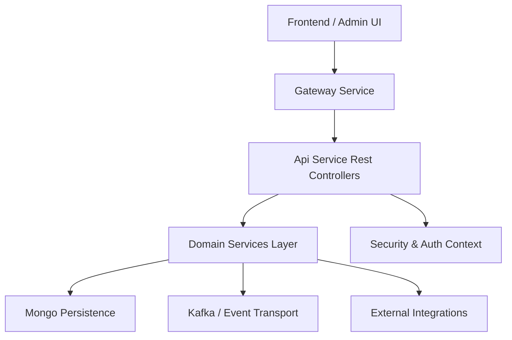

### Responsibilities at This Layer

- Define REST endpoints and HTTP semantics
- Validate request payloads (`@Valid`)
- Extract authenticated principal context
- Translate exceptions into HTTP status codes
- Delegate all business logic to services

Controllers do **not**:
- Implement domain logic
- Access repositories directly
- Perform cross-cutting security logic (handled by security config)

---

# Controller Inventory and Responsibilities

Below is a breakdown of each controller and its role within the system.

---

## 1. AgentRegistrationSecretController

**Base Path:** `/agent/registration-secret`

### Purpose
Manages agent registration secrets used during agent onboarding and secure registration flows.

### Endpoints

- `GET /active` – Returns the currently active secret
- `GET /` – Returns all historical secrets
- `POST /generate` – Generates a new secret (returns `201 Created`)

### Architectural Flow

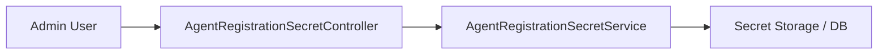

### Notes
- Secret rotation is logged.
- Creation is explicitly marked with `201 Created`.

---

## 2. ApiKeyController

**Base Path:** `/api-keys`

### Purpose
Manages per-user API keys used for programmatic access and automation.

### Security Model
Uses `@AuthenticationPrincipal AuthPrincipal` to ensure operations are scoped to the authenticated user.

### Endpoints

- `GET /` – List API keys for authenticated user
- `POST /` – Create new API key
- `GET /{keyId}` – Retrieve single key
- `PUT /{keyId}` – Update key metadata
- `DELETE /{keyId}` – Delete key
- `POST /{keyId}/regenerate` – Regenerate secret

### Request Flow

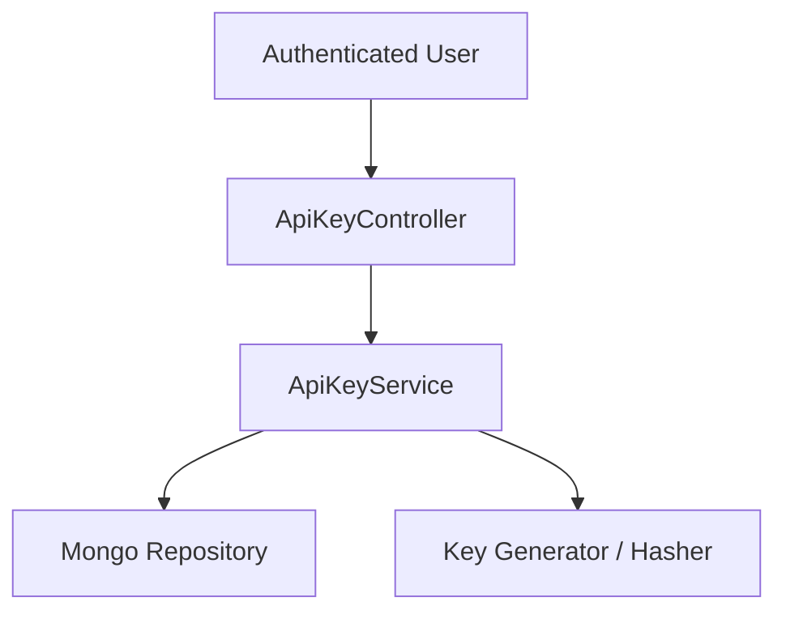

### Key Characteristics

- Strict user scoping
- Regeneration returns a new secret once
- Uses DTOs for safe output

---

## 3. DeviceController

**Base Path:** `/devices`

### Purpose
Internal endpoint to update device status.

### Endpoint

- `PATCH /{machineId}` – Update device status

### Flow

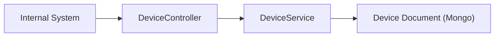

### Notes
- Returns `204 No Content`
- Intended for internal orchestration and sync processes

---

## 4. ForceAgentController

**Base Path:** `/force`

### Purpose
Triggers forced updates, installations, or reinstallations of:

- Clients
- Tool Agents

### Supported Operations

- Install tool agent (single/all)
- Update client (single/all)
- Update tool agent (single/all)
- Reinstall tool agent

### Command Processing Pattern

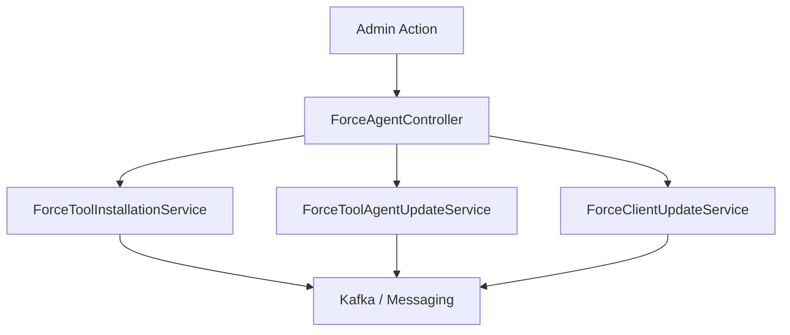

### Design Observations

- Thin controller
- Delegates to specialized services
- Services publish commands to agents via messaging layer

---

## 5. HealthController

**Endpoint:** `GET /health`

### Purpose
Lightweight liveness endpoint.

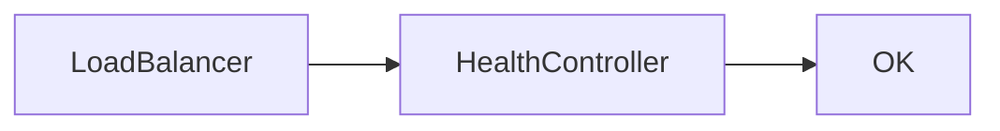

Used for:
- Kubernetes liveness/readiness probes
- Monitoring systems

---

## 6. InvitationController

**Base Path:** `/invitations`

### Purpose
Handles tenant invitation lifecycle.

### Endpoints

- `POST /` – Create invitation
- `GET /` – Paginated list
- `DELETE /{id}` – Revoke
- `POST /{id}/resend` – Resend invitation

### Flow

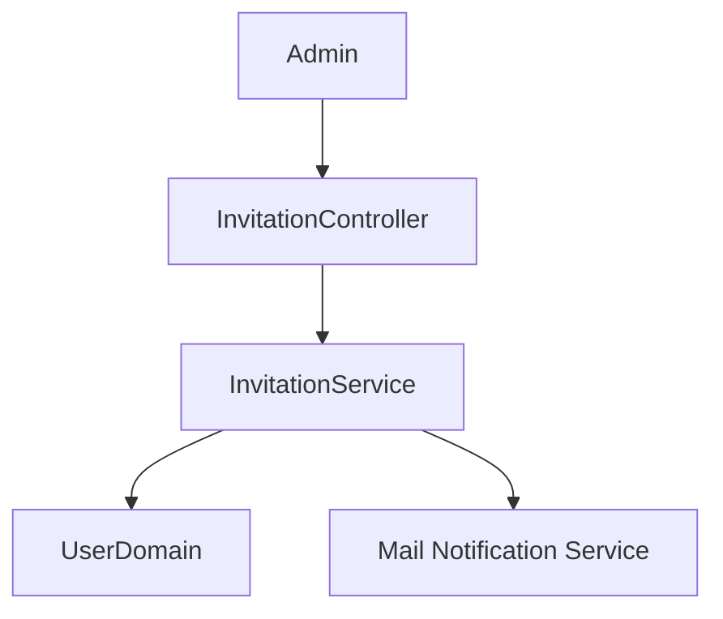

### Characteristics

- Uses `@Valid` request validation
- Returns page-based response object
- Triggers email notifications via service layer

---

## 7. MeController

**Endpoint:** `GET /me`

### Purpose
Returns authenticated user context.

### Behavior

- If no principal → `401 Unauthorized`
- Returns identity, roles, tenant ID

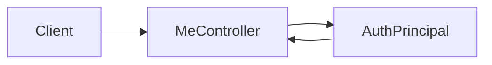

Useful for frontend session validation.

---

## 8. OpenFrameClientConfigurationController

**Base Path:** `/openframe-client/configuration`

### Purpose
Exposes client download/configuration metadata.

### Flow

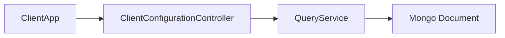

Used by client installers and UI.

---

## 9. OrganizationController

**Base Path:** `/organizations`

### Purpose
Handles **mutation operations only** for organizations.

Read operations are handled in the external API layer.

### Endpoints

- `POST /` – Create organization
- `PUT /{id}` – Update organization
- `DELETE /{id}` – Delete organization

### Exception Mapping

- `IllegalArgumentException` → `404 Not Found`
- `OrganizationHasMachinesException` → `409 Conflict`

### Flow

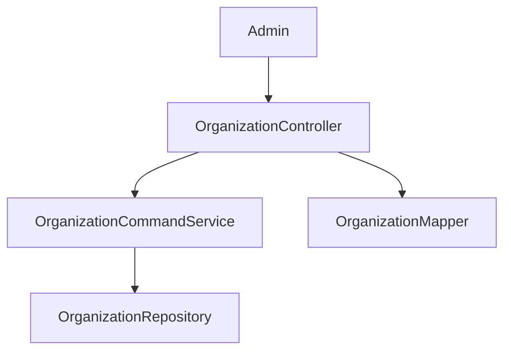

---

## 10. ReleaseVersionController

**Base Path:** `/release-version`

### Purpose
Exposes current release metadata.

### Behavior

- Returns `200 OK` with version
- Returns `404 Not Found` if missing

### Flow

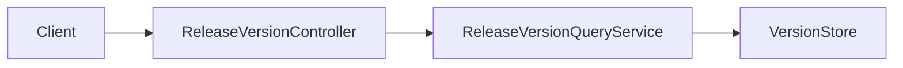

---

## 11. SSOConfigController

**Base Path:** `/sso`

### Purpose
Manages tenant SSO provider configurations.

### Endpoints

- `GET /providers` – Enabled providers
- `GET /providers/available` – All supported providers
- `GET /{provider}` – Retrieve configuration
- `POST /{provider}` – Create configuration
- `PUT /{provider}` – Update configuration
- `PATCH /{provider}/toggle` – Enable/disable
- `DELETE /{provider}` – Remove configuration

### Flow

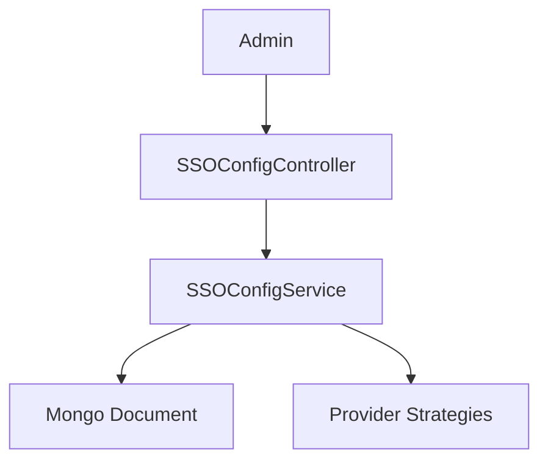

### Design

- Uses upsert semantics for create/update
- Exposes separate "available providers" endpoint

---

## 12. UserController

**Base Path:** `/users`

### Purpose
Handles user administration.

### Endpoints

- `GET /` – Paginated list
- `GET /{id}` – Retrieve
- `PUT /{id}` – Update
- `DELETE /{id}` – Soft delete

### Flow

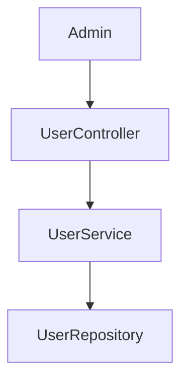

### Characteristics

- Uses soft delete semantics
- Converts domain exceptions into HTTP errors

---

# Cross-Cutting Concerns

## 1. Authentication & Authorization

Controllers rely on:

- `AuthPrincipal` injection
- Spring Security configuration
- Tenant-aware context

Authorization decisions are enforced at service/security layer.

---

## 2. Validation

- `@Valid` on request bodies
- Jakarta validation annotations in DTOs

Validation errors result in standard Spring error responses.

---

## 3. Exception Translation Pattern

Controllers explicitly translate domain exceptions into HTTP status codes using `ResponseStatusException`.

Pattern:

```text
Domain Exception
    ↓
Controller catch block
    ↓
ResponseStatusException
    ↓
HTTP Status Code
```

---

# End-to-End Request Lifecycle Example

Example: Force tool update for all agents.

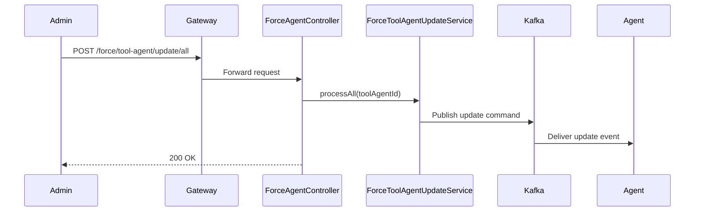

---

# Design Principles Observed

- Thin controllers
- Strict separation of concerns
- DTO-based contracts
- Clear HTTP semantics
- Event-driven command execution for force operations
- Tenant-aware security model

---

# Summary

The **Api Service Rest Controllers** module forms the operational control surface of the API service. It exposes secure, well-structured REST endpoints that:

- Manage users, organizations, API keys, and SSO
- Trigger agent lifecycle operations
- Provide configuration and version metadata
- Offer internal health and synchronization endpoints

All business logic is delegated to service layers, ensuring the module remains clean, maintainable, and aligned with Spring Boot best practices.
