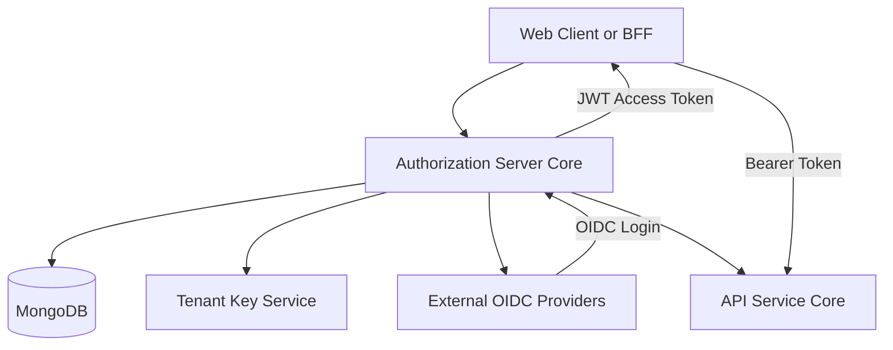
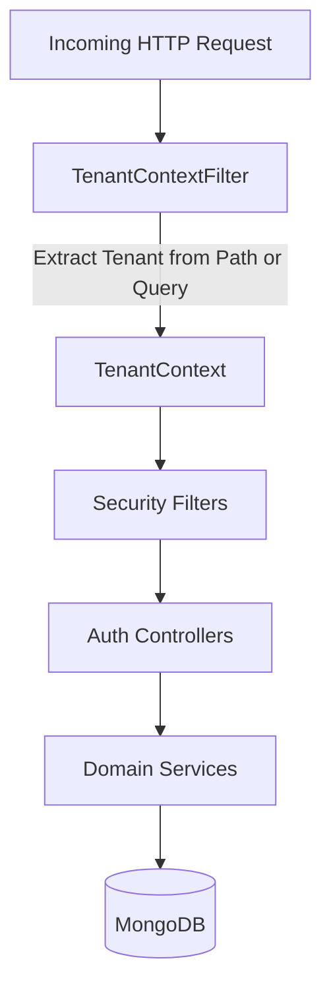
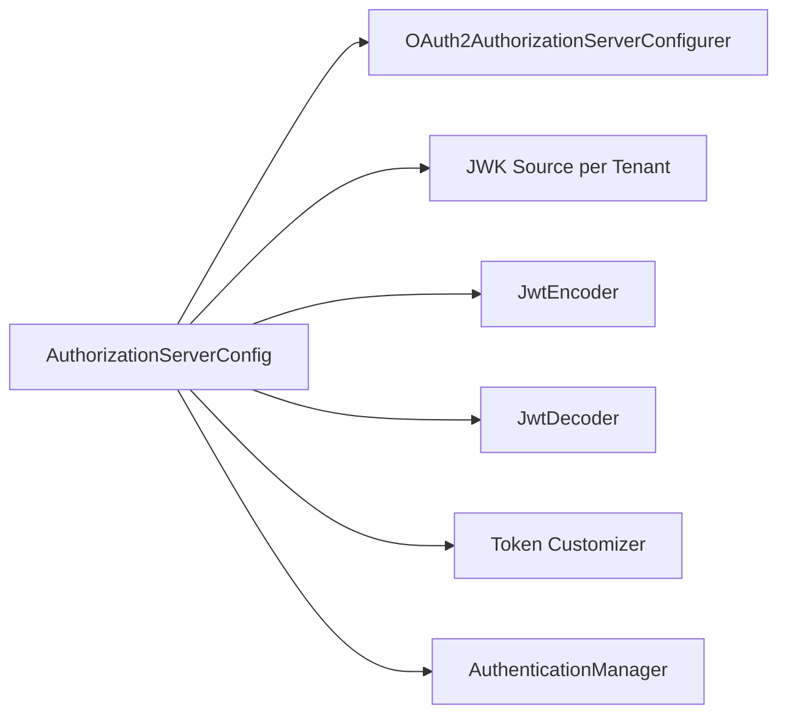
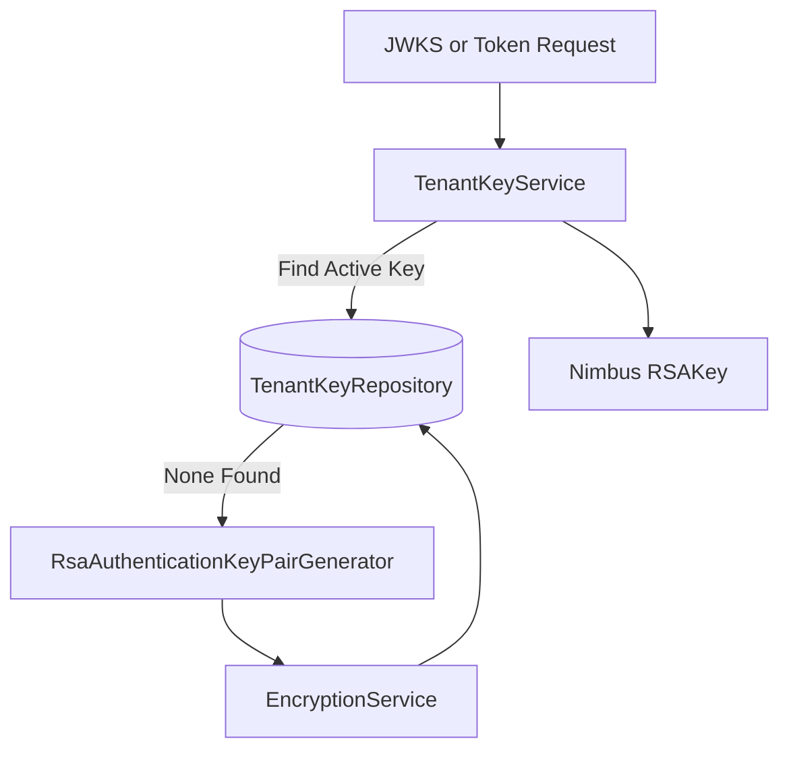
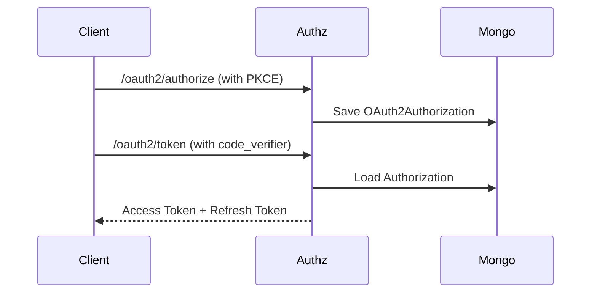
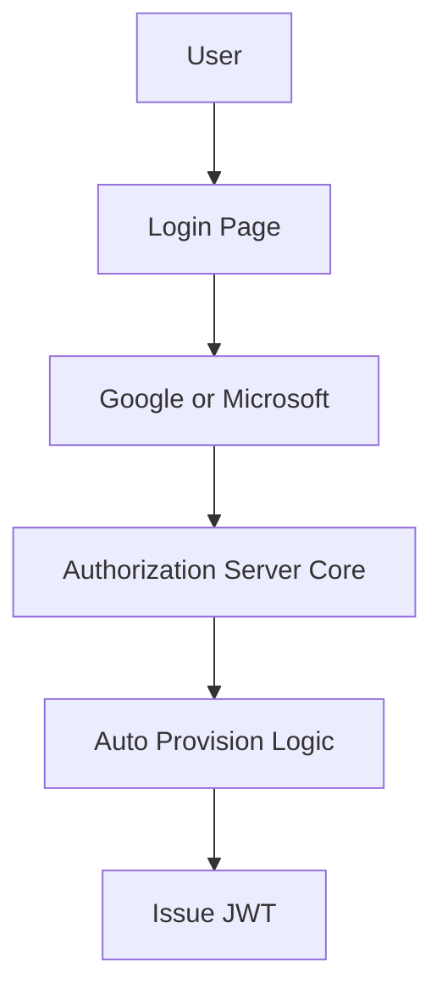
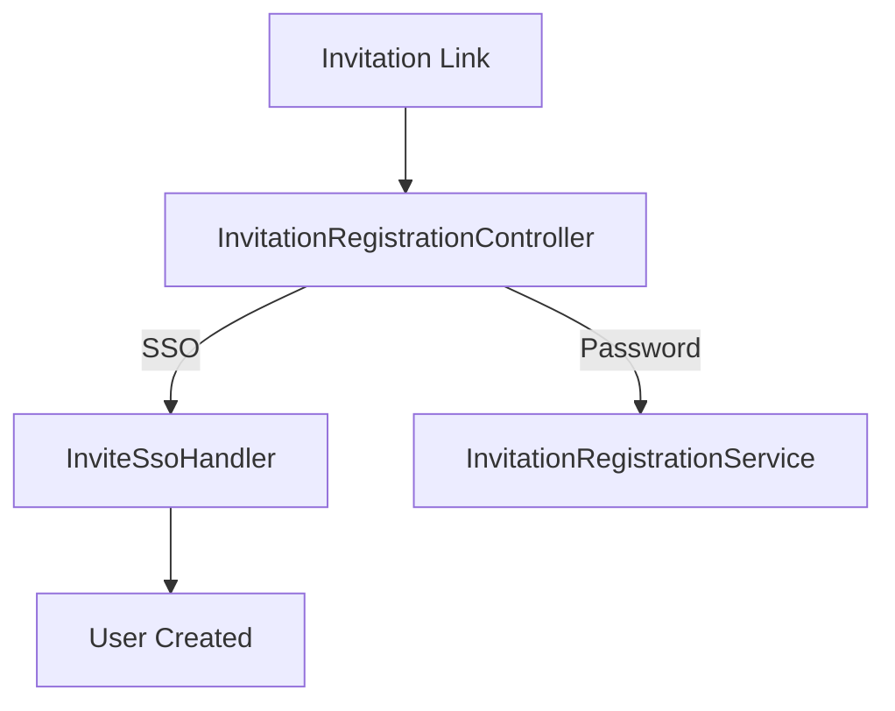
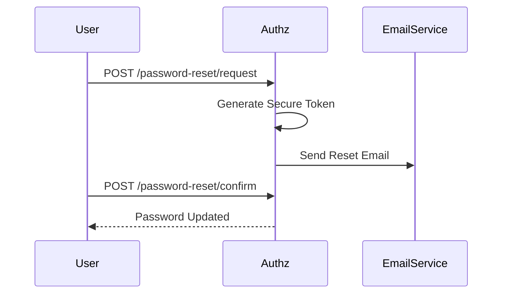

# Authorization Server Core

The **Authorization Server Core** module implements the multi-tenant OAuth2 and OpenID Connect (OIDC) authorization server for OpenFrame. It is responsible for:

- Issuing and validating JWT access and refresh tokens
- Managing OAuth2 clients and authorization grants
- Handling multi-tenant context resolution
- Supporting SSO providers (Google, Microsoft)
- Managing tenant registration, invitation flows, and password resets
- Persisting authorizations and PKCE state in MongoDB

This module is the identity backbone of the platform and integrates closely with:

- API Service Core (resource servers consuming JWTs)
- Gateway Service Core (JWT validation and routing)
- Mongo Domain and Repositories (users, tenants, OAuth data)
- Security and OAuth BFF (frontend OAuth flows)

---

## 1. High-Level Architecture

### Responsibilities by Layer

| Layer | Responsibility |
|--------|----------------|
| Security Configuration | OAuth2 server setup, filter chains, login flows |
| Tenant Context | Resolve and isolate tenant per request |
| Token & Key Management | Per-tenant RSA keys, JWT customization |
| OAuth Persistence | Store authorizations, codes, PKCE data |
| SSO Integration | Google & Microsoft OIDC login |
| Registration Flows | Tenant registration, invitation acceptance |
| Utility & Web Support | Redirect handling, cookie management |

---

## 2. Multi-Tenant Model

The Authorization Server Core is **strictly multi-tenant**.

Tenant isolation is enforced via:

- `TenantContext` (ThreadLocal tenant resolution)
- `TenantContextFilter` (extract tenant from path/query/session)
- Per-tenant RSA signing keys
- Tenant-scoped user lookup

### Tenant Resolution Flow

### Key Rules

- Tenant ID may come from URL path segment.
- Fallback mechanisms: query parameter `tenant` or session attribute.
- Tenant switch invalidates session unless transitioning from onboarding tenant.
- `TenantContext.clear()` ensures no leakage across threads.

---

## 3. OAuth2 Authorization Server Configuration

Core configuration class:

- `AuthorizationServerConfig`

### Features Enabled

- OAuth2 Authorization Code Flow
- Refresh Tokens
- PKCE Support
- OIDC (OpenID Connect)
- Multiple issuers (multi-tenant support)
- JWT resource server support

### JWT Customization

Access tokens are enriched with:

- `tenant_id`
- `userId`
- `roles`

If a user has `OWNER`, `ADMIN` is automatically included.

Last login timestamp is updated on refresh token issuance.

---

## 4. Per-Tenant RSA Key Management

Core components:

- `TenantKeyService`
- `RsaAuthenticationKeyPairGenerator`
- `PemUtil`

Each tenant has its own RSA key pair used for signing JWTs.

### Key Lifecycle

### Important Characteristics

- Private keys are encrypted at rest.
- Each key has a `kid` (key ID).
- JWKS endpoint serves tenant-specific public keys.
- Multiple active keys trigger warnings.

---

## 5. OAuth2 Persistence (Mongo)

Core components:

- `MongoAuthorizationService`
- `MongoAuthorizationMapper`
- `MongoRegisteredClientRepository`

This layer stores:

- Authorization codes
- Access tokens
- Refresh tokens
- PKCE metadata
- OAuth2AuthorizationRequest snapshot

### PKCE Handling

PKCE parameters (`code_challenge`, `code_challenge_method`) are:

- Stored in additional parameters
- Persisted in authorization code metadata
- Rehydrated on token exchange

---

## 6. Default Security Configuration

Core class:

- `SecurityConfig`

This filter chain handles:

- Form login
- OAuth2 login (OIDC)
- Public endpoint rules
- Microsoft issuer validation
- Authentication success and failure handlers

### Public Endpoints

Examples of permitted paths:

- `/oauth/**`
- `/invitations/**`
- `/password-reset/**`
- `/sso/providers/**`
- `/.well-known/**`

All other requests require authentication.

---

## 7. SSO Integration (Google & Microsoft)

Core components:

- `GoogleClientRegistrationStrategy`
- `MicrosoftClientRegistrationStrategy`
- `AuthSuccessHandler`
- `OidcUserUtils`

### OIDC Flow

### Auto-Provisioning

If enabled per tenant:

- New users are created automatically
- Domain restrictions may apply
- Email verified flag may be set based on IdP claim
- Profile picture may be synchronized

Microsoft uses custom issuer validation to support multi-tenant Azure AD.

---

## 8. Tenant & Invitation Flows

### Controllers

- `TenantRegistrationController`
- `InvitationRegistrationController`
- `TenantDiscoveryController`
- `SsoDiscoveryController`

### Registration Types

1. Direct tenant registration (email + password)
2. SSO-based tenant registration
3. Invitation-based registration
4. SSO invitation acceptance

SSO flows use secure HTTP-only cookies:

- `of_sso_reg`
- `of_sso_invite`

On completion, cookies are cleared while preserving OAuth session where required.

---

## 9. Password Reset Flow

Core components:

- `PasswordResetController`
- `PasswordResetDtos`
- `ResetTokenUtil`

### Flow

Reset tokens:

- 32-byte secure random
- URL-safe Base64
- One-time usage

Password policy enforces:

- Minimum 8 characters
- Uppercase, lowercase, digit, special character

---

## 10. Authentication Success & State Management

### AuthSuccessHandler

On successful login:

- Updates `lastLogin`
- Optionally marks email as verified
- Delegates to SSO flow handlers

### AuthStateUtils

Provides:

- Session invalidation
- JSESSIONID clearing
- Cookie clearing helpers

### Redirects

- `seeOther()` (303)
- `found()` (302)
- Root-relative redirect support

---

## 11. Integration with Other Modules

| Module | Integration Purpose |
|---------|---------------------|
| API Service Core | Validates JWT access tokens |
| Gateway Service Core | Enforces JWT-based routing |
| Mongo Domain and Repositories | Stores users, tenants, OAuth data |
| Management Service Core | Initializes tenant-related data |
| Security and OAuth BFF | Frontend OAuth redirection layer |

The Authorization Server Core is the identity authority for the entire platform.

---

## 12. Security Characteristics

- Per-tenant signing keys
- Encrypted private keys
- Strict PKCE enforcement
- Domain-based SSO restrictions
- Role-based JWT claims
- Session isolation across tenants
- Microsoft issuer pattern validation
- Secure, HTTP-only cookies for SSO flows

---

## Conclusion

The **Authorization Server Core** provides a production-grade, multi-tenant OAuth2 and OIDC identity provider tailored for OpenFrame.

It ensures:

- Strong tenant isolation
- Secure JWT issuance
- Flexible SSO integration
- Extensible registration processing
- Persistent and PKCE-safe OAuth flows

This module forms the foundation of authentication, authorization, and identity management across the OpenFrame platform.