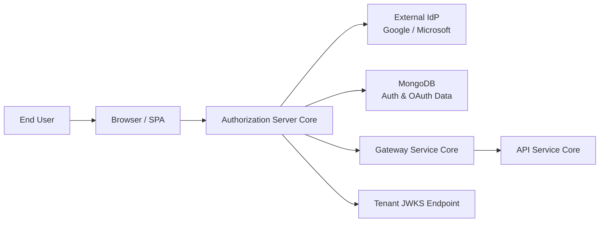
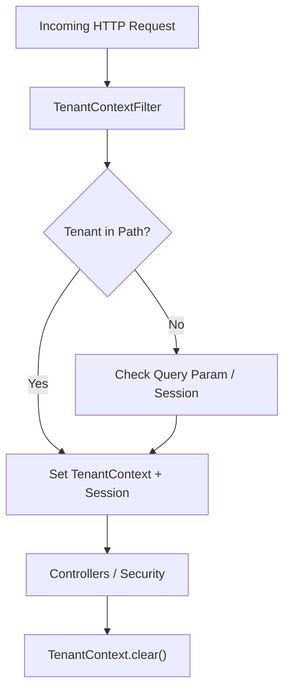
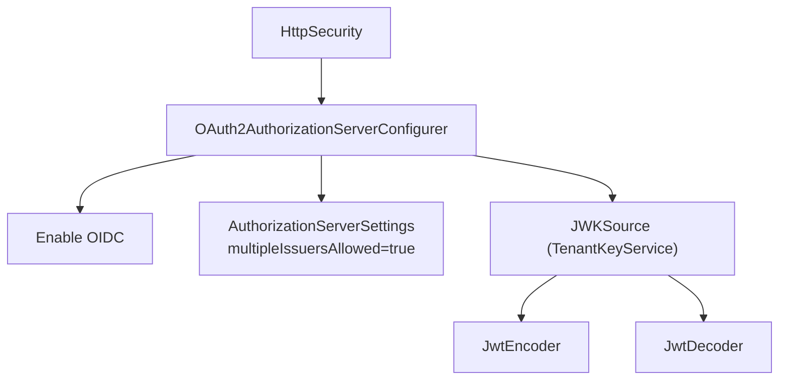
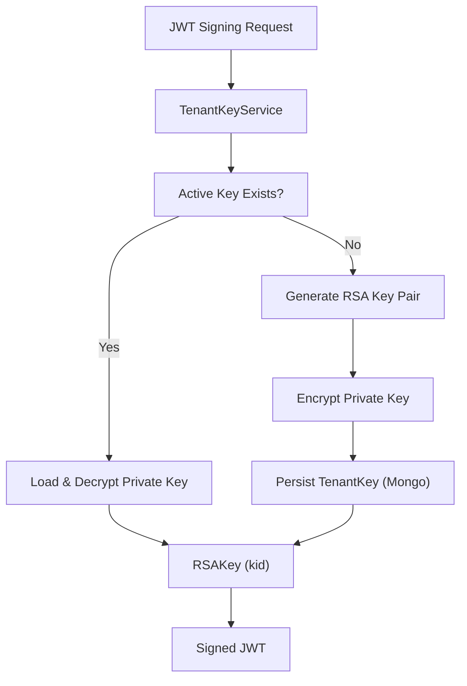
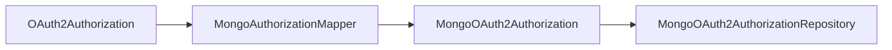
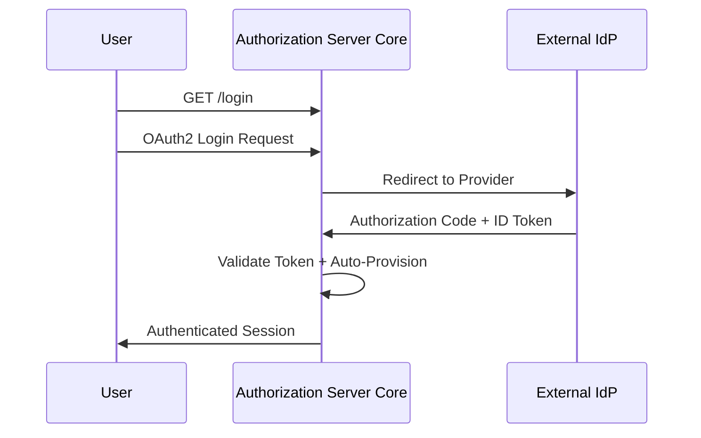

# Authorization Server Core

The **Authorization Server Core** module is the central identity and OAuth2/OIDC provider for the OpenFrame multi-tenant platform. It is responsible for:

- Acting as an OAuth2 Authorization Server (authorization code, refresh token, PKCE)
- Issuing tenant-scoped JWT access tokens
- Managing per-tenant signing keys (RSA / JWKS)
- Handling local authentication (username/password)
- Integrating with external Identity Providers (Google, Microsoft)
- Supporting multi-tenant registration, onboarding, and invitation-based flows

This module is built on **Spring Authorization Server** and **Spring Security**, extended with tenant awareness and Mongo-backed persistence.

---

## 1. Architectural Overview

The Authorization Server Core sits between end-users, external IdPs, and downstream services such as the Gateway and API services.

### Responsibilities in the Platform

- **Issues JWT access tokens** consumed by Gateway and API layers.
- **Publishes per-tenant JWKS** for signature validation.
- **Manages OAuth2 clients** (Mongo-backed `RegisteredClientRepository`).
- **Stores authorizations and tokens** via `MongoAuthorizationService`.
- **Enforces tenant isolation** through `TenantContext`.

---

## 2. Multi-Tenant Model

Tenant isolation is a first-class concern in this module.

### 2.1 Tenant Resolution

Tenant resolution is handled by:

- `TenantContextFilter`
- `TenantContext`

**Key behavior:**

- Extracts tenant ID from path segments like `/{tenant}/oauth2/...`
- Falls back to `tenant` query parameter
- Persists tenant in HTTP session
- Ensures thread-local cleanup after each request

This ensures that:

- JWTs are signed with the correct tenant key
- Users are resolved per-tenant
- OAuth2 clients are loaded in a tenant-aware way

---

## 3. Authorization Server Configuration

### 3.1 AuthorizationServerConfig

`AuthorizationServerConfig` configures Spring Authorization Server:

- Enables OAuth2 and OIDC
- Allows multiple issuers (multi-tenant)
- Secures authorization endpoints
- Configures JWT encoder/decoder
- Customizes token claims

### 3.2 JWT Customization

The `OAuth2TokenCustomizer<JwtEncodingContext>` adds tenant-scoped claims:

- `tenant_id`
- `userId`
- `roles`

Role handling includes automatic elevation:

- If `OWNER` → also includes `ADMIN`

This ensures downstream services (Gateway, API) can:

- Authorize by role
- Enforce tenant boundaries
- Perform user-scoped access checks

---

## 4. Tenant-Specific Signing Keys

Each tenant has its own RSA key pair.

### 4.1 Key Lifecycle

Handled by:

- `TenantKeyService`
- `RsaAuthenticationKeyPairGenerator`
- `PemUtil`

Key characteristics:

- Keys stored per tenant in Mongo.
- Private key encrypted via `EncryptionService`.
- `kid` included in JWT header.
- JWKS endpoint dynamically resolves key by tenant.

This enables:

- Cryptographic isolation per tenant
- Safe key rotation patterns
- Independent validation by resource servers

---

## 5. OAuth2 Persistence (Mongo)

### 5.1 MongoRegisteredClientRepository

Implements `RegisteredClientRepository` backed by Mongo:

- Client ID
- Client secret
- Grant types
- Redirect URIs
- Token TTL configuration

### 5.2 MongoAuthorizationService

Implements `OAuth2AuthorizationService`:

- Persists authorization codes
- Persists access tokens
- Persists refresh tokens
- Stores PKCE parameters

Mapping between domain and Mongo documents is handled by:

- `MongoAuthorizationMapper`

Special care is taken to:

- Persist PKCE (`code_challenge`, `code_challenge_method`)
- Rehydrate `OAuth2AuthorizationRequest`
- Maintain token metadata integrity

---

## 6. Local Authentication (Username & Password)

Local authentication is configured in `AuthorizationServerConfig`:

- `UserDetailsService` backed by `UserService`
- `BCryptPasswordEncoder`
- `AuthenticationManager` using `DaoAuthenticationProvider`

User lookup is always:

- Lowercased email
- Scoped by `tenantId`
- Must be active

---

## 7. SSO and External Identity Providers

The module supports dynamic SSO configuration per tenant.

### 7.1 Dynamic Client Registration

`DynamicClientRegistrationRepository` resolves client registrations per tenant and provider.

Supported providers:

- Google
- Microsoft

Strategies:

- `GoogleClientRegistrationStrategy`
- `MicrosoftClientRegistrationStrategy`

### 7.2 OIDC Login Flow

Configured in `SecurityConfig`:

- Custom `OidcUserService`
- Microsoft issuer pattern validation
- Auto-provisioning logic
- Domain-based tenant mapping

### 7.3 Auto-Provisioning

When enabled:

- If user does not exist in tenant
- And provider allows auto-provision
- And email domain matches policy

Then:

- User is created via `UserService`
- `RegistrationProcessor` hooks executed

---

## 8. Registration and Invitation Flows

Controllers:

- `TenantRegistrationController`
- `InvitationRegistrationController`
- `SsoDiscoveryController`
- `TenantDiscoveryController`
- `PasswordResetController`

### 8.1 Tenant Registration

Supports:

- Email/password registration
- SSO-based onboarding
- Access code validation

SSO onboarding uses cookies:

- `of_sso_reg`
- `of_sso_invite`

Handlers:

- `TenantRegSsoHandler`
- `InviteSsoHandler`

### 8.2 Invitation Flow

Invitation-based onboarding:

1. Validate invitation
2. Start SSO or password flow
3. Create or link user
4. Optionally switch tenant context

### 8.3 Password Reset

Handled by:

- `PasswordResetController`
- `PasswordResetService`
- `ResetTokenUtil`

Security constraints:

- Token-based confirmation
- Strong password validation
- Base64 URL-safe reset tokens

---

## 9. Authentication Success Handling

`AuthSuccessHandler`:

- Updates `lastLogin`
- Optionally marks email as verified
- Delegates to SSO success handler

This ensures:

- Accurate audit trail
- Verified email state for trusted IdPs
- Non-blocking login even if side-effects fail

---

## 10. Extension Points

The module is designed for extensibility:

### 10.1 Registration Hooks

- `RegistrationProcessor`
- `UserDeactivationProcessor`
- `UserEmailVerifiedProcessor`

Default implementations are no-op and can be overridden.

### 10.2 Domain Policy

- `GlobalDomainPolicyLookup`
- Default: `NoopGlobalDomainPolicyLookup`

Allows domain-to-tenant mapping for enterprise onboarding.

---

## 11. Security Characteristics

- ✅ Per-tenant signing keys
- ✅ PKCE support
- ✅ Refresh token support
- ✅ BCrypt password hashing
- ✅ Encrypted private key storage
- ✅ Thread-local tenant isolation
- ✅ Strict Microsoft issuer validation
- ✅ Auto-provision guarded by domain policy

---

# Summary

The **Authorization Server Core** module provides a fully multi-tenant, extensible OAuth2 and OIDC authorization server for OpenFrame.

It combines:

- Spring Authorization Server
- Tenant-aware key management
- Mongo-backed persistence
- Dynamic SSO provider integration
- Flexible onboarding and invitation flows

This module forms the cryptographic and identity backbone of the platform, enabling secure, tenant-isolated authentication across Gateway, API, and management services.
