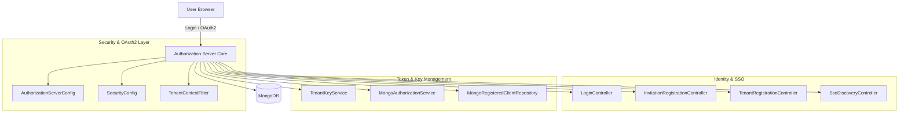
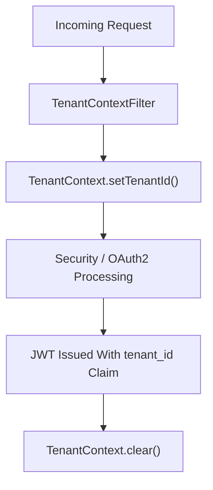
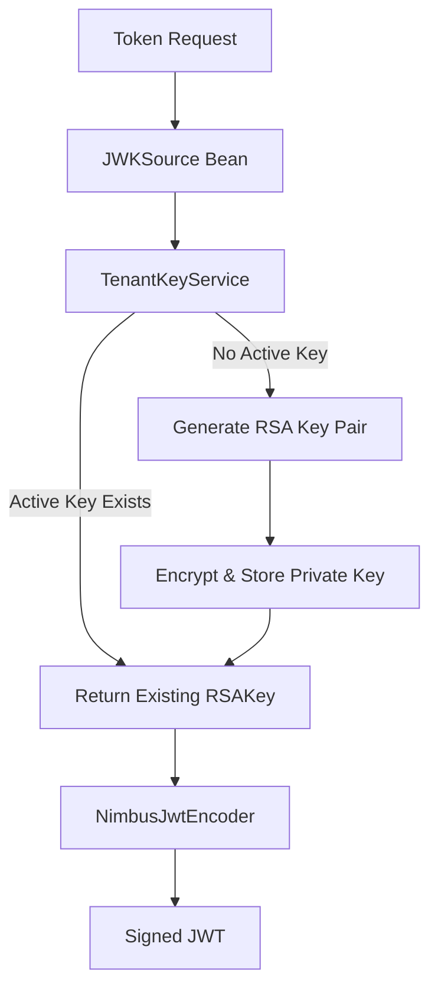
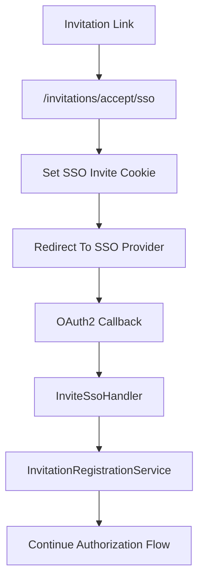

# Authorization Server Core

The **Authorization Server Core** module provides the multi-tenant OAuth2 and OpenID Connect (OIDC) infrastructure for the OpenFrame platform.  
It is responsible for:

- Acting as an OAuth2 Authorization Server (Spring Authorization Server based)
- Issuing tenant-scoped JWT access and refresh tokens
- Managing per-tenant RSA signing keys (JWKS)
- Handling login (form + SSO via Google and Microsoft)
- Supporting tenant onboarding and invitation-based registration
- Enforcing tenant isolation at the security layer

This module is a central security boundary in the platform and integrates with:

- Mongo-based domain and repository modules (for users, tenants, OAuth data)
- Gateway services (for JWT validation and routing)
- API services (as resource servers validating issued JWTs)

---

## 1. High-Level Architecture

At runtime, the Authorization Server Core operates as a standalone Spring Boot application (via the `OpenFrameAuthorizationServerApplication` in the runtime module) and exposes:

- OAuth2 endpoints (`/oauth2/authorize`, `/oauth2/token`, etc.)
- OIDC discovery and JWKS endpoints
- Login and SSO endpoints
- Tenant discovery and registration APIs
- Invitation and password reset APIs

### 1.1 Component Overview

The module is structured into the following logical areas:

1. **OAuth2 Authorization Server configuration**  
2. **Default security (form login + SSO)**  
3. **Tenant resolution and isolation**  
4. **Token persistence and PKCE support**  
5. **Per-tenant signing key management**  
6. **Registration, invitation, and onboarding flows**

---

## 2. Multi-Tenancy Model

Multi-tenancy is enforced at the security and token layers.

### 2.1 Tenant Resolution

Core classes:

- `TenantContext`
- `TenantContextFilter`

`TenantContext` uses a `ThreadLocal` to store the current tenant ID during request processing.

`TenantContextFilter`:

- Extracts tenant ID from:
  - Path segments (e.g. `/sas/{tenantId}/oauth2/...`)
  - Query parameters (`tenant=...`)
  - HTTP session
- Stores it in both:
  - `TenantContext`
  - HTTP session attribute (`TENANT_ID`)
- Handles safe tenant switching (including onboarding tenant flows)

### 2.2 Tenant-Aware Flow

All downstream components (user lookup, key selection, client registration) rely on `TenantContext.getTenantId()`.

---

## 3. OAuth2 & OIDC Configuration

### 3.1 AuthorizationServerConfig

`AuthorizationServerConfig` configures Spring Authorization Server:

- Enables OAuth2 and OIDC endpoints
- Allows multiple issuers (`multipleIssuersAllowed(true)`)
- Configures JWT encoder/decoder
- Customizes access token claims

#### 3.1.1 Token Customization

The `OAuth2TokenCustomizer<JwtEncodingContext>`:

- Loads the active `AuthUser` per tenant
- Adds custom claims to access tokens:
  - `tenant_id`
  - `userId`
  - `roles`
- Ensures OWNER implies ADMIN
- Updates `lastLogin` on refresh flows

Resulting access tokens are tenant-scoped and role-aware.

### 3.2 Registered Clients (Mongo)

`MongoRegisteredClientRepository` implements `RegisteredClientRepository` and:

- Persists OAuth2 clients in MongoDB
- Maps between Spring `RegisteredClient` and `MongoRegisteredClient`
- Supports:
  - Multiple grant types
  - PKCE
  - Configurable TTL for access and refresh tokens

### 3.3 Authorization Persistence

`MongoAuthorizationService` + `MongoAuthorizationMapper`:

- Persist `OAuth2Authorization` objects
- Store:
  - Authorization codes
  - Access tokens
  - Refresh tokens
  - PKCE metadata (`code_challenge`, `code_challenge_method`)
- Rehydrate full authorization state on token exchange

This enables robust support for:

- Authorization Code Flow
- PKCE (public clients)
- Refresh token rotation

---

## 4. Per-Tenant JWT Signing Keys

Each tenant has its own RSA signing key.

Core classes:

- `TenantKeyService`
- `RsaAuthenticationKeyPairGenerator`
- `PemUtil`

### 4.1 Key Lifecycle

Key characteristics:

- One active key per tenant
- Private key encrypted before storage
- Public key exposed via JWKS endpoint
- `kid` used for key identification

This ensures:

- Cryptographic isolation between tenants
- Safe key rotation support
- Clear separation of trust domains

---

## 5. Default Security Configuration (Form + SSO)

`SecurityConfig` defines the second `SecurityFilterChain` for non-OAuth endpoints.

### 5.1 Public Endpoints

Permits:

- `/login`
- `/oauth/**`
- `/invitations/**`
- `/password-reset/**`
- `/tenant/**`
- `/.well-known/**`
- `/sso/providers/**`

All other endpoints require authentication.

### 5.2 Form Login

- Custom login page (`LoginController`)
- `AuthSuccessHandler` updates:
  - `lastLogin`
  - `emailVerified` (when appropriate)

### 5.3 OAuth2 Login (SSO)

Supported providers:

- Google
- Microsoft

Core components:

- `DynamicClientRegistrationRepository`
- `GoogleClientRegistrationStrategy`
- `MicrosoftClientRegistrationStrategy`
- `GoogleDefaultProviderConfig`
- `MicrosoftDefaultProviderConfig`

#### Microsoft Issuer Validation

A custom `JwtDecoderFactory` validates Microsoft multi-tenant issuer patterns:

- Accepts issuer matching Microsoft tenant-specific pattern
- Prevents invalid or malicious issuer spoofing

---

## 6. Registration & Onboarding Flows

The module supports multiple onboarding paths:

1. Direct tenant registration (email + password)
2. SSO-based tenant registration
3. Invitation-based registration (password)
4. Invitation-based SSO acceptance

### 6.1 Tenant Registration

Controller: `TenantRegistrationController`

- `POST /oauth/register`
- `GET /oauth/register/sso`

SSO flow uses:

- Secure cookies (`of_sso_reg`)
- Temporary onboarding tenant (`sso-onboarding`)
- Redirect continuation into OAuth2 authorization flow

### 6.2 Invitation Acceptance

Controller: `InvitationRegistrationController`

- `POST /invitations/accept`
- `GET /invitations/accept/sso`

SSO invitation flow:

Cookies are:

- HTTP-only
- Secure
- Time-limited

### 6.3 Password Reset

Controller: `PasswordResetController`

- `POST /password-reset/request`
- `POST /password-reset/confirm`

`ResetTokenUtil`:

- Generates 256-bit URL-safe tokens
- Enforces strong password validation

---

## 7. Tenant & SSO Discovery

### 7.1 Tenant Discovery

`TenantDiscoveryController`:

- `GET /tenant/discover?email=...`
- Returns:
  - Whether account exists
  - Tenant ID
  - Available auth providers

### 7.2 SSO Provider Discovery

`SsoDiscoveryController`:

- `GET /sso/providers/invite`
- `GET /sso/providers/registration`

This enables dynamic frontend behavior:

- Show Google/Microsoft buttons per tenant
- Support system-wide default providers

---

## 8. Extensibility Hooks

The module provides extension points:

- `RegistrationProcessor`
- `UserDeactivationProcessor`
- `UserEmailVerifiedProcessor`
- `GlobalDomainPolicyLookup`

Default implementations are no-ops, allowing integrators to:

- Trigger external provisioning
- Enforce domain-based policies
- Integrate with messaging systems
- Synchronize user state to other services

---

## 9. Security Characteristics

The Authorization Server Core enforces:

- Strict tenant isolation
- Per-tenant signing keys
- PKCE support for public clients
- Encrypted private key storage
- Secure cookie usage
- Issuer validation for Microsoft SSO
- Role propagation inside JWTs

Each issued JWT contains:

- `tenant_id`
- `userId`
- `roles`

Downstream services (Gateway, API, Stream processors) validate these tokens to enforce authorization decisions.

---

## 10. Position in the Overall Platform

Within the broader OpenFrame architecture:

- The **Authorization Server Core** issues tokens.
- Gateway services validate tokens and route traffic.
- API services act as resource servers.
- Mongo-based data modules store users, tenants, OAuth clients, and authorizations.

It acts as the **root of trust** for identity and access management across all tenant-scoped services.

---

# Summary

The **Authorization Server Core** is a multi-tenant, OAuth2-compliant identity provider that:

- Isolates tenants cryptographically and logically
- Supports both password and SSO authentication
- Manages dynamic client registrations
- Persists full OAuth2 authorization state with PKCE
- Enables flexible onboarding and invitation flows

It forms the foundation of secure, tenant-aware identity across the OpenFrame platform.