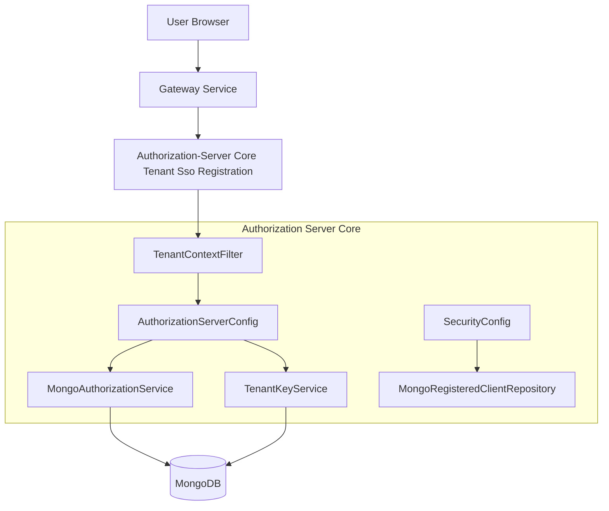
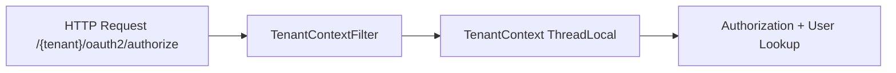
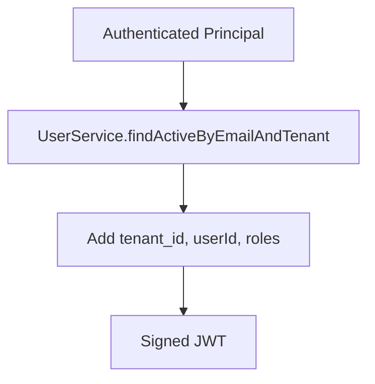
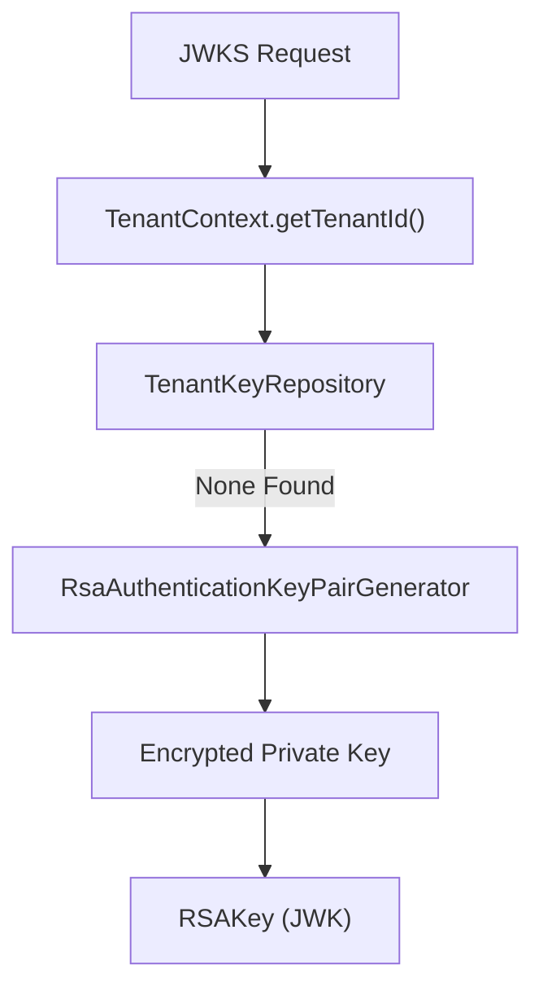
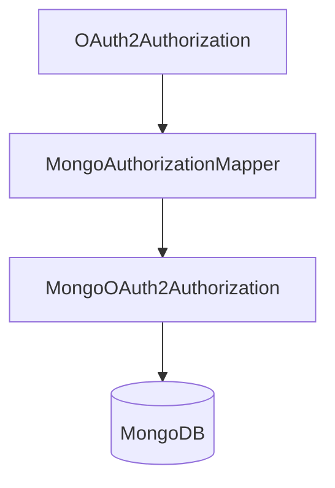
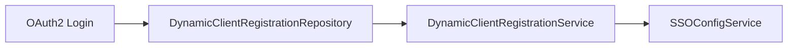
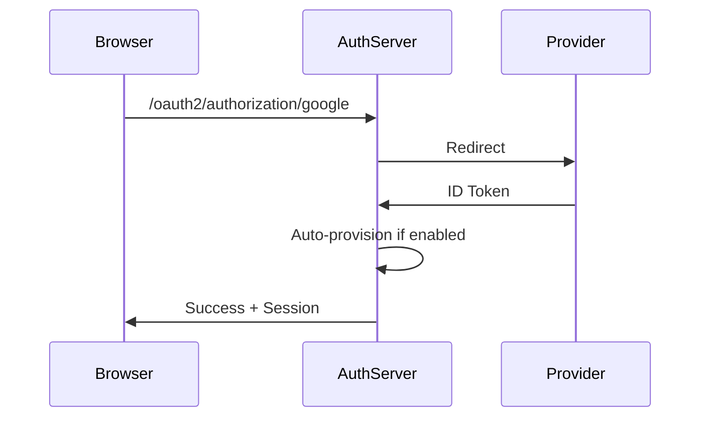
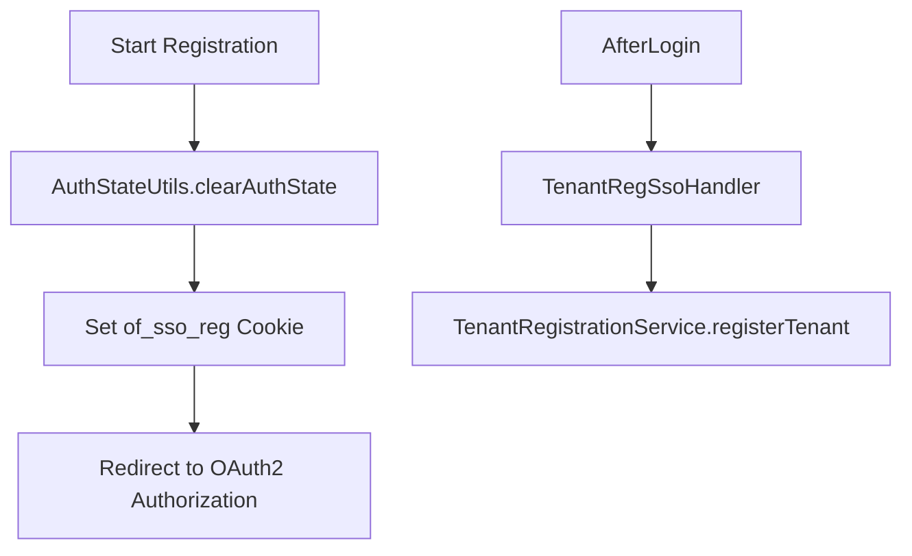
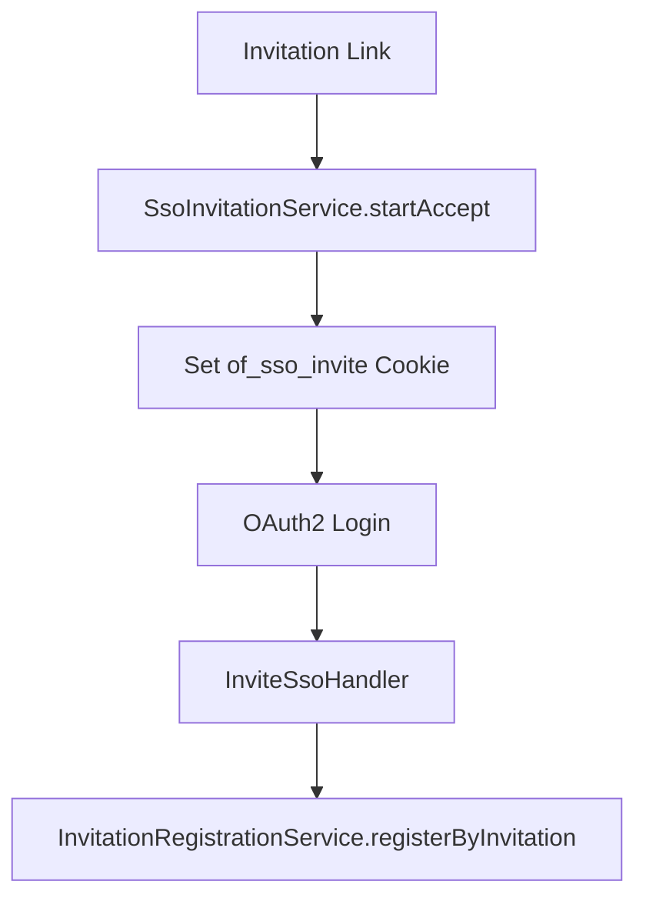
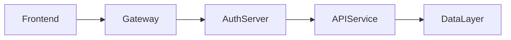

# Authorization-Server Core Tenant Sso Registration

## Overview

The **Authorization-Server Core Tenant Sso Registration** module is the heart of OpenFrame’s multi-tenant identity layer. It implements:

- A **Spring Authorization Server** (OAuth2 + OIDC)
- **Per-tenant JWT signing keys** and issuer handling
- **Dynamic SSO provider registration** (Google, Microsoft)
- **Tenant onboarding and invitation-based registration flows**
- **Mongo-backed authorization persistence** (codes, tokens, PKCE state)

This module is responsible for secure authentication, token issuance, and SSO-driven tenant lifecycle flows across the platform.

It works closely with:
- Data layer (Mongo documents and repositories)
- Security OAuth JWT BFF module
- Gateway Service for downstream JWT validation

---

## High-Level Architecture

### Core Responsibilities

1. **Tenant Resolution** – Determine tenant from request path, query, or session.
2. **Issuer Multiplexing** – Support multiple issuers (one per tenant).
3. **Per-Tenant Key Management** – Generate and serve RSA keys per tenant.
4. **OAuth2/OIDC Flows** – Authorization Code, Refresh Token, PKCE.
5. **SSO Flows** – Dynamic Google & Microsoft registration.
6. **Onboarding & Invitations** – SSO-backed tenant and user creation.

---

## Multi-Tenant Model

Tenant isolation is enforced via `TenantContext` and `TenantContextFilter`.

### Tenant Resolution Sources

- URL prefix: `/{tenantId}/oauth2/...`
- Query parameter: `?tenant=...`
- HTTP session attribute

The resolved tenant ID is stored in a `ThreadLocal` via `TenantContext` and cleared after request completion.

---

## Authorization Server Configuration

### AuthorizationServerConfig

This class configures Spring Authorization Server:

- Enables **OIDC support**
- Allows **multiple issuers**
- Uses per-tenant `JWKSource`
- Customizes JWT claims

### Token Customization

Access tokens include:

- `tenant_id`
- `userId`
- `roles`

If a user has `OWNER`, `ADMIN` is automatically added as an effective role.

---

## Per-Tenant Key Management

### TenantKeyService

Each tenant has its own RSA key pair used for signing tokens.

Keys are:

- Generated at 2048 bits
- Stored in Mongo
- Private key encrypted via `EncryptionService`
- Served dynamically via `JWKSource`

This enables strict tenant cryptographic isolation.

---

## OAuth2 Authorization Persistence

### MongoAuthorizationService

Stores:

- Authorization codes
- Access tokens
- Refresh tokens
- PKCE metadata

PKCE parameters are carefully preserved during:

- Authorization request snapshot
- Code metadata persistence
- Domain reconstruction

This ensures compatibility with public clients and BFF flows.

---

## Dynamic SSO Client Registration

### DynamicClientRegistrationRepository

Client registrations are resolved dynamically per tenant.

Supported providers:

- Google
- Microsoft

Strategies:
- `GoogleClientRegistrationStrategy`
- `MicrosoftClientRegistrationStrategy`

Default provider configurations are injected via `GoogleDefaultProviderConfig` and `MicrosoftDefaultProviderConfig`.

---

## SSO Auto-Provisioning

When users authenticate via OIDC:

1. Email is resolved from claims.
2. Tenant SSO configuration is checked.
3. If auto-provisioning is enabled:
   - User is created if not present.
   - Roles default to `ADMIN`.
   - `RegistrationProcessor` hooks execute.

Global domain mapping can be customized via `GlobalDomainPolicyLookup`.

---

## Tenant Registration Flows

### 1. Password-Based Tenant Registration

`POST /oauth/register`

Creates:
- Tenant
- Initial owner user

Hooks:
- `RegistrationProcessor.preProcessTenantRegistration`
- `RegistrationProcessor.postProcessTenantRegistration`

---

### 2. SSO-Based Tenant Registration

`GET /oauth/register/sso`

Flow:

Uses onboarding pseudo-tenant: `sso-onboarding`.

---

## Invitation-Based Registration

### InvitationRegistrationController

Two flows:

1. JSON-based registration
2. SSO-based acceptance

SSO invite flow:

Cookies are:
- HTTP-only
- Secure
- Short-lived

---

## Password Reset

Endpoints:

- `POST /password-reset/request`
- `POST /password-reset/confirm`

Tokens:
- Generated via `ResetTokenUtil`
- URL-safe Base64
- 32-byte secure random

Password policy:
- Minimum 8 characters
- Uppercase, lowercase, digit, special character

---

## Authentication Success Handling

`AuthSuccessHandler`:

- Updates `lastLogin`
- Marks email verified if asserted by trusted IdP
- Delegates to SSO success handlers

This ensures consistent auditability and state updates.

---

## Security Model Summary

| Layer | Responsibility |
|--------|---------------|
| TenantContextFilter | Tenant isolation |
| AuthorizationServerConfig | OAuth2/OIDC setup |
| SecurityConfig | Login + SSO flows |
| TenantKeyService | Per-tenant signing keys |
| MongoAuthorizationService | Token persistence |
| AuthSuccessHandler | Post-auth lifecycle |

---

## How It Fits in the Platform

- The Gateway validates JWTs issued by this module.
- API services rely on `tenant_id` and `roles` claims.
- Management and external APIs trust tokens signed per tenant.

---

## Key Design Principles

- ✅ Strict tenant isolation
- ✅ Per-tenant cryptographic boundaries
- ✅ Pluggable SSO providers
- ✅ PKCE-safe persistence
- ✅ Extensible registration hooks
- ✅ Non-blocking provisioning logic

---

## Conclusion

The **Authorization-Server Core Tenant Sso Registration** module provides a robust, extensible, and secure multi-tenant identity system for OpenFrame.

It combines:

- Modern OAuth2 + OIDC standards
- Dynamic SSO provider resolution
- Tenant-aware security enforcement
- Persistent and PKCE-safe token management
- Flexible onboarding and invitation flows

This module is foundational to OpenFrame’s secure, multi-tenant architecture and enables scalable identity management across the entire platform.
