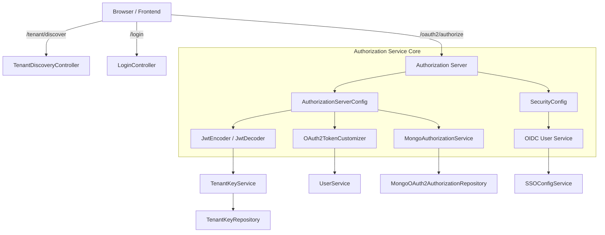
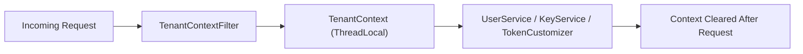
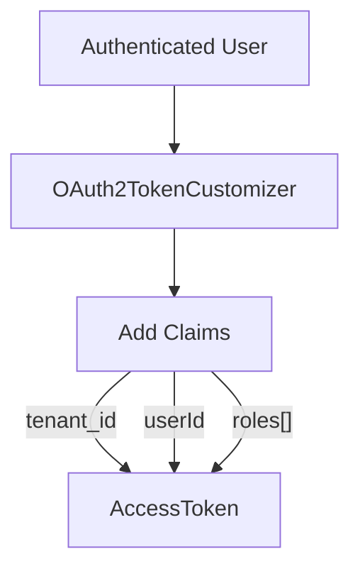
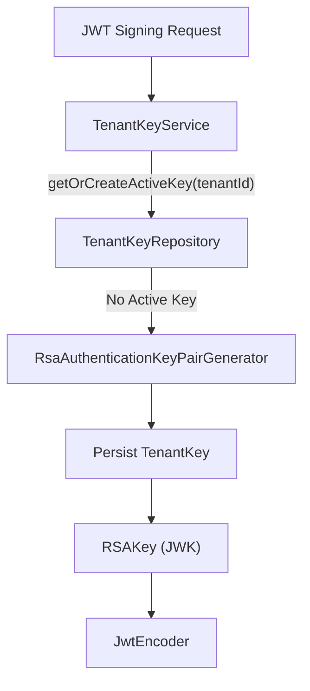
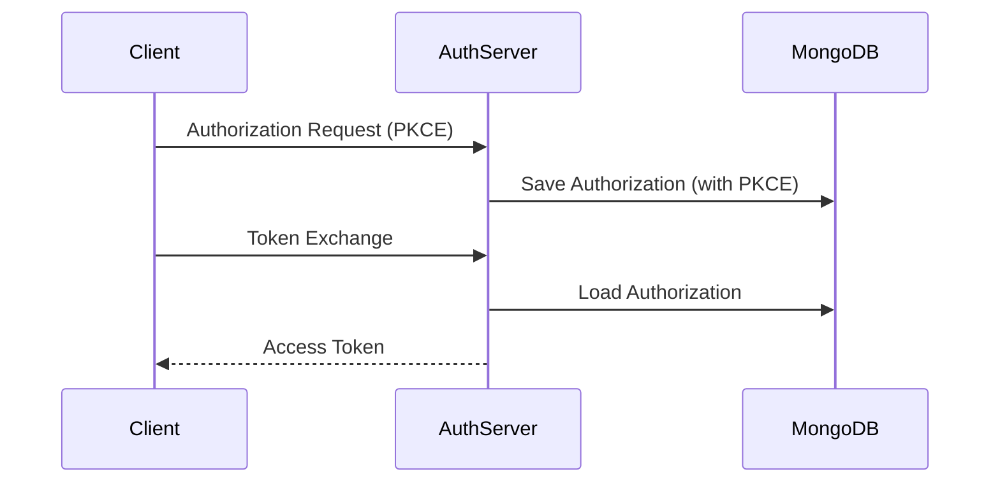
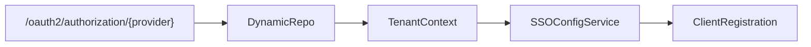

# Authorization Service Core

The **Authorization Service Core** module is the heart of OpenFrame’s multi-tenant identity and access management layer. It implements a fully multi-tenant OAuth2 Authorization Server with OpenID Connect (OIDC) support, dynamic SSO provider registration, tenant-aware key management, and MongoDB-backed token persistence.

This module powers the `OpenFrameAuthorizationServerApplication` and integrates with:

- Data persistence via MongoDB (users, tenants, OAuth2 clients, tokens)
- SSO providers such as Google and Microsoft
- The Gateway Service Core for downstream JWT validation
- Frontend and API services for login, registration, and tenant discovery flows

---

## 1. High-Level Responsibilities

The Authorization Service Core is responsible for:

- ✅ Multi-tenant OAuth2 Authorization Server (Spring Authorization Server)
- ✅ OIDC login with dynamic per-tenant SSO providers
- ✅ Tenant-aware JWT signing keys
- ✅ Token issuance with custom claims (tenant, roles, userId)
- ✅ MongoDB persistence of OAuth2 authorizations and clients
- ✅ Tenant onboarding and invitation-based registration
- ✅ Password reset and email verification support
- ✅ Auto-provisioning users via SSO domain policies

---

## 2. Architecture Overview

### Key Design Characteristics

- **Strict tenant isolation** via `TenantContext` and `TenantContextFilter`
- **Per-tenant signing keys** using `TenantKeyService`
- **Mongo-backed authorization persistence** for access tokens, refresh tokens, and authorization codes
- **Dynamic client registration** per tenant and provider
- **Dual security chains** (Authorization Server endpoints vs default endpoints)

---

## 3. Multi-Tenancy Model

Multi-tenancy is implemented using:

### 3.1 TenantContext

`TenantContext` is a `ThreadLocal` container that stores the active tenant ID for the duration of a request.

### 3.2 Tenant Resolution Strategy

`TenantContextFilter` resolves tenant ID from:

1. URL path prefix (e.g. `/sas/{tenantId}/oauth2/authorize`)
2. Query parameter `tenant`
3. HTTP session attribute `TENANT_ID`

Special handling exists for onboarding flows using:

- `ONBOARDING_TENANT_ID = "sso-onboarding"`

This allows safe transition from onboarding pseudo-tenant to a real tenant.

---

## 4. OAuth2 Authorization Server

### 4.1 AuthorizationServerConfig

`AuthorizationServerConfig` configures Spring Authorization Server with:

- OIDC support enabled
- Multiple issuers allowed (multi-tenant)
- JWT-based resource server support
- Custom `OAuth2TokenCustomizer`

### 4.2 Token Customization

The `OAuth2TokenCustomizer` enriches access tokens with:

- `tenant_id`
- `userId`
- `roles`

Role escalation rule:

- If a user has `OWNER`, they automatically receive `ADMIN`

This ensures downstream services (e.g., Gateway Service Core) can authorize requests using tenant-aware JWT claims.

---

## 5. JWT and Tenant Key Management

### 5.1 TenantKeyService

Each tenant has its own RSA key pair.

Responsibilities:

- Generate 2048-bit RSA key pair
- Store encrypted private key in MongoDB
- Expose active key as JWK
- Support key rotation (single active key enforced)

### 5.2 JWKSource

The `JWKSource` bean dynamically resolves the signing key based on `TenantContext.getTenantId()`.

If no tenant is resolved, the request fails.

---

## 6. MongoDB-Backed Authorization Persistence

### 6.1 MongoAuthorizationService

Implements `OAuth2AuthorizationService` and stores:

- Authorization codes
- Access tokens
- Refresh tokens
- PKCE metadata
- OAuth2AuthorizationRequest snapshot

### 6.2 PKCE Handling

`MongoAuthorizationMapper` ensures:

- `code_challenge`
- `code_challenge_method`

are preserved across persistence and reconstruction.

---

## 7. Dynamic SSO Integration

### 7.1 SecurityConfig (Default Security Chain)

Handles:

- `/login`
- `/oauth2/**`
- `/invitations/**`
- `/tenant/**`
- `/password-reset/**`

Includes:

- Form login
- OIDC login
- Microsoft issuer pattern validation
- Custom success and failure handlers

### 7.2 DynamicClientRegistrationRepository

Resolves `ClientRegistration` dynamically per tenant and provider:

If tenant is missing, OAuth flow fails safely.

### 7.3 OIDC Auto-Provisioning

`oidcUserService()` supports:

- Domain-based auto-provision
- SSO config per tenant
- Optional global domain mapping

If enabled:

- Creates user
- Assigns `ADMIN` role
- Calls `RegistrationProcessor.postProcessAutoProvision()`

---

## 8. Registration and Onboarding Flows

### 8.1 Tenant Registration

- `TenantRegistrationController`
- Supports password-based and SSO-based onboarding
- Uses short-lived secure cookies (`of_sso_reg`)

### 8.2 Invitation Registration

- `InvitationRegistrationController`
- Accept invitation via password or SSO
- Uses secure cookie `of_sso_invite`

### 8.3 SSO Flow Handlers

Two specialized handlers:

- `TenantRegSsoHandler`
- `InviteSsoHandler`

They:

- Decode secure HMAC cookies
- Create user/tenant
- Clear flow cookie
- Redirect to OAuth continuation

---

## 9. Password Reset

`PasswordResetController` exposes:

- `POST /password-reset/request`
- `POST /password-reset/confirm`

`ResetTokenUtil` generates 32-byte secure URL-safe tokens.

Password policy (via DTO validation):

- Minimum 8 characters
- Uppercase + lowercase
- Digit
- Special character

---

## 10. Authentication Success Handling

`AuthSuccessHandler`:

- Updates `lastLogin`
- Marks email verified for trusted providers (Google, Microsoft)
- Delegates to SSO registration success handler

This ensures:

- Consistent audit data
- Seamless onboarding transitions

---

## 11. Client Registration Persistence

`MongoRegisteredClientRepository` maps between:

- Spring `RegisteredClient`
- Mongo `MongoRegisteredClient`

Supports:

- Grant types
- PKCE requirement
- Token TTL configuration
- Redirect URIs
- Scopes

---

## 12. Integration with Other Modules

The Authorization Service Core interacts with:

- Data Mongo Core (users, tenants, OAuth2 documents)
- Security JWT Core (shared JWT validation concepts)
- Gateway Service Core (JWT verification for APIs)
- Frontend API Clients (AuthApiClient for login & discovery)

It acts as the **central identity authority** for the entire OpenFrame platform.

---

# Summary

The Authorization Service Core is a:

- ✅ Multi-tenant OAuth2 Authorization Server
- ✅ Dynamic OIDC provider manager
- ✅ Tenant-aware JWT issuer
- ✅ Mongo-backed token persistence engine
- ✅ Registration & onboarding orchestrator

It ensures secure, isolated, extensible authentication across all OpenFrame services while enabling:

- Flexible SSO
- Per-tenant identity boundaries
- Secure key management
- Enterprise-ready onboarding flows

This module forms the foundation of identity and access control across the OpenFrame ecosystem.
