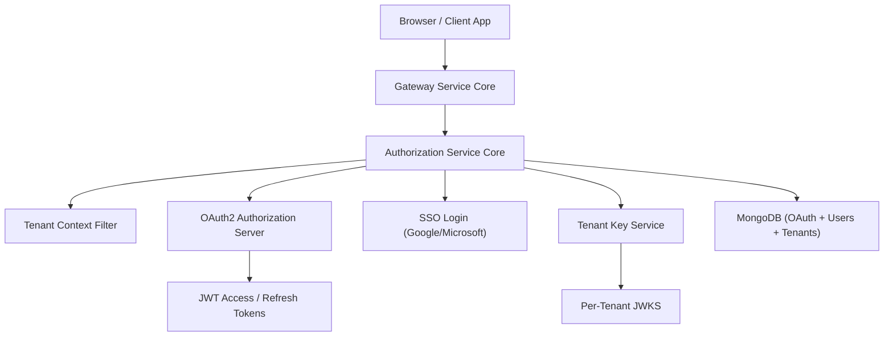
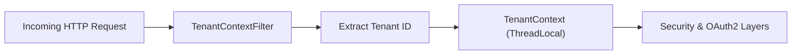
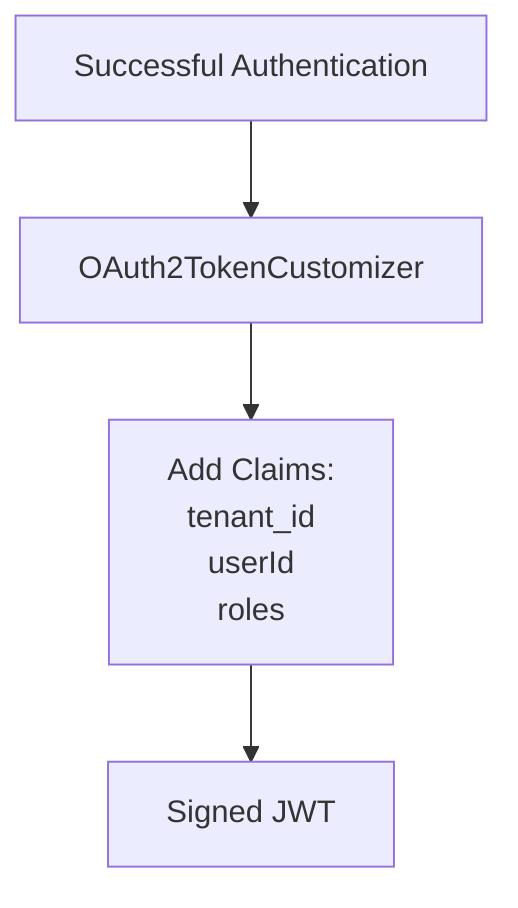
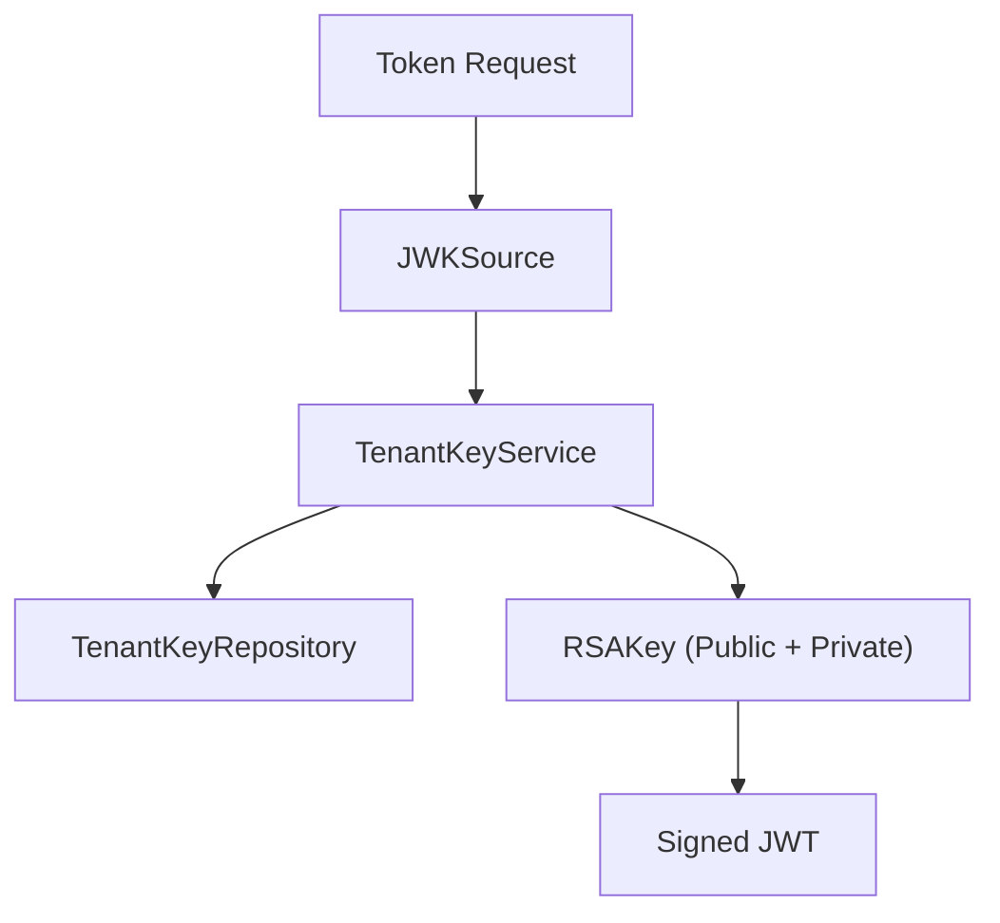
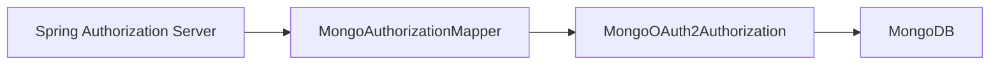
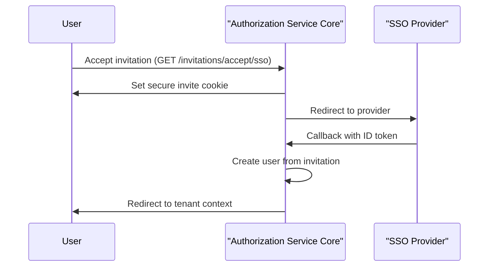
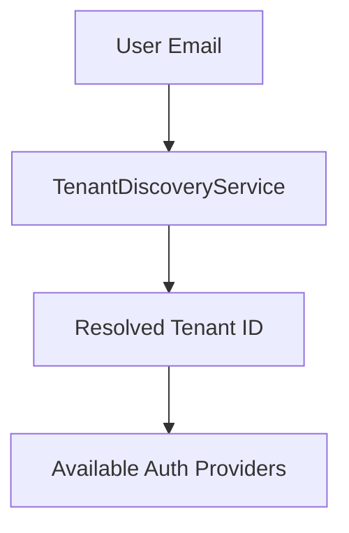
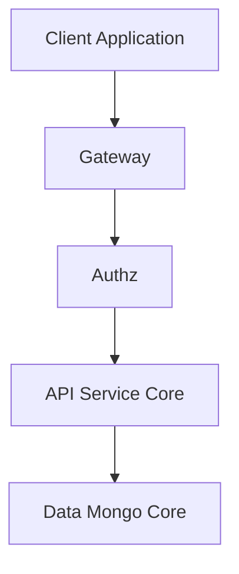

# Authorization Service Core

The **Authorization Service Core** module implements OpenFrame’s multi-tenant OAuth2 / OpenID Connect (OIDC) Authorization Server. It is responsible for:

- Issuing OAuth2 access and refresh tokens
- Acting as an OpenID Connect provider
- Managing tenant-aware authentication
- Supporting SSO (Google, Microsoft)
- Handling tenant onboarding and invitation flows
- Managing per-tenant signing keys

It is the security backbone of the OpenFrame platform and integrates closely with:

- [API Service Core](../api-service-core/api-service-core.md)
- [Gateway Service Core](../gateway-service-core/gateway-service-core.md)
- [Data Mongo Core](../data-mongo-core/data-mongo-core.md)
- [Security OAuth Core](../security-oauth-core/security-oauth-core.md)

---

## 1. Architectural Overview

The Authorization Service Core is built on **Spring Authorization Server** and extends it with:

- Multi-tenant resolution
- Dynamic client registration
- MongoDB-backed authorization persistence
- Per-tenant RSA signing keys
- Advanced SSO onboarding flows

### High-Level Architecture

---

## 2. Multi-Tenant Model

Multi-tenancy is enforced at the **security filter layer**.

### Tenant Resolution

The `TenantContextFilter`:

- Extracts tenant ID from:
  - URL path segments
  - Query parameter `tenant`
  - HTTP session
- Stores tenant ID in a thread-local via `TenantContext`
- Ensures tenant isolation across all security flows

This design ensures:

- Tokens are signed per tenant
- Users are resolved per tenant
- SSO configurations are tenant-scoped

---

## 3. OAuth2 Authorization Server Configuration

Implemented in:

- `AuthorizationServerConfig`

Key responsibilities:

- Enables OpenID Connect
- Supports multiple issuers
- Configures JWT encoder/decoder
- Adds custom claims to access tokens
- Uses per-tenant JWK source

### Token Customization

The `OAuth2TokenCustomizer` injects:

- `tenant_id`
- `userId`
- `roles`

If a user has `OWNER`, `ADMIN` is implicitly added.

---

## 4. Per-Tenant Key Management

Signing keys are managed by:

- `TenantKeyService`
- `RsaAuthenticationKeyPairGenerator`
- `PemUtil`

### Behavior

- Each tenant has an active RSA key
- If no key exists → generate new key
- Private keys are encrypted at rest
- Public keys exposed via JWKS endpoint

This guarantees **cryptographic isolation between tenants**.

---

## 5. Mongo-Based Authorization Persistence

The module replaces in-memory storage with MongoDB using:

- `MongoAuthorizationService`
- `MongoAuthorizationMapper`
- `MongoRegisteredClientRepository`

Stored artifacts include:

- Authorization codes
- Access tokens
- Refresh tokens
- PKCE parameters
- OAuth2AuthorizationRequest snapshots

PKCE parameters are preserved across authorization code exchange, ensuring secure public client flows.

---

## 6. SSO (Google & Microsoft)

SSO support includes:

- Dynamic client resolution per tenant
- Provider-specific JWT validation
- Auto-provisioning users

### Dynamic Client Registration

`DynamicClientRegistrationRepository` resolves:

- Provider (Google/Microsoft)
- Tenant-specific credentials

This allows different tenants to use different SSO configurations.

### Microsoft Multi-Tenant Validation

Custom JWT validation ensures:

- Issuer matches Microsoft multi-tenant pattern
- Standard OIDC validation still enforced

---

## 7. SSO Onboarding & Invitation Flows

Advanced onboarding flows are implemented using:

- `InviteSsoHandler`
- `TenantRegSsoHandler`
- `AuthSuccessHandler`
- Short-lived secure cookies

### Invitation Flow

Cookies are:

- HTTP-only
- Secure
- Short-lived
- HMAC protected

---

## 8. Password Reset

Managed via:

- `PasswordResetController`
- `ResetTokenUtil`

Security properties:

- 32-byte cryptographically secure tokens
- URL-safe Base64 encoding
- Strong password validation rules

---

## 9. Tenant Discovery & Registration

Controllers:

- `TenantDiscoveryController`
- `TenantRegistrationController`
- `SsoDiscoveryController`

These enable:

- Discovering tenant by email
- Checking SSO providers for invitations
- Creating tenants via password or SSO

---

## 10. Security Filter Chains

Two primary filter chains:

1. **Authorization Server Chain (Order 1)**
   - OAuth2 endpoints
   - OIDC endpoints

2. **Default Security Chain (Order 2)**
   - Form login
   - OAuth2 login
   - Public endpoints

This separation ensures OAuth endpoints are handled with highest priority.

---

## 11. How It Fits in the Platform

- The **Gateway Service Core** validates JWTs.
- The **API Service Core** consumes tenant-aware claims.
- The **Data Mongo Core** stores users, tenants, OAuth tokens, and keys.
- The **Security OAuth Core** provides shared security utilities.

The Authorization Service Core acts as the **identity provider and trust root** of the OpenFrame ecosystem.

---

# Summary

The **Authorization Service Core** provides:

- Multi-tenant OAuth2 + OIDC authorization server
- Per-tenant cryptographic key isolation
- MongoDB-backed token persistence
- Dynamic SSO client configuration
- Secure invitation & onboarding flows
- Extensible registration and user lifecycle processors

It is a production-grade, tenant-aware identity system designed specifically for OpenFrame’s distributed microservice architecture.
