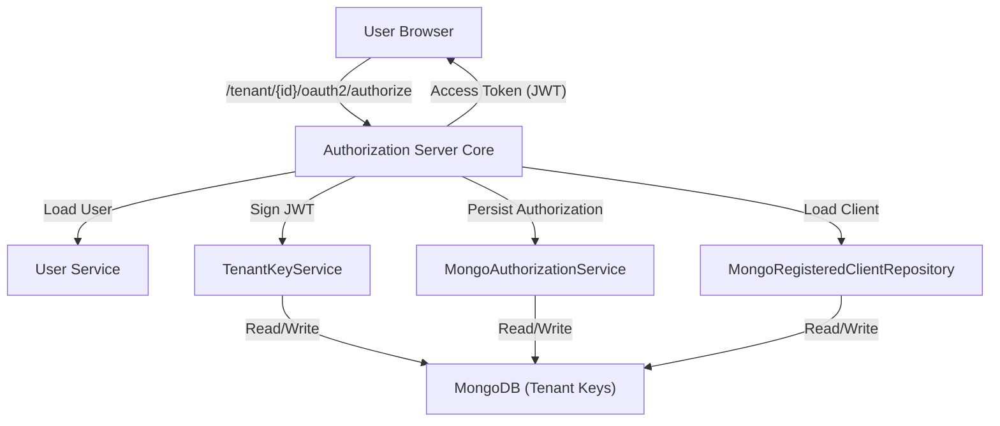
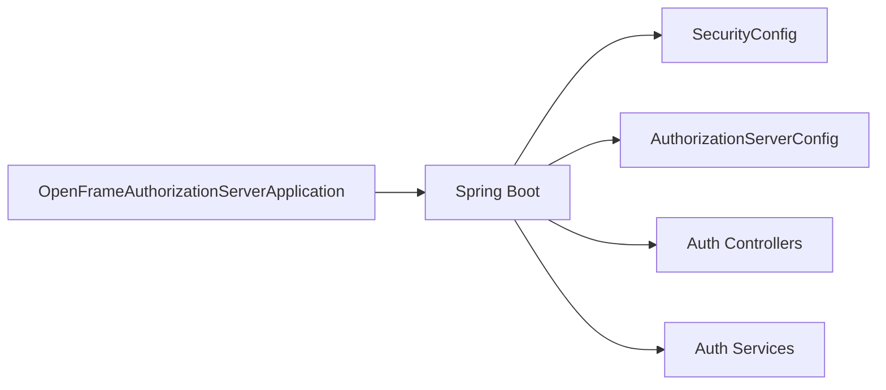
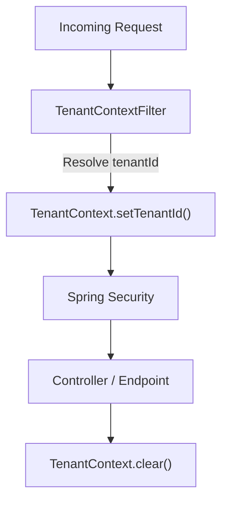
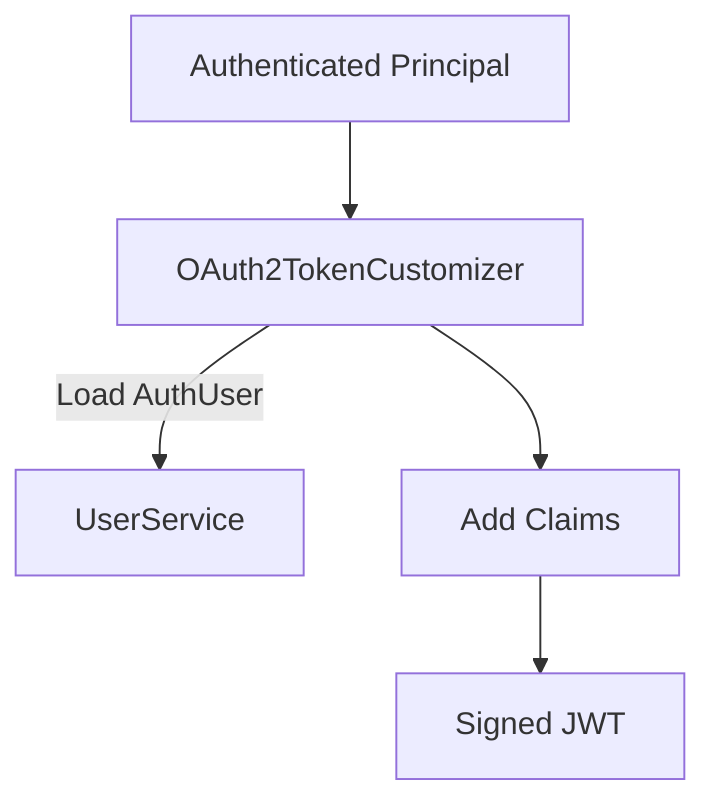
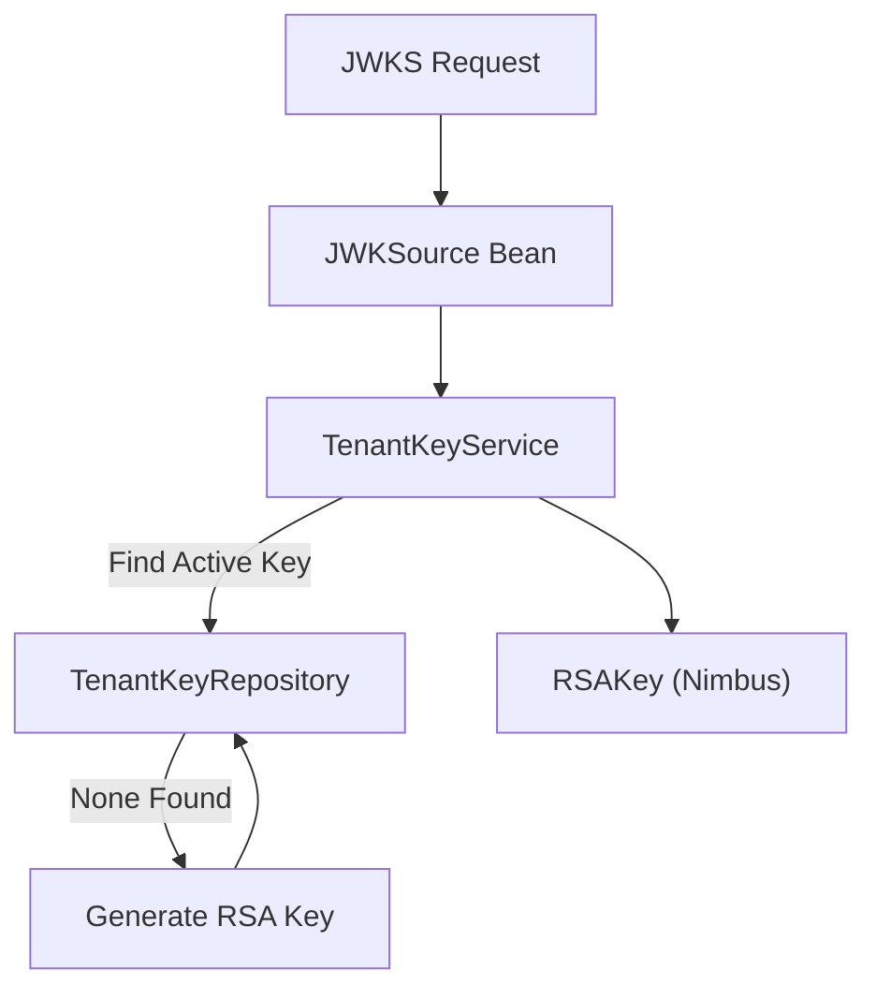
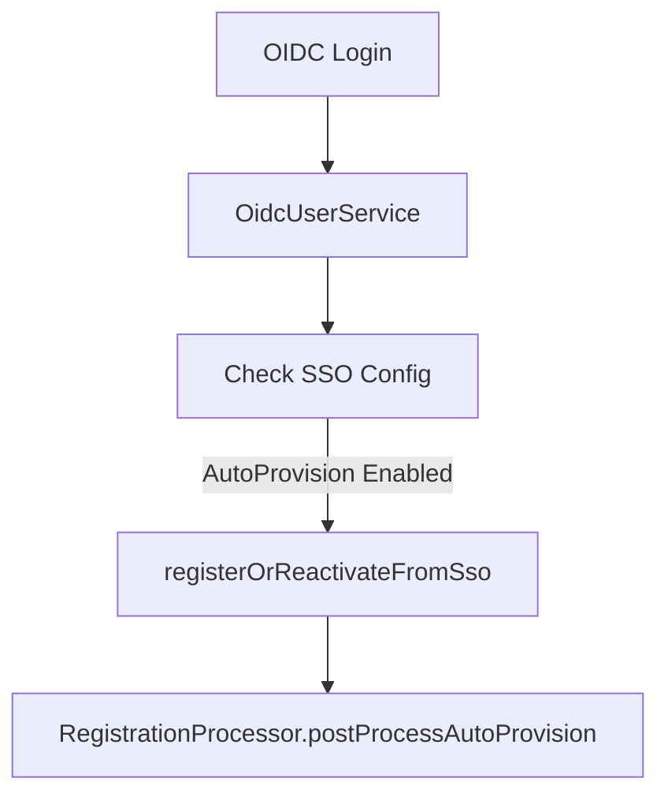
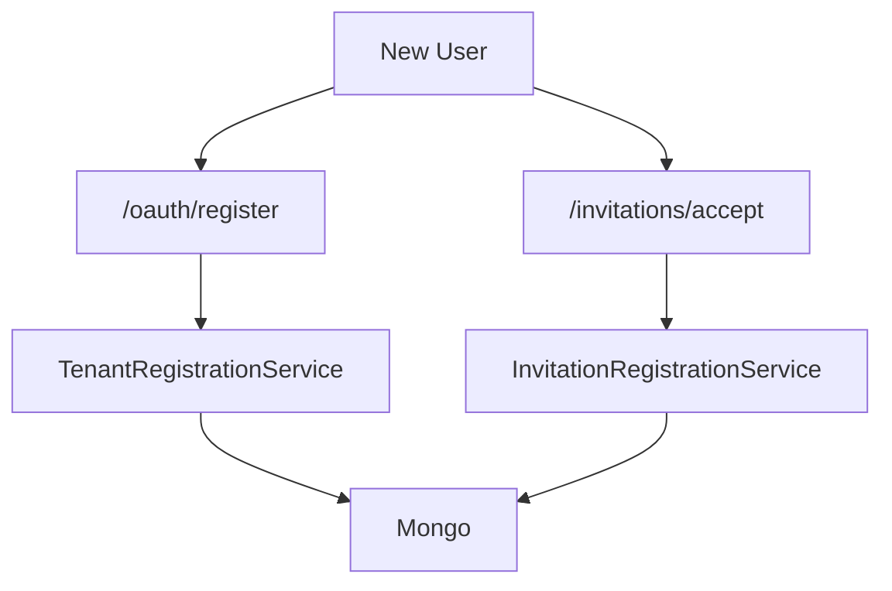
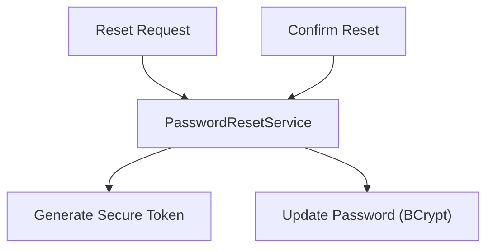

# Authorization Server Core

## Overview

The **Authorization Server Core** module is the central identity and OAuth2/OpenID Connect (OIDC) authority for the OpenFrame multi-tenant platform. It is responsible for:

- Issuing OAuth2 access and refresh tokens
- Managing OpenID Connect flows (authorization code, PKCE, refresh tokens)
- Handling multi-tenant login and tenant discovery
- Supporting SSO providers (Google, Microsoft)
- Managing tenant-scoped signing keys (per-tenant RSA key pairs)
- Providing invitation-based onboarding and password reset flows

This module is built on **Spring Boot**, **Spring Security**, and **Spring Authorization Server**, and persists state in MongoDB via the shared data layer.

It integrates closely with:

- [API Service Core](../api_service_core/api_service_core.md)
- [Gateway Service Core](../gateway_service_core/gateway_service_core.md)
- [Data Persistence and Messaging Core](../data_persistence_and_messaging_core/data_persistence_and_messaging_core.md)

---

## High-Level Architecture

The Authorization Server Core operates as a tenant-aware OAuth2/OIDC provider.

### Key Characteristics

- **Multi-issuer support** (`multipleIssuersAllowed=true`)
- **Per-tenant RSA signing keys**
- **JWT access tokens with tenant and role claims**
- **PKCE support for public clients**
- **OIDC-compliant discovery and JWKS endpoints**

---

## Application Bootstrap

### OpenFrameAuthorizationServerApplication

The entry point:

- Enables Spring Boot auto-configuration
- Registers with service discovery (`@EnableDiscoveryClient`)
- Scans core, data, and notification packages

---

## Multi-Tenancy Model

Multi-tenancy is enforced per request using a thread-local context.

### TenantContext

- Stores `tenantId` in a `ThreadLocal`
- Set at request entry
- Cleared after request completion

### TenantContextFilter

The `TenantContextFilter`:

- Extracts tenant from URL path (e.g., `/tenantId/oauth2/...`)
- Falls back to query parameter `tenant`
- Stores tenant in HTTP session
- Invalidates session if tenant changes (except onboarding transition)

This ensures:

- Tenant isolation in user lookup
- Tenant-specific JWT signing keys
- Tenant-scoped SSO configuration

---

## OAuth2 and OIDC Configuration

### AuthorizationServerConfig

Configures Spring Authorization Server:

- OAuth2 authorization endpoint
- Token endpoint
- OIDC support
- JWT encoder/decoder
- JWK source (per-tenant)

### JWT Customization

Access tokens are enriched with custom claims:

- `tenant_id`
- `userId`
- `roles`

If a user has role `OWNER`, `ADMIN` is implicitly added to the token.

---

## Per-Tenant Key Management

### TenantKeyService

Each tenant has its own RSA key pair used to sign JWTs.

Responsibilities:

- Generate 2048-bit RSA key pair
- Store encrypted private key
- Serve active key as JWK
- Auto-create key if none exists

This enables:

- Cryptographic isolation per tenant
- Key rotation strategies
- Independent token validation by resource servers

---

## Security Configuration

### SecurityConfig

Handles non-authorization-server endpoints:

- Form login (`/login`)
- OAuth2 login (SSO)
- CSRF disabled for stateless flows
- Custom authentication success handling

Permitted endpoints include:

- `/oauth/**`
- `/invitations/**`
- `/password-reset/**`
- `/tenant/**`
- `/.well-known/**`

### AuthSuccessHandler

On successful authentication:

- Updates `lastLogin`
- Optionally marks email as verified (Google/Microsoft)
- Delegates to SSO flow handlers if applicable

---

## SSO and Auto-Provisioning

Supported providers:

- Google
- Microsoft

### Client Registration Strategies

- `GoogleClientRegistrationStrategy`
- `MicrosoftClientRegistrationStrategy`

These dynamically build client registrations per tenant using `SSOConfigService`.

### Auto-Provisioning Flow

If enabled for a tenant:

Domain-based global policies are also supported.

---

## Invitation and Tenant Registration

### InvitationRegistrationController

Supports:

- Accept invitation with password
- Accept invitation via SSO

### TenantRegistrationController

Supports:

- Direct tenant registration
- SSO-based tenant onboarding

SSO flows use short-lived, signed cookies to preserve context across redirects.

---

## Password Reset

### PasswordResetController

Endpoints:

- `POST /password-reset/request`
- `POST /password-reset/confirm`

Reset tokens are generated using secure random bytes via `ResetTokenUtil`.

---

## Authorization Persistence

### MongoAuthorizationService

Implements `OAuth2AuthorizationService` using MongoDB.

Persists:

- Authorization codes
- Access tokens
- Refresh tokens
- PKCE parameters
- State

This allows:

- Token introspection
- Refresh token reuse policies
- Authorization code validation

---

## Registered Clients

### MongoRegisteredClientRepository

Stores OAuth2 client registrations in MongoDB:

- Client ID and secret
- Grant types
- Redirect URIs
- Token settings
- PKCE requirement

Resource servers validate tokens using per-tenant JWKS endpoints.

---

## Integration with Other Modules

### Gateway Service Core

The gateway:

- Validates JWTs issued here
- Resolves issuer URL per tenant
- Adds Authorization headers when forwarding

### API Service Core

The API layer:

- Uses JWT claims (`tenant_id`, `roles`)
- Enforces role-based access
- Operates as OAuth2 resource server

### Data Persistence and Messaging Core

Provides:

- MongoDB repositories
- Encryption service
- Tenant key storage

---

## Summary

The Authorization Server Core provides:

- A multi-tenant OAuth2/OIDC identity provider
- Per-tenant cryptographic isolation
- SSO integration (Google & Microsoft)
- Invitation and onboarding flows
- Secure password reset
- JWT customization with tenant and role claims

It is the security backbone of the OpenFrame platform, enabling secure communication across all services and tenants.
