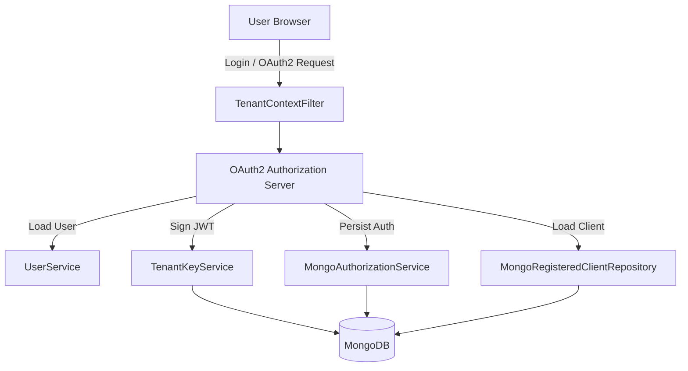
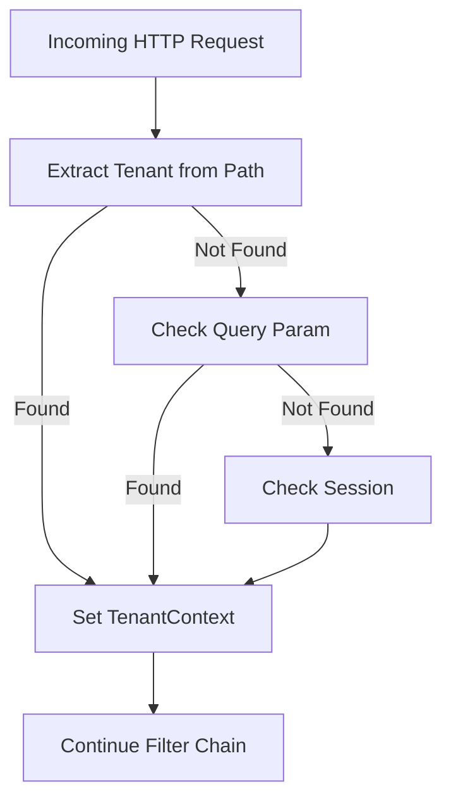
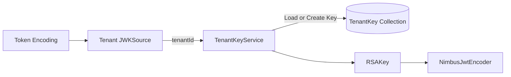
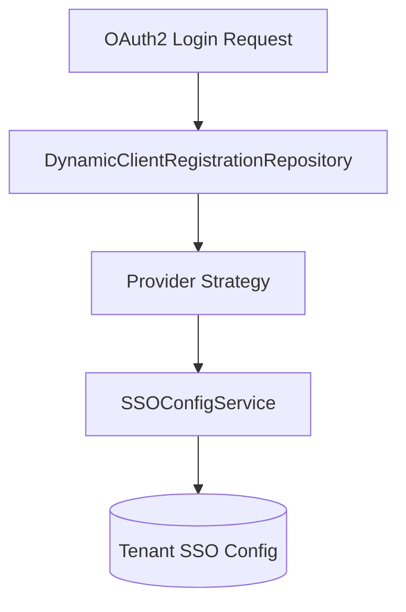
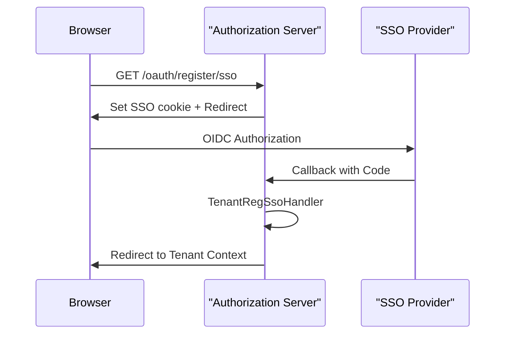
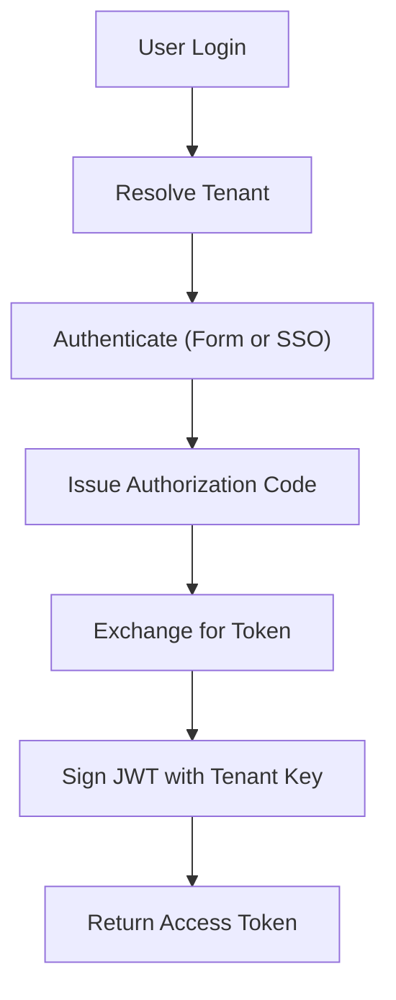

# Authorization Server Core

The **Authorization Server Core** module is the heart of OpenFrame’s multi-tenant identity and access management system. It implements a tenant-aware OAuth2 / OpenID Connect (OIDC) Authorization Server using Spring Authorization Server, with deep integration into MongoDB persistence, dynamic SSO configuration, and per-tenant cryptographic key management.

This module is responsible for:

- OAuth2 Authorization Code + PKCE flows
- OpenID Connect (OIDC) login
- Multi-tenant issuer resolution
- Dynamic SSO provider registration (Google, Microsoft)
- Invitation-based onboarding
- Tenant registration (standard + SSO)
- Password reset flows
- Per-tenant JWT signing keys
- MongoDB-backed authorization and client storage

It serves as the identity provider (IdP) for other platform services such as the API Service Core and Gateway Service Core.

---

## 1. High-Level Architecture

The Authorization Server Core operates in a strict multi-tenant mode where each request is resolved against a specific tenant context. Tokens are signed with tenant-specific RSA keys and contain tenant-scoped claims.



### Core Layers

1. **Tenant Resolution Layer** – Determines active tenant for each request.
2. **Authorization Server Configuration** – Configures OAuth2 + OIDC endpoints.
3. **Security Layer** – Handles login, SSO, and authentication flows.
4. **Key Management** – Generates and rotates per-tenant RSA keys.
5. **Persistence Layer** – Stores clients, authorizations, and tenant keys in MongoDB.
6. **Onboarding & Registration Flows** – Handles tenant creation and invitations.

---

## 2. Multi-Tenant Context Resolution

### TenantContext

`TenantContext` is a `ThreadLocal` holder storing the active tenant ID for the current request lifecycle.

### TenantContextFilter

`TenantContextFilter` resolves the tenant from:

- URL path prefix (e.g. `/tenantA/oauth2/authorize`)
- Query parameter `tenant`
- Existing HTTP session

If the tenant changes mid-session, the session is invalidated (except for controlled onboarding transitions).



This mechanism ensures that:

- JWTs are signed with correct tenant keys
- Users are resolved in correct tenant scope
- SSO providers are tenant-specific

---

## 3. OAuth2 Authorization Server Configuration

### AuthorizationServerConfig

This configuration class enables Spring Authorization Server with:

- OIDC support
- Multiple issuers enabled (`multipleIssuersAllowed(true)`)
- JWT-based access tokens
- Tenant-aware JWK resolution

### Tenant-Aware JWKSource

The `jwkSource` bean delegates key lookup to `TenantKeyService`, ensuring:

- Each tenant has its own RSA key pair
- JWKS endpoint serves tenant-specific public keys
- Tokens are signed with correct `kid`



### JWT Customization

The `OAuth2TokenCustomizer` enriches access tokens with:

- `tenant_id`
- `userId`
- `roles` (with OWNER implying ADMIN)

This ensures downstream services can enforce tenant-aware RBAC.

---

## 4. Security Configuration & Authentication Flows

### SecurityConfig

Handles non-authorization-server endpoints such as:

- `/login`
- `/password-reset/**`
- `/tenant/**`
- `/sso/providers/**`
- Invitation endpoints

It supports:

- Form login
- OAuth2 login (Google, Microsoft)
- Auto-provisioning of users
- Microsoft multi-tenant issuer validation

### Microsoft-Specific Issuer Validation

A custom JWT validator allows Microsoft multi-tenant issuers matching:

```text
https://login.microsoftonline.com/{tenantId}/v2.0
```

This ensures compatibility with Azure AD multi-tenant applications.

---

## 5. Dynamic SSO Provider Registration

### DynamicClientRegistrationRepository

Resolves `ClientRegistration` dynamically per tenant:

- Uses tenant ID from context or session
- Delegates to `DynamicClientRegistrationService`
- Allows different client IDs/secrets per tenant

### Provider Strategies

- `GoogleClientRegistrationStrategy`
- `MicrosoftClientRegistrationStrategy`

Each strategy:

- Resolves tenant-specific configuration
- Falls back to default provider configuration



---

## 6. Invitation & Tenant Registration Flows

The module supports both:

- Standard registration
- SSO-based registration
- Invitation acceptance (password or SSO)

### TenantRegistrationController

Endpoints:

- `POST /oauth/register`
- `GET /oauth/register/sso`

SSO flow:

1. Clear auth state
2. Store signed short-lived cookie
3. Redirect to OAuth2 provider
4. Complete flow via `TenantRegSsoHandler`

### InvitationRegistrationController

Supports:

- JSON-based invitation acceptance
- SSO-based invitation acceptance

### SSO Flow Handlers

- `InviteSsoHandler`
- `TenantRegSsoHandler`

These handlers:

- Decode HMAC-protected cookies
- Extract OIDC user claims
- Create tenant or user
- Redirect to correct tenant context



---

## 7. MongoDB Persistence

### MongoRegisteredClientRepository

Stores OAuth2 clients with:

- Authentication methods
- Grant types
- Redirect URIs
- Token settings (TTL, reuse refresh tokens)

### MongoAuthorizationService

Implements `OAuth2AuthorizationService` backed by MongoDB.

Stores:

- Authorization codes
- Access tokens
- Refresh tokens
- PKCE metadata
- Authorization request attributes

### TenantKeyService

Responsible for:

- Generating RSA 2048 key pairs
- Encrypting private keys
- Persisting keys in MongoDB
- Returning active key per tenant

Keys are lazily generated on first use.

---

## 8. Password Reset

### PasswordResetController

Endpoints:

- `POST /password-reset/request`
- `POST /password-reset/confirm`

`ResetTokenUtil` generates secure 32-byte Base64 URL-safe tokens.

Passwords must satisfy:

- Minimum 8 characters
- Uppercase + lowercase
- Digit
- Special character

---

## 9. JWT Claim Model

Access tokens include:

```text
tenant_id   -> Active tenant identifier
userId      -> Internal user ID
roles       -> Effective roles (OWNER implies ADMIN)
```

This design enables downstream services to:

- Validate tenant isolation
- Enforce RBAC
- Avoid cross-tenant access

---

## 10. End-to-End Flow Summary



The Authorization Server Core ensures:

- Strong tenant isolation
- Secure token issuance
- Flexible SSO integration
- Extensible registration pipelines
- Persistent, auditable authorization storage

It is the central identity backbone of the OpenFrame multi-tenant platform.