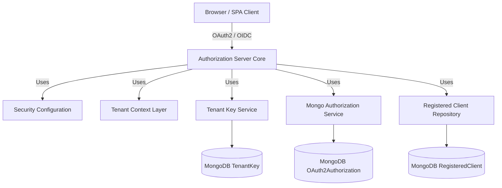
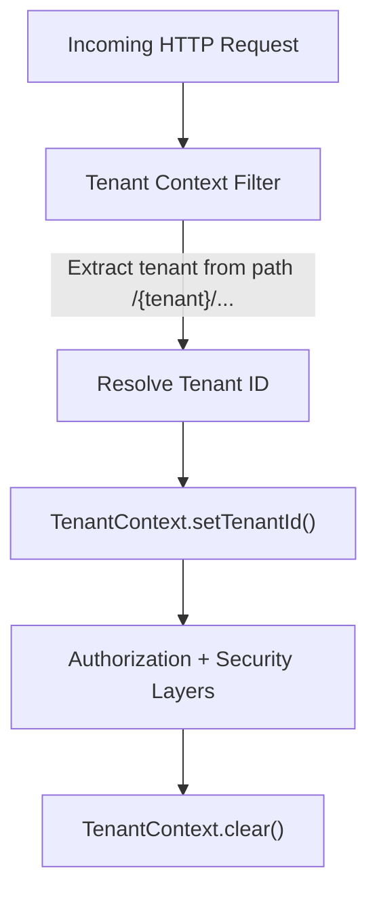
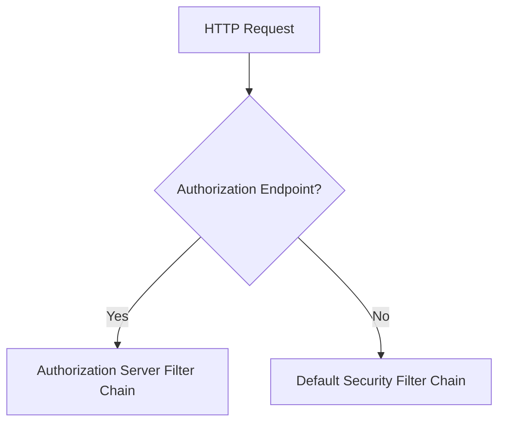
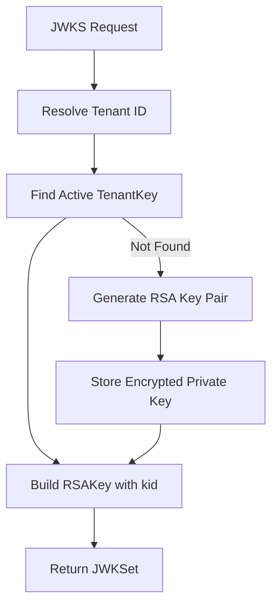
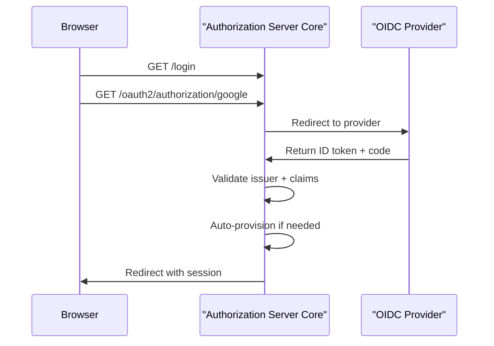
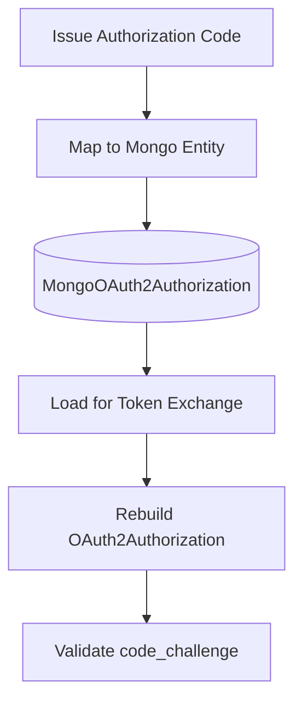
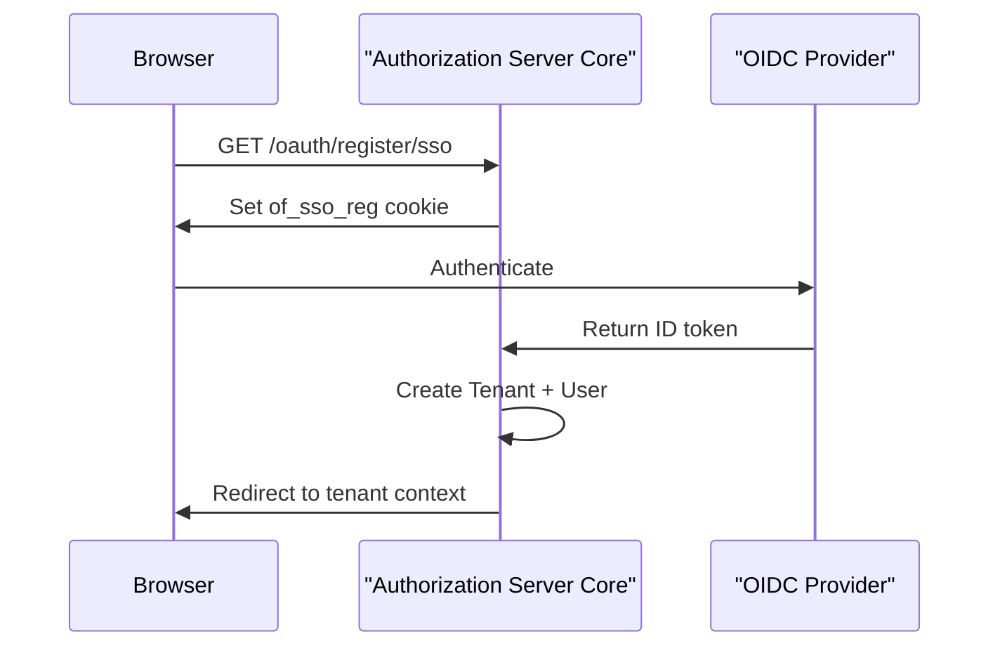

# Authorization Server Core

The **Authorization Server Core** module implements OpenFrame’s multi-tenant OAuth2 and OpenID Connect (OIDC) authorization server. It is responsible for:

- Issuing access and refresh tokens
- Managing OAuth2 authorization codes with PKCE support
- Handling multi-tenant login and SSO flows (Google, Microsoft)
- Dynamically resolving tenant-specific clients and signing keys
- Persisting OAuth2 authorizations and registered clients in MongoDB

This module is the heart of identity and access management in the OpenFrame platform.

---

## 1. Architectural Overview

The Authorization Server Core is built on **Spring Authorization Server** and **Spring Security**, extended with:

- Tenant-aware request resolution
- Per-tenant RSA signing keys
- Dynamic OAuth2 client registration
- SSO auto-provisioning and onboarding flows
- MongoDB-backed authorization persistence

### High-Level Architecture

---

## 2. Multi-Tenant Context Resolution

Multi-tenancy is enforced at the HTTP filter layer and propagated through a `ThreadLocal` context.

### Core Components

- `TenantContext`
- `TenantContextFilter`

### Flow

### Resolution Strategy

Tenant ID is resolved from:

1. Path prefix (e.g., `/{tenant}/oauth2/authorize`)
2. Query parameter `tenant`
3. Existing HTTP session attribute

Special handling allows switching from the onboarding pseudo-tenant (`sso-onboarding`) to a real tenant without losing the authentication context.

---

## 3. OAuth2 Authorization Server Configuration

### Core Component

- `AuthorizationServerConfig`

This class configures:

- OAuth2 Authorization Server endpoints
- OIDC support
- JWT encoding and decoding
- Custom token claims
- Authentication manager and password encoder

### Security Filter Chains

Two filter chains are defined:

1. **Authorization Server Chain** (Order 1)
2. **Default Application Security Chain** (Order 2)

---

## 4. Per-Tenant RSA Key Management

Each tenant has its own RSA key pair used to sign JWT tokens.

### Core Components

- `TenantKeyService`
- `RsaAuthenticationKeyPairGenerator`
- `PemUtil`

### Key Lifecycle

### Security Characteristics

- 2048-bit RSA keys
- Private keys encrypted before storage
- Unique `kid` per tenant
- JWKS dynamically served per tenant

---

## 5. JWT Customization

### Core Component

- `OAuth2TokenCustomizer<JwtEncodingContext>`

Custom claims added to access tokens:

- `tenant_id`
- `userId`
- `roles`

Special rule:

- `OWNER` role implicitly includes `ADMIN`

On refresh token grant, the user’s `lastLogin` timestamp is updated.

---

## 6. Authentication & Login

### Core Components

- `SecurityConfig`
- `LoginController`
- `AuthSuccessHandler`

### Supported Authentication Methods

- Username/password (form login)
- Google OIDC
- Microsoft OIDC

### OIDC Enhancements

- Microsoft multi-tenant issuer validation
- Auto-provisioning users from trusted domains
- Automatic email verification for trusted providers

### Login Flow (OIDC Example)

---

## 7. Dynamic Client Registration

### Core Component

- `DynamicClientRegistrationRepository`

This enables resolving OAuth2 client configurations dynamically per tenant.

Resolution order:

1. `TenantContext`
2. HTTP session
3. Request attributes

If no tenant is resolved, the OAuth2 flow fails gracefully.

---

## 8. OAuth2 Authorization Persistence

### Core Components

- `MongoAuthorizationService`
- `MongoAuthorizationMapper`
- `MongoRegisteredClientRepository`

### Responsibilities

- Persist authorization codes
- Persist access & refresh tokens
- Preserve PKCE parameters
- Rehydrate `OAuth2AuthorizationRequest`

PKCE parameters (`code_challenge`, `code_challenge_method`) are explicitly preserved across persistence and rehydration.

---

## 9. SSO Invitation & Tenant Registration Flows

### Core Controllers

- `InvitationRegistrationController`
- `TenantRegistrationController`
- `SsoDiscoveryController`
- `TenantDiscoveryController`
- `PasswordResetController`

### SSO Flow Handlers

- `InviteSsoHandler`
- `TenantRegSsoHandler`

SSO flows use short-lived, signed cookies:

- `of_sso_invite`
- `of_sso_reg`

### Tenant Registration via SSO

---

## 10. Password Reset

### Core Components

- `PasswordResetController`
- `ResetTokenUtil`

Features:

- Secure 256-bit URL-safe reset tokens
- Password policy enforcement (uppercase, lowercase, digit, special char)
- Token-based password confirmation

---

## 11. Extension Points

The module provides pluggable processors:

- `RegistrationProcessor`
- `UserDeactivationProcessor`
- `UserEmailVerifiedProcessor`
- `GlobalDomainPolicyLookup`

Default implementations are no-op and can be overridden by custom beans.

---

## 12. Security Guarantees

- Per-tenant JWT signing keys
- Encrypted private key storage
- PKCE enforced for authorization code flow
- Strict issuer validation for Microsoft multi-tenant
- Automatic session invalidation on tenant switch (except onboarding)
- Secure, HttpOnly cookies for SSO flows

---

# Summary

The **Authorization Server Core** module provides a robust, multi-tenant OAuth2 and OIDC identity provider tailored for OpenFrame. It combines:

- Spring Authorization Server
- Tenant-aware request scoping
- Per-tenant cryptographic isolation
- MongoDB-backed persistence
- Dynamic SSO client resolution
- Extensible provisioning hooks

It acts as the foundation for authentication, token issuance, and identity lifecycle management across the entire OpenFrame platform.
