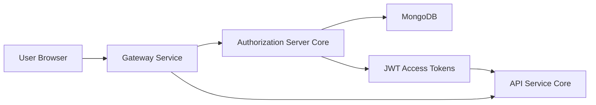
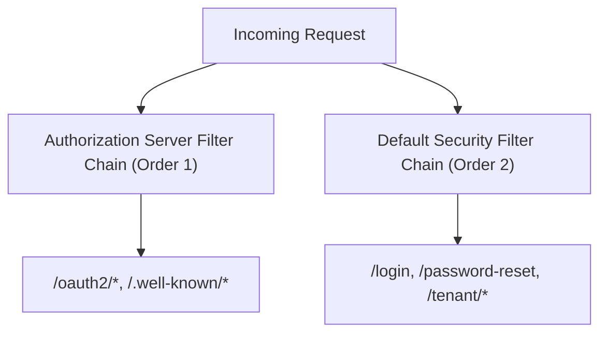
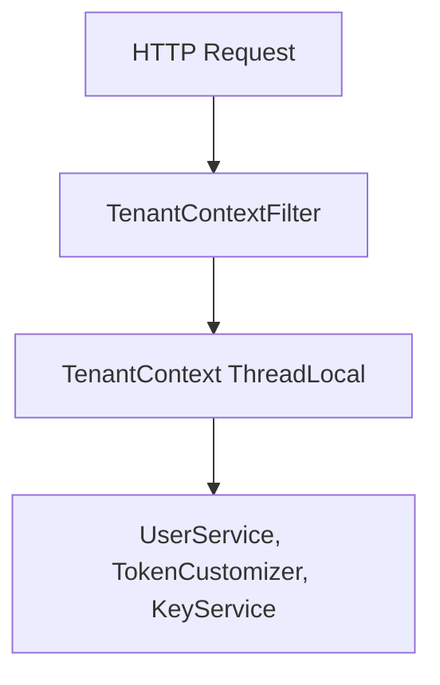
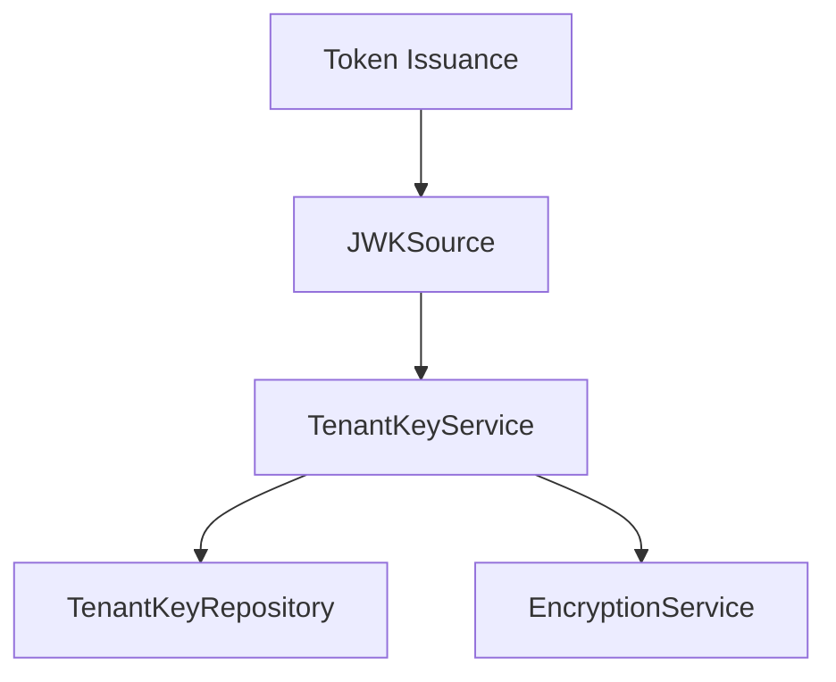
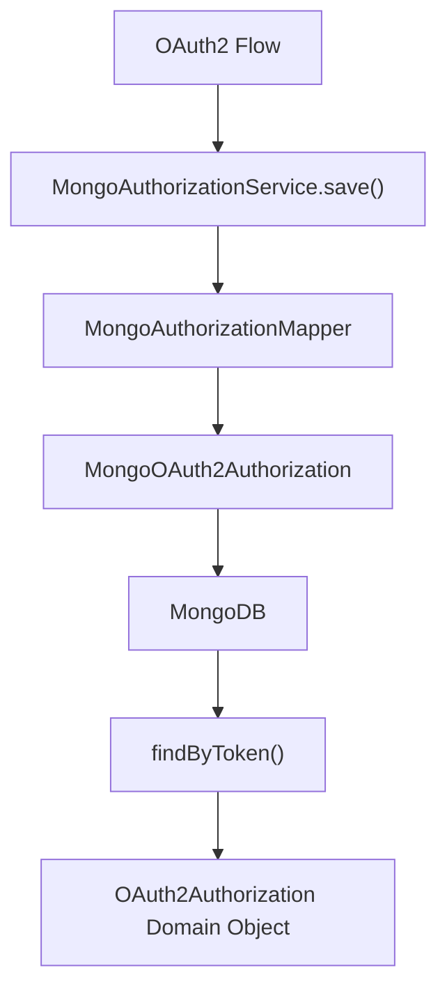
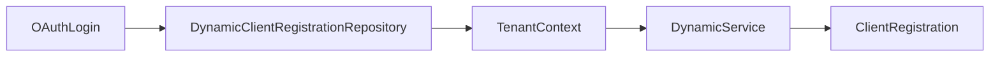
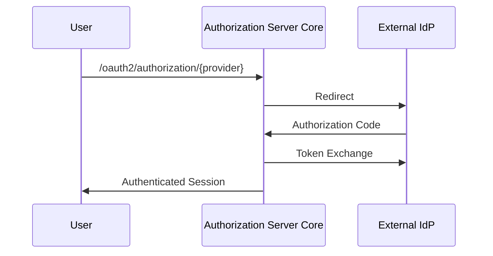
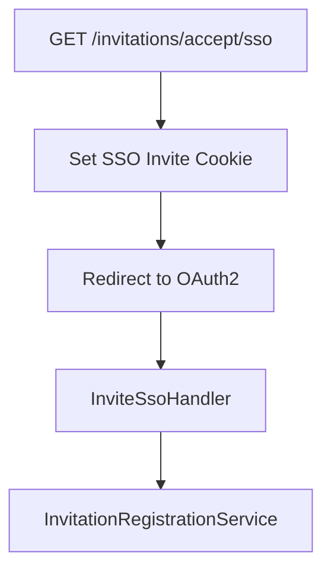
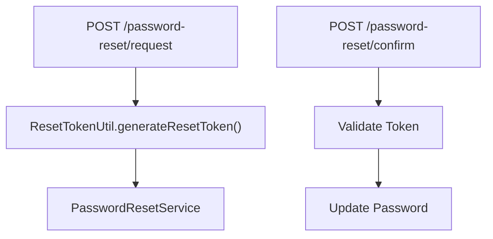

# Authorization Server Core

## Overview

The **Authorization Server Core** module is the central OAuth2 and OpenID Connect (OIDC) authority of the OpenFrame multi-tenant platform. It is responsible for:

- Acting as an OAuth2 Authorization Server (Spring Authorization Server)
- Issuing and validating JWT access and refresh tokens
- Managing tenant-aware authentication flows
- Supporting form login and OIDC-based SSO (Google, Microsoft)
- Handling invitation-based onboarding and tenant registration
- Persisting OAuth2 authorizations and clients in MongoDB
- Managing per-tenant RSA signing keys

This module is the trust anchor of the platform. All other services (Gateway, API, External API, Client, etc.) rely on tokens issued here.

---

## Architectural Position in the Platform

**Key responsibilities:**

- Issues signed JWT tokens
- Stores OAuth2 authorization state in MongoDB
- Resolves tenant context for every authentication request
- Coordinates SSO providers dynamically per tenant

---

# Core Architecture

The module is structured into the following major areas:

1. Authorization Server Configuration
2. Multi-Tenancy Infrastructure
3. Authentication & SSO Flows
4. Token & Key Management
5. OAuth2 Persistence Layer
6. Registration & Onboarding Processing
7. Web Utilities & Security Glue

---

# 1. Authorization Server Configuration

Primary class:

- `AuthorizationServerConfig`

## Security Filter Chains

Two main filter chains exist:

### Authorization Server Filter Chain (Order 1)

Configured via `OAuth2AuthorizationServerConfigurer`.

Key features:

- OIDC enabled
- Multiple issuers allowed (multi-tenant support)
- JWT resource server support
- Custom `ProviderAwareAuthenticationEntryPoint`

### Default Security Filter Chain (Order 2)

Configured in `SecurityConfig`.

Handles:

- Form login
- OAuth2 login (OIDC SSO)
- Public endpoints
- Success and failure handlers

---

# 2. Multi-Tenancy Model

Multi-tenancy is implemented using a `ThreadLocal`-based context.

## TenantContext

### Components

- `TenantContext` — ThreadLocal storage
- `TenantContextFilter` — extracts tenant from:
  - URL path segment
  - Query parameter `tenant`
  - HTTP session

Tenant switching logic:

- Session invalidated if tenant changes
- Special onboarding tenant `sso-onboarding` supported

### Why This Matters

Every token, key, client, and user lookup is tenant-scoped.

The tenant ID is injected into:

- JWT claims (`tenant_id`)
- Database queries
- Client registration resolution
- SSO provider configuration

---

# 3. JWT & Key Management

## Per-Tenant RSA Keys

### TenantKeyService

Responsibilities:

- Ensures exactly one active signing key per tenant
- Generates RSA 2048 key pairs
- Encrypts private keys before persistence
- Builds `RSAKey` for JWT signing

If no active key exists:

- A new key pair is generated
- Stored with unique `kid`
- Marked as active

## JWT Customization

Defined in `AuthorizationServerConfig.tokenCustomizer`.

Custom claims added to access tokens:

- `tenant_id`
- `userId`
- `roles`

Role logic:

- If `OWNER` present → `ADMIN` also added

Also updates `lastLogin` on refresh token usage.

---

# 4. OAuth2 Persistence (MongoDB)

## MongoAuthorizationService

Implements `OAuth2AuthorizationService`.

### Key Features

- Stores:
  - Authorization code
  - Access token
  - Refresh token
  - PKCE parameters
- Rehydrates `OAuth2AuthorizationRequest`
- Handles PKCE normalization (underscore vs dot keys)
- Maintains TTL expiration

This ensures full compliance with:

- Authorization Code flow
- PKCE
- Refresh tokens

---

# 5. Client Registration

## MongoRegisteredClientRepository

Persists `RegisteredClient` objects.

Supports:

- Multiple grant types
- Configurable token TTL
- PKCE enforcement
- Consent requirements

Dynamic resolution for SSO:

- `DynamicClientRegistrationRepository`
- Uses `DynamicClientRegistrationService`
- Resolves client based on:
  - Provider ID
  - Tenant ID

---

# 6. Authentication Flows

## 6.1 Form Login

Handled by:

- `LoginController`
- `UserDetailsService`
- `AuthenticationManager`

Uses:

- BCrypt password hashing
- Tenant-aware user lookup

## 6.2 OAuth2 / OIDC Login

Configured in `SecurityConfig`.

### Flow

### Special Handling

- Microsoft issuer validation (multi-tenant support)
- Auto-provision users when enabled
- Domain-based tenant mapping
- Email verification marking

Auto-provision logic ensures:

- If user not found
- If SSO config allows auto-provision
- If email domain allowed

Then user is created and assigned `ADMIN` by default.

---

# 7. Invitation-Based Registration

Handled by:

- `InvitationRegistrationController`
- `InviteSsoHandler`

## Standard Invitation

`POST /invitations/accept`

Registers user via invitation ID.

## SSO Invitation

Cookie-based state is used to:

- Prevent tampering
- Preserve invitation context
- Allow tenant switching

---

# 8. Tenant Registration (Onboarding)

Handled by:

- `TenantRegistrationController`
- `TenantRegSsoHandler`

Supports:

- Standard registration
- SSO-based registration

SSO onboarding uses special tenant context:

`sso-onboarding`

After successful authentication:

- Tenant created
- Admin user created
- Session migrated to real tenant

---

# 9. Password Reset Flow

Password requirements enforced via regex:

- Minimum 8 characters
- Uppercase
- Lowercase
- Digit
- Special character

---

# 10. Extensibility Hooks

The module provides pluggable processors:

- `RegistrationProcessor`
- `UserDeactivationProcessor`
- `UserEmailVerifiedProcessor`

Default implementations are no-op.

This allows:

- Custom auditing
- Webhook integrations
- Cross-service orchestration

---

# Security Design Summary

| Area | Strategy |
|------|----------|
| Password Hashing | BCrypt |
| Token Signing | RSA 2048 per tenant |
| Private Key Storage | Encrypted in Mongo |
| PKCE | Fully supported |
| Multi-Issuer | Enabled |
| SSO | Google & Microsoft |
| Auto-Provision | Domain & tenant-config aware |

---

# Key Design Principles

1. Strict tenant isolation
2. Stateless JWT access tokens
3. Encrypted key material
4. Pluggable registration lifecycle
5. Full OIDC compliance
6. Mongo-based durable authorization state

---

# Conclusion

The **Authorization Server Core** module is the identity backbone of OpenFrame.

It combines:

- Spring Authorization Server
- Multi-tenant context propagation
- Per-tenant key rotation
- Mongo-backed OAuth2 persistence
- Flexible SSO provisioning
- Secure invitation-based onboarding

All other services trust tokens issued here, making this module foundational to platform security and tenant isolation.
