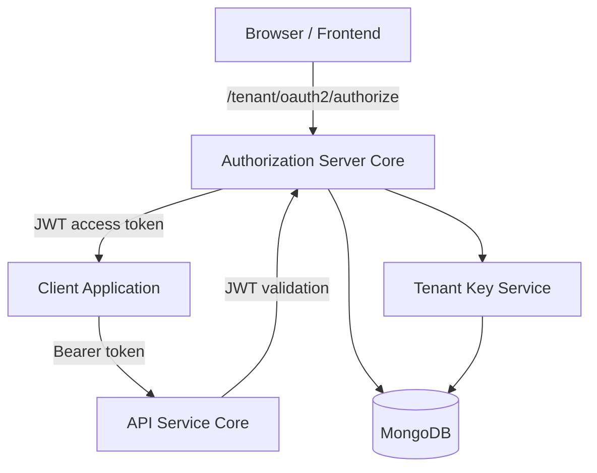
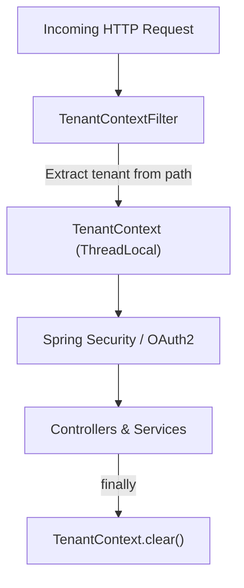
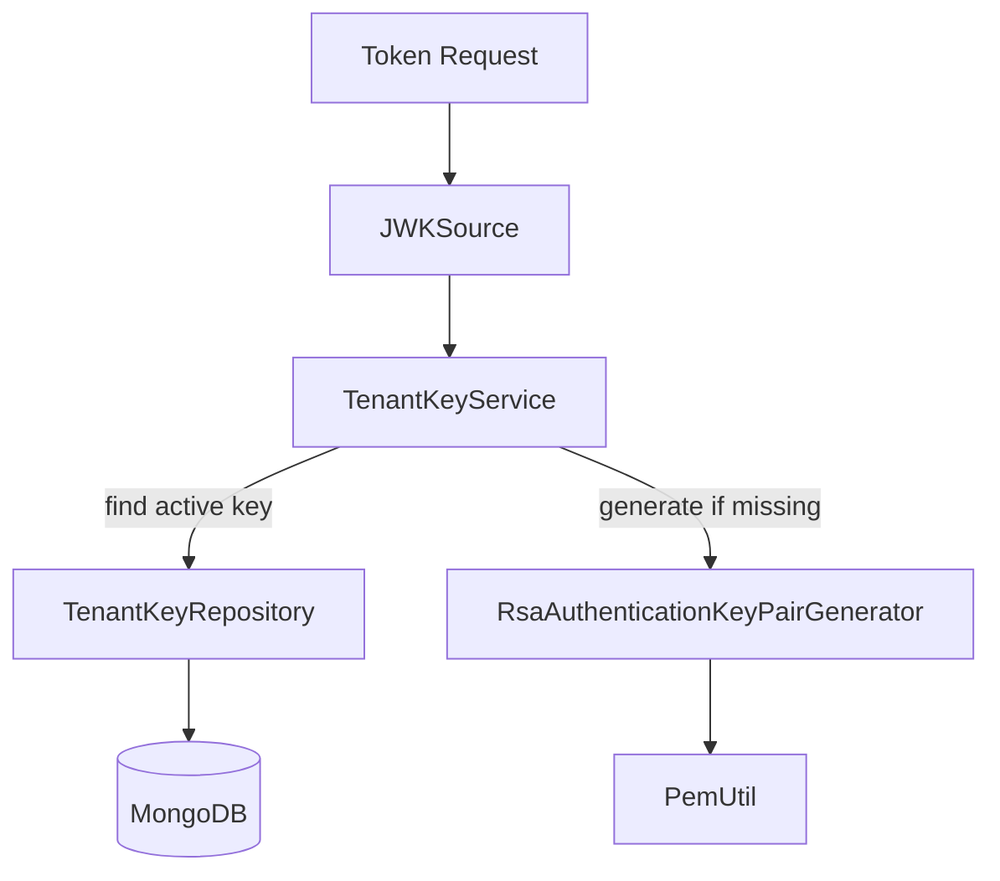
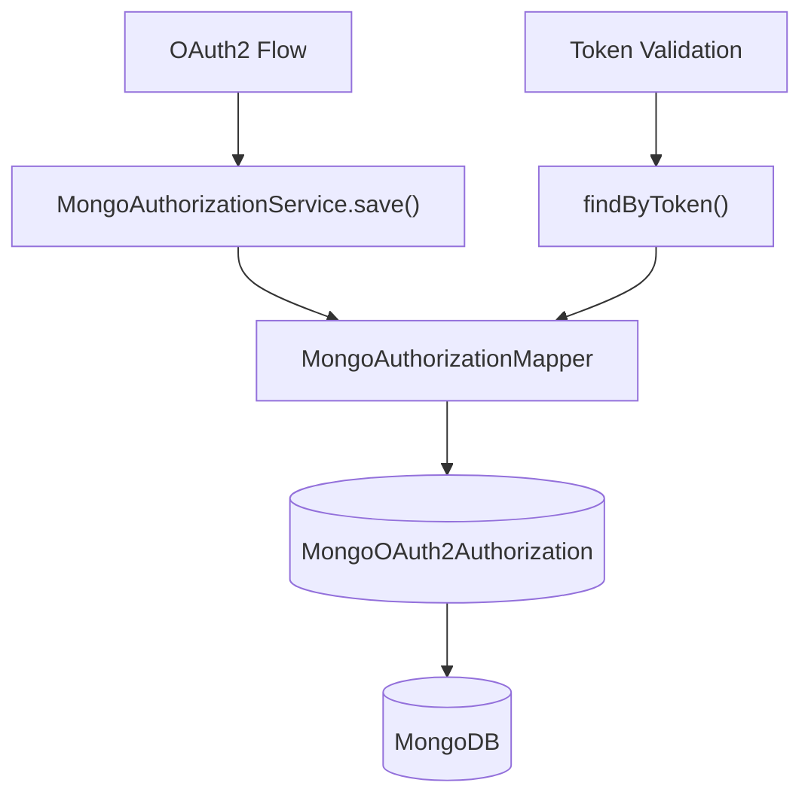
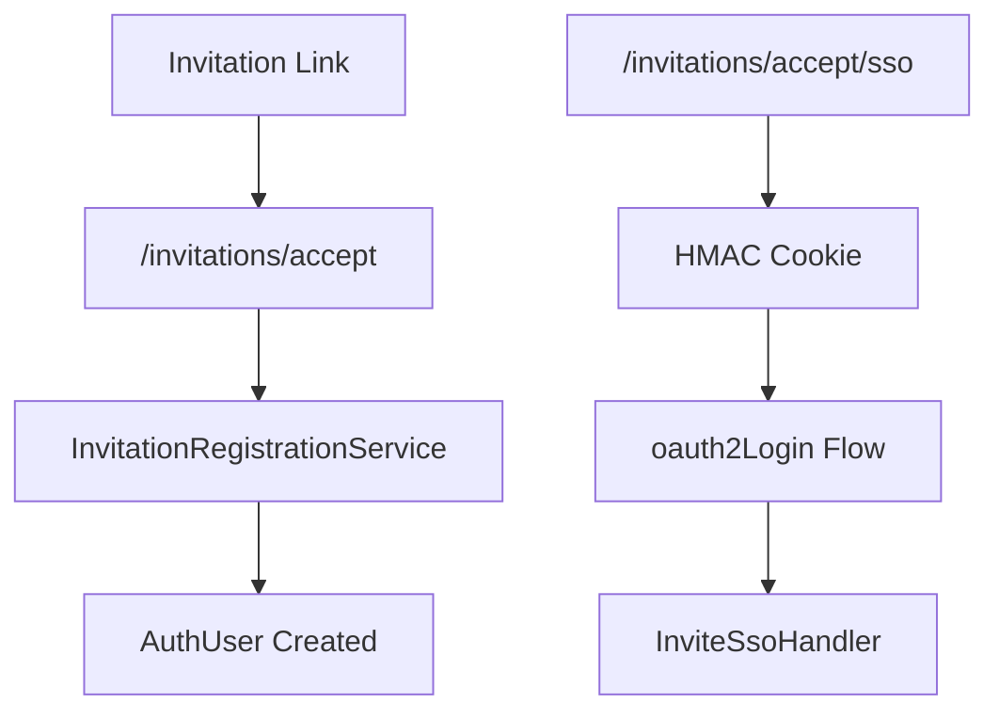

# Authorization Server Core

The **Authorization Server Core** module implements OpenFrame’s multi-tenant OAuth2 and OpenID Connect (OIDC) Authorization Server. It is responsible for:

- Issuing and validating JWT access and refresh tokens
- Managing OAuth2 clients and authorization grants
- Handling multi-tenant authentication contexts
- Supporting SSO (Google, Microsoft) with dynamic per-tenant configuration
- Managing tenant registration, invitation flows, and password reset
- Persisting authorizations and clients in MongoDB

This module is the security backbone of the OpenFrame platform and integrates with the API Service Core, Gateway Service Core, and Data Layer modules.

---

## 1. High-Level Architecture

The Authorization Server Core is built on **Spring Authorization Server** and **Spring Security**, extended with:

- Multi-tenant resolution via request path and session
- Per-tenant RSA signing keys
- Mongo-backed OAuth2 client and authorization persistence
- Dynamic SSO provider configuration per tenant
- Custom registration and onboarding flows

### 1.1 Logical Architecture

**Key responsibilities:**

- Issue tenant-scoped JWTs
- Expose OIDC endpoints (`/oauth2/authorize`, `/oauth2/token`, `/.well-known`)
- Persist OAuth2Authorization and RegisteredClient data in MongoDB
- Resolve tenant context before any security decision

---

## 2. Multi-Tenant Context Model

Multi-tenancy is enforced at the HTTP filter layer and propagated through a `ThreadLocal` context.

### 2.1 Tenant Resolution Flow

### Core Components

- `TenantContext` – Stores `tenantId` in a `ThreadLocal`.
- `TenantContextFilter` – Extracts tenant ID from:
  - URL path (`/{tenant}/oauth2/...`)
  - Query parameter `tenant`
  - HTTP session
- Session switching logic allows controlled transition from onboarding tenant (`sso-onboarding`) to real tenant.

This design ensures every JWT, SSO flow, and DB query is tenant-aware.

---

## 3. Authorization Server Configuration

### 3.1 AuthorizationServerConfig

`AuthorizationServerConfig` wires Spring Authorization Server:

- Enables OIDC support
- Allows multiple issuers (`multipleIssuersAllowed(true)`)
- Configures JWT encoder/decoder
- Customizes tokens with tenant and role claims

### 3.2 Security Filter Chains

Two security filter chains are defined:

1. **Authorization Server Chain (Order 1)**
   - Applies only to OAuth2 endpoints
   - Requires authentication
   - Configures resource server JWT validation

2. **Default Security Chain (Order 2)**
   - Handles login, SSO, invitations, password reset
   - Configures `formLogin()` and `oauth2Login()`
   - Custom success and failure handlers

---

## 4. JWT and Tenant Key Management

Each tenant has its own RSA key pair used to sign JWTs.

### 4.1 Key Generation and Storage

### Core Classes

- `TenantKeyService`
  - Retrieves or creates active RSA key per tenant
  - Encrypts private key using `EncryptionService`
  - Returns `RSAKey` with `kid`
- `RsaAuthenticationKeyPairGenerator`
  - Generates 2048-bit RSA key pairs
- `PemUtil`
  - Converts RSA keys to/from PEM

### 4.2 JWT Customization

`OAuth2TokenCustomizer<JwtEncodingContext>` injects custom claims:

- `tenant_id`
- `userId`
- `roles`

Role logic:

- `OWNER` implicitly adds `ADMIN`
- Roles are serialized as string array claim

On refresh token grant, `lastLogin` is updated.

---

## 5. OAuth2 Client and Authorization Persistence

### 5.1 Registered Clients

`MongoRegisteredClientRepository` implements `RegisteredClientRepository`:

- Stores client:
  - Authentication methods
  - Grant types
  - Redirect URIs
  - Scopes
  - Token TTL settings
- Maps Mongo document ⇄ Spring `RegisteredClient`

### 5.2 Authorization Persistence

`MongoAuthorizationService` implements `OAuth2AuthorizationService`.

Features:

- Persists:
  - Authorization codes
  - Access tokens
  - Refresh tokens
  - PKCE metadata
- Rehydrates `OAuth2AuthorizationRequest`
- Normalizes PKCE parameters (`code_challenge`, `code_challenge_method`)

This ensures full support for Authorization Code + PKCE flows.

---

## 6. SSO and Dynamic Client Registration

The module supports Google and Microsoft SSO with per-tenant configuration.

### 6.1 Dynamic Client Resolution

`DynamicClientRegistrationRepository`:

- Resolves `ClientRegistration` at runtime
- Uses `TenantContext`
- Falls back to session attribute if needed
- Delegates to `DynamicClientRegistrationService`

### 6.2 Provider Strategies

- `GoogleClientRegistrationStrategy`
- `MicrosoftClientRegistrationStrategy`

Each strategy:

- Supplies provider ID
- Loads provider properties
- Builds `ClientRegistration` dynamically

### 6.3 Microsoft Issuer Validation

Custom `JwtDecoderFactory`:

- Allows multi-tenant Microsoft issuers
- Validates issuer against pattern:
  - `https://login.microsoftonline.com/{tenant}/v2.0`

---

## 7. Login, Invitation, and Onboarding Flows

### 7.1 Form Login

`LoginController`:

- Renders login page
- Displays password reset link if configured

`AuthSuccessHandler`:

- Updates `lastLogin`
- Marks email verified for trusted IdPs
- Delegates to SSO registration success handler

---

### 7.2 Invitation Registration

Components:

- `InvitationRegistrationController`
- `InviteSsoHandler`
- `InvitationRegistrationRequest`

Supports:

- Direct password-based registration
- SSO-based invitation acceptance

---

### 7.3 Tenant Registration

Two flows are supported:

1. Direct registration (`/oauth/register`)
2. SSO-based onboarding (`/oauth/register/sso`)

`TenantRegSsoHandler`:

- Decodes secure cookie
- Builds `TenantRegistrationRequest`
- Creates tenant
- Redirects into tenant-specific OAuth flow

Onboarding uses pseudo-tenant:

- `sso-onboarding`

After tenant creation, context switches to real tenant.

---

### 7.4 Tenant Discovery

`TenantDiscoveryController`:

- `/tenant/discover`
- Resolves tenant and available providers by email

`TenantDiscoveryResponse` contains:

- `tenant_id`
- `auth_providers`
- `has_existing_accounts`

Used by frontend login flow.

---

### 7.5 Password Reset

`PasswordResetController`:

- `/password-reset/request`
- `/password-reset/confirm`

`ResetTokenUtil`:

- Generates 256-bit secure URL-safe token

Password validation enforces:

- Minimum 8 characters
- Uppercase, lowercase, digit, special character

---

## 8. Registration and Lifecycle Processors

Extensibility is provided via processor interfaces with default no-op implementations:

- `DefaultRegistrationProcessor`
- `DefaultUserDeactivationProcessor`
- `DefaultUserEmailVerifiedProcessor`
- `NoopGlobalDomainPolicyLookup`

These allow downstream services to hook into:

- Tenant registration
- Invitation acceptance
- Auto-provisioning
- User deactivation
- Email verification

---

## 9. Security Considerations

The Authorization Server Core enforces:

- BCrypt password hashing
- PKCE support
- Per-tenant signing keys
- Encrypted private key storage
- Strict issuer validation for Microsoft
- Session isolation per tenant
- Secure, HTTP-only SSO cookies

Sensitive flows always:

- Clear authentication state before SSO
- Validate tenant context before issuing tokens
- Attach `tenant_id` claim to every access token

---

## 10. Role Within the OpenFrame Platform

The Authorization Server Core integrates with:

- Gateway Service Core (JWT validation and routing)
- API Service Core (resource server using JWT)
- Data Layer Mongo (users, tenants, OAuth data)
- Frontend clients (login, onboarding, SSO flows)

It provides the foundation for:

- Multi-tenant isolation
- Secure API access
- SSO-enabled onboarding
- OAuth2-compliant token issuance

---

# Summary

The **Authorization Server Core** module is a multi-tenant, OAuth2/OIDC-compliant authorization server built on Spring Authorization Server. It extends standard behavior with:

- Tenant-aware security context
- Per-tenant RSA signing keys
- Mongo-backed OAuth persistence
- Dynamic SSO configuration
- Flexible onboarding and invitation workflows

It is the central trust authority of the OpenFrame platform and ensures secure, isolated authentication and token issuance for every tenant.
