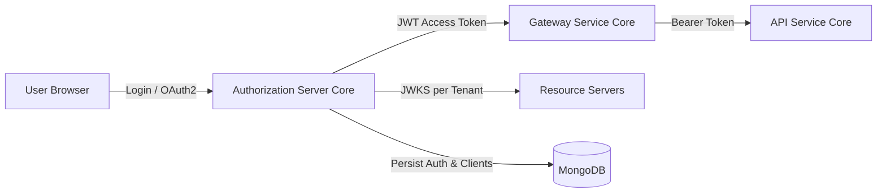
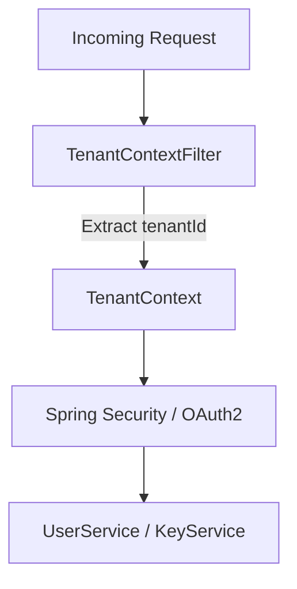
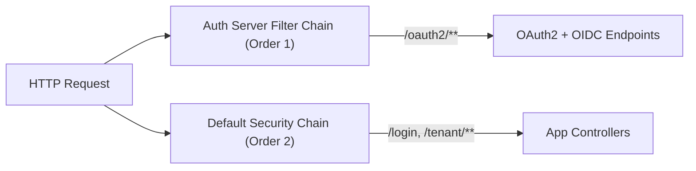
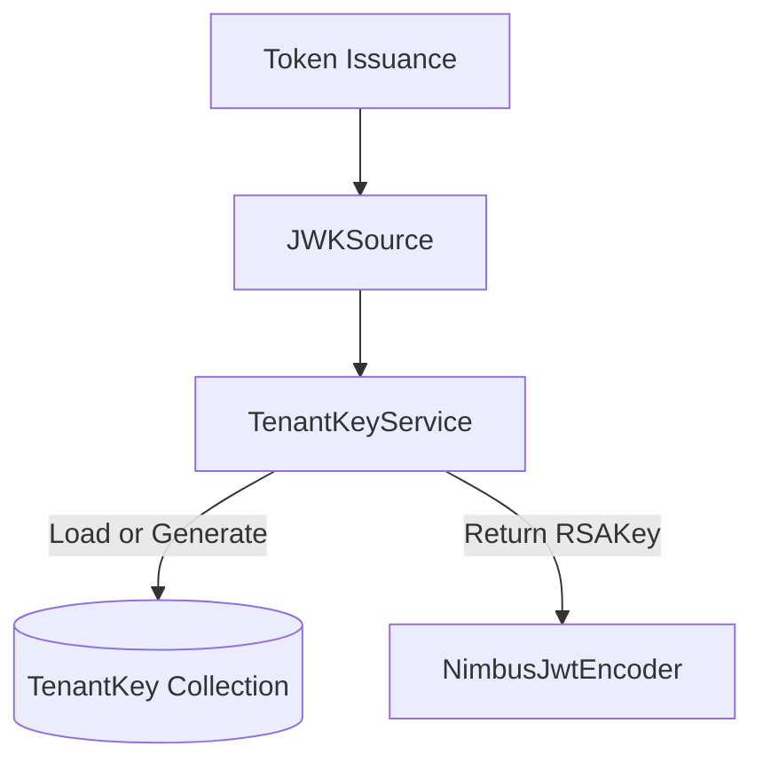
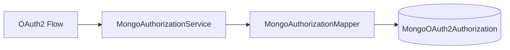
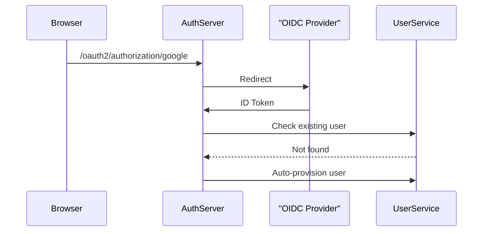
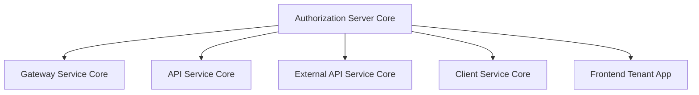

# Authorization Server Core

The **Authorization Server Core** module is the central identity and OAuth2/OpenID Connect (OIDC) provider for the OpenFrame platform. It is responsible for:

- Multi-tenant OAuth2 Authorization Server capabilities
- OpenID Connect (OIDC) login and SSO (Google, Microsoft)
- Tenant-aware authentication and token issuance
- JWT signing with per-tenant RSA keys
- Dynamic client registration and PKCE support
- Invitation-based and SSO-based onboarding flows
- Password reset and email verification lifecycle

This module powers secure access across the platform, including the Gateway, API, External API, Client, and Frontend applications.

---

## 1. High-Level Architecture

At runtime, the Authorization Server Core acts as a **multi-tenant OAuth2 Authorization Server** built on Spring Authorization Server and Spring Security.



### Key Responsibilities

- Issue OAuth2 Authorization Codes, Access Tokens, and Refresh Tokens
- Support PKCE for public clients
- Provide `.well-known` OIDC discovery endpoints
- Sign JWTs with **tenant-specific RSA keys**
- Support multi-tenant issuer URLs
- Dynamically resolve OIDC providers per tenant

---

## 2. Multi-Tenant Security Model

Multi-tenancy is enforced at the HTTP layer and propagated throughout the security stack.

### 2.1 Tenant Resolution

`TenantContextFilter` extracts the tenant ID from:

- URL path segment
- Query parameter `tenant`
- Existing HTTP session

The resolved tenant is stored in a `ThreadLocal` via `TenantContext`.



### TenantContext

`TenantContext` is a lightweight thread-local holder:

- `setTenantId(String)`
- `getTenantId()`
- `clear()`

All key operations (JWT signing, user lookup, client resolution) depend on the current tenant.

---

## 3. OAuth2 Authorization Server Configuration

### 3.1 AuthorizationServerConfig

`AuthorizationServerConfig` configures:

- Spring Authorization Server endpoints
- OIDC support
- JWT encoder/decoder
- Token customization
- AuthenticationManager
- Password encoding

### Security Filter Chains

Two ordered filter chains are defined:

1. **Order(1)** – Authorization Server endpoints
2. **Order(2)** – Default application security



---

## 4. JWT Signing and Per-Tenant Keys

Each tenant has its own RSA key pair for signing JWTs.

### 4.1 TenantKeyService

`TenantKeyService`:

- Retrieves active signing key from MongoDB
- Generates new RSA key pair if missing
- Encrypts private key before persistence
- Exposes key as `RSAKey` for Nimbus



### 4.2 Token Customization

The `OAuth2TokenCustomizer` injects custom claims into access tokens:

- `tenant_id`
- `userId`
- `roles`

Role normalization ensures:

- `OWNER` implies `ADMIN`

---

## 5. OAuth2 Client & Authorization Persistence

### 5.1 MongoRegisteredClientRepository

Implements `RegisteredClientRepository` backed by MongoDB.

Stores:

- Client authentication methods
- Grant types
- Redirect URIs
- Scopes
- Token TTL settings
- PKCE requirements

### 5.2 MongoAuthorizationService

Implements `OAuth2AuthorizationService`.

Handles:

- Authorization Code storage
- Access & Refresh tokens
- PKCE parameters
- State
- Token metadata



PKCE parameters (`code_challenge`, `code_challenge_method`) are preserved across:

- Authorization request
- Code metadata
- Persistence layer

---

## 6. Login and SSO Flows

The module supports:

- Username/password login
- Google OIDC
- Microsoft OIDC
- Invitation-based SSO
- Tenant onboarding via SSO

### 6.1 SecurityConfig

`SecurityConfig` configures:

- Form login
- OAuth2 login
- Custom success & failure handlers
- Microsoft-specific JWT issuer validation
- OIDC auto-provisioning

### 6.2 DynamicClientRegistrationRepository

Resolves OIDC `ClientRegistration` dynamically per tenant.

Resolution order:

1. `TenantContext`
2. HTTP session

If tenant is missing, OAuth2 login fails early.

---

## 7. Auto-Provisioning and Domain Policy

During OIDC login:

1. User authenticates with provider
2. Email is resolved from claims
3. Tenant SSO configuration is evaluated
4. Auto-provision may create a new user



### Domain Policy

`GlobalDomainPolicyLookup` allows domain-to-tenant mapping.

If no custom implementation exists, `NoopGlobalDomainPolicyLookup` disables auto-mapping.

---

## 8. Invitation & SSO Onboarding Flows

### 8.1 InvitationRegistrationController

Supports:

- JSON-based invitation acceptance
- SSO-based invitation acceptance

SSO flows use short-lived HMAC-protected cookies:

- `of_sso_invite`
- `of_sso_reg`

### 8.2 SSO Flow Handlers

- `InviteSsoHandler`
- `TenantRegSsoHandler`

These handlers:

1. Decode secure cookie payload
2. Extract OIDC user info
3. Create tenant or user
4. Clear flow cookie
5. Redirect to tenant-specific OAuth endpoint

---

## 9. Tenant Registration and Discovery

### 9.1 TenantRegistrationController

Supports:

- JSON-based tenant registration
- SSO-based onboarding

### 9.2 TenantDiscoveryController

Endpoint:

```text
GET /tenant/discover?email=user@example.com
```

Returns:

- `tenant_id`
- `auth_providers`
- `has_existing_accounts`

Used by frontend to guide login UX.

---

## 10. Password Reset

`PasswordResetController` exposes:

```text
POST /password-reset/request
POST /password-reset/confirm
```

`ResetTokenUtil` generates secure 256-bit URL-safe tokens.

Password policy enforced via regex:

- Minimum 8 characters
- Uppercase
- Lowercase
- Digit
- Special character

---

## 11. Authentication Success Handling

`AuthSuccessHandler`:

- Updates `lastLogin`
- Marks email verified for trusted providers
- Delegates to SSO-specific success handler

Email resolution strategy:

1. `email`
2. `preferred_username`
3. `upn`
4. `unique_name`

---

## 12. Security Guarantees

The Authorization Server Core enforces:

- BCrypt password hashing
- PKCE validation
- Per-tenant JWT signing keys
- OIDC issuer validation (Microsoft pattern validation)
- Secure, HttpOnly cookies
- Session isolation per tenant
- Automatic session invalidation on tenant switch (except onboarding flow)

---

## 13. How It Fits in the Platform

The Authorization Server Core is the trust anchor of the OpenFrame stack.



All downstream services validate JWTs using the tenant-specific JWKS exposed by this module.

---

# Summary

The **Authorization Server Core** module provides:

- Multi-tenant OAuth2 Authorization Server
- OIDC login with dynamic provider resolution
- Tenant-scoped JWT issuance and signing
- Secure onboarding and invitation flows
- Mongo-backed client and authorization persistence
- Extensible registration and lifecycle processors

It is the foundational identity layer of the OpenFrame platform and enables secure, scalable, tenant-isolated authentication across all services.
