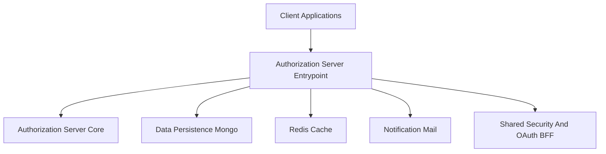
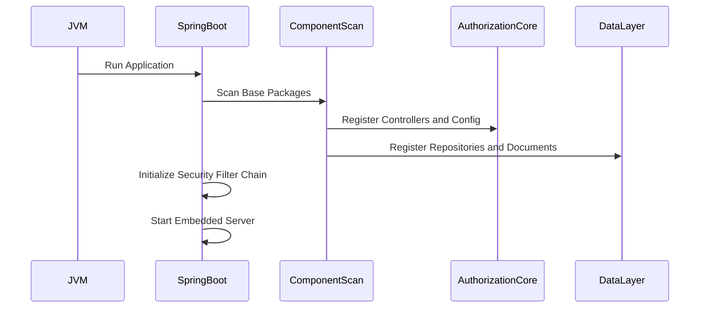
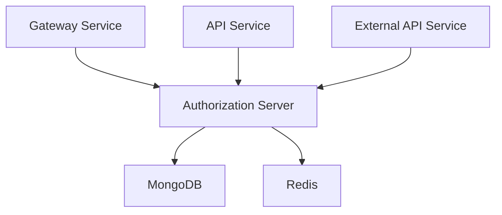
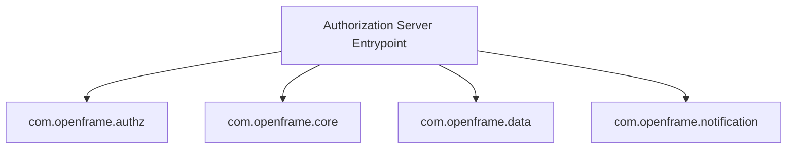
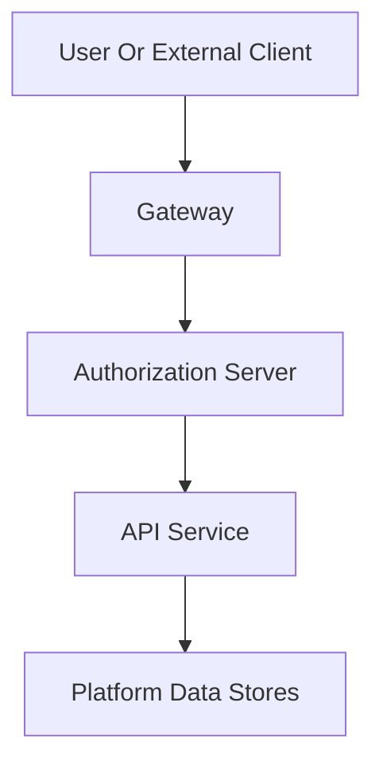

# Authorization Server Entrypoint

## Overview

The **Authorization Server Entrypoint** module is the bootstrap layer of the OpenFrame Authorization Server. It is responsible for starting the Spring Boot application, enabling service discovery, and wiring together the core authorization, security, data, and notification components.

This module does not contain business logic itself. Instead, it initializes and exposes the Authorization Server runtime by loading:

- Authorization configuration and controllers from the **Authorization Server Core**
- Shared security utilities and OAuth infrastructure
- Data persistence layers (MongoDB, Redis)
- Notification services (email providers)

It is the foundation of the identity and access management layer across the OpenFrame platform.

---

## Core Component

### OpenFrameAuthorizationServerApplication

```java
@SpringBootApplication
@EnableDiscoveryClient
@ComponentScan(
        basePackages = {
                "com.openframe.authz", "com.openframe.core", "com.openframe.data", "com.openframe.notification"
        }
)
public class OpenFrameAuthorizationServerApplication {

    public static void main(String[] args) {
        SpringApplication.run(OpenFrameAuthorizationServerApplication.class, args);
    }
}
```

### Responsibilities

1. **Application Bootstrap** – Starts the Spring Boot context.
2. **Service Discovery Registration** – Registers with the service registry.
3. **Component Scanning** – Loads beans from:
   - `com.openframe.authz` (authorization core logic)
   - `com.openframe.core` (shared utilities)
   - `com.openframe.data` (persistence and repositories)
   - `com.openframe.notification` (email services)

---

## High-Level Architecture

The Authorization Server Entrypoint acts as the outer shell around the authorization infrastructure.



### Explanation

- **Authorization Server Core**: Contains OAuth2, OIDC, SSO, tenant logic, and controllers.
- **Data Persistence Mongo**: Stores users, tenants, OAuth clients, tokens, and SSO configurations.
- **Redis Cache**: Used for caching and session-related data.
- **Notification Mail**: Sends password reset and invitation emails.
- **Shared Security And OAuth BFF**: Provides JWT, PKCE, and OAuth utilities.

---

## Internal Bootstrapping Flow

At runtime, the module performs the following startup sequence:



---

## Relationship with Authorization Server Core

All OAuth2, OIDC, SSO, and tenant-specific logic resides in:

- [Authorization Server Core](authorization_server_core.md)

The Entrypoint module ensures those components are discoverable and active.

### Key Capabilities Activated

- OAuth2 Authorization Code Flow
- OpenID Connect support
- Dynamic client registration
- Multi-tenant resolution
- Invitation-based registration
- Password reset flows
- RSA key generation and tenant key management

---

## Multi-Tenant Context Activation

The Authorization Server is multi-tenant aware. During startup, the following pieces are activated:


The Entrypoint ensures that:

- The Tenant Context Filter is registered in the security chain
- Tenant-aware repositories are loaded
- Tenant-specific signing keys are accessible

Tenant logic is implemented in the **Authorization Server Core**.

---

## Integration with Platform Services

The Authorization Server Entrypoint integrates into the broader OpenFrame platform as follows:



### Platform Role

- Issues access tokens for the API and Gateway layers
- Publishes OIDC discovery endpoints
- Validates user credentials
- Coordinates SSO provider flows (Google, Microsoft)

---

## Component Scan Boundaries

The `@ComponentScan` configuration defines strict logical boundaries.



This guarantees:

- Authorization beans are loaded
- Shared utilities are reusable
- Data repositories are injectable
- Email services are available for security workflows

---

## Security Context Initialization

On startup, Spring Security auto-configuration is combined with custom security configuration from the Authorization Server Core.

High-level responsibilities:

1. Register OAuth2 Authorization Server endpoints
2. Configure JWT signing
3. Attach authentication success handlers
4. Apply tenant-aware security filters
5. Enable PKCE validation

Security infrastructure components are implemented in:

- [Authorization Server Core](authorization_server_core.md)
- Shared security and OAuth modules

---

## Deployment and Service Discovery

The `@EnableDiscoveryClient` annotation allows the Authorization Server to:

- Register with a service registry
- Be discoverable by the Gateway Service
- Participate in cloud-native routing

In distributed environments, this enables dynamic scaling and routing without hardcoded endpoints.

---

## How It Fits in the Overall System

The Authorization Server Entrypoint is the identity backbone of the OpenFrame platform.



### System Role Summary

- Central identity provider
- Token issuer
- Multi-tenant boundary enforcer
- SSO orchestration engine
- Security policy activator

---

## Summary

The **Authorization Server Entrypoint** module is intentionally minimal but strategically critical. It:

- Bootstraps the Authorization Server runtime
- Activates multi-tenant OAuth2 and OIDC flows
- Wires together security, persistence, and notification layers
- Integrates the identity system into the broader OpenFrame microservices ecosystem

All identity and authorization behavior ultimately depends on this module successfully initializing and exposing the Authorization Server infrastructure.