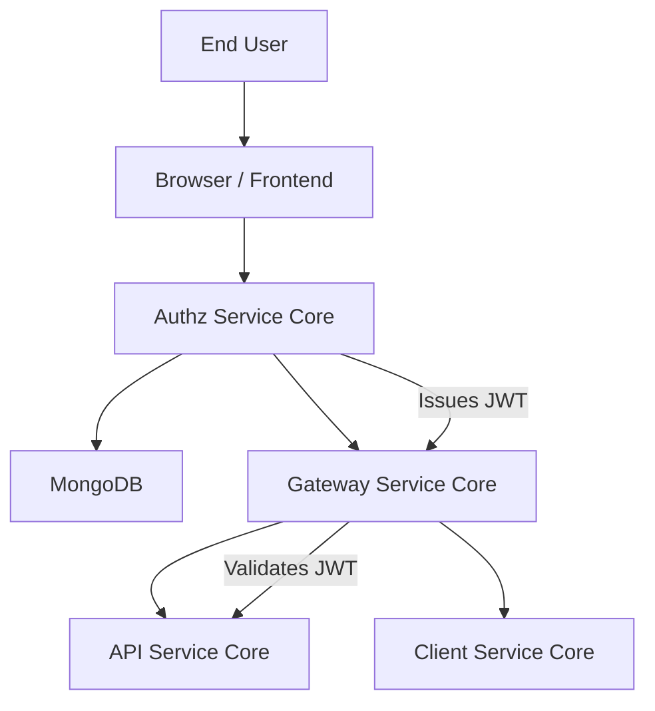
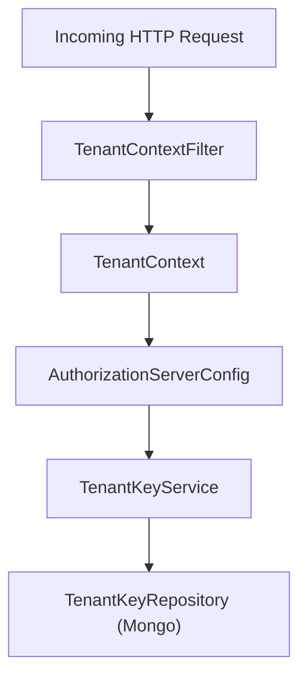
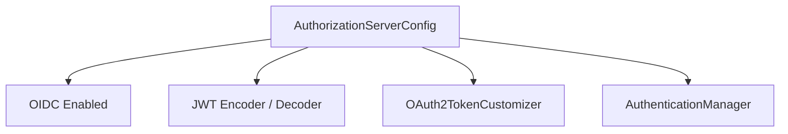
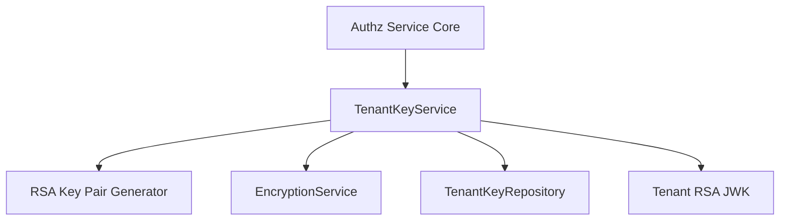
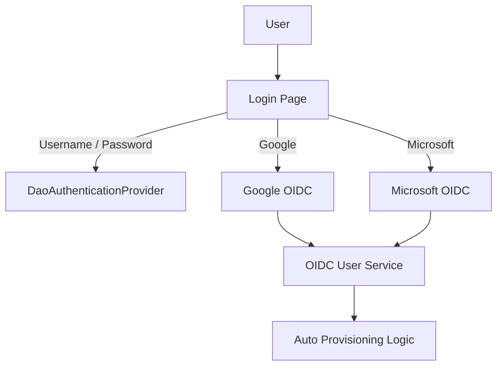
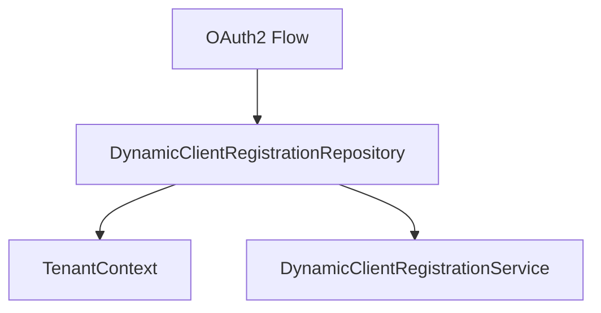
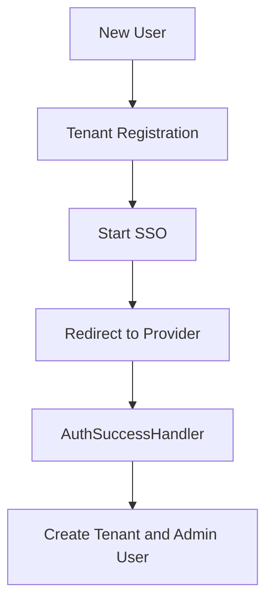
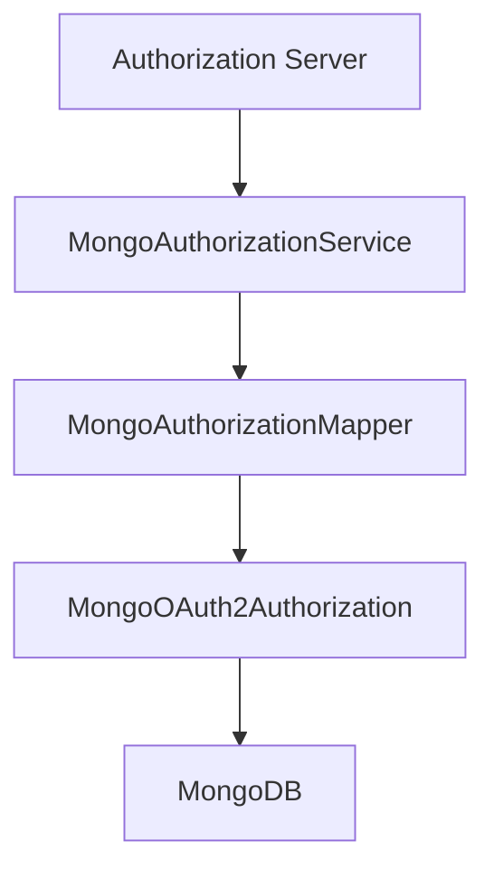
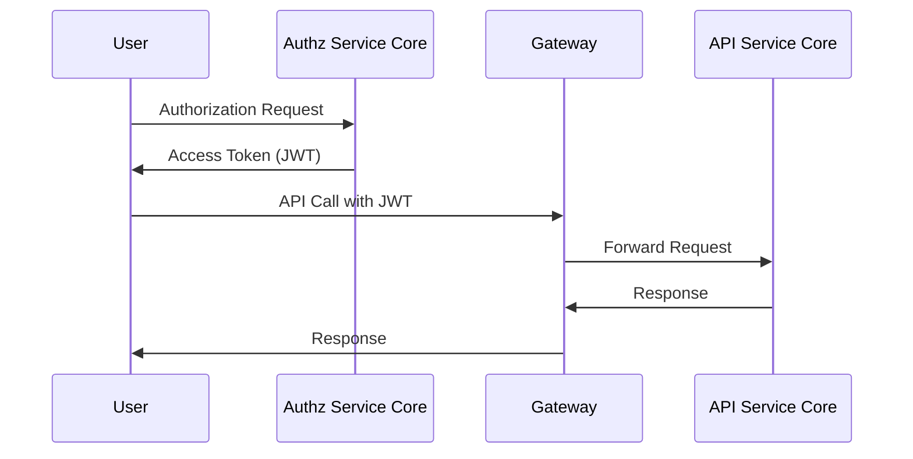

# Authz Service Core

The **Authz Service Core** module is the multi-tenant OAuth2 Authorization Server for the OpenFrame platform. It is responsible for:

- Issuing and validating OAuth2 and OpenID Connect (OIDC) tokens
- Managing multi-tenant authentication contexts
- Supporting username/password and SSO (Google, Microsoft) flows
- Handling tenant onboarding, invitation-based registration, and password reset
- Persisting OAuth2 clients and authorizations in MongoDB

This module powers secure identity and token issuance for downstream services such as the Gateway Service Core, API Service Core, and Client Service Core.

---

## 1. Architectural Overview

At a high level, Authz Service Core acts as the identity provider (IdP) and authorization server in a multi-tenant architecture.

### Key Responsibilities

1. **Authorization Server Configuration** – Configures OAuth2 and OIDC endpoints.
2. **Multi-Tenant Context Resolution** – Resolves tenant per request and isolates keys and users.
3. **JWT Issuance and Custom Claims** – Generates tenant-scoped JWTs with role claims.
4. **SSO Integration** – Dynamic client resolution per tenant for Google and Microsoft.
5. **Registration & Invitation Flows** – Tenant onboarding and user provisioning.
6. **Authorization Persistence** – Stores tokens, codes, and PKCE metadata in MongoDB.

---

## 2. Multi-Tenant Request Model

Multi-tenancy is enforced via a thread-local tenant context.

### Core Components

- `TenantContext` – ThreadLocal holder for current tenant ID.
- `TenantContextFilter` – Extracts tenant from path, query parameter, or session.
- `TenantKeyService` – Provides tenant-specific RSA signing keys.

### Tenant Resolution Strategy

The tenant ID may be derived from:

- URL path segment
- `tenant` query parameter
- Existing HTTP session

Once resolved, it is stored in both:

- ThreadLocal (for service-layer access)
- HTTP session (for multi-step OAuth flows)

This guarantees isolation of:

- Users
- OAuth2 clients
- Signing keys
- SSO configurations

---

## 3. OAuth2 Authorization Server Configuration

The `AuthorizationServerConfig` class configures Spring Authorization Server with:

- Multiple issuers allowed
- OIDC enabled
- JWT-based resource server
- Custom token customizer

### JWT Customization

Access tokens include:

- `tenant_id`
- `userId`
- `roles`

If a user has role `OWNER`, the `ADMIN` role is automatically added to ensure elevated privileges propagate correctly.

---

## 4. Tenant-Specific Key Management

Each tenant has its own RSA key pair for signing JWTs.

### Components

- `TenantKeyService`
- `RsaAuthenticationKeyPairGenerator`
- `PemUtil`

Behavior:

- If no active key exists → generate new key pair
- Private key stored encrypted
- Public key exposed via JWKS endpoint
- Each key has unique `kid`

This allows:

- Tenant-level cryptographic isolation
- Key rotation per tenant

---

## 5. Security Configuration (Non-Authorization Endpoints)

The `SecurityConfig` defines authentication behavior for:

- `/login`
- `/oauth2/**`
- `/password-reset/**`
- `/tenant/**`
- `/sso/providers/**`

### Supported Authentication Modes

1. Form login
2. OAuth2 login (Google, Microsoft)
3. OIDC token validation

### Auto Provisioning Logic

If enabled per tenant:

- Validates allowed domains
- Creates user if not existing
- Assigns default `ADMIN` role
- Executes post-processing hooks

---

## 6. SSO Flows and Dynamic Client Resolution

### Dynamic Client Registration

`DynamicClientRegistrationRepository` resolves OAuth2 clients per tenant at runtime.

This allows:

- Different client IDs per tenant
- Runtime configuration updates
- Tenant-scoped SSO settings

### SSO Flow Handlers

- `InviteSsoHandler`
- `TenantRegSsoHandler`
- `AuthSuccessHandler`

These handlers:

- Decode secure cookies
- Complete onboarding flows
- Redirect back into OAuth flow
- Update last login timestamps

---

## 7. Tenant Onboarding & Invitation Flows

Controllers involved:

- `TenantRegistrationController`
- `InvitationRegistrationController`
- `SsoDiscoveryController`
- `TenantDiscoveryController`
- `PasswordResetController`

The module supports:

- Invitation-based user creation
- SSO-based invitation acceptance
- Full tenant onboarding with SSO
- Password reset via secure token

---

## 8. Authorization Persistence (Mongo)

OAuth2 authorizations are stored in MongoDB.

### Components

- `MongoAuthorizationService`
- `MongoAuthorizationMapper`
- `MongoRegisteredClientRepository`

### Persisted Data

- Authorization codes
- Access tokens
- Refresh tokens
- PKCE parameters
- Token metadata

PKCE parameters are carefully preserved and rehydrated to ensure standards-compliant Authorization Code flow.

---

## 9. JWT and Downstream Services

Tokens issued by Authz Service Core are consumed by:

- Gateway Service Core
- API Service Core
- Client Service Core

JWT contains tenant and role claims, enabling:

- Tenant isolation
- Role-based access control
- Secure inter-service communication

---

## 10. Extension Points

The module provides extension hooks:

- `RegistrationProcessor` (custom tenant/user lifecycle logic)
- `DefaultProviderConfig` implementations
- Custom SSO provider additions

By overriding default beans, platform integrators can:

- Enforce custom policies
- Integrate external provisioning systems
- Implement advanced domain-based onboarding

---

# Summary

The **Authz Service Core** module is the identity backbone of OpenFrame. It provides:

- Multi-tenant OAuth2 and OIDC authorization server
- Per-tenant RSA key isolation
- Dynamic SSO provider resolution
- Invitation and onboarding flows
- Secure token persistence with PKCE support
- JWT issuance with enriched tenant and role claims

It integrates tightly with other core modules and ensures secure, scalable, tenant-aware authentication across the OpenFrame platform.
