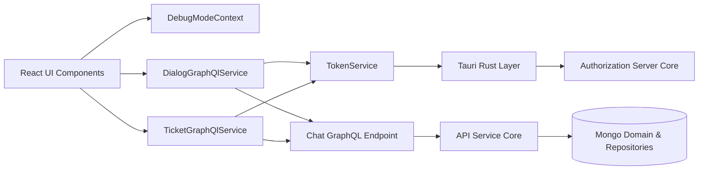
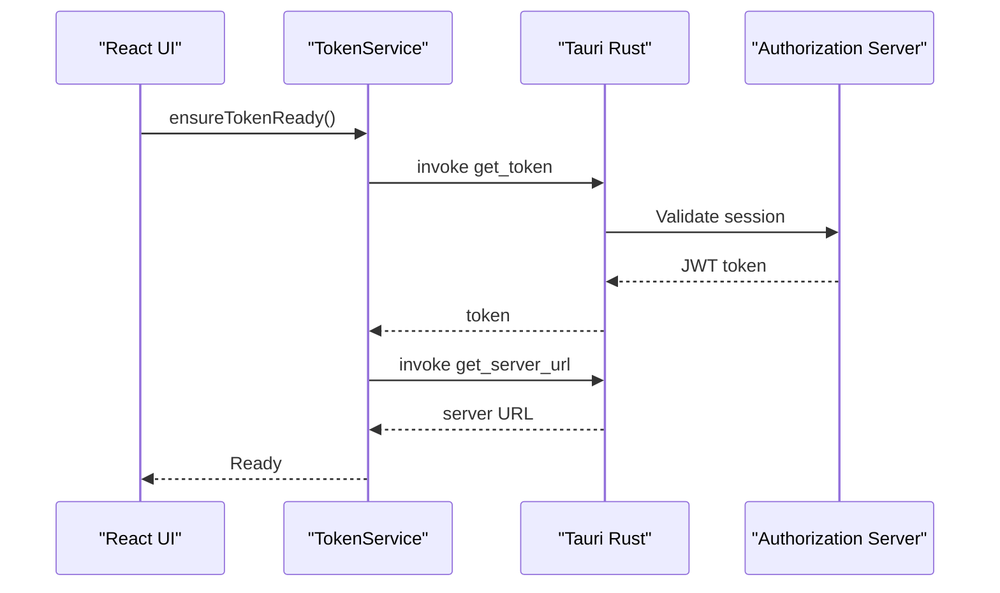
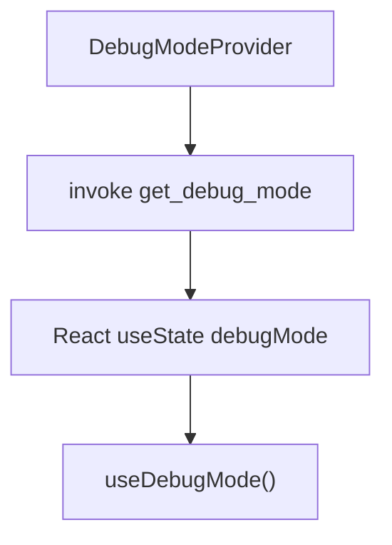
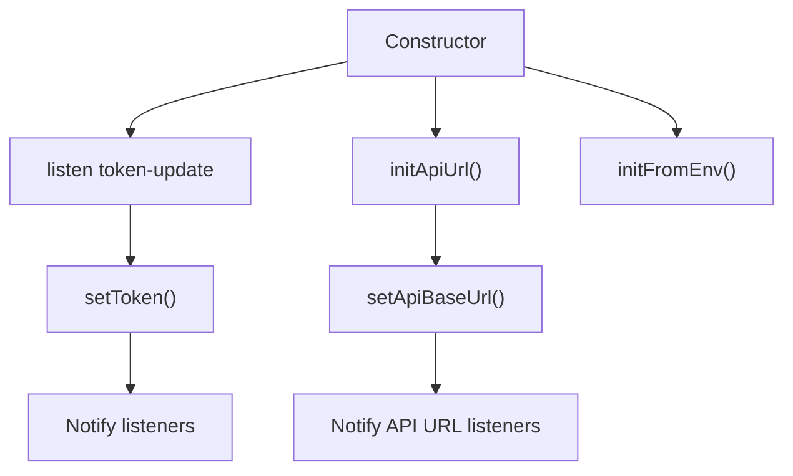
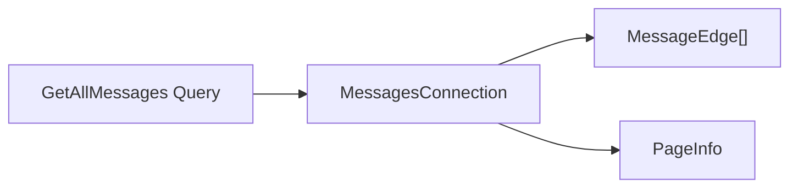
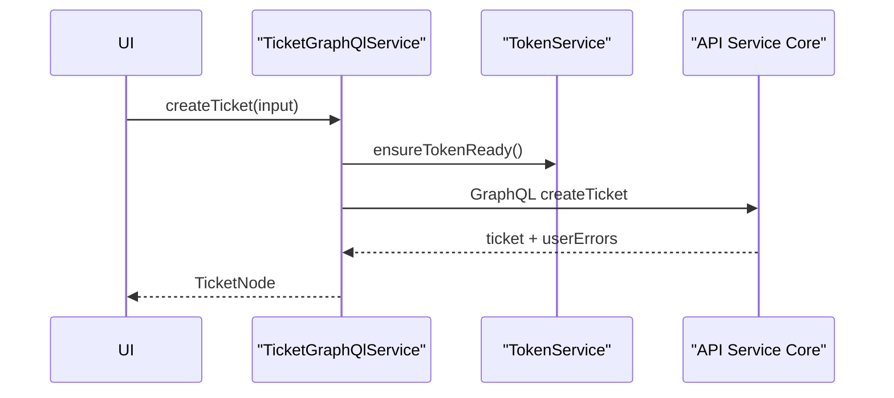

# Chat Client Core

The **Chat Client Core** module provides the frontend-side runtime services and context layer for the OpenFrame Chat desktop client. It is responsible for:

- Managing authentication tokens and API base URLs
- Communicating with the Chat GraphQL backend
- Handling dialog (AI chat) message retrieval and token usage
- Managing ticket creation, retrieval, and attachments
- Providing runtime debug configuration to React components

This module runs inside the Tauri-based desktop client and acts as the bridge between the UI layer and the OpenFrame backend services.

---

## 1. Architectural Overview

At a high level, Chat Client Core sits between the React UI and the backend GraphQL API exposed by the API and Gateway services.



### Key Responsibilities

| Layer | Responsibility |
|--------|----------------|
| DebugModeContext | Runtime debug flag for UI and diagnostics |
| TokenService | Authentication token and API URL lifecycle |
| DialogGraphQlService | Chat dialog and message retrieval |
| TicketGraphQlService | Ticket CRUD and attachment handling |

The Chat Client Core does not implement business logic itself; it delegates to backend services such as:

- [API Service Core](../api-service-core/api-service-core.md)
- [Authorization Server Core](../authorization-server-core/authorization-server-core.md)
- [Gateway Service Core](../gateway-service-core/gateway-service-core.md)
- [Mongo Domain and Repositories](../mongo-domain-and-repositories/mongo-domain-and-repositories.md)

---

## 2. Runtime Flow

### 2.1 Authentication and Initialization Flow

When the desktop application starts:



Key characteristics:

- Token retrieval is delegated to the Rust layer via Tauri commands.
- Tokens are cached in memory and broadcast to listeners.
- API base URL is normalized and stored centrally.

---

## 3. Core Components

### 3.1 DebugModeContext

**Component:** `DebugModeContextType`

This React context provides a global `debugMode` boolean flag to UI components.

#### Responsibilities

- Fetch initial debug state from Tauri (`get_debug_mode`).
- Provide a setter for runtime toggling.
- Guarantee hook safety via `useDebugMode()`.



If the debug state cannot be retrieved, it safely defaults to `false`.

---

### 3.2 TokenService

**Component:** `TokenService`

The TokenService is the most critical infrastructure component in this module.

#### Responsibilities

- Retrieve authentication token via Tauri (`get_token`).
- Listen to `token-update` events from Rust.
- Retrieve API server URL (`get_server_url`).
- Provide subscription APIs for token and API URL updates.
- Ensure both token and API URL are ready before GraphQL calls.

#### Internal Model



#### Key Methods

- `requestToken()` – fetch token if not cached
- `refreshToken()` – force refresh
- `ensureTokenReady()` – guard used by GraphQL services
- `onTokenUpdate(callback)` – subscribe to changes

All network services depend on `ensureTokenReady()` before executing requests.

---

### 3.3 DialogGraphQlService

**Component:** `DialogGraphQlService`

Handles dialog-based chat operations via GraphQL.

#### Responsibilities

- Initialize `GraphQLClient` dynamically based on token and base URL.
- Fetch paginated dialog messages.
- Retrieve dialog token usage for `CLIENT_CHAT`.
- Support optional inclusion of "thinking" fragments.

#### GraphQL Endpoint

```text
{baseUrl}/chat/graphql
```

#### Message Pagination Model



The service follows a Relay-style connection model:

- `edges[]`
- `cursor`
- `pageInfo`

This aligns with backend pagination patterns defined in the API layer.

#### Token Usage Filtering

Only token usage entries with:

```text
chatType = CLIENT_CHAT
```

are returned to the UI.

---

### 3.4 TicketGraphQlService

**Component:** `TicketGraphQlService`

Manages ticket-related GraphQL operations.

#### Responsibilities

- Fetch paginated tickets with status filters and search.
- Retrieve single ticket by ID.
- Create tickets.
- Generate temporary upload URLs for attachments.
- Delete temporary attachments.

#### Ticket Creation Flow



User errors returned by the backend are converted into thrown exceptions.

#### Temporary Attachment Pattern

1. Request upload URL
2. Upload file directly to storage
3. Attach temporary ID to ticket creation
4. Optionally delete temp attachment

This pattern avoids sending large binary payloads through GraphQL.

---

## 4. Integration with Backend Modules

Chat Client Core depends heavily on backend modules but does not reimplement their logic.

### API Service Core

GraphQL resolvers and data fetchers are implemented in:

- [API Service Core](../api-service-core/api-service-core.md)

This includes ticket management, dialog storage, and pagination behavior.

### Authorization Server Core

Authentication, JWT issuance, SSO flows, and tenant context are handled by:

- [Authorization Server Core](../authorization-server-core/authorization-server-core.md)

The Chat Client Core only consumes tokens; it does not manage identity directly.

### Gateway Service Core

Requests may pass through:

- [Gateway Service Core](../gateway-service-core/gateway-service-core.md)

for routing, CORS, rate limiting, and upstream resolution.

### Mongo Domain and Repositories

All persisted entities (tickets, dialogs, users, attachments) ultimately map to MongoDB documents defined in:

- [Mongo Domain and Repositories](../mongo-domain-and-repositories/mongo-domain-and-repositories.md)

---

## 5. Error Handling Strategy

| Component | Strategy |
|------------|-----------|
| TokenService | Fallback to cached token; throw if unavailable |
| DialogGraphQlService | Log and return `null` on failure |
| TicketGraphQlService | Throw on mutation userErrors; return `null` for queries |
| DebugModeContext | Default to `false` if fetch fails |

This approach prioritizes:

- UI resilience
- Clear mutation failure feedback
- Safe defaults during initialization

---

## 6. Design Principles

### 6.1 Singleton Service Pattern

Both GraphQL services and TokenService are exported as singletons:

```text
export const dialogGraphQlService = new DialogGraphQlService();
export const ticketGraphQlService = new TicketGraphQlService();
export const tokenService = new TokenService();
```

This ensures:

- Shared authentication state
- Centralized header management
- Controlled lifecycle via `dispose()`

### 6.2 Lazy Client Initialization

GraphQL clients are created only when:

- A valid token exists
- API base URL is known

This avoids premature failures during app bootstrap.

### 6.3 Strongly Typed Contracts

All responses are typed:

- `MessagesConnection`
- `TicketsConnection`
- `TicketNode`
- `DialogTokenUsage`

This ensures frontend/backend contract consistency.

---

## 7. Summary

The **Chat Client Core** module is the communication backbone of the OpenFrame Chat desktop client.

It provides:

- Secure token lifecycle management
- GraphQL communication layer
- Dialog and ticket domain access
- Debug configuration context

By delegating business logic to backend services and focusing on authentication, state management, and typed API integration, Chat Client Core remains lightweight, testable, and maintainable.

It forms the essential client-side boundary between the React UI and the distributed OpenFrame backend ecosystem.