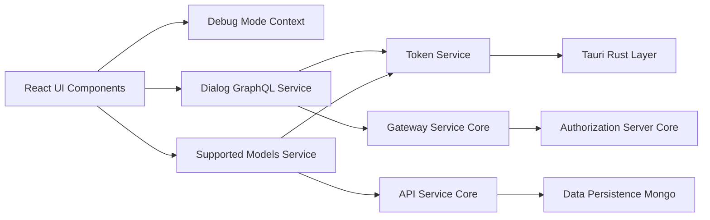
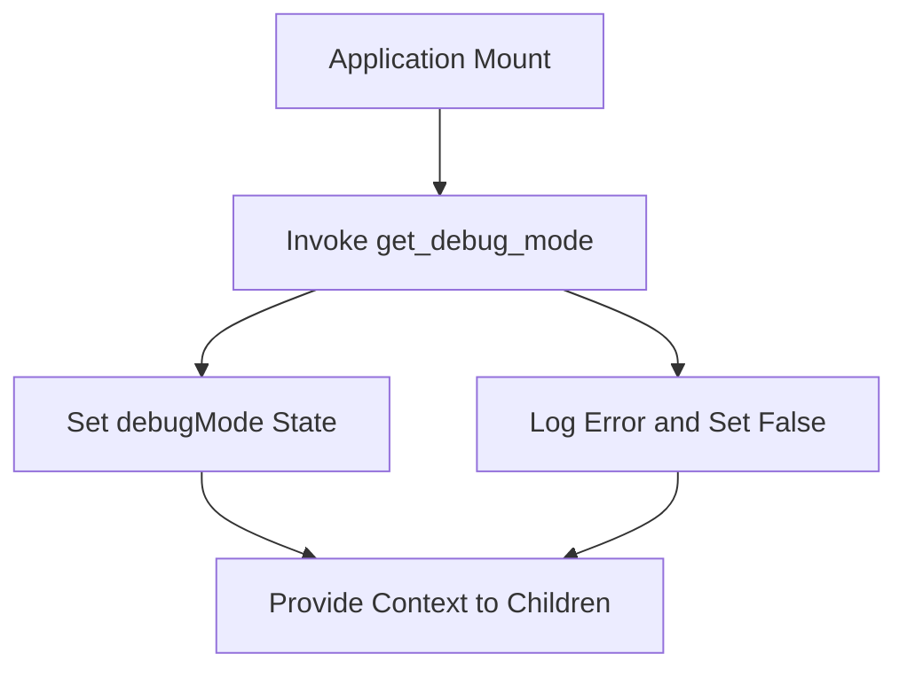
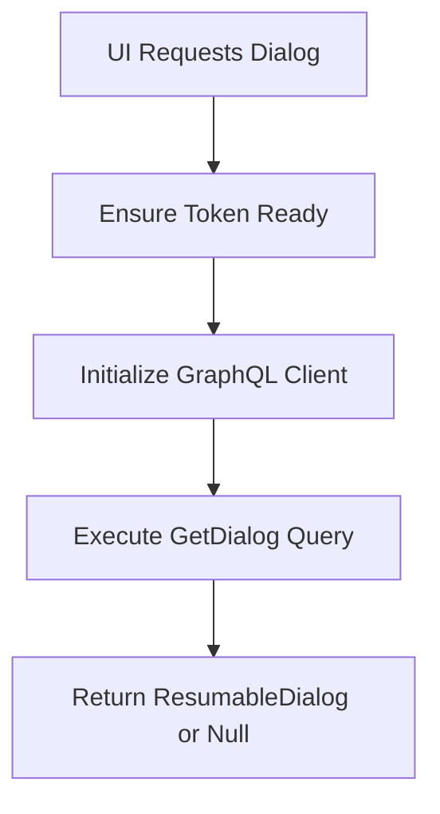
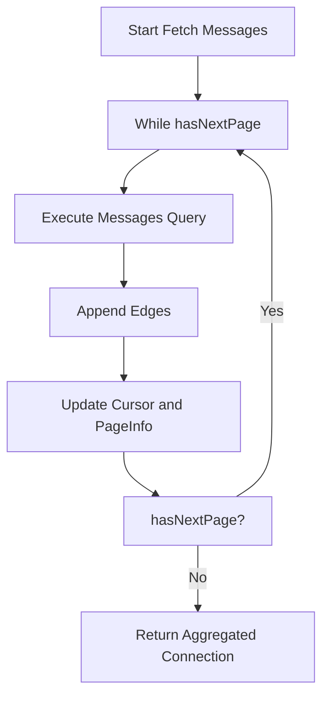
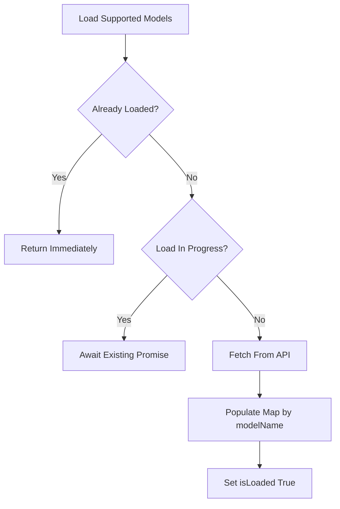
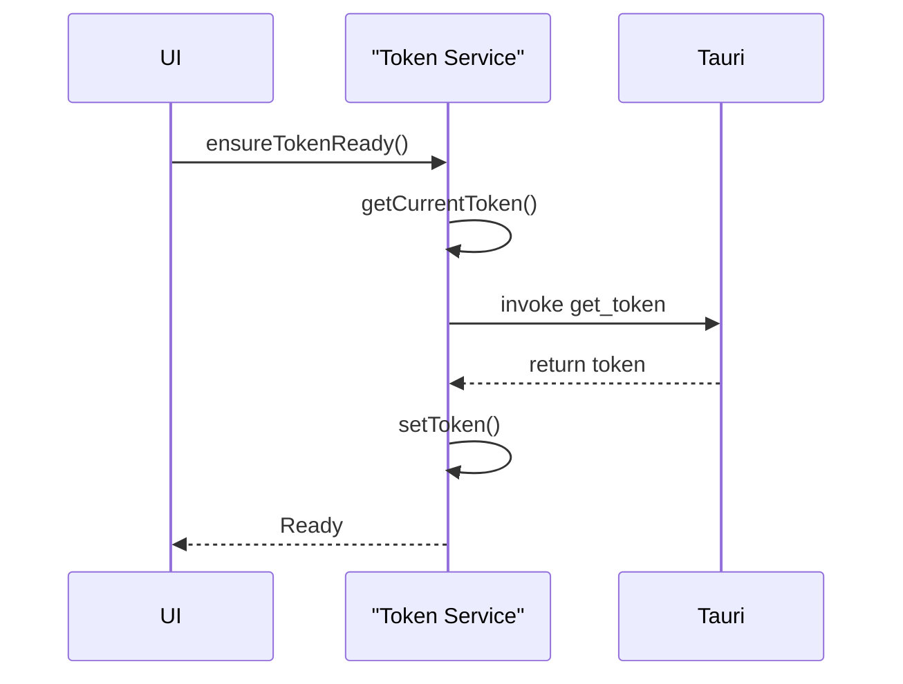
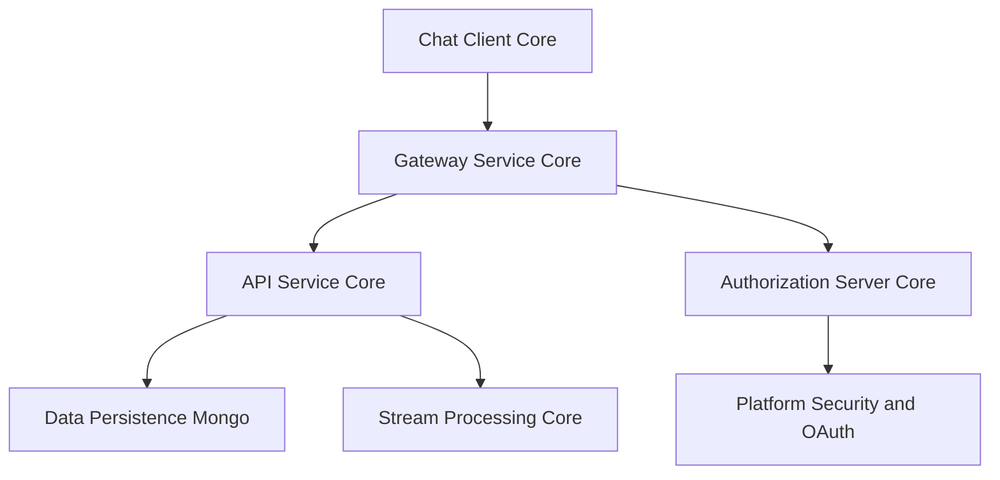

# Chat Client Core

The **Chat Client Core** module implements the desktop chat client for the OpenFrame platform. It is responsible for:

- Managing authentication tokens and API base URLs in a Tauri environment
- Communicating with backend chat services via GraphQL and REST
- Handling dialog lifecycle and paginated message retrieval
- Loading and caching supported AI models
- Providing debug-mode state to the React component tree

This module runs inside the OpenFrame desktop client (Tauri + React) and acts as the frontend bridge to backend services such as the API Service Core, Authorization Server Core, and Gateway Service Core.

---

## High-Level Architecture

The Chat Client Core sits between the React UI layer and the backend platform services.



### Responsibilities by Layer

- **React Context Layer** – Provides global UI state such as debug mode.
- **Service Layer** – Encapsulates communication with backend APIs.
- **Token Coordination Layer** – Ensures valid authentication tokens and base URLs are available before API calls.
- **Backend Services** – Provide GraphQL chat endpoints, AI configuration, authentication, and persistence.

---

## Core Components

The Chat Client Core module consists of four primary components:

1. **DebugModeContextType** – UI-level debug state management.
2. **DialogGraphQLService** – GraphQL-based dialog and message retrieval.
3. **SupportedModelsService** – Fetching and caching AI model metadata.
4. **TokenService** – Token and API URL lifecycle management via Tauri.

Each component has a clearly scoped responsibility to maintain separation of concerns.

---

# Debug Mode Context

**Component:** `DebugModeContextType`  
**Location:** `clients/openframe-chat/src/contexts/DebugModeContext.tsx`

The Debug Mode Context provides a global boolean flag (`debugMode`) to the React application tree.

## Purpose

- Enable or disable debug-specific UI behavior
- Initialize debug mode state from the Tauri backend
- Provide a strongly typed React Context API

## Initialization Flow



## Key Characteristics

- Uses React `createContext`, `useState`, and `useEffect`
- Fetches initial state via Tauri `invoke("get_debug_mode")`
- Enforces provider usage through runtime guard in `useDebugMode()`

This keeps debug concerns isolated from business logic and backend communication.

---

# Dialog GraphQL Service

**Component:** `DialogGraphQLService`  
**Location:** `clients/openframe-chat/src/services/dialogGraphQLService.ts`

The Dialog GraphQL Service manages all dialog-related communication with the backend chat GraphQL endpoint.

## Responsibilities

- Initialize and cache a `GraphQLClient`
- Attach bearer tokens to all requests
- Retrieve resumable dialog metadata
- Fetch paginated dialog messages
- Transparently handle cursor-based pagination

## Endpoint Construction

The endpoint is dynamically constructed:

```text
{API_BASE_URL}/chat/graphql
```

The API base URL and bearer token are supplied by the Token Service.

## Dialog Retrieval Flow



## Message Pagination Strategy

The service implements iterative cursor-based pagination:



### Key Design Decisions

- **Client Reuse** – Avoids re-instantiating the GraphQL client when endpoint remains unchanged.
- **Token Rebinding** – Updates headers if token changes.
- **Fail-Safe Returns** – Returns `null` on failure instead of throwing in UI-level methods.

## Backend Dependencies

The GraphQL endpoint is typically exposed through:

- [Gateway Service Core](../gateway_service_core/gateway_service_core.md)
- [API Service Core](../api_service_core/api_service_core.md)
- [Authorization Server Core](../authorization_server_core/authorization_server_core.md)

These services manage routing, authentication, and business logic execution.

---

# Supported Models Service

**Component:** `SupportedModelsService`  
**Location:** `clients/openframe-chat/src/services/supportedModelsService.ts`

The Supported Models Service retrieves and caches AI model configuration from the backend.

## Responsibilities

- Fetch supported AI models from REST endpoint
- Normalize and cache models by `modelName`
- Provide lookup and validation utilities
- Prevent duplicate concurrent fetches

## REST Endpoint

```text
{API_BASE_URL}/chat/api/v1/ai-configuration/supported-models
```

## Load Strategy



## Internal Data Model

Models are stored in:

```text
Map<string, SupportedModel>
```

This enables:

- O(1) lookup by model name
- Provider-agnostic flattening
- Efficient reset and reload

## Backend Integration

The supported models endpoint is implemented server-side in chat configuration APIs exposed through the API Service Core.

---

# Token Service

**Component:** `TokenService`  
**Location:** `clients/openframe-chat/src/services/tokenService.ts`

The Token Service is the authentication coordination layer for the Chat Client Core.

## Responsibilities

- Receive token updates from Tauri events
- Request token via Tauri command
- Retrieve and normalize API base URL
- Provide subscription hooks for token and URL updates
- Ensure token and API URL readiness before API calls

## Initialization Sources

Tokens and API URLs can originate from:

1. Tauri event `token-update`
2. Tauri command `get_token`
3. Tauri command `get_server_url`
4. Environment variables `VITE_TOKEN` and `VITE_SERVER_URL`

## Token Lifecycle



## Event-Driven Updates

The service registers a Tauri event listener:

```text
listen("token-update", callback)
```

When a token update is received:

- The token is stored internally
- All registered listeners are notified
- Dependent services automatically use the new token

## API URL Normalization

Server URLs are normalized to ensure they begin with `http://` or `https://`. If omitted, `https://` is automatically prefixed.

## Security Considerations

- Tokens are masked in logs (first and last 4 characters only)
- Token storage remains in memory (not persisted to disk by this module)
- All backend calls include `Authorization: Bearer <token>` headers

The actual JWT validation and OAuth flows are implemented in:

- [Platform Security and OAuth](../platform_security_and_oauth/platform_security_and_oauth.md)
- [Authorization Server Core](../authorization_server_core/authorization_server_core.md)

---

# Interaction with the Overall System

The Chat Client Core integrates with the broader OpenFrame architecture:



## Key Integration Points

- **Authentication** – Delegated to Authorization Server Core and Platform Security modules.
- **Chat GraphQL** – Routed via Gateway Service Core.
- **AI Model Configuration** – Served by API Service Core.
- **Data Storage** – Managed by Data Persistence Mongo.
- **Event Processing** – Handled by Stream Processing Core.

---

# Design Principles

The Chat Client Core follows these architectural principles:

1. **Separation of Concerns** – UI state, API communication, and authentication are strictly separated.
2. **Lazy Initialization** – Tokens and models are loaded only when needed.
3. **Resilience** – Service methods fail gracefully and return `null` where appropriate.
4. **Event-Driven Updates** – Token changes propagate automatically to dependent services.
5. **Backend-Agnostic UI** – The UI depends on service abstractions, not raw endpoints.

---

# Summary

The **Chat Client Core** module is the frontend orchestration layer for chat functionality within OpenFrame. It:

- Bridges Tauri and React
- Manages authentication state
- Communicates with GraphQL and REST endpoints
- Implements robust pagination and caching strategies
- Integrates cleanly with backend microservices

By centralizing token management and API communication, this module ensures that the chat experience remains secure, scalable, and maintainable within the larger OpenFrame ecosystem.