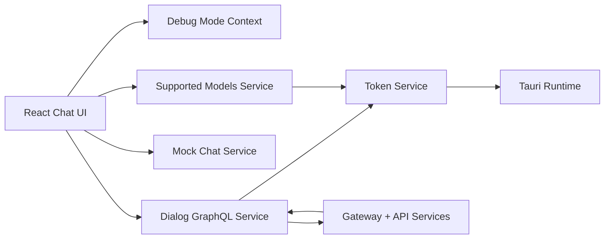
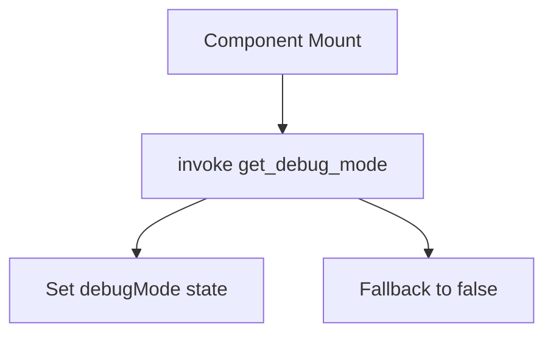
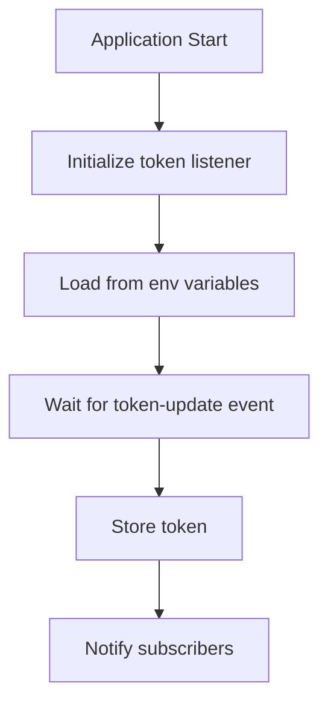
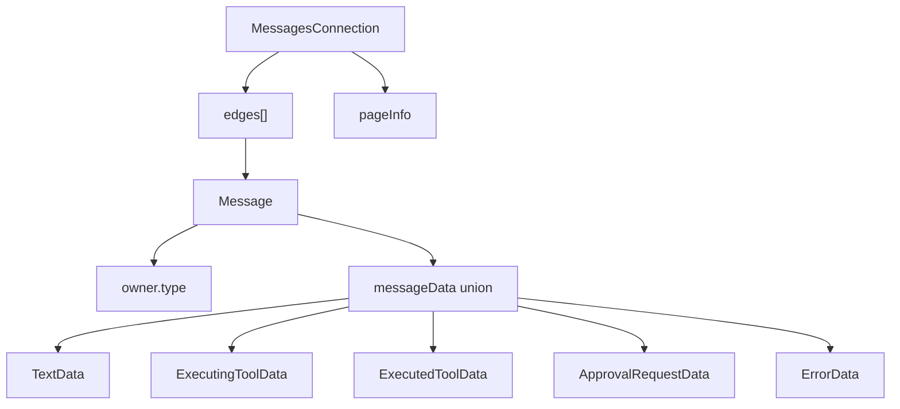
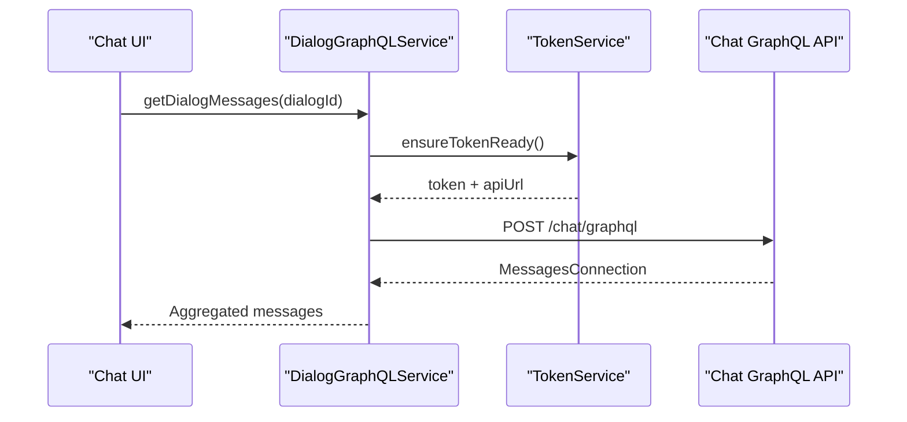
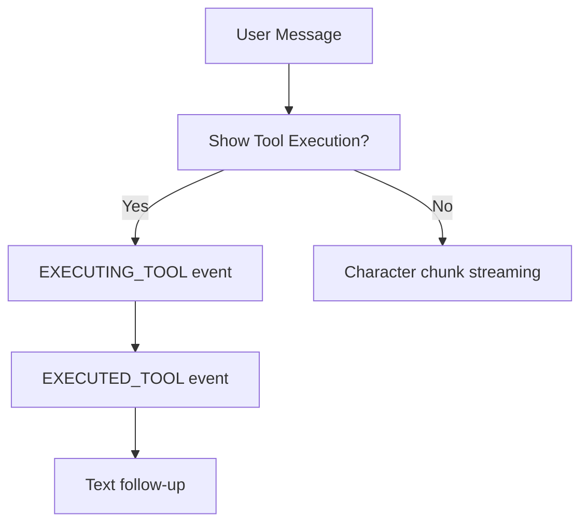
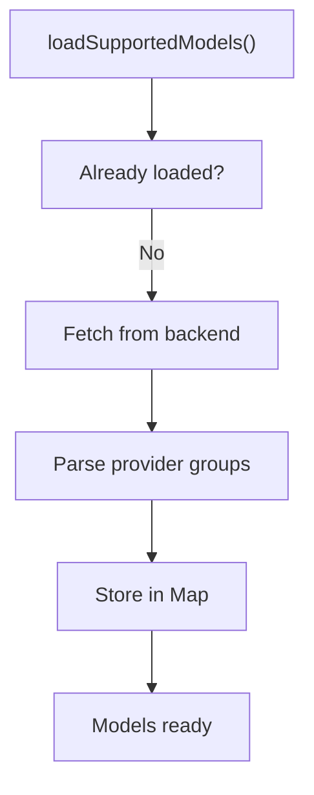
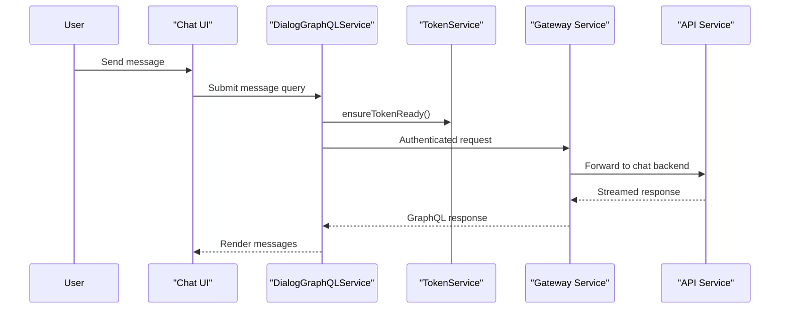

# Chat Client Core

## Overview

The **Chat Client Core** module implements the desktop chat experience for OpenFrame tenants. It is responsible for:

- Managing authentication tokens and API base URLs via Tauri integration
- Communicating with the backend chat GraphQL API
- Streaming chat responses (including tool execution events)
- Loading supported AI model metadata
- Providing development utilities such as debug mode

This module runs on the client side (Tauri + React) and integrates with backend services such as:

- [API Service Core](../api_service_core/api_service_core.md)
- [Authorization Service Core](../authz_service_core/authz_service_core.md)
- [Gateway Service Core](../gateway_service_core/gateway_service_core.md)

It acts as the primary bridge between the tenant desktop UI and the OpenFrame platform.

---

## High-Level Architecture



### Responsibilities by Layer

| Layer | Responsibility |
|--------|----------------|
| React Context | Application-wide debug state |
| Services | API communication, streaming, model metadata |
| Token Layer | Authentication + server URL management |
| Backend | GraphQL chat, AI config, tool execution |

---

## Core Components

### 1. Debug Mode Context

**Component:** `DebugModeContextType`

Provides a React context for enabling or disabling debug mode across the application.

### Responsibilities

- Fetches debug mode state from Tauri (`get_debug_mode` command)
- Exposes `debugMode` boolean
- Exposes `setDebugMode` setter
- Enforces usage inside `DebugModeProvider`

### Initialization Flow



Debug mode is particularly useful for:

- Simulating chat flows
- Triggering mock services
- Inspecting token lifecycle behavior

---

### 2. Token Service

**Component:** `TokenService`

The central authentication and API configuration manager for the chat client.

### Key Capabilities

- Listens for `token-update` Tauri events
- Requests token via `get_token` command
- Retrieves server URL via `get_server_url`
- Normalizes API URLs
- Notifies subscribers on token or API URL updates
- Ensures token + API URL readiness before API calls

### Token Lifecycle



### Backend Relationship

The token issued by the backend originates from:

- [Authorization Service Core](../authz_service_core/authz_service_core.md)

Requests are typically routed through:

- [Gateway Service Core](../gateway_service_core/gateway_service_core.md)

---

### 3. Dialog GraphQL Service

**Component:** `DialogGraphQLService`

Handles all chat-related GraphQL operations.

### Core Queries

- `GetDialog` – retrieves resumable dialog metadata
- `GetAllMessages` – paginated message retrieval

### Responsibilities

- Lazy initialization of `GraphQLClient`
- Injects Bearer token into headers
- Paginates through all message edges
- Supports tool execution message types
- Graceful error handling

### Message Model Structure



### Backend Interaction Flow



The GraphQL endpoint is derived from:

```text
{apiBaseUrl}/chat/graphql
```

---

### 4. Mock Chat Service

**Component:** `MockChatService`

Provides simulated streaming responses for development and testing.

### Features

- Async generator-based streaming
- Character chunk streaming for realism
- Simulated tool execution events
- Optional simulated network errors

### Streaming Model



This service mirrors the structure of real backend responses, including:

- Tool execution lifecycle
- Structured `MessageSegment` events
- Streaming delays

It is typically enabled during development or debug scenarios.

---

### 5. Supported Models Service

**Component:** `SupportedModelsService`

Fetches and caches AI model metadata from the backend.

### Endpoint

```text
GET /chat/api/v1/ai-configuration/supported-models
```

### Responsibilities

- Fetch once and cache models
- Normalize provider-based response into a flat map
- Provide lookup helpers:
  - `getModelDisplayName`
  - `getModel`
  - `isModelSupported`
  - `getAllModels`
- Reset cache when needed

### Loading Flow



The backend implementation resides in:

- [API Service Core](../api_service_core/api_service_core.md)

---

## End-to-End Chat Flow



---

## Error Handling Strategy

| Component | Strategy |
|------------|----------|
| Token Service | Throws if token or API URL unavailable |
| Dialog Service | Logs errors, returns `null` on failure |
| Mock Service | Simulates network failure scenarios |
| Supported Models | Graceful fallback if fetch fails |

The UI layer is expected to handle `null` results safely.

---

## Security Considerations

- Tokens are masked in logs
- Authorization header uses Bearer scheme
- Token stored only in memory
- Server URL normalized to HTTPS when missing scheme
- All GraphQL requests include authentication headers

The security model aligns with:

- [Security Shared](../security_shared/security_shared.md)
- [Authorization Service Core](../authz_service_core/authz_service_core.md)

---

## Relationship to the Overall Platform

The Chat Client Core serves as the **interactive AI interface** within the OpenFrame ecosystem.

It connects:

- Tenant desktop UI
- AI orchestration services
- Tool execution infrastructure
- Authentication and authorization stack

In the broader architecture:

- Backend logic lives in API, Gateway, and Authorization services
- Data is persisted in Mongo and Kafka-backed layers
- Tool events and activity streams are processed by stream services

The Chat Client Core focuses exclusively on:

- Session-aware UI interaction
- Streaming experience
- Tool execution visualization
- AI model configuration awareness

---

## Summary

The **Chat Client Core** module provides:

- A token-aware GraphQL client
- Real-time streaming support
- Tool execution visualization support
- Model configuration awareness
- Debug and development utilities

It is the client-side orchestration layer that transforms backend AI capabilities into a responsive, secure, and extensible desktop chat experience within OpenFrame.