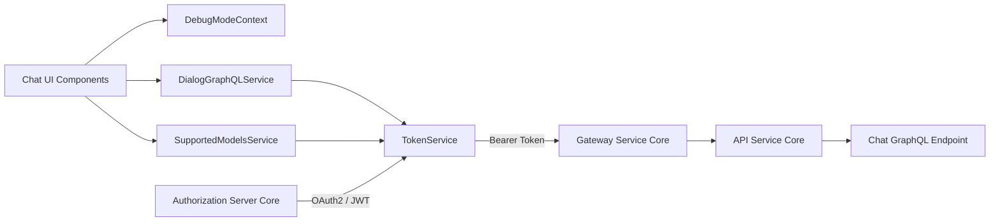
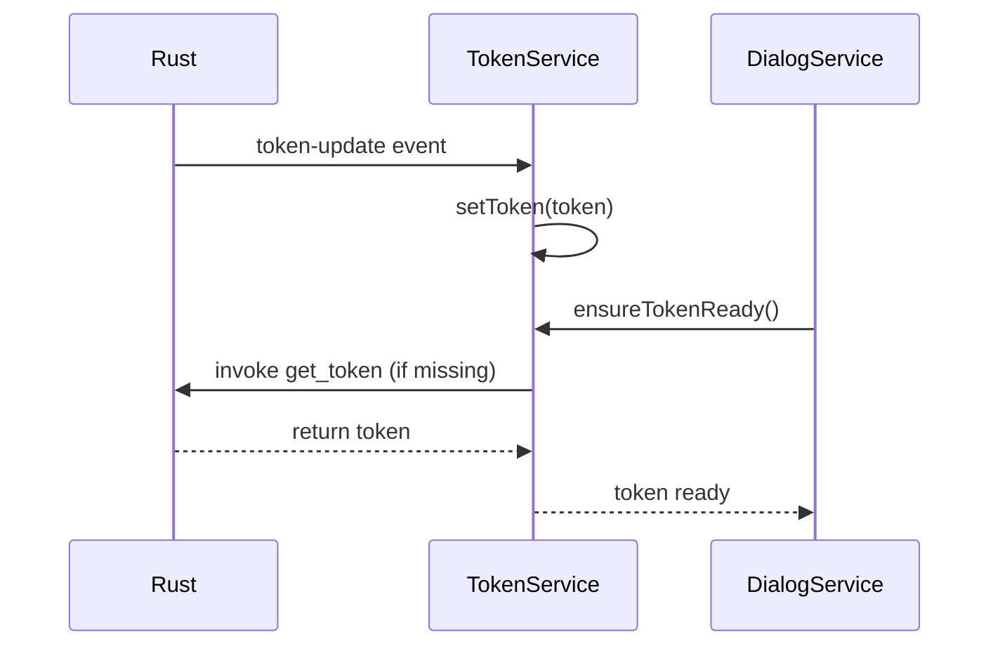
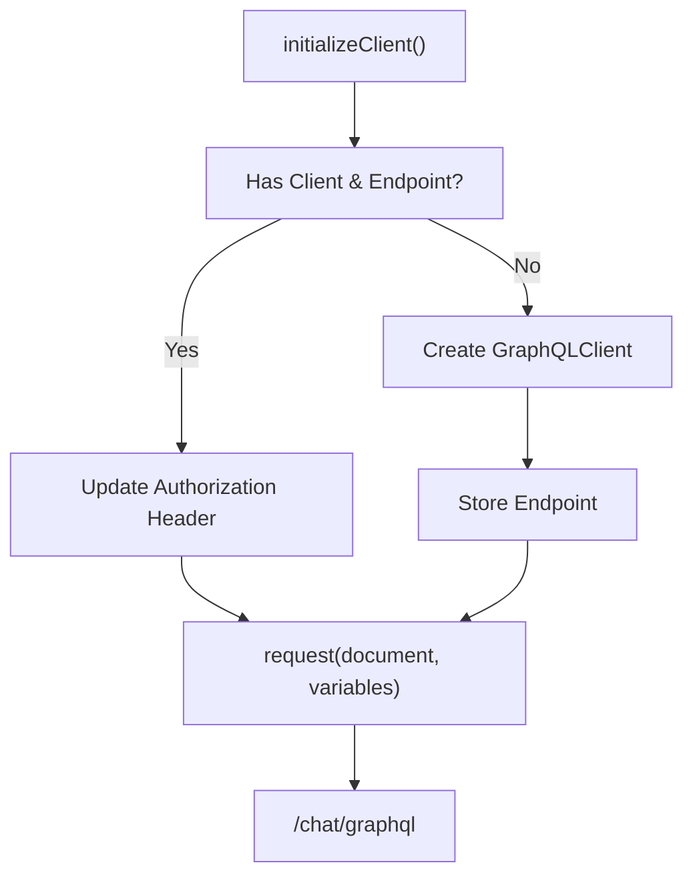
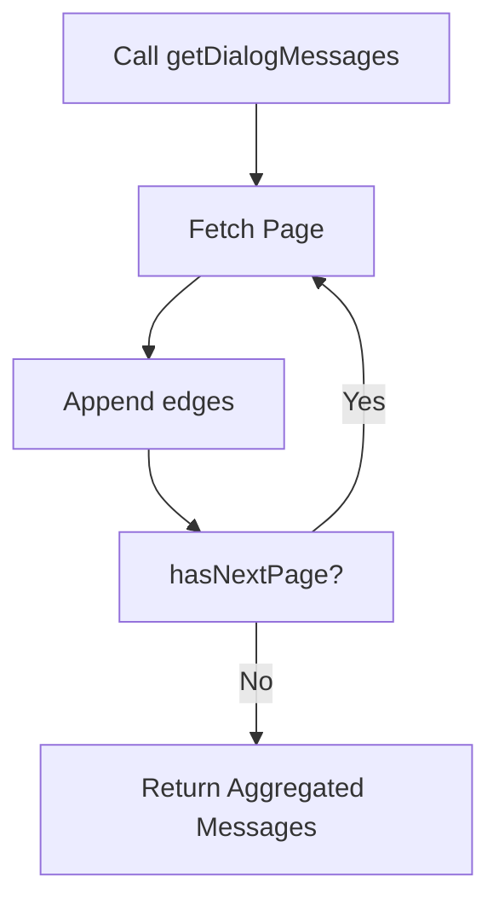
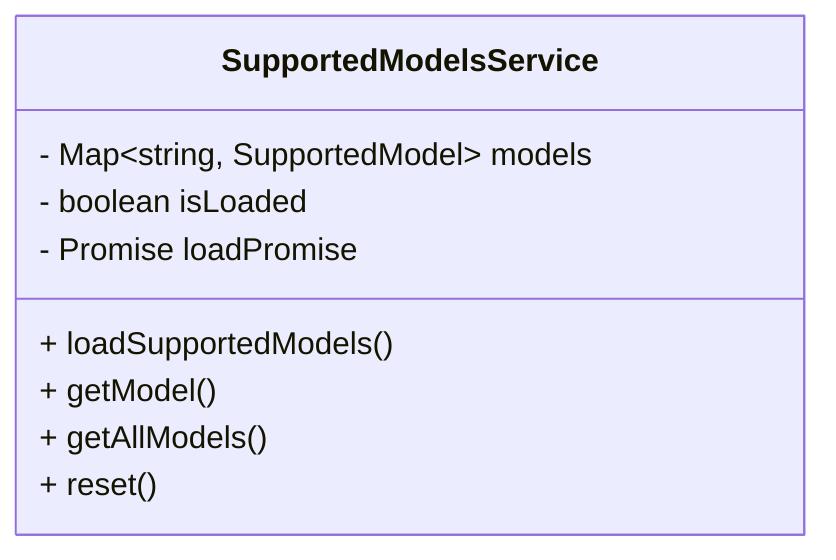
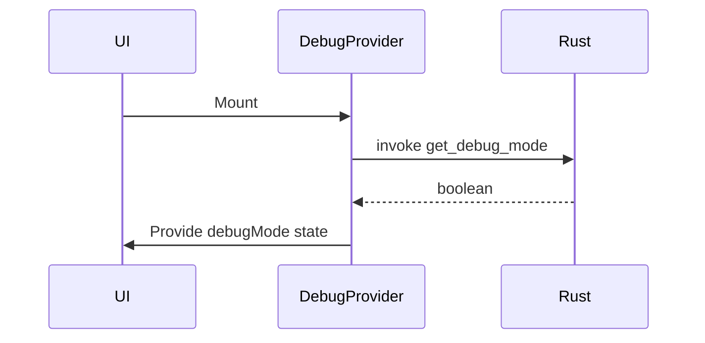
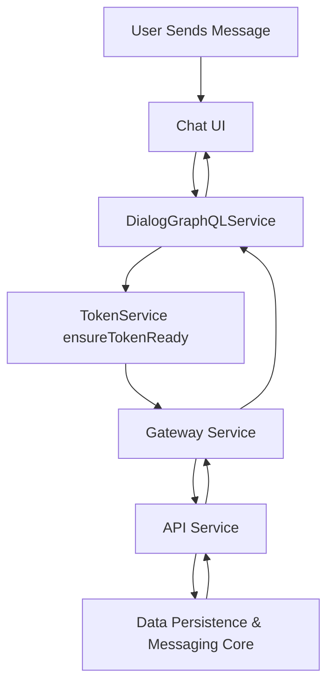

# Chat Client Core

## Overview

The **Chat Client Core** module is the desktop chat runtime for OpenFrame, responsible for:

- Managing authentication tokens and API endpoint configuration
- Communicating with the backend Chat GraphQL API
- Fetching and paginating dialog history
- Discovering supported AI models
- Providing runtime debug state for development and troubleshooting

It runs inside a **Tauri-based desktop environment**, where Rust provides secure token and configuration delivery, and the TypeScript client consumes them via Tauri events and commands.

This module acts as the **client-side integration layer** between the Chat UI and the backend services such as:

- [API Service Core](../api_service_core/api_service_core.md)
- [Authorization Server Core](../authorization_server_core/authorization_server_core.md)
- [Gateway Service Core](../gateway_service_core/gateway_service_core.md)

---

## High-Level Responsibilities

| Responsibility | Component |
|---------------|------------|
| Token lifecycle & API URL management | `TokenService` |
| GraphQL dialog & message retrieval | `DialogGraphQLService` |
| AI model discovery | `SupportedModelsService` |
| Debug runtime state | `DebugModeContextType` |

---

## Architecture Overview



### Flow Summary

1. **Authorization Server Core** issues tokens.
2. The Rust layer injects tokens into the Tauri runtime.
3. `TokenService` receives and manages tokens.
4. `DialogGraphQLService` and `SupportedModelsService` use the token to call backend APIs.
5. The Chat UI renders dialogs, messages, and model information.

---

# Core Components

## 1. TokenService

**Component:**  
`openframe-oss-tenant.clients.openframe-chat.src.services.tokenService.TokenService`

### Purpose

`TokenService` is the authentication backbone of the Chat Client Core. It:

- Listens for token updates from the Rust (Tauri) backend
- Requests tokens on demand
- Manages the current API base URL
- Notifies subscribers about token and API URL changes
- Ensures token + API URL are ready before API calls

### Token Initialization Flow



### Key Capabilities

- **Tauri Event Listener**
  - Listens to `token-update`
- **Command Invocation**
  - Calls `get_token`
  - Calls `get_server_url`
- **Environment Bootstrap**
  - Reads `VITE_TOKEN`
  - Reads `VITE_SERVER_URL`
- **Observer Pattern**
  - `onTokenUpdate(callback)`
  - `onApiUrlUpdate(callback)`

### Design Considerations

- Singleton instance (`export const tokenService`)
- Safe logging via token masking
- Lazy initialization
- Defensive checks in `ensureTokenReady()`

---

## 2. DialogGraphQLService

**Component:**  
`openframe-oss-tenant.clients.openframe-chat.src.services.dialogGraphQLService.DialogGraphQLService`

### Purpose

Handles all Chat-related GraphQL operations:

- Fetch resumable dialog
- Fetch paginated dialog messages
- Aggregate full history via cursor-based pagination

### GraphQL Endpoint

```text
{API_BASE_URL}/chat/graphql
```

The base URL is provided by `TokenService`.

### Architecture



### Pagination Strategy

`getDialogMessages()`:

- Uses cursor-based pagination
- Loops while `hasNextPage` is true
- Aggregates all edges into a single response



### Supported Message Types

The GraphQL schema supports polymorphic `messageData` types such as:

- Text
- ExecutingToolData
- ExecutedToolData
- ApprovalRequestData
- ApprovalResultData
- ErrorData

This enables:

- Tool execution flows
- Approval workflows
- AI-generated responses
- Error reporting

---

## 3. SupportedModelsService

**Component:**  
`openframe-oss-tenant.clients.openframe-chat.src.services.supportedModelsService.SupportedModelsService`

### Purpose

Discovers and caches AI models supported by the backend.

### Endpoint

```text
GET /chat/api/v1/ai-configuration/supported-models
```

### Responsibilities

- Fetch models once (lazy load)
- Cache models in memory
- Provide:
  - `getModelDisplayName()`
  - `getModel()`
  - `getAllModels()`
  - `isModelSupported()`

### Internal State



### Design Characteristics

- Idempotent loading
- Promise deduplication (`loadPromise`)
- In-memory cache
- Graceful failure handling

---

## 4. DebugModeContext

**Component:**  
`openframe-oss-tenant.clients.openframe-chat.src.contexts.DebugModeContext.DebugModeContextType`

### Purpose

Provides a global React context for debug mode.

### Initialization Flow



### Responsibilities

- Fetch initial debug state from Tauri
- Expose:
  - `debugMode`
  - `setDebugMode(enabled)`
- Enforce usage within provider (`useDebugMode()` guard)

### Use Cases

- Verbose logging
- Displaying technical metadata
- Feature flags during development

---

# Integration with Backend Modules

The Chat Client Core does not directly manage business logic or persistence. Instead, it relies on backend modules:

## API Service Core

- Hosts GraphQL resolvers
- Provides Chat schema
- Connects to data layer

See:  
[API Service Core](../api_service_core/api_service_core.md)

## Authorization Server Core

- Issues OAuth2 tokens
- Manages tenant-aware authentication

See:  
[Authorization Server Core](../authorization_server_core/authorization_server_core.md)

## Gateway Service Core

- Validates JWT tokens
- Routes requests to internal services

See:  
[Gateway Service Core](../gateway_service_core/gateway_service_core.md)

---

# End-to-End Request Flow



---

# Design Principles

- **Separation of concerns**: Auth, GraphQL, models, and debug state are isolated.
- **Lazy initialization**: Clients and models are loaded only when needed.
- **Resilience**: Failures degrade gracefully (null returns instead of crashes).
- **Security-first**: Tokens are never fully logged.
- **Tenant-aware architecture**: API URL and token are dynamically injected.

---

# Summary

The **Chat Client Core** is a lightweight but critical integration layer that:

- Bridges Tauri (Rust) and the TypeScript frontend
- Secures and manages authentication state
- Interfaces with GraphQL-based chat APIs
- Enables AI model configuration discovery
- Provides runtime debugging controls

It forms the foundation for the OpenFrame desktop chat experience while delegating business logic, persistence, and security enforcement to backend service modules.