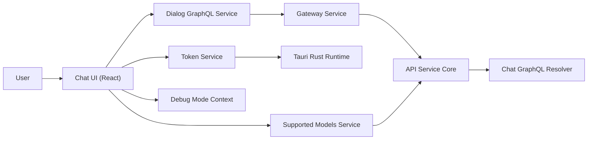
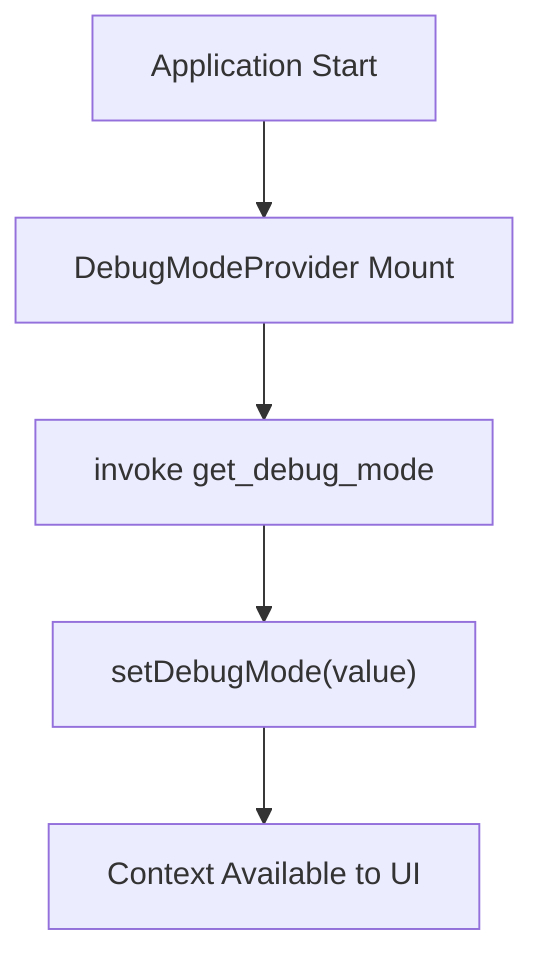
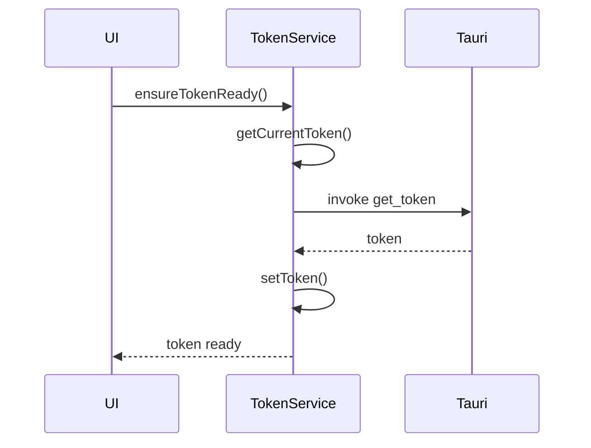
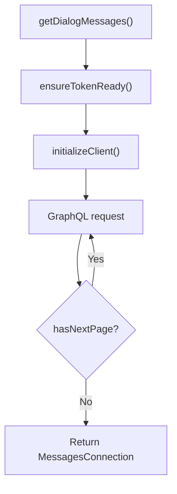
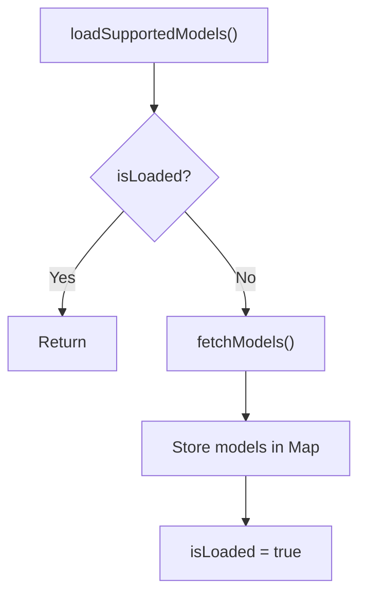
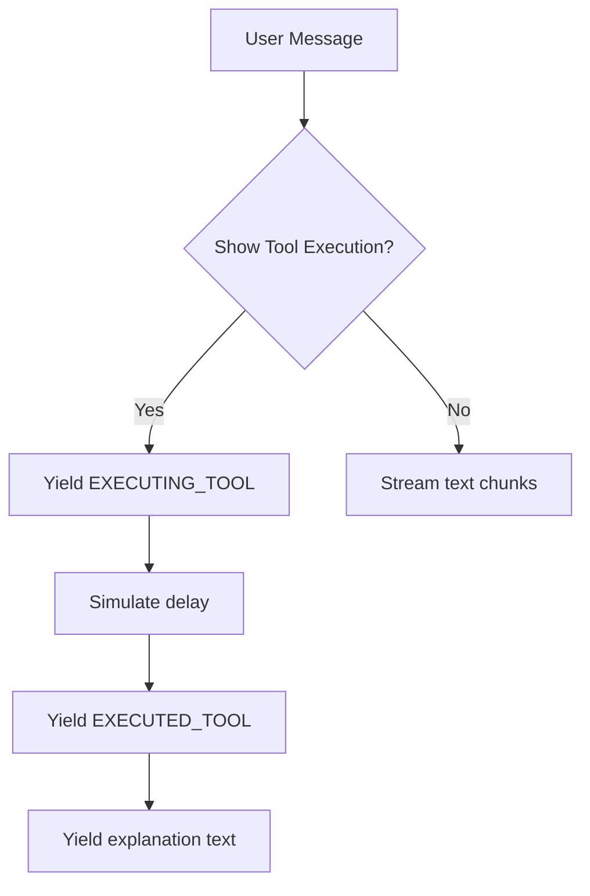
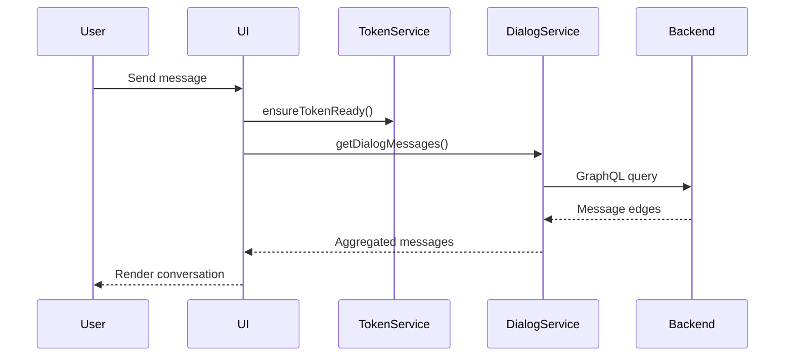

# Chat Client Openframe Chat

## Overview

The **Chat Client Openframe Chat** module is the desktop chat client layer of the OpenFrame ecosystem. It is responsible for:

- Managing authentication tokens and API endpoints via Tauri integration.
- Communicating with backend chat services over GraphQL and REST.
- Streaming AI responses, including tool execution events.
- Loading supported AI model metadata for dynamic model selection.
- Providing runtime debug capabilities for development and troubleshooting.

This module runs inside a Tauri-based desktop application and bridges:

- The local Rust runtime (via Tauri events and commands).
- The OpenFrame Gateway and API services.
- The AI-powered chat backend exposed through `/chat/graphql` and `/chat/api/v1` endpoints.

It is a **client-side orchestration layer**, not a domain logic layer. Business logic, persistence, authorization, and AI orchestration are handled by backend services such as:

- API Service Core (GraphQL + REST)
- Authorization Server Core (OAuth2 / OIDC)
- Gateway Service Core (edge routing + JWT validation)

---

## High-Level Architecture



### Key Responsibilities

| Layer | Responsibility |
|-------|---------------|
| UI Layer | Renders messages, tool executions, and dialog state |
| Token Service | Handles authentication token + API URL lifecycle |
| Dialog GraphQL Service | Fetches dialogs and paginated messages |
| Supported Models Service | Loads AI model metadata |
| Mock Chat Service | Provides local streaming simulation for development |
| Debug Mode Context | Controls runtime debug behavior |

---

## Core Components

### 1. Debug Mode Context

**Component:** `DebugModeContextType`

The Debug Mode Context provides a global React context for enabling or disabling debug behavior at runtime.

### Responsibilities

- Fetches debug state from the Tauri backend using `get_debug_mode`.
- Exposes:
  - `debugMode: boolean`
  - `setDebugMode(enabled: boolean)`
- Ensures `useDebugMode()` can only be used inside a provider.

### Initialization Flow



If fetching fails, debug mode defaults to `false`.

---

### 2. Token Service

**Component:** `TokenService`

The Token Service is the authentication and API configuration backbone of the Chat Client.

It manages:

- Current OAuth access token
- Current API base URL
- Subscriptions to token updates
- Subscriptions to API URL updates
- Synchronization with the Tauri Rust layer

### Token Lifecycle



### Key Features

- Listens for `token-update` events from Rust.
- Can request token via `invoke get_token`.
- Can request server URL via `invoke get_server_url`.
- Normalizes API URLs (adds `https://` if missing).
- Supports listener subscriptions for reactive UI updates.

### Fail-Safe Behavior

`ensureTokenReady()` throws if:

- No token is available.
- No API server URL is configured.

This prevents GraphQL or REST calls from executing in an invalid state.

---

### 3. Dialog GraphQL Service

**Component:** `DialogGraphQLService`

This service is responsible for all chat-related GraphQL communication.

### Endpoint

```
{apiBaseUrl}/chat/graphql
```

### Responsibilities

- Fetch resumable dialog.
- Fetch paginated dialog messages.
- Attach Bearer token to every request.
- Aggregate paginated results into a single connection.
- Reinitialize client when endpoint or token changes.

### GraphQL Flow



### Message Model

Messages support rich AI interactions:

- Text responses
- Tool execution start events
- Tool execution result events
- Approval requests
- Approval results
- Error responses

This mirrors the backend GraphQL schema served by the API Service Core.

### Pagination Strategy

Instead of returning a single page, the client:

- Iteratively requests pages while `hasNextPage` is true.
- Merges edges into a single array.
- Returns normalized `MessagesConnection`.

This simplifies UI rendering and avoids exposing pagination complexity to the view layer.

---

### 4. Supported Models Service

**Component:** `SupportedModelsService`

This service fetches AI model metadata from:

```
{apiBaseUrl}/chat/api/v1/ai-configuration/supported-models
```

### Responsibilities

- Fetch supported models grouped by provider.
- Flatten models into a `Map<string, SupportedModel>`.
- Provide:
  - `getModelDisplayName()`
  - `getModel()`
  - `getAllModels()`
  - `isModelSupported()`
- Avoid duplicate network calls using `loadPromise`.

### Load Control Flow



This ensures idempotent initialization and safe concurrent calls.

---

### 5. Mock Chat Service

**Component:** `MockChatService`

The Mock Chat Service simulates streaming AI responses and tool executions for development.

### Capabilities

- Streams text in chunks.
- Simulates tool execution events:
  - `EXECUTING_TOOL`
  - `EXECUTED_TOOL`
- Simulates delayed responses.
- Randomly injects errors for resilience testing.

### Streaming Model



This mirrors real streaming behavior from AI backends and ensures UI components properly handle:

- Incremental rendering
- Tool result visualization
- Error boundaries

---

## Runtime Interaction with Backend Services

Although this module is frontend-focused, it depends heavily on backend services:

### Authentication

- Authorization Server Core issues OAuth tokens.
- Gateway Service Core validates JWTs.
- Token Service injects Bearer token into requests.

### Chat Data

- API Service Core exposes GraphQL resolvers.
- Dialog GraphQL Service queries:
  - `resumableDialog`
  - `messages`

### AI Configuration

- Supported Models Service calls REST configuration endpoint.

---

## End-to-End Chat Flow



---

## Error Handling Strategy

| Layer | Strategy |
|-------|----------|
| Token Service | Throws if token or API URL missing |
| Dialog GraphQL Service | Catches errors, logs, returns null |
| Supported Models Service | Logs warning and fails gracefully |
| Mock Chat Service | Randomly throws for testing |
| Debug Mode Context | Defaults to false on failure |

This layered strategy ensures the UI does not crash due to recoverable backend failures.

---

## Design Principles

1. **Separation of Concerns**  
   Authentication, GraphQL transport, AI configuration, and debugging are isolated services.

2. **Backend-Agnostic UI**  
   UI components depend on service interfaces, not transport details.

3. **Streaming-First Design**  
   Async generators enable incremental rendering of AI responses.

4. **Fail Gracefully**  
   Most network failures return `null` instead of crashing the app.

5. **Desktop-Native Integration**  
   Tight integration with Tauri allows secure token injection from Rust.

---

## Conclusion

The **Chat Client Openframe Chat** module is the secure, streaming-enabled frontend gateway into OpenFrame’s AI-assisted support platform.

It provides:

- Secure token lifecycle management
- GraphQL-based dialog retrieval
- AI model configuration awareness
- Real-time streaming and tool execution rendering
- Desktop-native runtime integration

While lightweight in business logic, it is architecturally critical because it orchestrates the entire client-to-AI interaction lifecycle.
