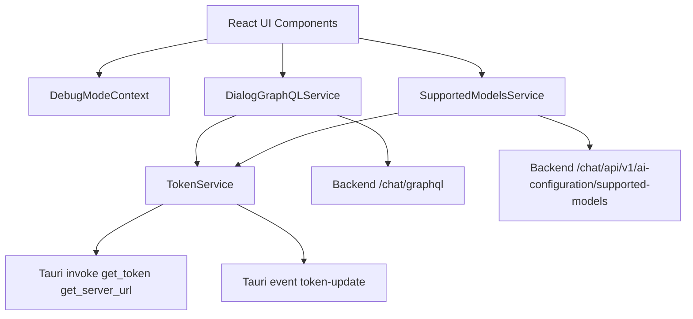
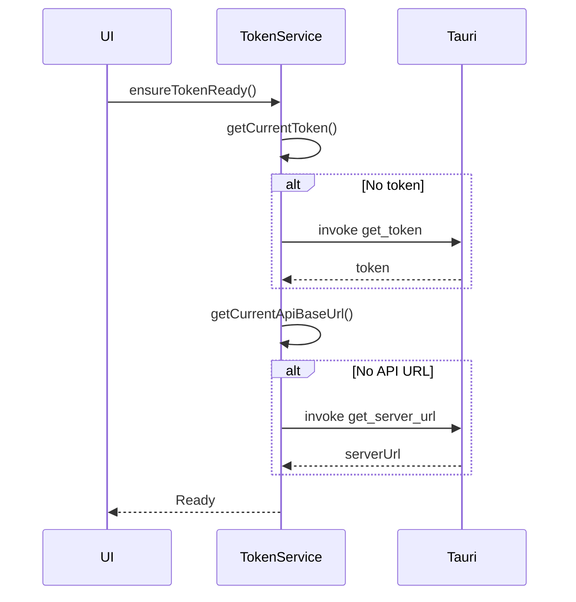
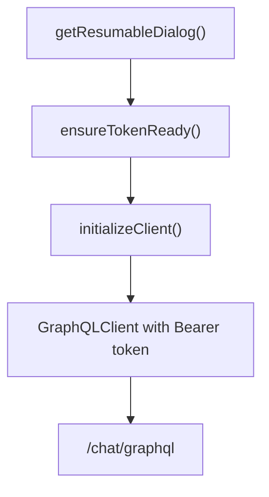
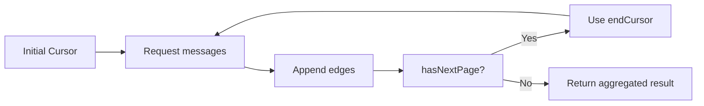
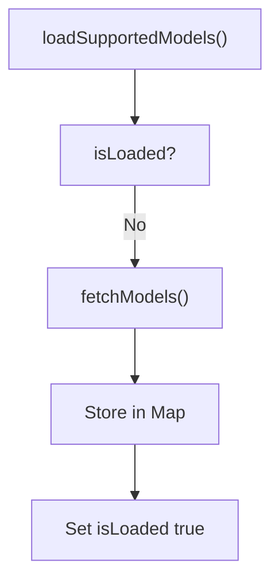
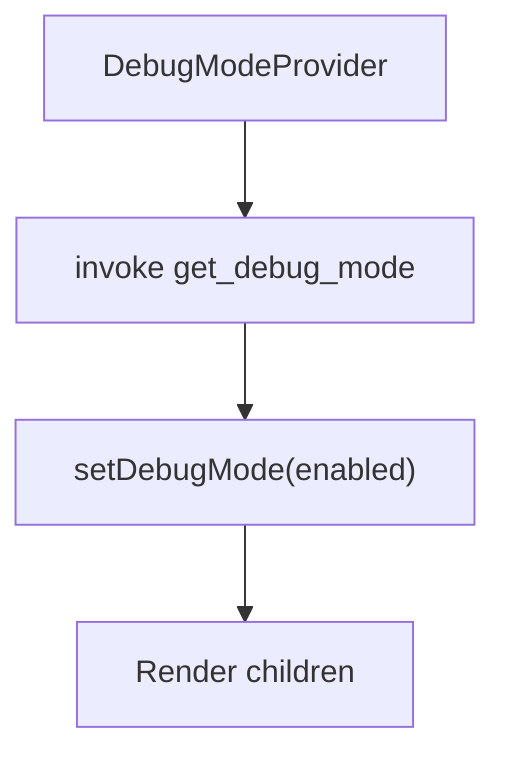
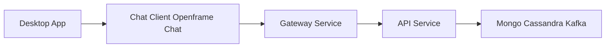

# Chat Client Openframe Chat

## Overview

**Chat Client Openframe Chat** is a lightweight desktop chat client built with React and Tauri. It connects to the OpenFrame backend over authenticated GraphQL and REST endpoints to:

- Resume existing AI-powered dialogs
- Fetch and paginate historical messages
- Send and receive structured AI/tool messages
- Dynamically load supported AI models
- Manage authentication tokens and API endpoints via Tauri

This module acts as a **secure, token-aware bridge** between the desktop runtime (Rust via Tauri) and the OpenFrame multi-service backend.

It integrates closely with the frontend platform layer defined in the sibling module:

- [Frontend Tenant App Core](../frontend_tenant_app_core/frontend_tenant_app_core.md)

---

## High-Level Architecture

The Chat Client Openframe Chat module is composed of four primary parts:

1. **TokenService** – Authentication and API endpoint lifecycle
2. **DialogGraphQLService** – GraphQL communication layer for dialogs and messages
3. **SupportedModelsService** – AI model discovery and caching
4. **DebugModeContext** – Runtime debug state management

### Component Architecture



---

## Runtime Responsibilities

### 1. Authentication and API Initialization

The module does not manage login directly. Instead, it:

- Receives tokens from the Tauri (Rust) backend
- Subscribes to token updates
- Normalizes and manages the API base URL
- Ensures both token and server URL are available before API calls

This design keeps authentication logic outside UI code and centralizes it in `TokenService`.

---

## Core Components

### 1. TokenService

**Component:**  
`openframe-oss-tenant.clients.openframe-chat.src.services.tokenService.TokenService`

#### Purpose

`TokenService` is the authentication backbone of the chat client. It manages:

- JWT token lifecycle
- API base URL initialization
- Tauri event integration
- Listener subscription model
- Readiness guarantees before network calls

#### Token Initialization Flow



#### Key Responsibilities

- Listens for `token-update` events from Tauri
- Requests token via `invoke get_token`
- Requests server URL via `invoke get_server_url`
- Normalizes server URLs (adds https if missing)
- Provides subscription APIs:
  - `onTokenUpdate`
  - `onApiUrlUpdate`
- Masks tokens in logs for security

#### Design Characteristics

- Singleton instance
- Event-driven updates
- Defensive error handling
- Lazy initialization
- Environment fallback via `VITE_TOKEN` and `VITE_SERVER_URL`

---

### 2. DialogGraphQLService

**Component:**  
`openframe-oss-tenant.clients.openframe-chat.src.services.dialogGraphQLService.DialogGraphQLService`

#### Purpose

Handles all GraphQL communication for:

- Resumable dialogs
- Historical message pagination
- Tool execution message rendering

It uses `graphql-request` and dynamically injects the current Bearer token.

#### GraphQL Endpoint

```text
{baseUrl}/chat/graphql
```

#### Internal Flow



#### Pagination Strategy

Message history is fetched using cursor-based pagination:

- `edges[]` contain message nodes
- `pageInfo` drives iteration
- Automatically loops while `hasNextPage` is true



#### Message Types Supported

The client supports polymorphic `messageData` including:

- Text messages
- Executing tool messages
- Executed tool results
- Approval requests
- Approval results
- Error messages

This allows tight integration with OpenFrame’s tool execution and approval pipeline.

---

### 3. SupportedModelsService

**Component:**  
`openframe-oss-tenant.clients.openframe-chat.src.services.supportedModelsService.SupportedModelsService`

#### Purpose

Dynamically loads and caches AI models supported by the backend.

#### Endpoint

```text
{baseUrl}/chat/api/v1/ai-configuration/supported-models
```

#### Response Structure

```text
{
  anthropic: SupportedModel[],
  openai: SupportedModel[],
  google-gemini: SupportedModel[]
}
```

#### Caching Strategy

- Uses an in-memory `Map<string, SupportedModel>`
- Lazy loads once
- Guards with `loadPromise` to prevent concurrent fetches
- Provides:
  - `getModelDisplayName`
  - `getModel`
  - `getAllModels`
  - `isModelSupported`
  - `reset`

#### Lifecycle



---

### 4. DebugModeContext

**Component:**  
`openframe-oss-tenant.clients.openframe-chat.src.contexts.DebugModeContext.DebugModeContextType`

#### Purpose

Provides a React Context for toggling debug mode across the chat application.

#### Behavior

- Initializes debug mode via Tauri `invoke get_debug_mode`
- Defaults to `false` on failure
- Exposes:
  - `debugMode`
  - `setDebugMode`
- Enforces usage inside `DebugModeProvider`

#### Context Flow



This enables runtime feature toggling without modifying core services.

---

## Backend Integration

Chat Client Openframe Chat integrates with:

- Chat GraphQL endpoint
- AI configuration REST endpoint
- Token and server URL from Tauri runtime

It assumes the backend enforces:

- JWT-based authentication
- Multi-tenant isolation
- Tool execution and approval workflows

The client is therefore **stateless with respect to identity**, delegating authentication authority to the platform.

---

## Error Handling Strategy

Across services:

- Network failures are caught and logged
- Missing tokens throw explicit errors
- GraphQL failures return `null` instead of crashing
- Token masking prevents credential leaks

This prioritizes UI stability and safe failure.

---

## Design Principles

1. **Separation of concerns**
   - Token lifecycle isolated from API services
2. **Lazy initialization**
   - Clients only constructed when needed
3. **Singleton services**
   - Prevent duplicate state
4. **Cursor-based pagination**
   - Scalable history retrieval
5. **Tauri-native integration**
   - Desktop-first architecture

---

## How This Module Fits in OpenFrame



The Chat Client Openframe Chat module:

- Runs inside the tenant desktop runtime
- Connects to the OpenFrame backend stack
- Displays AI-assisted dialogs
- Surfaces tool execution and approval workflows
- Dynamically adapts to backend-supported AI providers

It is the **end-user conversational interface** for OpenFrame’s AI-powered operations.

---

## Summary

Chat Client Openframe Chat is a focused, secure, token-aware chat frontend module that:

- Bridges Tauri and OpenFrame backend
- Handles authenticated GraphQL communication
- Supports tool-driven AI workflows
- Dynamically loads supported AI models
- Provides runtime debug controls

It is intentionally lightweight, delegating identity, policy, and orchestration to the broader OpenFrame platform while maintaining a robust and extensible client architecture.
