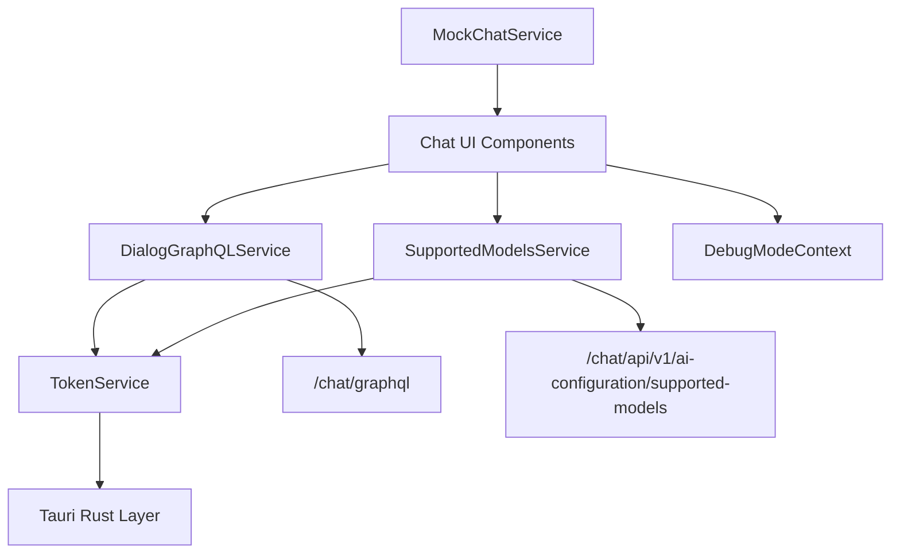
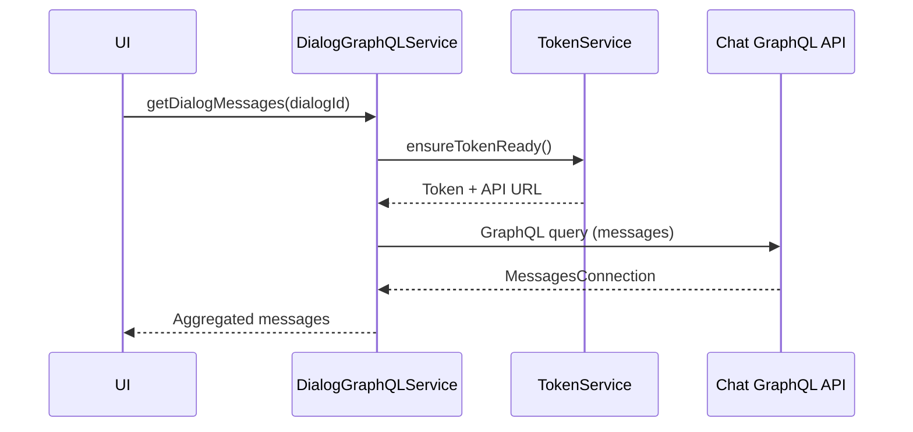
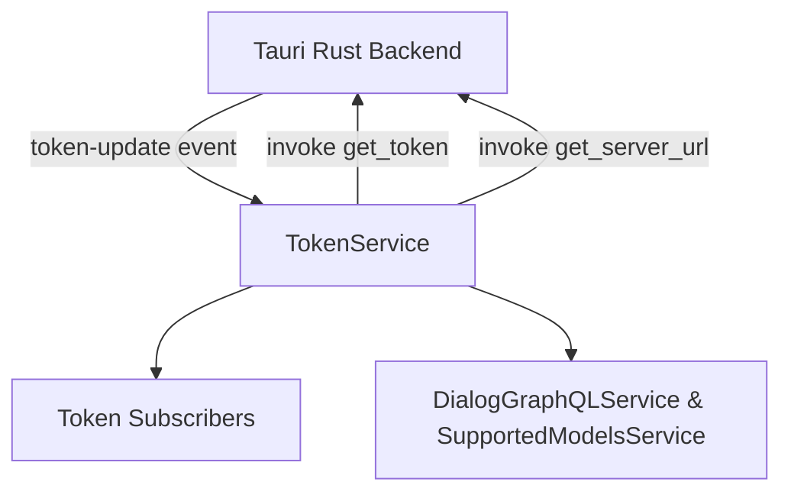
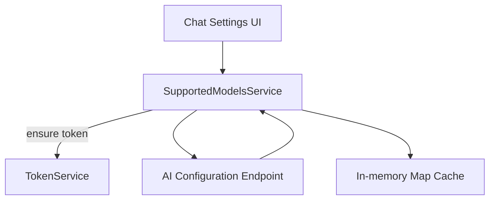
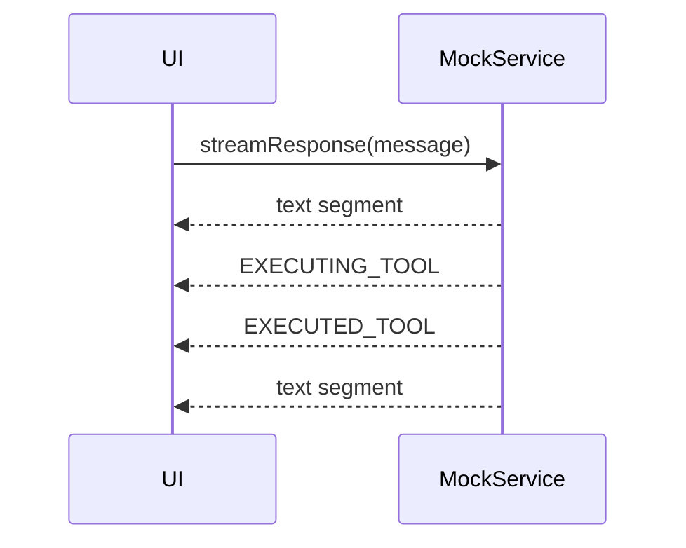
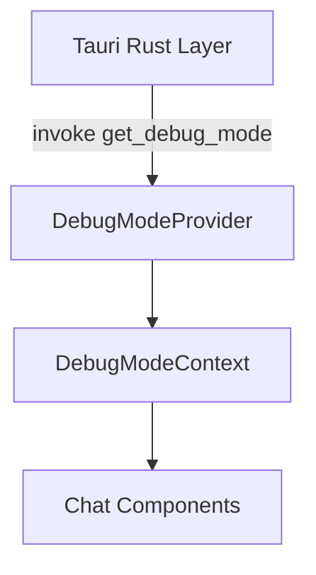
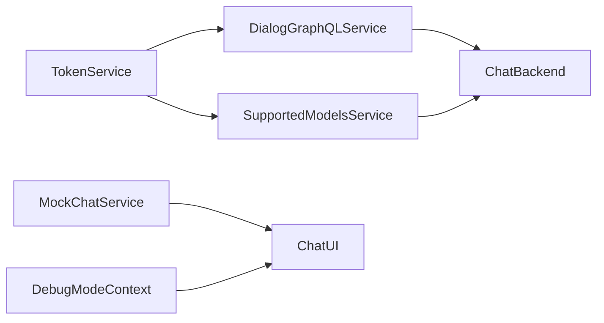

# Chat Client Services

## Overview

The **Chat Client Services** module encapsulates all client-side service logic required to power the OpenFrame Chat experience inside the desktop (Tauri) application. It acts as the bridge between:

- The Chat UI (React components)
- The OpenFrame backend GraphQL and REST endpoints
- The local Tauri runtime (Rust commands & events)

This module is responsible for:

- Secure token management and API base URL resolution
- GraphQL dialog and message retrieval
- Streaming chat responses (including tool execution simulation)
- AI model discovery and metadata loading
- Debug mode state management

It is intentionally UI-agnostic and focuses purely on **stateful service orchestration and communication**.

---

## High-Level Architecture

### Key Design Principles

1. **Separation of concerns** – Each service has a focused responsibility.
2. **Lazy initialization** – GraphQL client and model metadata load only when needed.
3. **Token-aware networking** – All backend communication depends on `TokenService`.
4. **Streaming-first design** – Chat responses are modeled as async generators.
5. **Tauri-native integration** – Tokens, server URLs, and debug mode come from Rust.

---

## Core Components

### 1. DialogGraphQLService

**Purpose:**
Handles all GraphQL communication for dialogs and messages.

**Responsibilities:**

- Initializes and manages a `GraphQLClient`
- Injects Bearer authentication headers
- Fetches resumable dialogs
- Fetches paginated dialog messages
- Automatically aggregates paginated message edges
- Gracefully handles network failures

### Internal Workflow

### Pagination Strategy

The `getDialogMessages()` method:

- Iteratively fetches pages
- Uses `pageInfo.hasNextPage`
- Advances via `endCursor`
- Returns a fully merged `MessagesConnection`

This design abstracts pagination away from the UI layer.

### Authentication Enforcement

Every request:

1. Calls `tokenService.ensureTokenReady()`
2. Validates token and API base URL
3. Sets `Authorization: Bearer <token>` header

If token or API URL is missing, the request fails early.

---

### 2. TokenService

**Purpose:**
Central authority for authentication token and API base URL management.

**Responsibilities:**

- Listen for `token-update` Tauri events
- Request token from Rust via `invoke('get_token')`
- Request API server URL via `invoke('get_server_url')`
- Maintain subscribers for token updates
- Mask tokens in logs
- Provide readiness guarantees via `ensureTokenReady()`

### Token Lifecycle

### Initialization Order

1. Constructor initializes:
   - Token listener
   - API URL retrieval
   - Environment fallback
2. Services call `ensureTokenReady()` before network access
3. If no token exists:
   - Token is requested from Rust
   - Failure throws an authentication error

This guarantees backend calls are never made with missing credentials.

---

### 3. SupportedModelsService

**Purpose:**
Loads and caches supported AI models from the backend.

**Endpoint Used:**

- `GET /chat/api/v1/ai-configuration/supported-models`

**Responsibilities:**

- Lazy-load supported models
- Normalize provider-grouped responses
- Store models in a `Map<string, SupportedModel>`
- Provide lookup utilities
- Cache results until reset

### Supported Model Structure

Each model contains:

- `modelName`
- `displayName`
- `provider`
- `contextWindow`

### Loading Strategy

Key characteristics:

- Only loads once per lifecycle
- Uses `loadPromise` to prevent duplicate concurrent fetches
- Safe no-op if token or API URL unavailable

---

### 4. MockChatService

**Purpose:**
Provides a fully simulated streaming chat experience for development and testing.

**Key Features:**

- Async generator–based streaming
- Simulated tool execution phases
- Simulated delays
- Character-chunked streaming
- Randomized response selection
- Optional error injection

### Streaming Model

The service emits `MessageSegment` objects:

- `type: 'text'`
- `type: 'tool_execution'`

Tool execution simulates:

1. `EXECUTING_TOOL`
2. Delay
3. `EXECUTED_TOOL`
4. Result payload

### Stream Execution Flow

This mirrors real production streaming behavior without backend dependency.

---

### 5. DebugModeContext

**Purpose:**
Provides global debug mode state for the chat application.

**Responsibilities:**

- Fetch debug mode from Rust via `invoke('get_debug_mode')`
- Store `debugMode` boolean in React state
- Provide setter via context
- Enforce usage inside provider

### Context Flow

If the context is accessed outside its provider, it throws a controlled error.

---

## Cross-Service Interaction Model

### Interaction Summary

| Component | Depends On | Provides |
|------------|------------|-----------|
| TokenService | Tauri | Auth + API base URL |
| DialogGraphQLService | TokenService | Dialog + Messages |
| SupportedModelsService | TokenService | AI Model Metadata |
| MockChatService | None | Streaming Simulation |
| DebugModeContext | Tauri | Debug State |

---

## Error Handling Strategy

### Network Errors

- Caught and logged
- Return `null` instead of throwing (DialogGraphQLService)
- Fail gracefully in UI

### Authentication Errors

- Thrown early if token missing
- Prevents invalid API calls

### Mock Errors

- `streamResponseWithError()` randomly throws
- Useful for resilience testing

---

## Lifecycle Considerations

### Service Singletons

- `dialogGraphQLService`
- `supportedModelsService`
- `tokenService`

All exported as singletons to ensure:

- Shared token state
- Shared model cache
- Consistent API endpoint usage

### Cleanup

`DialogGraphQLService.dispose()` clears:

- GraphQL client instance
- Cached endpoint reference

Useful when switching tenants or environments.

---

## Security Considerations

1. Tokens are masked in logs.
2. No request is sent without verified token.
3. API base URL normalization prevents malformed URLs.
4. Token and URL updates propagate via subscribers.

---

## How This Module Fits in the System

Within the OpenFrame architecture:

- Backend services provide:
  - GraphQL chat endpoints
  - AI configuration REST endpoints
- Tauri provides:
  - Secure token access
  - Server URL configuration
  - Debug mode flag
- Chat Client Services orchestrates these dependencies.

It acts as the **client-side integration layer** between:

- UI
- Desktop runtime
- Multi-service backend

---

## Summary

The **Chat Client Services** module provides a clean, well-isolated service layer for the OpenFrame Chat client. It:

- Abstracts authentication
- Encapsulates GraphQL communication
- Supports streaming-based message handling
- Enables development via mock streaming
- Integrates tightly with Tauri runtime
- Maintains model metadata caching
- Centralizes debug mode state

By keeping networking, authentication, streaming, and configuration concerns separated, the module ensures scalability, maintainability, and testability for the chat experience.