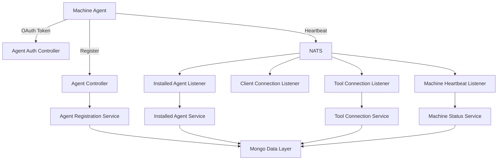
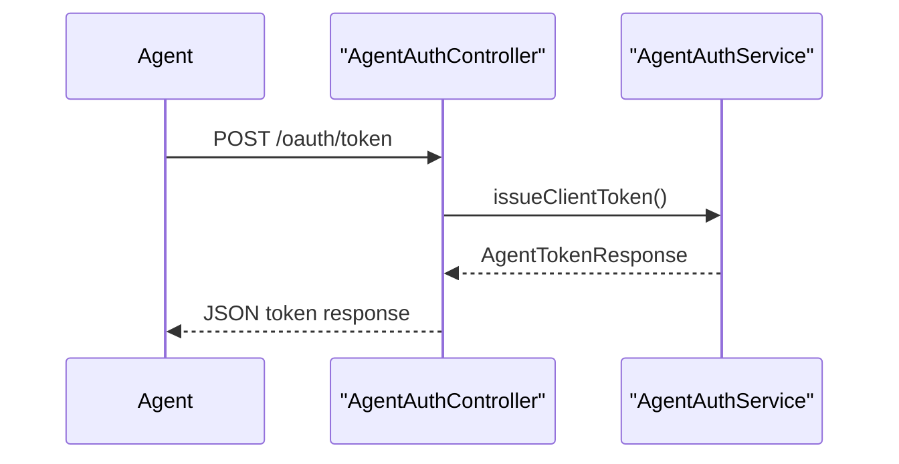
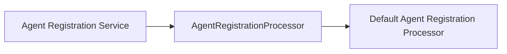
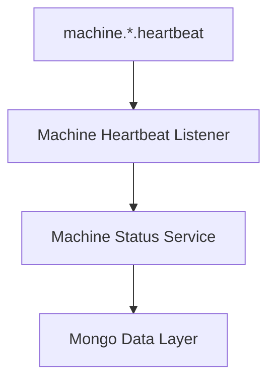
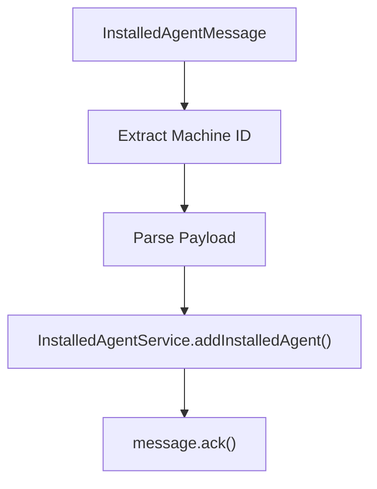
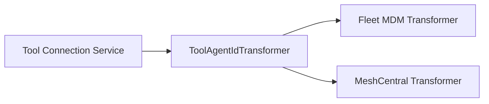

# Client Service Core

## Overview

The **Client Service Core** module is responsible for managing agent-facing interactions within the OpenFrame platform. It acts as the runtime boundary between managed machines (agents), integrated tools, and the rest of the platform services.

This module provides:

- Agent authentication (`/oauth/token`)
- Agent registration (`/api/agents/register`)
- Tool agent file delivery
- Real-time machine and tool event processing via NATS
- Tool-specific agent ID transformation
- Extensible agent registration post-processing

It is deployed as part of the `ClientApplication` in the platform applications layer.

---

## Architectural Role in the Platform

Client Service Core operates between:

- Agents installed on managed machines
- External tool systems (Fleet MDM, MeshCentral, etc.)
- NATS event streams
- Data layer (Mongo-based documents and repositories)

### High-Level Interaction Flow



---

# Core Functional Areas

The module can be logically divided into the following functional domains:

1. Authentication & Security
2. Agent Registration
3. Event-Driven Machine State Processing
4. Tool Integration & Agent ID Transformation
5. Configuration & Infrastructure

---

## 1. Authentication & Security

### Password Encoder Configuration

`PasswordEncoderConfig` defines a Spring `PasswordEncoder` bean using `BCryptPasswordEncoder`.

```java
@Bean
public PasswordEncoder passwordEncoder() {
    return new BCryptPasswordEncoder();
}
```

This ensures secure hashing of client secrets and aligns with the platform's OAuth security model.

---

### Agent Authentication Controller

`AgentAuthController` exposes:

```text
POST /oauth/token
```

It supports:

- `grant_type`
- `refresh_token`
- `client_id`
- `client_secret`

Flow:



Error handling:
- `IllegalArgumentException` → 401
- Generic exceptions → 400 with `server_error`

This endpoint is purpose-built for machine agents rather than interactive users.

---

## 2. Agent Registration

### Agent Controller

`AgentController` exposes:

```text
POST /api/agents/register
```

Requires:

- Header: `X-Initial-Key`
- Body: `AgentRegistrationRequest`

### AgentRegistrationRequest DTO

Encapsulates:

- Core identification (hostname, organizationId)
- Network information (IP, MAC, OS UUID)
- Hardware information (serial number, manufacturer, model)
- OS metadata (type, version, timezone)

This data is used to create or update a `Machine` entity in the data layer.

---

### Registration Processing Extension Point

`DefaultAgentRegistrationProcessor` implements `AgentRegistrationProcessor` and is loaded conditionally:

- Used when no custom processor bean is provided
- Provides a no-op implementation
- Allows platform extensions without modifying core logic



This design enables:

- Tenant-specific customizations
- Post-registration enrichment
- External provisioning hooks

---

## 3. Event-Driven Machine State Processing

Client Service Core listens to NATS subjects to maintain real-time machine state.

### Machine Heartbeats

**Subject:** `machine.*.heartbeat`

Handled by `MachineHeartbeatListener`.

Behavior:

- Extract machine ID from subject
- Generate server-side timestamp
- Call `MachineStatusService.processHeartbeat()`



---

### Client Connection Events

Handled by `ClientConnectionListener`.

Events:

- Machine connected
- Machine disconnected

Each event:

- Parses `ClientConnectionEvent`
- Extracts timestamp
- Updates machine online/offline status

---

### Installed Agent Events

**Stream:** `INSTALLED_AGENTS`  
**Subject:** `machine.*.installed-agent`

Handled by `InstalledAgentListener` using JetStream durable consumers.

Key characteristics:

- Explicit acknowledgment (`AckPolicy.Explicit`)
- `maxDeliver = 50`
- Retry until max delivery
- `lastAttempt` flag passed to service

Processing logic:



If processing fails:
- Message is not acknowledged
- JetStream handles redelivery

---

### Tool Connection Events

**Stream:** `TOOL_CONNECTIONS`  
**Subject:** `machine.*.tool-connection`

Handled by `ToolConnectionListener`.

Behavior mirrors InstalledAgentListener:

- Durable consumer
- Delivery group
- Max delivery control
- Explicit acknowledgment
- `lastAttempt` awareness

Used to:

- Associate tool instances with machines
- Track active tool integrations

---

## 4. Tool Integration & Agent ID Transformation

When agents report tool-specific identifiers, they may require normalization before persistence.

### ToolAgentIdTransformer Strategy

The system supports tool-specific ID transformation.



---

### Fleet MDM Agent ID Transformer

`FleetMdmAgentIdTransformer`:

- ToolType: `FLEET_MDM`
- Uses `IntegratedToolService` and `ToolUrlService`
- Instantiates `FleetMdmClient`
- Searches hosts by UUID
- Converts UUID → Fleet host numeric ID

Key behaviors:

- Validates OS metadata
- Supports retry semantics via `lastAttempt`
- Fallback to UUID when last attempt fails

This ensures consistency between OpenFrame and Fleet MDM identifiers.

---

### MeshCentral Agent ID Transformer

`MeshCentralAgentIdTransformer`:

- ToolType: `MESHCENTRAL`
- Prefixes ID with `node//`

Simple normalization logic:

```text
originalId -> node//originalId
```

---

## 5. Tool Agent File Delivery

`ToolAgentFileController` exposes:

```text
GET /tool-agent/{assetId}?os={mac|windows}
```

Current behavior:

- Returns embedded resource
- Appends `.exe` for Windows
- Throws error for unknown OS

Marked as temporary until artifact distribution is implemented.

---

# Reliability & Lifecycle Management

All NATS listeners:

- Create dispatchers on `ApplicationReadyEvent`
- Support durable JetStream consumers
- Handle consumer creation/update logic
- Implement `@PreDestroy` cleanup

This ensures:

- Graceful shutdown
- No message loss
- Proper resource draining

---

# Deployment Context

Client Service Core is packaged within:

- `ClientApplication` (platform applications layer)

It integrates with:

- Mongo data core (documents & repositories)
- Authorization service (OAuth compatibility)
- Gateway service (external routing)
- Stream service (event pipelines)

---

# Design Principles

The module reflects the following architectural principles:

- ✅ Event-driven state synchronization
- ✅ Explicit acknowledgment and retry control
- ✅ Strategy-based extensibility (transformers & processors)
- ✅ Secure authentication using BCrypt
- ✅ Clean separation of controllers, listeners, and services

---

# Summary

The **Client Service Core** module is the machine-facing runtime of OpenFrame. It:

- Authenticates agents
- Registers and enriches machines
- Processes real-time connection and heartbeat events
- Synchronizes installed agents and tool connections
- Normalizes tool-specific identifiers

It ensures reliable, extensible, and secure integration between managed devices and the broader OpenFrame platform ecosystem.
