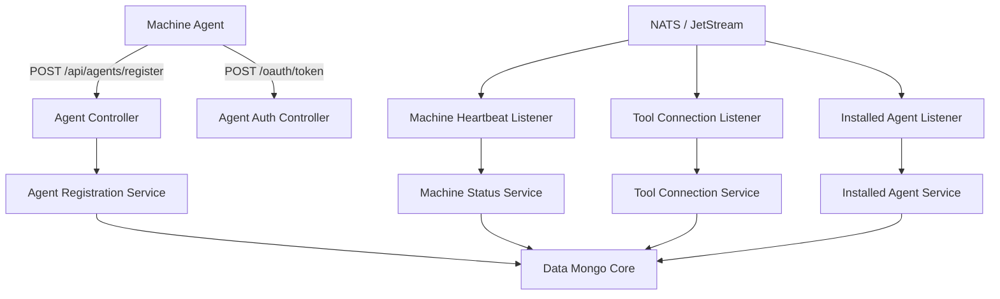
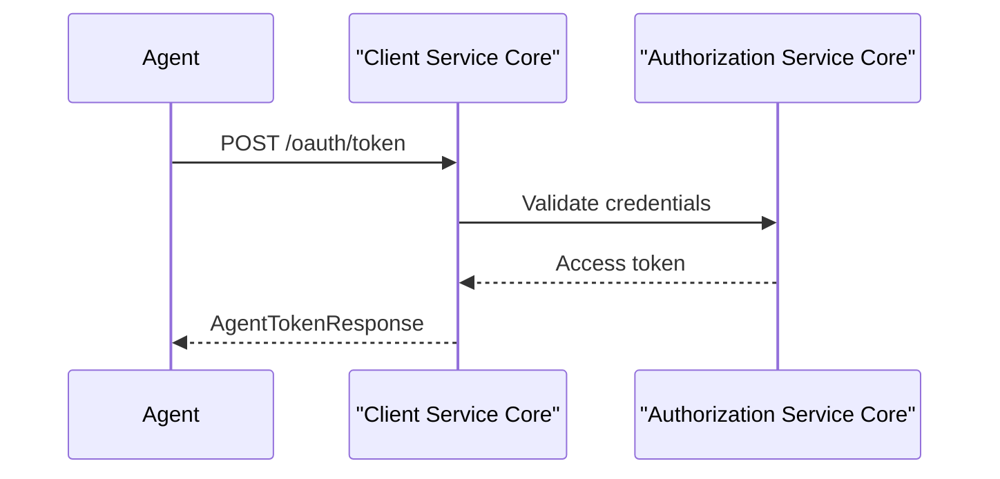
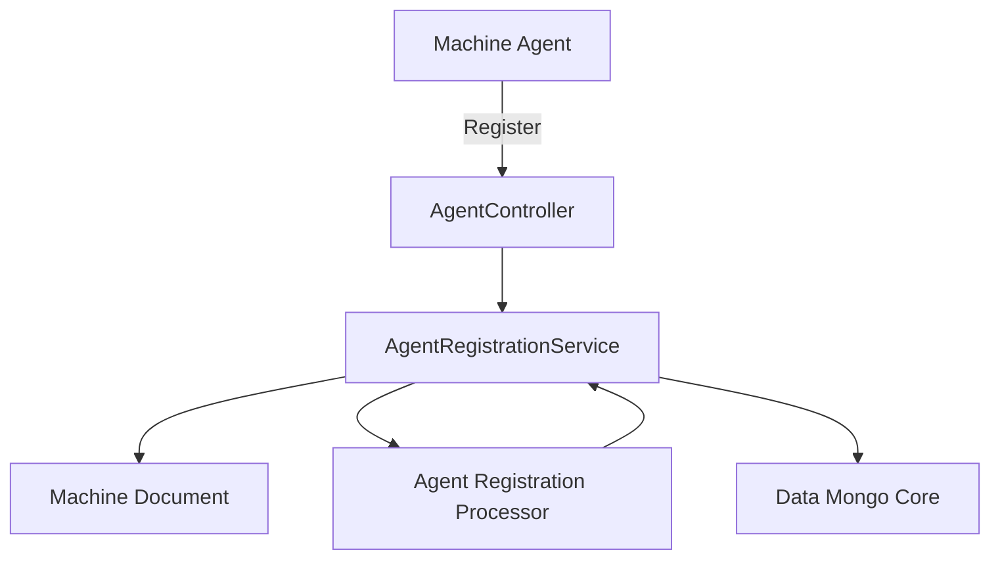
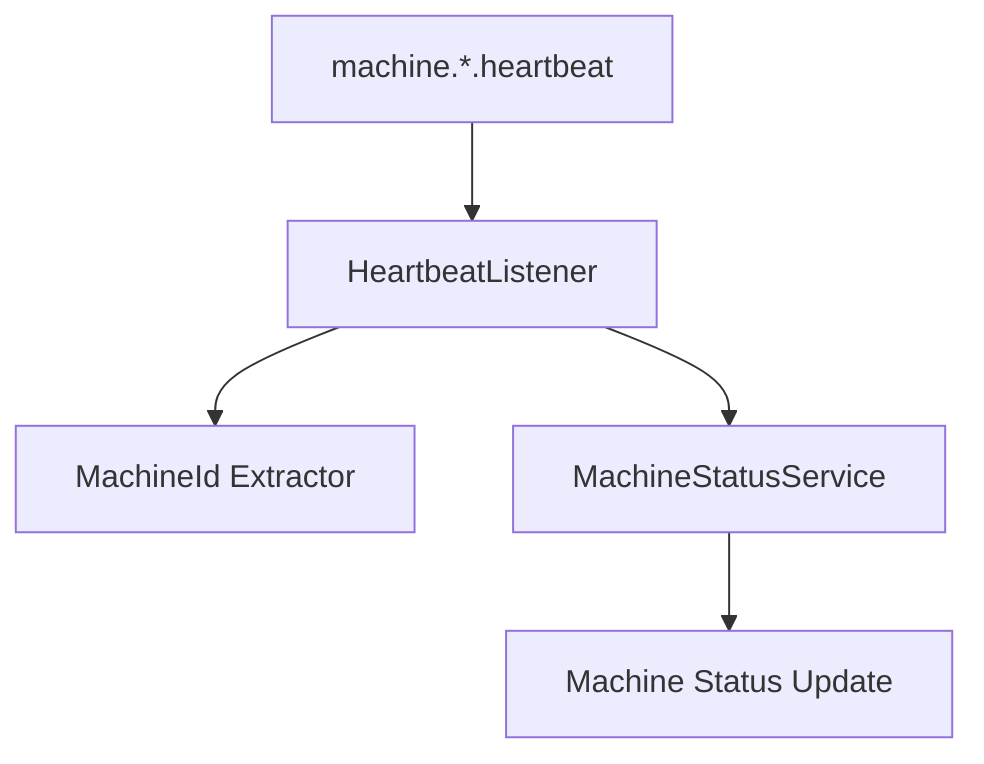
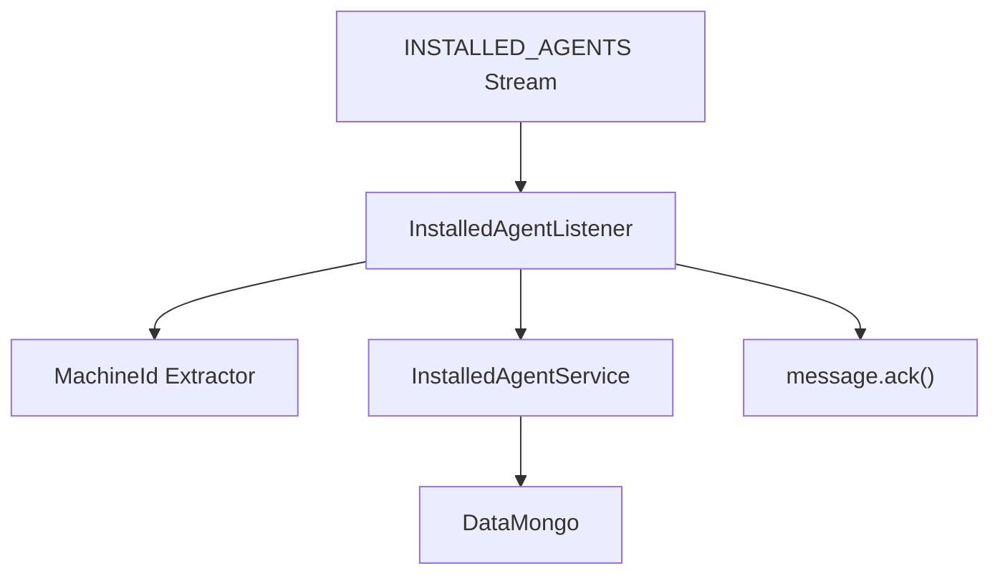
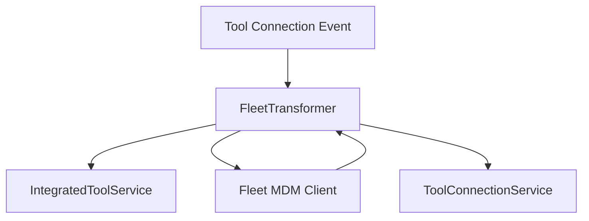

# Client Service Core

## Overview

The **Client Service Core** module is responsible for managing machine agents, tool connections, and real-time client lifecycle events within the OpenFrame platform. It acts as the bridge between installed agents running on customer devices and the backend ecosystem, handling:

- Agent registration
- Machine heartbeat and connectivity tracking
- Tool connection synchronization
- Agent authentication (OAuth client credentials)
- Tool-specific agent ID transformation

This module integrates closely with:

- [Authorization Service Core](../authorization-service-core/authorization-service-core.md)
- [Data Mongo Core](../data-mongo-core/data-mongo-core.md)
- [Data Kafka Core](../data-kafka-core/data-kafka-core.md)
- [Gateway Service Core](../gateway-service-core/gateway-service-core.md)
- [Management Service Core](../management-service-core/management-service-core.md)

---

## Architectural Role in the Platform

The Client Service Core is part of a distributed, event-driven architecture. It exposes REST endpoints for agents and subscribes to NATS / JetStream subjects for real-time updates.



The module combines:

- **Synchronous REST flows** (registration, token issuance)
- **Asynchronous event processing** (heartbeat, tool connections, installed agents)

---

## Core Functional Areas

### 1. Agent Authentication

**Primary Component:**
- `AgentAuthController`

Endpoint:

```text
POST /oauth/token
```

Supports:
- `grant_type`
- `refresh_token`
- `client_id`
- `client_secret`

This controller delegates token issuance to `AgentAuthService`, enabling agents to authenticate using OAuth-style client credentials.

High-level flow:



This flow integrates with the broader authorization infrastructure implemented in the Authorization Service Core module.

---

### 2. Agent Registration

**Primary Components:**
- `AgentController`
- `AgentRegistrationRequest`
- `DefaultAgentRegistrationProcessor`

Endpoint:

```text
POST /api/agents/register
Header: X-Initial-Key
Body: AgentRegistrationRequest
```

The registration request includes:

- Hostname and organization ID
- Network information (IP, MAC, OS UUID)
- Hardware metadata (manufacturer, model, serial number)
- OS metadata (type, version, build)
- Agent version and status

Registration flow:



### Extensibility via Processor

`DefaultAgentRegistrationProcessor` is a conditional bean that provides a no-op implementation. Custom implementations of `AgentRegistrationProcessor` can override post-registration behavior.

This enables:
- Organization-specific provisioning
- Auto-tagging logic
- External synchronization hooks

---

### 3. Tool Agent File Distribution

**Primary Component:**
- `ToolAgentFileController`

Endpoint:

```text
GET /tool-agent/{assetId}?os=mac|windows
```

Currently:
- Returns classpath-based test artifacts
- Adds `.exe` suffix for Windows
- Designed as a temporary solution

Future architecture intends to replace this with artifact repository integration.

---

### 4. Real-Time Machine Lifecycle Management

The module subscribes to NATS subjects to process machine lifecycle events.

#### 4.1 Machine Heartbeats

**Component:** `MachineHeartbeatListener`

Subject:

```text
machine.*.heartbeat
```

Behavior:
- Extract machine ID from subject
- Generate server-side timestamp
- Update machine online status



---

#### 4.2 Client Connection Events

**Component:** `ClientConnectionListener`

Processes:
- Machine connected
- Machine disconnected

Uses functional `Consumer<String>` beans to:
- Deserialize `ClientConnectionEvent`
- Update machine status to online/offline

---

#### 4.3 Installed Agent Events (JetStream)

**Component:** `InstalledAgentListener`

Stream:

```text
INSTALLED_AGENTS
Subject: machine.*.installed-agent
```

Features:
- Durable consumer
- Explicit acknowledgment
- Max delivery attempts
- Dead-letter style retry via redelivery

Processing logic:



---

#### 4.4 Tool Connection Events (JetStream)

**Component:** `ToolConnectionListener`

Stream:

```text
TOOL_CONNECTIONS
Subject: machine.*.tool-connection
```

Responsibilities:
- Extract machine ID
- Deserialize `ToolConnectionMessage`
- Transform agent tool IDs when needed
- Persist tool connection state
- Acknowledge message on success

This design ensures:
- At-least-once delivery
- Resilience through redelivery attempts
- Controlled backpressure via delivery groups

---

## Tool Agent ID Transformation

The module supports pluggable transformation of tool-specific agent IDs.

### Fleet MDM Transformer

**Component:** `FleetMdmAgentIdTransformer`

Behavior:
- Looks up integrated tool configuration
- Fetches API URL and API key
- Queries Fleet MDM for host by UUID
- Transforms UUID → numeric host ID

Fallback behavior:
- If no match and not last attempt → throw exception
- If last attempt → return original UUID for manual resolution



---

### MeshCentral Transformer

**Component:** `MeshCentralAgentIdTransformer`

Behavior:
- Prefixes agent tool ID with `node//`
- Lightweight transformation
- No external calls

This clean separation allows additional tool integrations without modifying core logic.

---

## Resilience and Delivery Semantics

The Client Service Core uses JetStream for critical event streams with:

- Durable consumers
- Explicit acknowledgment
- Delivery groups for scaling
- Configurable `maxDeliver` retries
- Ack wait timeout enforcement

Failure strategy:

- Exceptions during processing → message not acknowledged
- JetStream redelivers up to max attempts
- Final attempt behavior can alter logic (for example, Fleet transformer fallback)

---

## Integration with Other Modules

| Concern | Module |
|----------|---------|
| OAuth and token validation | Authorization Service Core |
| Machine and tool persistence | Data Mongo Core |
| Kafka streaming | Data Kafka Core |
| API routing and external exposure | Gateway Service Core |
| Client initialization secrets | Management Service Core |

The Client Service Core focuses exclusively on:

- Agent lifecycle
- Machine presence
- Tool connectivity
- Client-facing endpoints for agents

It deliberately avoids embedding authorization server logic, storage internals, or gateway concerns.

---

## Summary

The **Client Service Core** is the operational backbone for machine agents within OpenFrame. It:

- Registers devices
- Issues agent tokens
- Tracks connectivity and heartbeats
- Synchronizes tool integrations
- Processes real-time events via NATS and JetStream

Through extensible processors and transformers, it enables vendor-specific integration logic while maintaining a clean and modular core architecture.