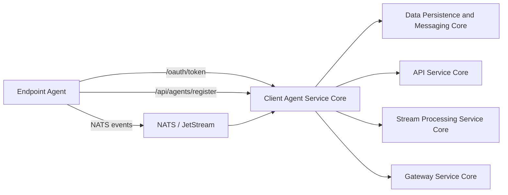
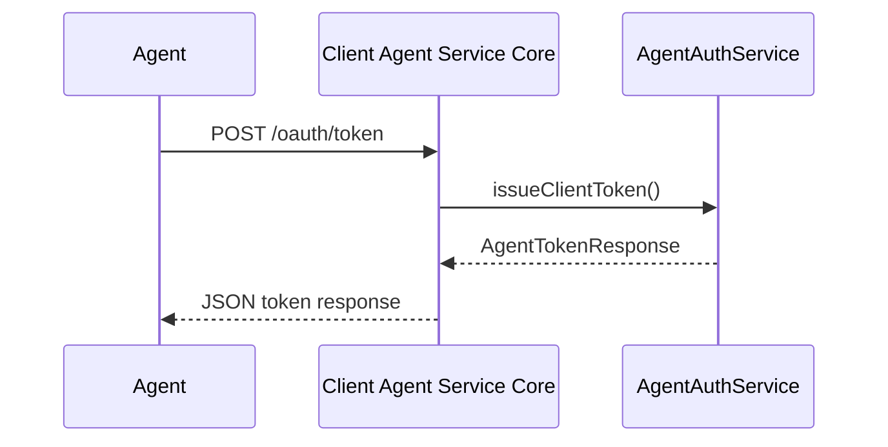
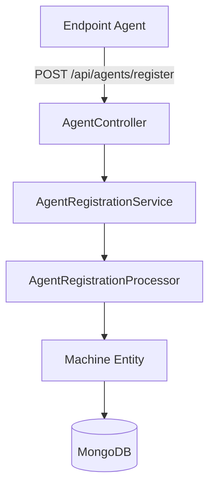
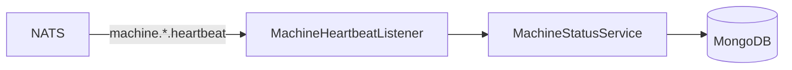
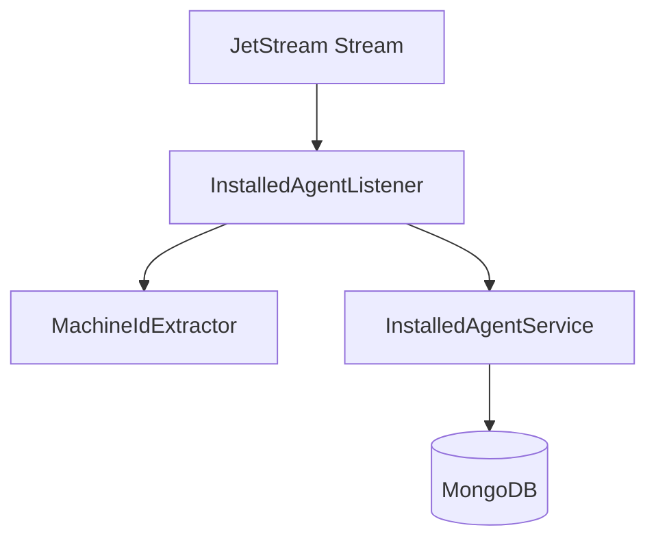
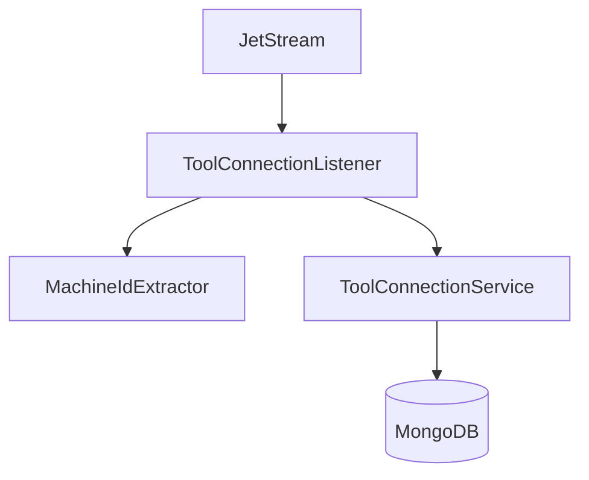

# Client Agent Service Core

## Overview

The **Client Agent Service Core** module is the central backend service responsible for managing endpoint agents (machines), their authentication, registration, lifecycle events, and tool integrations within the OpenFrame platform.

It acts as the runtime bridge between:

- Installed agents on client machines
- Integrated third-party tools (e.g., Fleet MDM, MeshCentral)
- Messaging infrastructure (NATS / JetStream)
- Persistence layer (MongoDB, Redis, Kafka, etc.)
- Other platform services such as API Service Core, Gateway Service Core, and Stream Processing Service Core

This service ensures that machines are securely registered, authenticated, monitored (heartbeats), and synchronized with integrated tools.

---

## High-Level Responsibilities

The Client Agent Service Core is responsible for:

1. Agent authentication (OAuth-style token issuance)
2. Agent registration and provisioning
3. Tool agent binary delivery
4. Machine connection lifecycle tracking (online/offline)
5. Installed agent event processing
6. Tool connection event processing
7. Agent tool ID normalization and transformation

---

## Architectural Position in the Platform



The module primarily exposes REST endpoints for agents and consumes asynchronous machine and tool events from NATS JetStream.

---

# Application Bootstrap

## ClientApplication

The entry point of the service:

- Annotated with `@SpringBootApplication`
- Performs component scanning across:
  - `com.openframe.data`
  - `com.openframe.client`
  - `com.openframe.core`
  - `com.openframe.security`
  - `com.openframe.kafka.producer`
- Explicitly excludes `CassandraHealthIndicator`

This indicates that while Cassandra components may exist in the shared data layer, they are intentionally disabled in this service context.

---

# Authentication and Security

## PasswordEncoderConfig

Defines a `BCryptPasswordEncoder` bean:

- Used for hashing client secrets or credentials
- Ensures secure handling of authentication secrets

## AgentAuthController

Base path: `/oauth`

### Endpoint: POST `/oauth/token`

Supports OAuth-like token issuance for agents:

Parameters:
- `grant_type`
- `refresh_token`
- `client_id`
- `client_secret`

Flow:



Error handling:
- `IllegalArgumentException` → 401 Unauthorized
- Other exceptions → 400 with server_error

This endpoint enables secure machine-to-platform communication.

---

# Agent Registration

## AgentController

Base path: `/api/agents`

### Endpoint: POST `/api/agents/register`

Headers:
- `X-Initial-Key`

Body:
- `AgentRegistrationRequest`

The `AgentRegistrationRequest` contains:

- Core identification (hostname, organizationId)
- Network info (IP, MAC, OS UUID)
- Hardware metadata
- OS metadata
- Agent version and status

### Registration Flow



## DefaultAgentRegistrationProcessor

- Conditional default implementation
- Provides post-processing hook
- Can be overridden by custom processor beans

This enables tenant-level customization without modifying core logic.

---

# Tool Agent File Delivery

## ToolAgentFileController

Base path: `/tool-agent/{assetId}`

Used to deliver tool agent binaries.

Behavior:
- OS-aware resolution (`mac`, `windows`)
- Returns raw binary bytes
- Throws exceptions for unsupported OS or missing content

> Note: Currently returns hardcoded content for testing and marked for future replacement by artifact-based distribution.

---

# Event-Driven Machine Lifecycle Management

The Client Agent Service Core heavily relies on NATS and JetStream for asynchronous processing.

## MachineHeartbeatListener

Subject: `machine.*.heartbeat`

Behavior:
- Extracts `machineId` from subject
- Generates server-side timestamp
- Calls `MachineStatusService.processHeartbeat()`



Ensures machines remain marked online when heartbeats are received.

---

## ClientConnectionListener

Consumers:
- `machineConnectedConsumer`
- `machineDisconnectionConsumer`

Processes `ClientConnectionEvent` messages:

- Updates machine status to ONLINE or OFFLINE
- Uses event timestamp

Provides fallback lifecycle management when heartbeat reliability is degraded.

---

## InstalledAgentListener

JetStream Stream: `INSTALLED_AGENTS`

Subject: `machine.*.installed-agent`

Key features:
- Durable consumer
- Explicit ACK policy
- Max deliver attempts (50)
- Redelivery support
- Delivery groups for scaling

Processing logic:



If processing fails:
- Message remains unacknowledged
- JetStream handles redelivery

---

## ToolConnectionListener

JetStream Stream: `TOOL_CONNECTIONS`

Subject: `machine.*.tool-connection`

Responsibilities:
- Process tool connection events
- Support durable consumer groups
- Retry up to 50 deliveries
- Explicit acknowledgments



This ensures reliable synchronization of external tool state with platform records.

---

# Tool Agent ID Transformation

Tool integrations often use external identifiers that must be normalized.

## FleetMdmAgentIdTransformer

Tool Type: `FLEET_MDM`

Behavior:

1. Retrieves integrated tool configuration
2. Fetches API URL and credentials
3. Calls Fleet MDM API
4. Searches host by UUID
5. Transforms UUID → Fleet host ID

Handles:
- Retry awareness (`lastAttempt`)
- Partial data scenarios
- Logging and fallback

## MeshCentralAgentIdTransformer

Tool Type: `MESHCENTRAL`

Simple transformation:

```text
Original ID: abc123
Transformed: node//abc123
```

This standardizes tool agent identifiers before persistence.

---

# Reliability and Resilience Patterns

The Client Agent Service Core uses several resilience mechanisms:

1. Durable JetStream consumers
2. Explicit message acknowledgment
3. Max delivery retry limits
4. Delivery groups for horizontal scaling
5. Graceful dispatcher draining on shutdown
6. Conditional bean overrides for extensibility

These patterns ensure:

- No event loss
- Safe redelivery
- Horizontal scalability
- Customizable processing logic

---

# Data Dependencies

The module depends on the Data Persistence and Messaging Core for:

- MongoDB documents (Machine, Device, Tool, etc.)
- Redis caching
- Kafka producers
- Multi-tenant data access

It also integrates with:

- API Service Core for platform APIs
- Gateway Service Core for routing and JWT validation
- Stream Processing Service Core for downstream enrichment

---

# Summary

The **Client Agent Service Core** is the operational backbone of machine lifecycle management in OpenFrame.

It provides:

- Secure agent authentication
- Flexible and extensible registration
- Reliable event-driven synchronization
- Tool integration normalization
- Machine availability tracking

By combining REST APIs, event-driven messaging, durable consumers, and transformation pipelines, the module ensures that endpoint agents are consistently represented, authenticated, and synchronized across the platform ecosystem.
