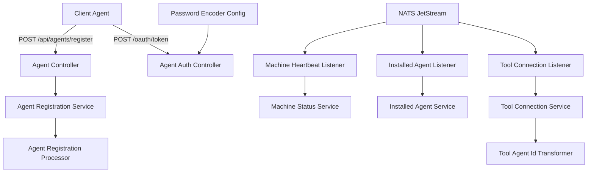
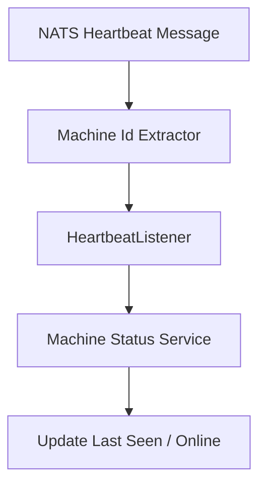
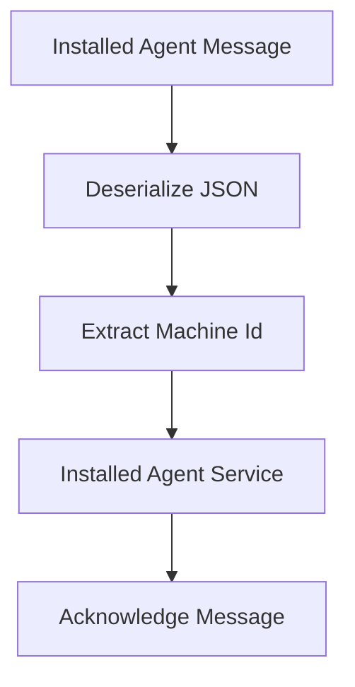
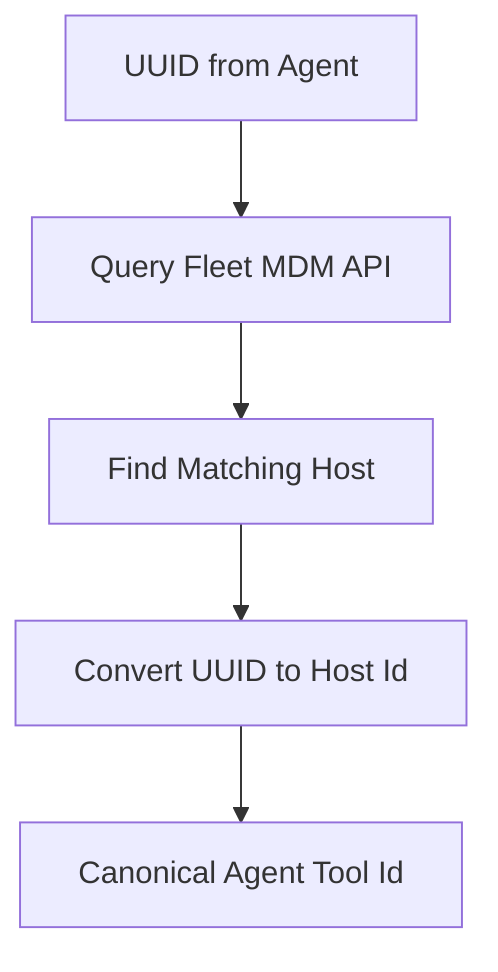
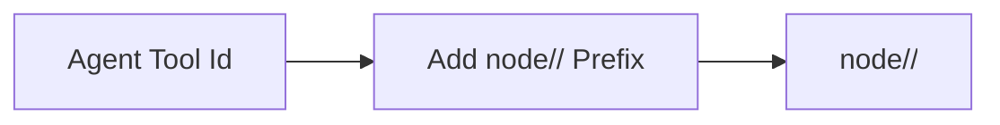

# Client Agent Service Core

The **Client Agent Service Core** module is responsible for managing agent lifecycle operations, machine connectivity, tool integrations, and agent authentication within the OpenFrame platform.

It acts as the runtime-facing backend for installed agents and tool agents running on customer machines. This module:

- Registers and authenticates agents
- Processes machine heartbeats and connectivity events
- Tracks installed agents and tool connections
- Transforms external tool identifiers into internal representations
- Exposes REST endpoints for agent operations
- Integrates with NATS JetStream for event-driven updates

The service is bootstrapped by the `ClientApplication` entrypoint and integrates with data, messaging, and security layers across the platform.

---

## High-Level Responsibilities

The Client Agent Service Core handles four primary concerns:

1. **Agent Authentication** – OAuth-based token issuance for client agents
2. **Agent Registration** – Machine onboarding and metadata registration
3. **Event Processing** – Heartbeats, installed agents, and tool connections via NATS
4. **Tool Agent Identity Transformation** – Converting external tool IDs into canonical internal IDs

---

## Architectural Overview



This architecture combines synchronous REST interactions with asynchronous messaging.

---

# REST API Layer

The REST layer exposes endpoints for agent registration, authentication, and tool asset retrieval.

## Agent Auth Controller

**Endpoint:** `/oauth/token`

The `AgentAuthController` issues OAuth-style tokens for client agents.

### Supported Parameters

```text
grant_type
refresh_token (optional)
client_id (optional)
client_secret (optional)
```

### Behavior

- Delegates token issuance to `AgentAuthService`
- Returns `AgentTokenResponse` on success
- Returns `401` on invalid credentials
- Returns `400` for unexpected server errors

This controller integrates with the broader security layer, including password encoding provided by `PasswordEncoderConfig`.

---

## Agent Controller

**Endpoint:** `/api/agents/register`

Handles machine registration.

### Required Header

```text
X-Initial-Key
```

### Request Body

```text
AgentRegistrationRequest
```

### Registration Flow


The `AgentRegistrationRequest` contains:

- Host and organization identifiers
- Network metadata (IP, MAC, UUID)
- OS information
- Hardware information
- Device type and status

After machine creation, a processor hook is executed.

---

## Tool Agent File Controller

**Endpoint:** `/tool-agent/{assetId}`

Provides binary content for tool agents.

Behavior:

- Determines OS-specific artifact
- Loads bundled resource
- Returns raw bytes

⚠️ Currently implemented as a temporary hardcoded artifact provider.

---

# Event-Driven Architecture (NATS Integration)

The module consumes real-time machine events from NATS.

## Machine Heartbeat Listener

**Subject:** `machine.*.heartbeat`

### Flow



Key behavior:

- Extract machine ID from subject
- Generate server-side timestamp
- Update machine status
- Uses dispatcher-managed threads

---

## Client Connection Listener

Handles machine connection and disconnection events.

### Exposed Consumers

- `machineConnectedConsumer()`
- `machineDisconnectionConsumer()`

Behavior:

- Deserialize `ClientConnectionEvent`
- Update machine online/offline state
- Throws `NatsException` on failure

---

## Installed Agent Listener

**Stream:** `INSTALLED_AGENTS`  
**Subject:** `machine.*.installed-agent`

### Features

- JetStream durable consumer
- Explicit acknowledgment
- Redelivery support
- Max delivery attempts: 50
- Ack wait: 30 seconds

### Processing Flow



If processing fails:

- Message is not acknowledged
- JetStream redelivers until `MAX_DELIVER`
- Last attempt flag enables fallback behavior

---

## Tool Connection Listener

**Stream:** `TOOL_CONNECTIONS`  
**Subject:** `machine.*.tool-connection`

Handles tool-agent linkage events.

Key behavior:

- Extract machine ID
- Deserialize `ToolConnectionMessage`
- Transform agent tool ID if necessary
- Persist connection
- Explicit ack on success

This listener supports durable consumer reconfiguration and delivery groups.

---

# Agent Registration Extension Points

## Default Agent Registration Processor

`DefaultAgentRegistrationProcessor` provides a no-op post-processing hook.

Design characteristics:

- Conditional bean (`@ConditionalOnMissingBean`)
- Allows custom override
- Executes after machine entity creation

This enables tenant-specific behavior without modifying core registration logic.

---

# Tool Agent ID Transformation

The system supports multiple integrated tools. Each tool may use a different agent identifier format.

A `ToolAgentIdTransformer` implementation converts external IDs into canonical IDs.

## Fleet MDM Agent ID Transformer

### Tool Type

`FLEET_MDM`

### Transformation Logic



Behavior:

- Fetch integrated tool configuration
- Resolve API URL and credentials
- Call Fleet MDM API
- Match UUID to host
- Convert to numeric host ID

If no match is found:

- Throws exception unless last retry attempt
- Falls back to UUID on final attempt

---

## MeshCentral Agent ID Transformer

### Tool Type

`MESHCENTRAL`

### Transformation Logic



Behavior:

- Simple string prefix transformation
- Stateless
- Safe fallback for blank IDs

---

# Security Configuration

## Password Encoder Config

Provides:

```text
PasswordEncoder -> BCryptPasswordEncoder
```

Used for secure credential storage and authentication flows.

This integrates with broader JWT and OAuth infrastructure across the platform.

---

# Data Contracts

## Agent Registration Request

Contains:

- Machine identifiers
- Organization reference
- OS and hardware metadata
- Agent version
- Device type and status

## Create Client Request

Defines:

```text
grantTypes[]
scopes[]
```

Used when dynamically registering OAuth clients.

## Metrics Message

Represents runtime metrics:

```text
machineId
cpu
memory
timestamp
```

Used for monitoring and analytics ingestion.

---

# Resilience and Reliability

The module is designed for distributed reliability:

- Durable JetStream consumers
- Explicit message acknowledgment
- Retry with max delivery threshold
- Last-attempt fallback logic
- Dispatcher draining on shutdown
- Structured logging for observability

---

# How It Fits Into the Platform

The Client Agent Service Core serves as the operational boundary between:

- Installed agents on customer machines
- Integrated tools (Fleet MDM, MeshCentral, others)
- Messaging infrastructure (NATS)
- Data persistence layer
- OAuth authentication system

It enables:

- Secure machine onboarding
- Real-time status tracking
- Tool ecosystem integration
- Agent lifecycle management

Without this module, the platform would lack a runtime coordination layer for installed agents.

---

# Summary

The **Client Agent Service Core** is a hybrid REST + event-driven service responsible for:

- Agent authentication and token issuance
- Machine registration and lifecycle management
- Real-time event processing from NATS
- Tool connection tracking and ID transformation
- Secure and extensible onboarding workflows

Its design emphasizes:

- Extensibility (processor hooks)
- Reliability (JetStream durability)
- Multi-tool integration
- Security-first architecture

This module is foundational to OpenFrame’s ability to manage distributed client agents at scale.